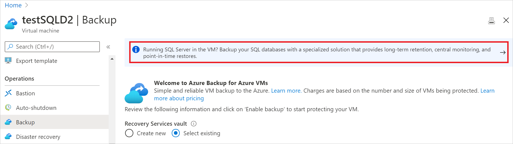
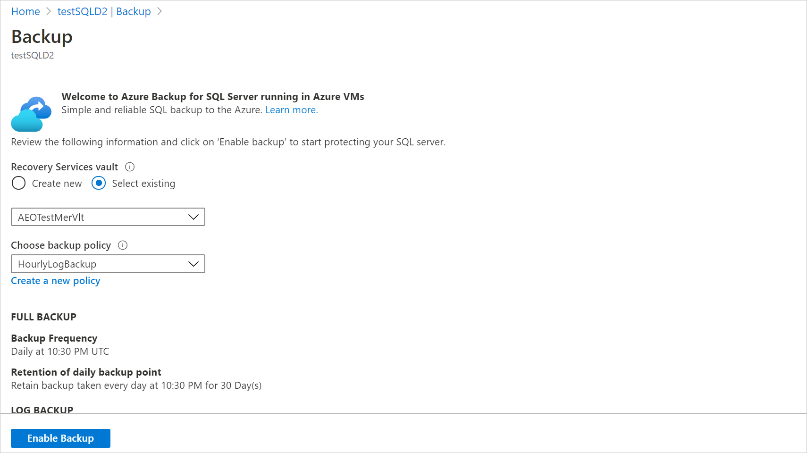
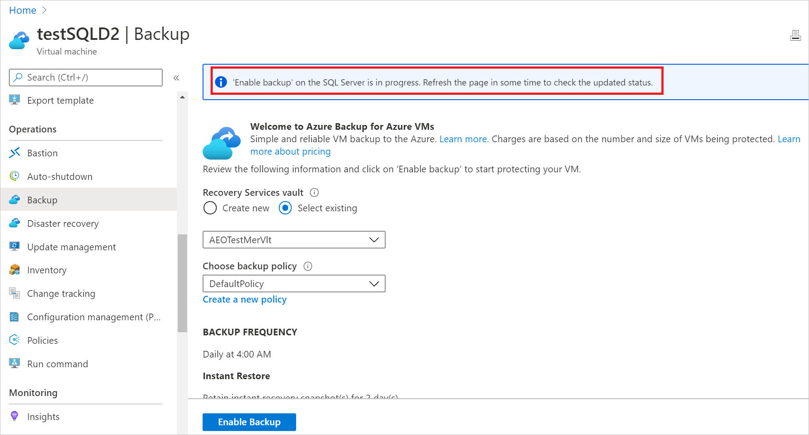
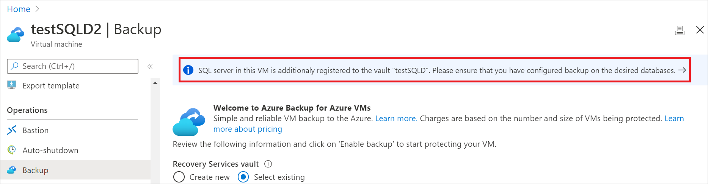
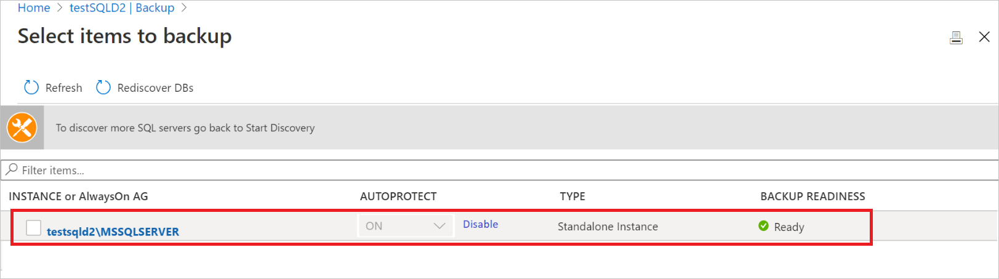
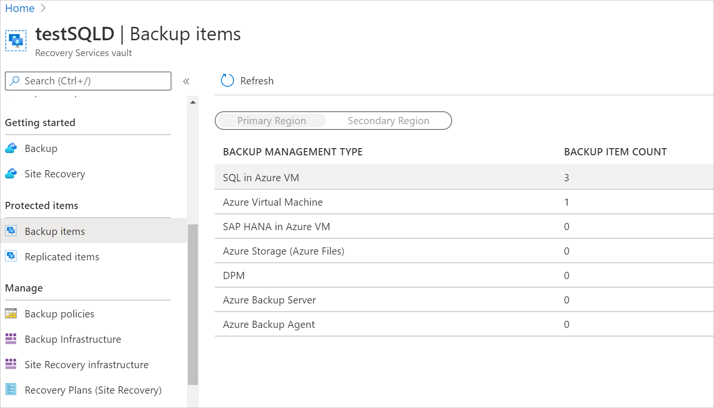

# Back up a SQL Server from the VM pane

This article explains how to back up SQL Server running in Azure VMs with the [Azure Backup](backup-overview.md) service. You can back up SQL Server VMs using two methods:

- Single SQL Server Azure VM: The instructions in this article describe how to back up a SQL Server VM directly from the VM view.
- Multiple SQL Server Azure VMs: You can set up a Recovery Services vault and configure backup for multiple VMs. Follow the instructions in [this article](backup-sql-server-database-azure-vms.md) for that scenario.

## Before you start

1. Verify your environment with the [support matrix](sql-support-matrix.md).
2. Get an [overview](backup-azure-sql-database.md) of Azure Backup for SQL Server VM.
3. Verify that the VM has [network connectivity](backup-sql-server-database-azure-vms.md#establish-network-connectivity).

>[!Note]
>See the [SQL backup support matrix](sql-support-matrix.md) to know more about the supported configurations and scenarios.

## Configure backup on the SQL Server

You can enable backup on your SQL Server VM from the **Backup** pane in the VM. This method does two things:

- Registers the SQL VM with the Azure Backup service to give it access.
- Autoprotects all the SQL Server instances running inside the VM. This means that the backup policy is applied to all the existing databases, as well as the databases that will be added to these instances in the future.

1. Select the banner on the top of the page to open the SQL Server backup view.

    

    >[!NOTE]
    >Don't see the banner? The banner is only displayed for those SQL Server VMs that are created using Azure Marketplace images. It's additionally displayed for the VMs that are protected with Azure VM Backup. For other images, you can configure backup as explained [here](backup-sql-server-database-azure-vms.md).

2. Enter the Recovery Services vault name. A vault is a logical entity to store and manage all your backups. If you create a new vault:

    - It will be created in the same subscription and region as the SQL Server VM that you're protecting.
    - It will be created with the geo-redundant storage (GRS) setting for all the backups. If you wish to change the redundancy type, you should do so before protecting the VM. For more information, see [this article](backup-create-rs-vault.md#set-storage-redundancy).

3. Choose a **Backup Policy**. You can choose from the default policy, or any other existing policies that you created in the vault. If you want to create a new policy, you can refer to [this article](backup-sql-server-database-azure-vms.md#create-a-backup-policy) for a step-by-step guide.

    

4. Select **Enable Backup**. The operation may take a few minutes to complete.

    

5. Once the operation is completed, you'll see the **vault name** in the banner.

    

6. Select the banner to go the vault view, where you can see all the registered VMs and their protection status.

    

7. For non-marketplace images, the registration may be successful, but **configure backup** may not be triggered until the Azure Backup extension is given permission on the SQL Server. In such cases, the **Backup Readiness** column reads **Not Ready**. You need to [assign the appropriate permissions](backup-azure-sql-database.md#set-vm-permissions) manually for non-marketplace images so configure backup can get triggered.

    

8. For further operations or monitoring that you need to do on the backed-up SQL Server VM, go to the corresponding Recovery Services vault. Go to **Backup Items** to see all the databases backed up in this vault, and trigger operations such as on-demand backup and restore. Similarly, go to **Backup Jobs** to [monitor](manage-monitor-sql-database-backup.md) jobs corresponding to operations such as configure protection, backup, and restore.

    

>[!NOTE]
>The backup isn't automatically configured on any of the new SQL Server instances that may be added later to the protected VM. To configure backup on the newly added instances, you need to go the vault that the VM is registered to and follow the steps listed [here](backup-sql-server-database-azure-vms.md).

## Next steps

Learn how to:

- [Restore backed-up SQL Server databases](restore-sql-database-azure-vm.md)
- [Manage backed-up SQL Server databases](manage-monitor-sql-database-backup.md)
