<properties
   pageTitle="First look: How to back up a Windows Server or client to Azure | Microsoft Azure"
   description="Learn how to backup a Windows Server using Azure Backup with these easy steps"
   services="backup"
   documentationCenter=""
   authors="Jim-Parker"
   manager="jwhit"
   editor=""
   keywords="how to backup; how to back up"/>

<tags
   ms.service="backup"
   ms.workload="storage-backup-recovery"
	 ms.tgt_pltfrm="na"
	 ms.devlang="na"
	 ms.topic="hero-article"
	 ms.date="02/20/2016"
	 ms.author="jimpark;"/>

# Back up a Windows Server or client to Azure

In just a few steps you can back up your Windows machine (Windows client or Windows Server) to Azure. When you've completed the 4 steps below, you will have:

- Set up an Azure subscription (if necessary).
- Created a backup vault and downloaded the necessary components.
- Prepared your Windows server or client by installing and registering those components.
- Backed up your data.

## Step 1: Get an Azure subscription

If you do not have an Azure subscription, you can create a [free account](https://azure.microsoft.com/free/) that lets you access any Azure service.

>[AZURE.NOTE] You can skip this step if you already have an Azure subscription.

## Step 2: Create a backup vault

To back up files and data from a Windows machine to Azure, you need to create a backup vault in the geographic region where you want to store the data.

1. If you haven't already done so, sign in to the [Azure Portal](https://portal.azure.com/) using your Azure subscription.

    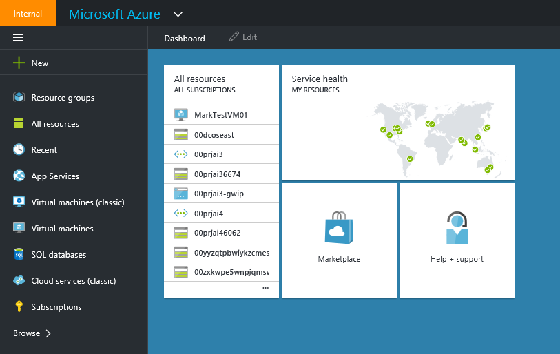

2. Click **New > Hybrid Integration > Backup**.

    

    a. On the resulting screen, for **Name**, enter a friendly name to identify the backup vault. Type a name that contains between 2 and 50 characters. It must start with a letter, and can contain only letters, numbers and hyphens.

    b. For **Region**, select the geographic region for the backup vault. By choosing a geographic region close to your location, you can reduce network latency when backing up to Azure.

    c. Click **Create Vault**.

    

    For status, you can monitor the notifications at the bottom of the portal.

    

    Once the backup vault is created, you'll see it listed in the resources for Recovery Services as **Active**.

    

6. Select **storage redundancy** options.

    The best time to select your storage redundancy options is right after creating a vault and before any machines are registered to the vault. Once an item has been registered to the vault, the storage redundancy option is locked and cannot be modified.

    If you are using Azure as a primary backup storage endpoint (e.g. you are backing up to Azure from a Windows Server), you should consider picking (the default) Geo-Redundant storage option.

    If you are using Azure as a tertiary backup storage endpoint (e.g. you are using SCDPM to have a local backup copy on-premises & using Azure for your long term retention needs), you should consider choosing Locally Redundant Storage. This brings down the cost of storing data in Azure, while providing a lower level of durability for your data that might be acceptable for tertiary copies.

    a. Click on the *vault* you just created.

    b. Select **Configure**.

    

    c. Choose the appropriate storage redundancy option. You will need to click **Save** if you've selected **Locally Redundant**, since **Geo Redundant** is the default.

    

    >[AZURE.NOTE] Learn more about choosing storage redundancy options in this [overview](../storage/storage-redundancy.md).

    d. Click **Recovery Services**, in the left navigation pane to return to the list of resources for *Recovery Services*.

    Your Windows machine now needs to be authenticated with the backup vault you just created. The authentication is achieved using vault credentials.

7.  Click on the vault you just created.

    

8. From the **Quick Start** page, click **Download vault credentials**.

    

    The portal will generate a vault credential using a combination of the vault name and the current date.

    >[AZURE.NOTE] The vault credentials file is used only during the registration workflow and expires after 48hrs.

9. Click **Save** to download the vault credentials to the local account's *Downloads* folder, or select **Save As** from the *Save* menu to specify a location for the vault credentials.

    Ensure that the vault credentials are saved in a location that can be accessed from your machine. If the file is stored in a file share/SMB, check for the access permissions.

    >[AZURE.NOTE] You don't need to open the vault credentials at this time.

    Next, you need to download the backup agent

10. Click **Recovery Services**, in the left navigation pane and then click the backup vault that you want to register with a server.

    

11. On the Quick Start page, click **Agent for Windows Server or System Center Data Protection Manager or Windows Client > Save** (or select **Save As** from the *Save* menu to specify a location for the agent).

    

At this point, you've finished creating a backup vault and downloading the necessary components. Now you'll install the backup agent.

## Step 3: Install the Azure Backup agent on your Windows Server or client

1. After the *MARSagentinstaller.exe* download finishes, click **Run** (or double click **MARSAgentInstaller.exe** from the saved location).

2. Choose the *installation folder* and *cache folder* required for the agent.

    The cache location you specify must have free space equal to at least 5% of the backup data.

    Click **Next**.

    

3. You can continue to connect to the internet through the default proxy settings, or if you use a proxy server to connect to the internet, in the **Proxy configuration** screen, check the **Use custom proxy settings** box and enter the proxy server details.

    If you use an authenticated proxy, enter the user name and password details.

   Click **Next**.

    

4. Click **Install**.

    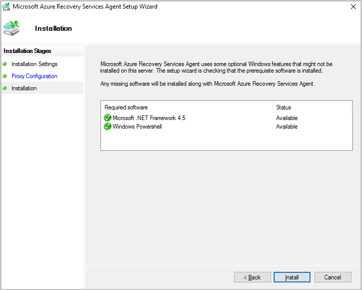

    The Azure Backup agent installs .NET Framework 4.5 and Windows PowerShell (if they are not already installed) to complete the installation.

5. Once the agent is installed, click **Proceed to Registration** to continue with the workflow.

    

6. In the **Vault Identification** screen, browse to and select the *vault credentials file* you previously downloaded. Ensure that the vault credentials file is available in a location that can be accessed by the setup application.

    Click **Next**.

    

7. In the **Encryption setting** screen, you can either generate a passphrase or provide a passphrase (minimum of 16 characters). Remember to save the passphrase in a secure location.

    > [AZURE.WARNING] If the passphrase is lost or forgotten Microsoft cannot help in recovering the backup data. The end user owns the encryption passphrase and Microsoft does not have visibility into the passphrase used by the end user. Please save the file in a secure location as it is required during a recovery operation.

    Click **Finish**.

    

    The **Register Server Wizard** registers the server with Microsoft Azure Backup.

    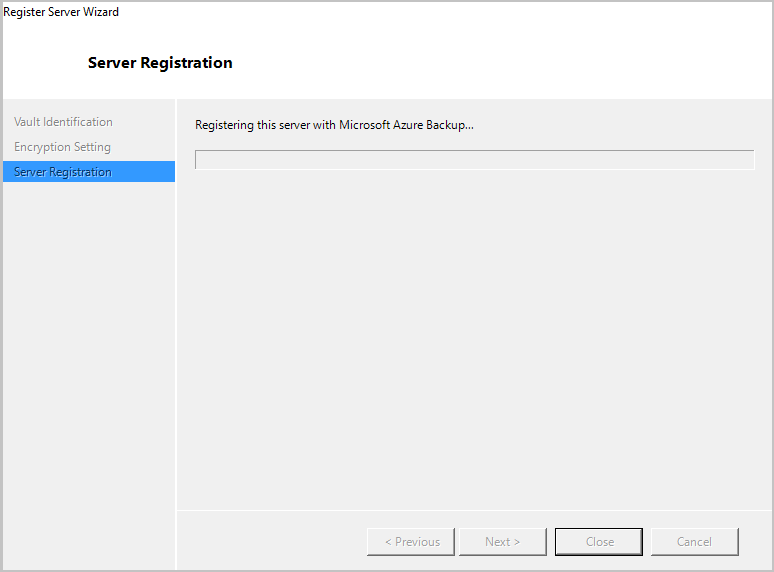

8. Once the *encryption key* is set, leave the *Launch Microsoft Azure Recovery Services Agent* checkbox checked and click **Close**.

    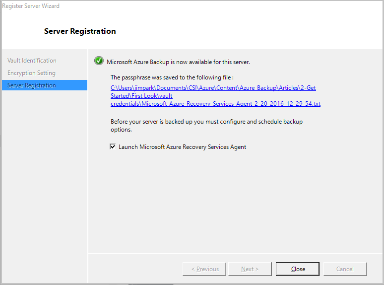

    The machine is now registered successfully to the vault and you are ready to configure and schedule your backup options.

## Step 4: Back up files and folders

Before your machine is backed up you need to configure and schedule back options.

1. In the mmc snap-in (which opened automatically because you left the *Launch Microsoft Azure Recovery Services Agent* checkbox checked) click **Schedule Backup**.

    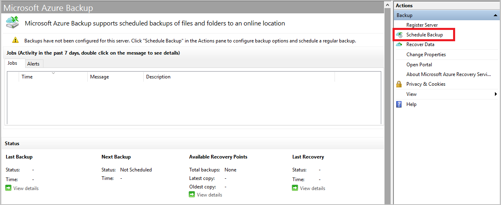

2. On the **Getting started** screen, click **Next**.

    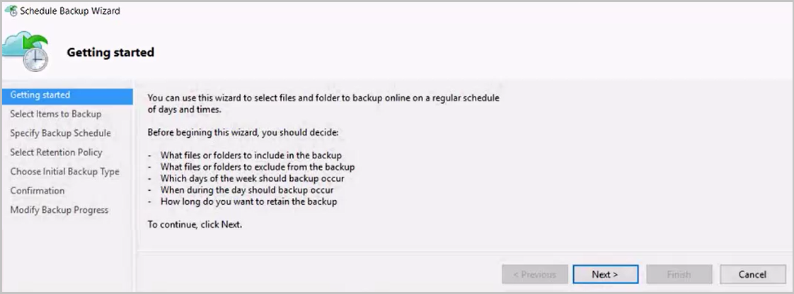

3. On the **Select Items to Backup** screen, click **Add Items**.

    

    Select the items you wish to back up and click **Okay**. Azure Backup on a Windows Server/Windows Client allows you to protect files and folders.

    

    Click **Next**.

    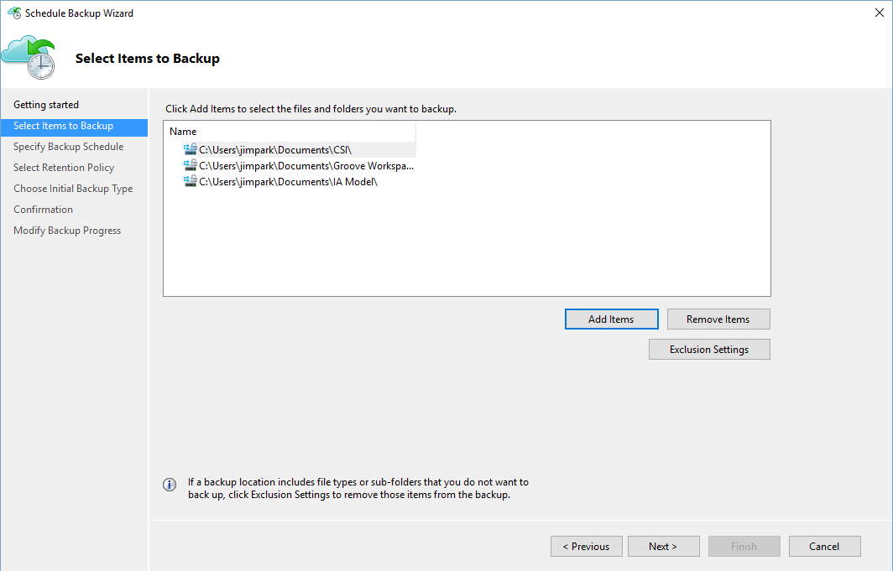

4. Specify the *backup schedule* and click **Next**.

    You can schedule daily (at a maximum of 3 times per day) or weekly backups.

    

5. Specify the *retention policy* for the backup copy. You can modify the daily, weekly, monthly, and yearly retention policy to meet your needs.

    

     Click **Next**

    >[AZURE.NOTE] The backup schedule is explained in detail in the following [article](backup-azure-backup-cloud-as-tape.md).

6. Choose the initial backup type.

    You can back up automatically over the network, or you can back up offline. The remainder of this article follows the automatic backup process. If you prefer to do an offline backup, review this article for additional information on the [offline back up workflow in Azure Backup](backup-azure-backup-import-export.md).

    

    Click **Next**

7. On the **Confirmation** screen review the information and click **Finish**.

    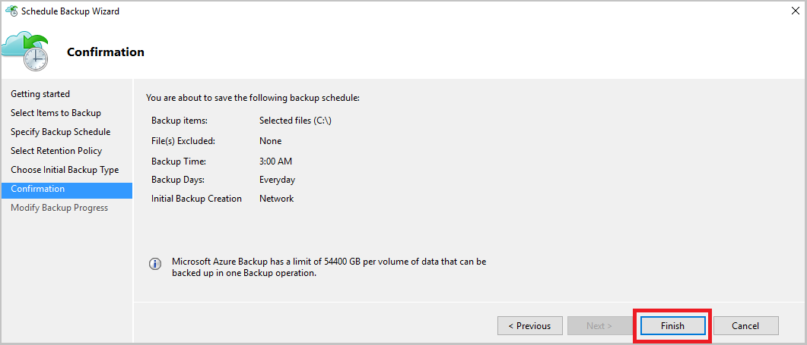

8. Once the wizard finishes creating the *backup schedule*, click **Close**.

    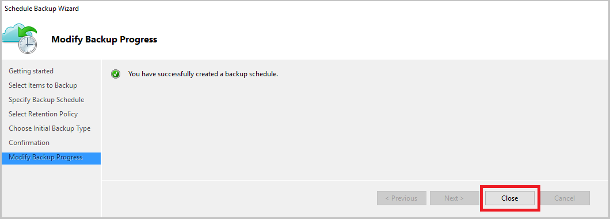

9. In the mmc snap in click **Back up Now** to complete the initial seeding over the network.

    

10. On the **Confirmation** screen, review the settings the wizard will use to backup the machine and click **Back Up**.

    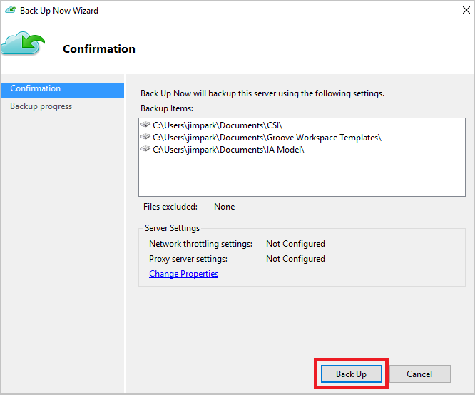

11. Click **Close** to close the wizard. You can do this before the *backup process* completes and it will continue to run in the background.

    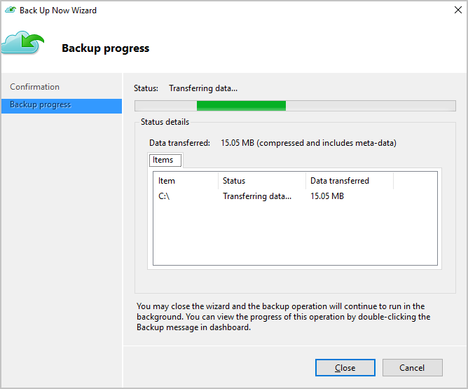

12. After the initial backup is completed, the **Jobs** view in the Azure Backup console indicates the status.

    

Your data has been successfully backed up.

## Next steps
- To learn more about Azure Backup, see [Azure Backup Overview](backup-introduction-to-azure-backup.md)
- Get more details about [preparing your environment to back up Windows machines](backup-configure-vault.md)
- Get more details about [backing up a Windows Server](backup-azure-backup-windows-server.md)
- Visit the [Azure Backup Forum](http://go.microsoft.com/fwlink/p/?LinkId=290933).
