<properties
   pageTitle="Learn to back up files and folders from Windows to Azure | Microsoft Azure"
   description="Learn how to backup Windows Server data by creating a vault, installing the backup agent, and backing up your files and folders to Azure."
   services="backup"
   documentationCenter=""
   authors="Jim-Parker"
   manager="jwhit"
   editor=""
   keywords="how to backup; how to back up"/>

<tags
   ms.service="backup"
   ms.workload="storage-backup-recovery"
	 ms.tgt_pltfrm="na"
	 ms.devlang="na"
	 ms.topic="hero-article"
	 ms.date="03/28/2016"
	 ms.author="jimpark;"/>

# First look: back up files and folders from Windows Server or client to Azure

This article explains how to back up your Windows Server (or Windows client) files and folders to Azure using Azure Backup. If you want to see how simple it is to use Azure Backup, you're in the right place.

Backing up your files and folders only requires these steps:

 Get an Azure subscription (if necessary). 
 Create a backup vault and download the necessary components. 
 Prepare your Windows Server or client by installing and registering those components. 
 Back up your data.

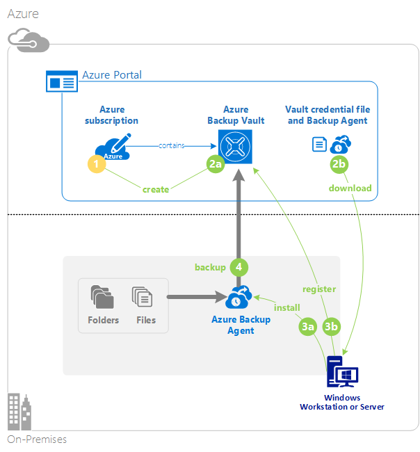

## Step 1: Get an Azure subscription

If you do not have an Azure subscription, you can create a [free account](https://azure.microsoft.com/free/) that lets you access any Azure service.

>[AZURE.NOTE] If you already have an Azure subscription, you can skip this step.

## Step 2: Create a backup vault and download the necessary components

To back up your files and folders, you need to create a backup vault in the geographic region where you want to store the data.

1. If you haven't already done so, sign in to the [Azure Portal](https://portal.azure.com/) using your Azure subscription.

2. Click **New > Hybrid Integration > Backup**.

    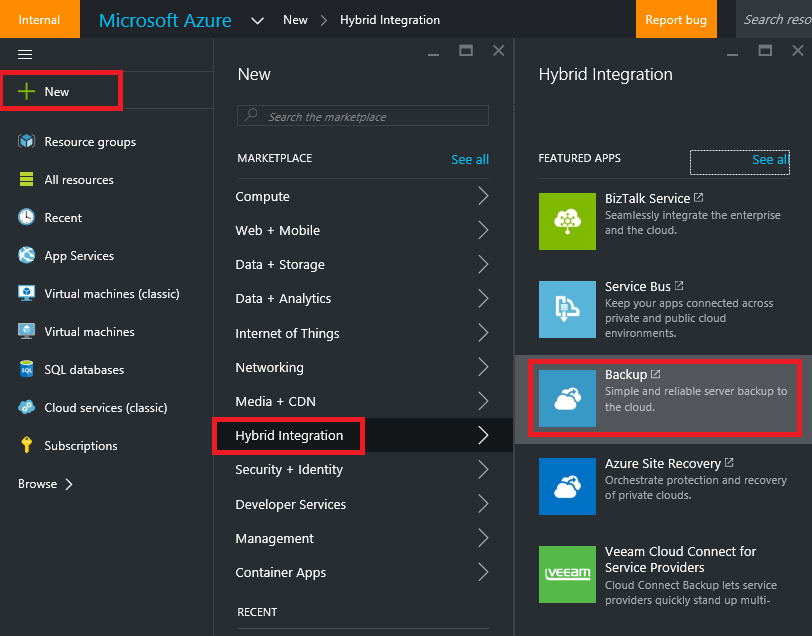

    a. On the resulting screen, for **Name**, enter a friendly name to identify the backup vault. Type a name that contains between 2 and 50 characters. It must start with a letter, and can contain only letters, numbers, and hyphens.

    b. For **Region**, select the geographic region for the backup vault. By choosing a geographic region close to your location, you can reduce network latency when backing up to Azure.

    c. Click **Create Vault**.

    

    For status, you can monitor the notifications at the bottom of the portal.

    

    Once the backup vault is created, it’s listed in the resources for Recovery Services as **Active**.

    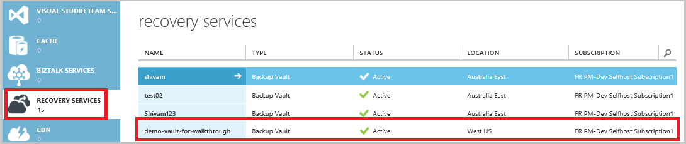

3. Select **storage redundancy** options.

    The best time to select the storage redundancy option is right after creating a vault and before any machines are registered to it. Once an item has been registered to the vault, the storage redundancy option is locked and cannot be modified.

    If you are using Azure as a primary backup storage endpoint, consider picking the (default) [Geo-Redundant storage](../storage/storage-redundancy.md#geo-redundant-storage) option.

    If you are using Azure as a tertiary backup storage endpoint, consider choosing [Locally Redundant Storage](../storage/storage-redundancy.md#locally-redundant-storage). This option brings down the cost of storing data in Azure, while providing a lower level of durability that might be acceptable for tertiary copies.

    a. Click on the vault you just created.

    b. On the Quick Start page, select **Configure**.

    

    c. Choose the appropriate storage redundancy option.

    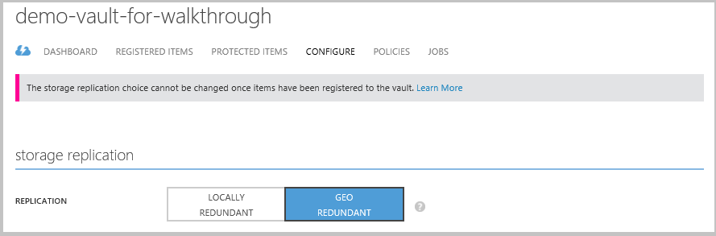

    If you selected **Locally Redundant**, click **Save** since **Geo Redundant** is the default option.

    d. To return to the list of resources for **Recovery Services**, click **Recovery Services** in the left navigation pane.

    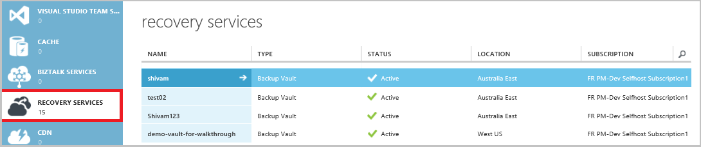

    You now need to authenticate your Windows machine with the backup vault you just created. The authentication is achieved using vault credentials.

4.  Click the vault you just created.

    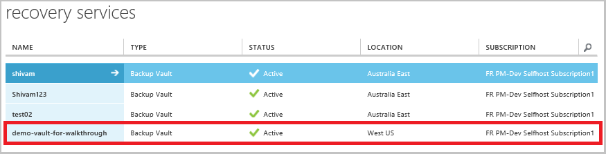

5. From the **Quick Start** page, click **Download vault credentials**.

    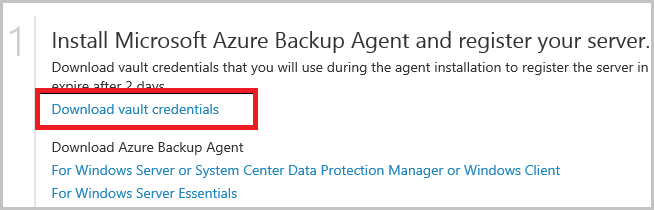

    The portal generates a vault credential using a combination of the vault name and the current date.

    >[AZURE.NOTE] The vault credentials file is used only during the registration workflow and expires after 48 hours.

6. Click **Save** to download the vault credentials to the local **Downloads** folder. You can also select **Save As** from the **Save** menu to specify a location for the vault credentials.

    Ensure that the vault credentials are saved in a location that can be accessed from your machine. If the file is stored in a file share/SMB, check for the access permissions.

    >[AZURE.NOTE] You don't need to open the vault credentials at this point in the procedure.

    Next, you need to download the backup agent

7. Click **Recovery Services**, in the left navigation pane and then click the backup vault that you want to register with a server.

    

8. On the Quick Start page, click **Agent for Windows Server or System Center Data Protection Manager or Windows Client > Save**.

    

At this point, you've finished creating a backup vault and downloading the necessary components. Now you install the backup agent.

## Step 3: Prepare your Windows Server or client by installing and registering the backup components

1. After the download finishes, double click the **MARSagentinstaller.exe** from the saved location (or you could click **Run** instead of saving the file in the previous step).

2. Choose the **Installation folder** and **Cache folder** required for the agent.

    The cache location you specify must have free space equal to at least 5% of the backup data.

    Click **Next**.

    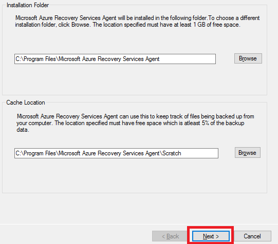

3. (Optional) If you use a proxy server to connect to the internet, in the **Proxy configuration** screen, check the **Use custom proxy settings** box and enter the proxy server details.

    If you use an authenticated proxy, enter the user name and password details.

    Click **Next**.

    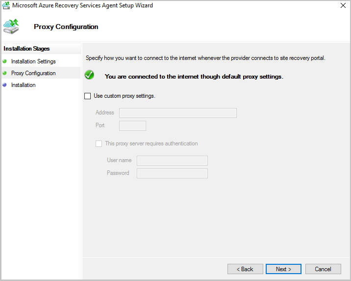

4. Click **Install**.

    The Azure Backup agent installs .NET Framework 4.5 and Windows PowerShell (if they are not already installed) to complete the installation.

5. Once the agent is installed, click **Proceed to Registration** to continue with the workflow.

    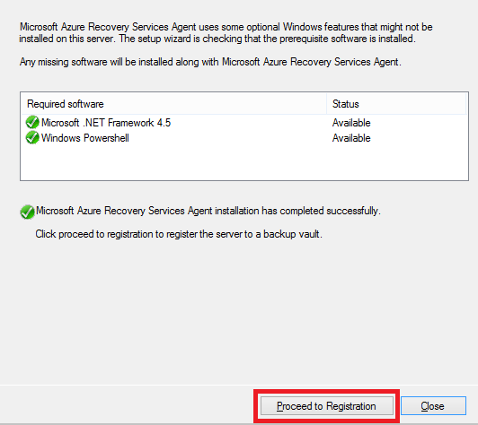

6. In the **Vault Identification** screen, browse to and select the **vault credentials file** you previously downloaded. Ensure that the vault credentials file is available in a location that can be accessed by the setup application.

    Click **Next**.

    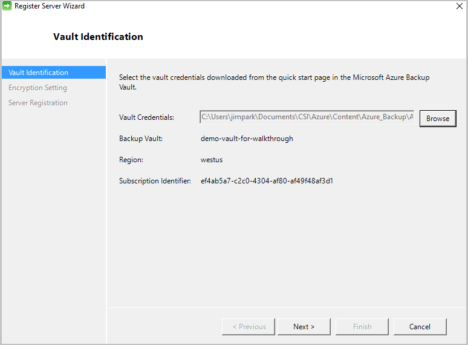

7. In the **Encryption setting** screen, you can either generate a passphrase or provide a passphrase (minimum of 16 characters). Remember to save the passphrase in a secure location.

    > [AZURE.WARNING] If you lose or forget the passphrase, Microsoft cannot help in recovering the backup data. You own the encryption passphrase and Microsoft does not have visibility into the passphrase used by the end user. Please save the file in a secure location as it is required during a recovery operation.

    Click **Finish**.

    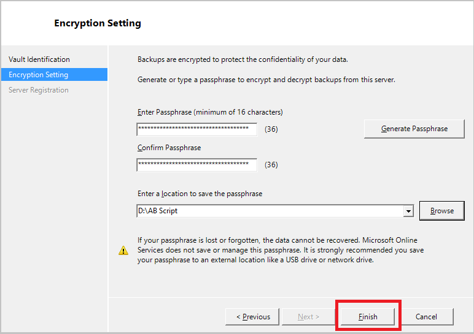

    The **Register Server Wizard** registers the server with Microsoft Azure Backup.

8. Once the **encryption key** is set, leave the **Launch Microsoft Azure Recovery Services Agent** checkbox checked and click **Close**.

    The machine is now registered successfully to the vault and you are ready to configure and schedule your backup options.

## Step 4: Back up your data

1. In the **Backup agent** (which opened automatically if you left the **Launch Microsoft Azure Recovery Services Agent** checkbox checked) click **Schedule Backup**.

    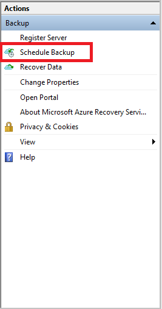

2. On the **Getting started** screen, click **Next**.

3. On the **Select Items to Backup** screen, click **Add Items**. Azure Backup on a Windows Server or Windows client allows you to protect files and folders.

    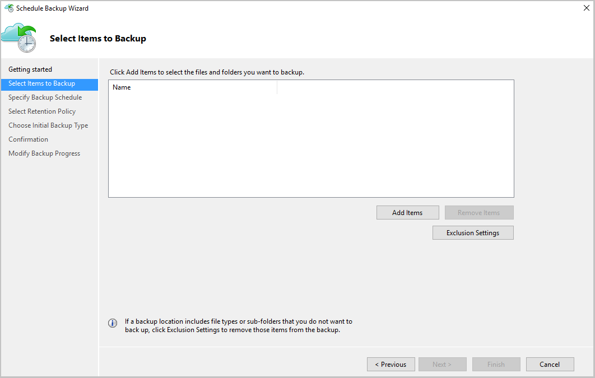

    Select the items you wish to back up and click **Okay**.

    Click **Next**.

4. Specify the **backup schedule** and click **Next**.

    You can schedule daily (at a maximum of three times per day) or weekly backups.

    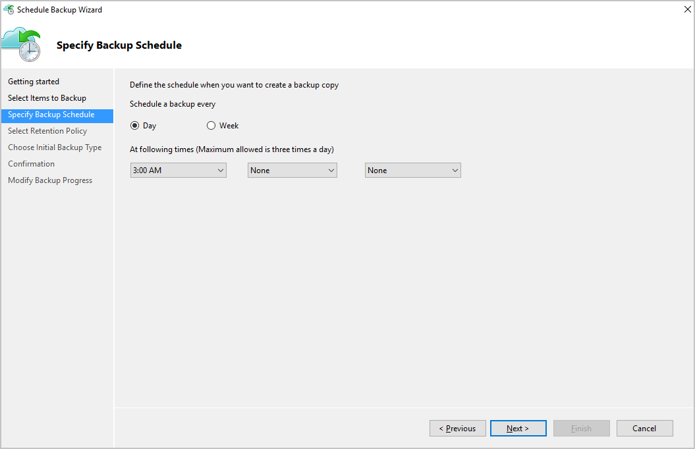

5. Select the **Retention Policy** for the backup copy. You can modify the daily, weekly, monthly, and yearly retention policy to meet your needs.

    >[AZURE.NOTE] The backup schedule is explained in detail in this [article](backup-azure-backup-cloud-as-tape.md).

     Click **Next**

    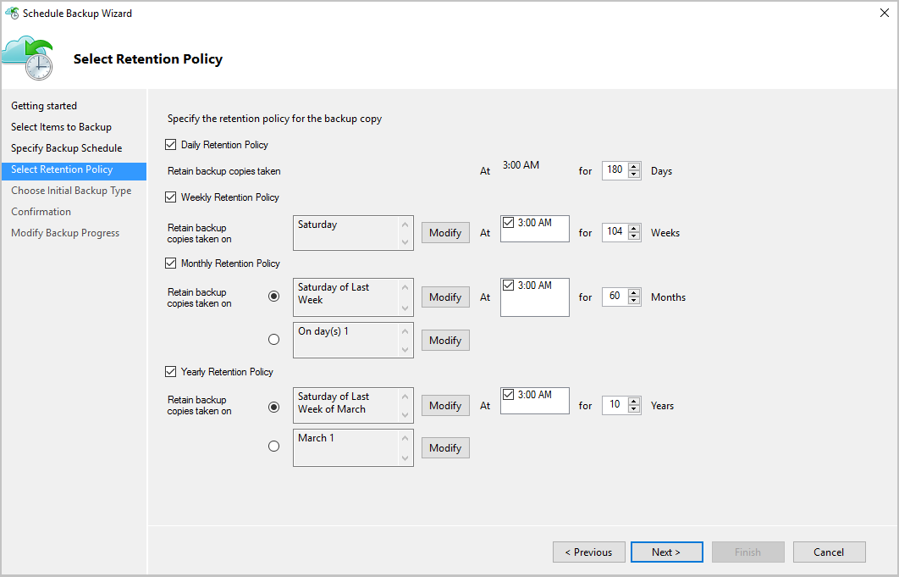

6. Choose the initial backup type.

    You can back up automatically over the network, or you can back up offline. The remainder of this article follows the automatic backup process. If you prefer to do an offline backup, review this article for additional information on the [offline back up workflow in Azure Backup](backup-azure-backup-import-export.md).

    Click **Next**

    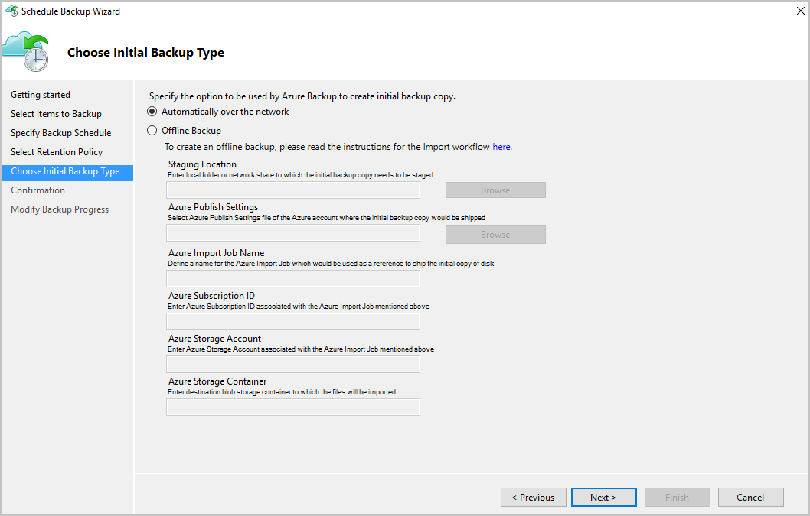

7. On the **Confirmation** screen, review the information and click **Finish**.

8. Once the wizard finishes creating the **backup schedule**, click **Close**.

9. In the **Backup agent**, click **Back Up Now** to complete the initial seeding over the network.

    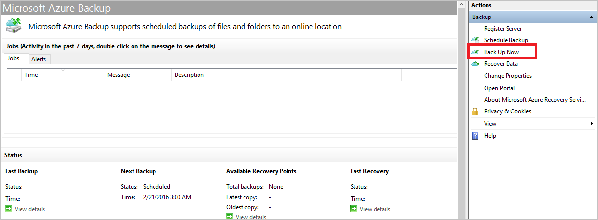

10. On the **Confirmation** screen, review the settings the wizard will uses to back up the machine and click **Back Up**.

11. Click **Close** to close the wizard. You can close the wizard before the backup process completes and it continues to run in the background.

12. After the initial backup is completed, the **Jobs** view in the Azure Backup console indicates the "Job completed" status.

    

Congratulations, you've successfully backed up your files and folders to Azure Backup.

## Next steps
- To learn more about Azure Backup, see [Azure Backup Overview](backup-introduction-to-azure-backup.md).
- Get more details about [preparing your environment and backing up Windows machines](backup-configure-vault.md).
- Learn how to backup up Azure VMs with this [First look article](backup-azure-vms-first-look.md).
- Read the latest discussions about Azure Backup in the [Azure Backup Forum](http://go.microsoft.com/fwlink/p/?LinkId=290933).
