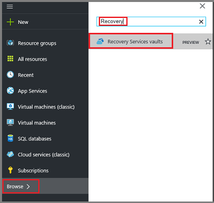
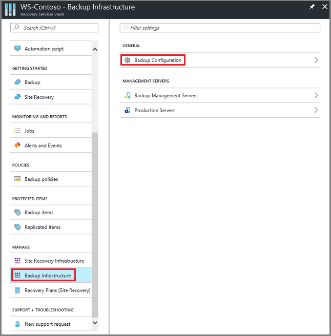
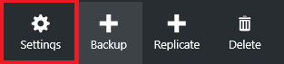
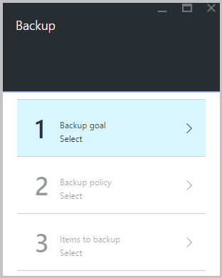
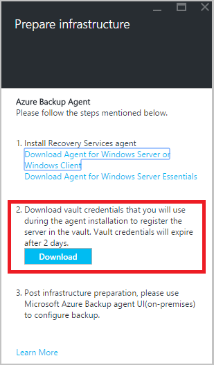

<properties
   pageTitle="Learn to back up files and folders from Windows to Azure with Azure Backup using the Resource Manager deployment model | Microsoft Azure"
   description="Learn how to backup Windows Server data by creating a vault, installing the Recovery Services agent, and backing up your files and folders to Azure."
   services="backup"
   documentationCenter=""
   authors="Jim-Parker"
   manager="jwhit"
   editor=""
   keywords="how to backup; how to back up"/>

<tags
   ms.service="backup"
   ms.workload="storage-backup-recovery"
   ms.tgt_pltfrm="na"
   ms.devlang="na"
   ms.topic="hero-article"
   ms.date="06/27/2016"
   ms.author="jimpark;"/>

# First look: back up files and folders with Azure Backup using the Resource Manager deployment model

This article explains how to back up your Windows Server (or Windows client) files and folders to Azure with Azure Backup using Resource Manager. It's a tutorial intended to walk you through the basics. If you want to get started using Azure Backup, you're in the right place.

If you want to know more about Azure Backup, read this [overview](backup-introduction-to-azure-backup.md).

Backing up files and folders to Azure requires these activities:

 Get an Azure subscription (if you don't already have one). 
 Create a Recovery Services vault. 
 Download the necessary files. 
 Install and register the Recovery Services agent. 
 Back up your files and folders.

## Step 1: Get an Azure subscription

If you don't have an Azure subscription, create a [free account](https://azure.microsoft.com/free/) that lets you access any Azure service.

## Step 2: Create a Recovery Services vault

To back up your files and folders, you need to create a Recovery Services vault in the region where you want to store the data. You also need to determine how you want your storage replicated.

### To create a Recovery Services vault

1. If you haven't already done so, sign in to the [Azure Portal](https://portal.azure.com/) using your Azure subscription.

2. On the Hub menu, click **Browse** and in the list of resources, type **Recovery Services** and click **Recovery Services vaults**.

      

3. On the **Recovery Services vaults** menu, click **Add**.

    

    The Recovery Services vault blade opens, prompting you to provide a **Name**, **Subscription**, **Resource group**, and **Location**.

    

4. For **Name**, enter a friendly name to identify the vault.

5. Click **Subscription** to see the available list of subscriptions.

6. Click **Resource group** to see the available list of Resource groups, or click **New** to create a new Resource group.

7. Click **Location** to select the geographic region for the vault. This choice determines the geographic region where your backup data is sent.

8. Click **Create**.

    If you don't see your vault listed after it has been completed, click **Refresh**. When the list refreshes, click the name of the vault.

### To determine storage redundancy
When you first create a Recovery Services vault you determine how storage is replicated.

1. Click on the new vault to open the dashboard.

2. In the **Settings** blade, which opens automatically with your vault dashboard, click **Backup Infrastructure**.

3. In the Backup Infrastructure blade, click **Backup Configuration** to view the **Storage replication type**.

    

4. Choose the appropriate storage replication option for your vault.

    

    By default, your vault has geo-redundant storage. If you are using Azure as a primary backup storage endpoint, continue using geo-redundant storage. If you are using Azure as a non-primary backup storage endpoint, then choose locally redundant storage, which will reduce the cost of storing data in Azure. Read more about [geo-redundant](../storage/storage-redundancy.md#geo-redundant-storage) and [locally redundant](../storage/storage-redundancy.md#locally-redundant-storage) storage options in this [overview](../storage/storage-redundancy.md).

Now that you've created a vault, you prepare your infrastructure to back up files and folders by downloading the Microsoft Azure Recovery Services agent and vault credentials.

## Step 3 - Download files

1. Click **Settings** on the Recovery Services vault dashboard.

    

2. Click **Getting Started > Backup** on the Settings blade.

    

3. Click **Backup goal** on the Backup blade.

    

4. Select **On-premises** from the Where is your workload running? menu.

5. Select **Files and folders** from the What do you want to backup? menu, and click **OK**.

### Download the Recovery Services agent

1. Click **Download Agent for Windows Server or Windows Client** in the **Prepare infrastructure** blade.

    

2. Click **Save** in the download pop-up. By default, the **MARSagentinstaller.exe** file is saved to your Downloads folder.

### Download vault credentials

1. Click **Download > Save** on the Prepare infrastructure blade.

    

## Step 4 -Install and register the agent

>[AZURE.NOTE] Enabling backup through the Azure portal is coming soon. At this time, you use the Microsoft Azure Recovery Services Agent on-premises to back up your files and folders.

1. Locate and double click the **MARSagentinstaller.exe** from the Downloads folder (or other saved location).

2. Complete the Microsoft Azure Recovery Services Agent Setup Wizard. To complete the wizard, you need to:

    - Choose a location for the installation and cache folder.
    - Provide your proxy server info if you use a proxy server to connect to the internet.
    - Provide your user name and password details if you use an authenticated proxy.
    - Provide the downloaded vault credentials
    - Save the encryption passphrase in a secure location.

    >[AZURE.NOTE] If you lose or forget the passphrase, Microsoft cannot help recover the backup data. Please save the file in a secure location. It is required to restore a backup.

The agent is now installed and your machine is registered to the vault. You're ready to configure and schedule your backup.

## Step 5: Back up your files and folders

The initial backup includes two key tasks:

- Schedule the backup
- Back up files and folders for the first time

To complete the initial backup, you use the Microsoft Azure Recovery Services agent.

### To schedule the backup

1. Open the Microsoft Azure Recovery Services agent. You can find it by searching your machine for **Microsoft Azure Backup**.

    

2. In the Recovery Services agent, click **Schedule Backup**.

    

3. On the Getting started page of the Schedule Backup Wizard, click **Next**.

4. On the Select Items to Backup page, click **Add Items**.

5. Select the files and folders that you want to back up, and then click **Okay**.

6. Click **Next**.

7. On the **Specify Backup Schedule** page, specify the **backup schedule** and click **Next**.

    You can schedule daily (at a maximum rate of three times per day) or weekly backups.

    

    >[AZURE.NOTE] For more information about how to specify the backup schedule, see the article [Use Azure Backup to replace your tape infrastructure](backup-azure-backup-cloud-as-tape.md).

8. On the **Select Retention Policy** page, select the **Retention Policy** for the backup copy.

    The retention policy specifies the duration for which the backup will be stored. Rather than just specifying a “flat policy” for all backup points, you can specify different retention policies based on when the backup occurs. You can modify the daily, weekly, monthly, and yearly retention policies to meet your needs.

9. On the Choose Initial Backup Type page, choose the initial backup type. Leave the option **Automatically over the network** selected, and then click **Next**.

    You can back up automatically over the network, or you can back up offline. The remainder of this article describes the process for backing up automatically. If you prefer to do an offline backup, review the article [Offline backup workflow in Azure Backup](backup-azure-backup-import-export.md) for additional information.

10. On the Confirmation page, review the information, and then click **Finish**.

11. After the wizard finishes creating the backup schedule, click **Close**.

### To back up files and folders for the first time

1. In the Recovery Services agent, click **Back Up Now** to complete the initial seeding over the network.

    

2. On the Confirmation page, review the settings that the Back Up Now Wizard will use to back up the machine. Then click **Back Up**.

3. Click **Close** to close the wizard. If you do this before the backup process finishes, the wizard continues to run in the background.

After the initial backup is completed, the **Job completed** status appears in the Backup console.

## Questions?
If you have questions, or if there is any feature that you would like to see included, [send us feedback](http://aka.ms/azurebackup_feedback).

## Next steps
- Get more details about [backing up Windows machines](backup-configure-vault.md).
- Now that you've backed up your files and folders, you can [manage your vaults and servers](backup-azure-manage-windows-server.md).
- If you need to restore a backup, use this article to [restore files to a Windows machine](backup-azure-restore-windows-server.md).
