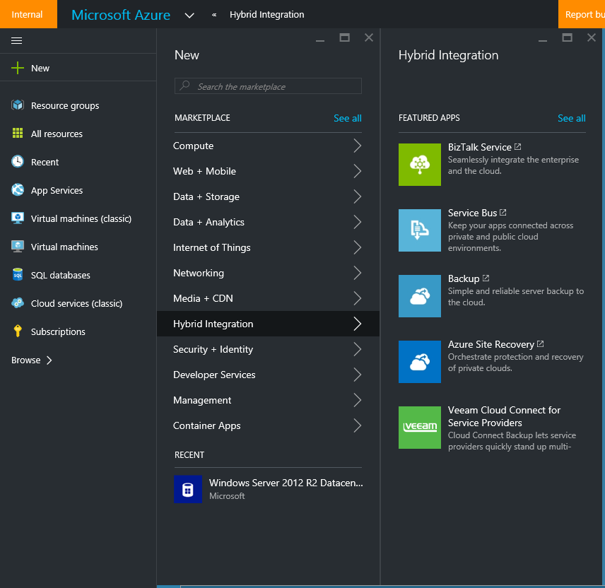

<properties
   pageTitle="Back up a Windows machine to Azure in 10 minutes | Microsoft Azure"
   description="Get started using Azure Backup with these easy steps"
   services="backup"
   documentationCenter=""
   authors="Jim-Parker"
   manager="shreeshd"
   editor=""/>

<tags
   ms.service="backup"
   ms.workload="storage-backup-recovery"
	 ms.tgt_pltfrm="na"
	 ms.devlang="na"
	 ms.topic="hero-article"
	 ms.date="02/10/2016"
	 ms.author="jimpark;"/>

# Back up a Windows machine to Azure

It is extremely easy to get up and running with Azure Backup. In just a few steps you can back up your Windows machine (Windows client or Windows Server) to Azure. When you've completed the steps below, you will have:

- Set up an Azure subscription (if necessary).
- Created a backup vault and downloaded the necessary components.
- Prepared your Windows machine by installing and registering those components.
- Backed up your data.

## Step 1: Get an Azure subscription

If you don't have an Azure subscription, you can get started with a [free trial account](https://azure.microsoft.com/pricing/free-trial/) that lets you access any Azure service.

>[AZURE.NOTE] You can skip this step you already have an Azure subscription.

## Step 2: Create a backup vault

To back up files and data from a Windows machine to Azure, you need to create a backup vault in the geographic region where you want to store the data.

1. If you haven't already done so, sign in to the [Management Portal](https://manage.windowsazure.com/) using your Azure subscription.

2. Click **New** > **Data Services** > **Recovery Services** > **Backup Vault** and choose **Quick Create**.

    If you use the Ibiza portal to access your backup vaults, when you click Backup, you will be automatically taken to the Classic portal. All editing or creation of backup vaults is done through the Classic portal.

    

    

    For **Name**, enter a friendly name to identify the backup vault.

    For **Region**, select the geographic region for the backup vault. By choosing a geographic region close to your location, you can reduce the network latency when backing up to Azure.

    Click **Create Vault**.

    For status, you can monitor the notifications at the bottom of the portal.

    

    Once the backup vault is created, you'll see it listed in the resources for Recovery Services as **Active** by clicking on...

    

## Step 3: Download the vault credential file
Your Windows machine needs to be authenticated with the backup vault you just created. The authentication is achieved using vault credentials.

1. Click **Recovery Services** in the left navigation pane and select the backup vault that you created.

2.  Click the cloud icon to get to the *Quick Start* view of the backup vault.

    

3. On the **Quick Start** page, click **Download vault credentials**.

    

    The portal will generate a vault credential using a combination of the vault name and the current date.

    >[AZURE.NOTE] The vault credentials file is used only during the registration workflow and expires after 48hrs.

4. Click **Save** to download the vault credentials to the local account's Downloads folder, or select **Save As** from the *Save* menu to specify a location for the vault credentials.

    You don't need to open the vault credentials at this time.

    Ensure that the vault credentials are saved in a location that can be accessed from your machine. If the file is stored in a file share/SMB, check for the access permissions.

## Step 4: Download the backup agent

1. Click **Recovery Services**, in the left navigation pane then select the backup vault that you want to register with a server.

2. On the Quick Start page, click **Agent for Windows Server or System Center Data Protection Manager or Windows Client > Save**.

    

## Step 5: Install the Azure Backup agent on your Windows Server or client

1. After the *MARSagentinstaller.exe* download is completed, click **Run** (or double click **MARSAgentInstaller.exe** from the saved location).

2. Choose the *installation folder* and *cache folder* required for the agent and click **Next**.

    The cache location you specify must have free space equal to at least 5% of the backup data.

    

3. If you use a proxy server to connect to the internet, in the **Proxy configuration** screen, enter the proxy server details. If you use an authenticated proxy, enter the user name and password details and click **Next**.

    The Azure Backup agent installs .NET Framework 4.5 and Windows PowerShell (if they are not already installed) to complete the installation.

## Step 6: Install the Azure Backup agent on your Windows machine

1. Once the agent is installed, click **Proceed to Registration** to continue with the workflow.

    

2. In the **Vault Identification** screen, browse to and select the *vault credentials file* you previously downloaded.

    

    Ensure that the vault credentials file is available in a location that can be accessed by the setup application.

3. In the **Encryption setting** screen, you can either generate a passphrase or provide a passphrase (minimum of 16 characters). Remember to save the passphrase in a secure location.

    

    > [AZURE.WARNING] If the passphrase is lost or forgotten Microsoft cannot help in recovering the backup data. The end user owns the encryption passphrase and Microsoft does not have visibility into the passphrase used by the end user. Please save the file in a secure location as it is required during a recovery operation.

4. Click **Finish**.

    The machine is now registered successfully to the vault and you are ready to start backing up data to Microsoft Azure.

## Step 7: Back up files and folders
1. Once the machine is registered, open the Microsoft Azure Backup mmc snap-in.

    

2. Click **Schedule Backup**

    

3. Select the items you wish to back up. Azure Backup on a Windows Server/Windows Client allows you to protect files and folders.

    

4. Specify the backup schedule and retention policy which is explained in detail in the following [article](backup-azure-backup-cloud-as-tape.md).

5. Choose the method for sending the initial backup.

    

6. After the scheduled backup process is completed, go back to the mmc snap in and click **Back up Now** to complete the initial seeding over the network.

    

7. After the initial backup is completed, the **Jobs** view in the Azure Backup console indicates the status.

    

Your data has been successfully backed up.

## Next steps
- To learn more about Azure Backup, see [Azure Backup Overview](backup-introduction-to-azure-backup.md)
- [Back up Windows Server](backup-azure-backup-windows-server.md)
- Visit the [Azure Backup Forum](http://go.microsoft.com/fwlink/p/?LinkId=290933).
