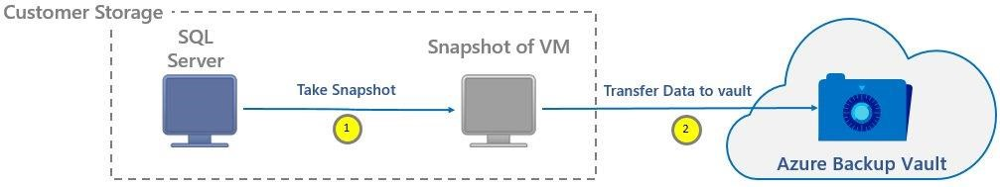
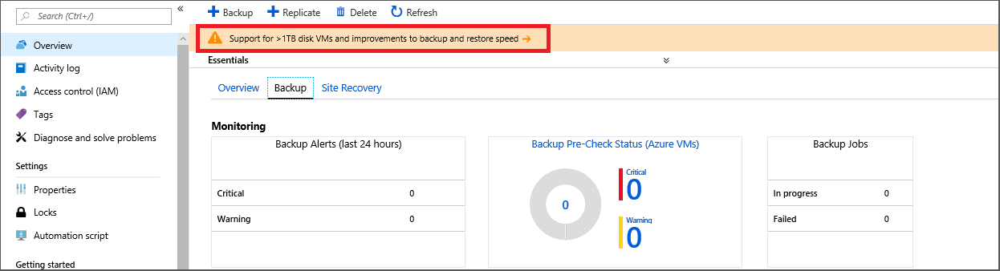

# Upgrade to Azure VM Backup stack V2

The Resource Manager deployment model for the upgrade to virtual machine (VM) backup stack provides the following feature enhancements:

* Ability to see snapshots taken as part of a backup job that's available for recovery without waiting for data transfer to finish. It reduces the wait time for snapshots to copy to the vault before triggering restore. Also, this ability eliminates the additional storage requirement for backing up premium VMs, except for the first backup.  

* Reduces backup and restore times by retaining snapshots locally, for seven days.

* Support for disk sizes up to 4 TB.

* Ability to use an unmanaged VM's original storage accounts, when restoring. This ability exists even when the VM has disks that are distributed across storage accounts. It speeds up restore operations for a wide variety of VM configurations.
    > [!NOTE]
    > This ability is not the same as overriding the original VM.
    >

## What's changing in the new stack?
Currently, the backup job consists of two phases:
1.	Taking a VM snapshot.
2.	Transferring a VM snapshot to the Azure Backup vault.

A recovery point is considered created only after phases 1 and 2 are done. As part of the new stack, a recovery point is created as soon as the snapshot is finished. You can also restore from this recovery point by using the same restore flow. You can identify this recovery point in the Azure portal by using “snapshot” as the recovery point type. After the snapshot is transferred to the vault, the recovery point type changes to “snapshot and vault.”



By default, snapshots are kept for seven days. This feature allows the restore to finish faster from these snapshots. It reduces the time that's required to copy data back from the vault to the customer's storage account.

## Considerations before upgrade

* The upgrade of the VM backup stack is one directional, all backups go into this flow. Because the change occurs at the subscription level, all VMs go into this flow. All new feature additions are based on the same stack. Currently you can't control the stack at policy level.

* Snapshots are stored locally to boost recovery point creation and also to speed up restore operations. As a result, you'll see storage costs that correspond to snapshots taken during the seven-day period.

* Incremental snapshots are stored as page blobs. All customers that use unmanaged disks are charged for the seven days the snapshots are stored in the customer's local storage account. Since the restore point collections used by Managed VM backups use blob snapshots at the underlying storage level, for managed disks you will see costs corresponding to [blob snapshot pricing](https://docs.microsoft.com/rest/api/storageservices/understanding-how-snapshots-accrue-charges) and they are incremental.

* If you restore a premium VM from a snapshot recovery point, a temporary storage location is used while the VM is created.

* For premium storage accounts, the snapshots taken for instant recovery points count towards the 10-TB limit of allocated space.

> [!NOTE]
> Upgrade to Azure VM Backup stack V2 to get Azure Backup support for the [Standard SSD Managed Disks](https://azure.microsoft.com/blog/announcing-general-availability-of-standard-ssd-disks-for-azure-virtual-machine-workloads/) and virtual machines with up to 32 data disks.

## Upgrade
### The Azure portal
If you use the Azure portal, you see a notification on the vault dashboard. This notification relates to large-disk support and backup and restore speed improvements. Alternatively you can go to Properties page of the vault to get the upgrade option.



To open a screen for upgrading to the new stack, select the banner.


### PowerShell
Run the following cmdlets from an elevated PowerShell terminal:
1.	Sign in to your Azure account:

    ```
    PS C:> Connect-AzureRmAccount
    ```

2.	Select the subscription that you want to register:

    ```
    PS C:>  Get-AzureRmSubscription –SubscriptionName "Subscription Name" | Select-AzureRmSubscription
    ```

3.	Register this subscription:

    ```
    PS C:>  Register-AzureRmProviderFeature -FeatureName "InstantBackupandRecovery" –ProviderNamespace Microsoft.RecoveryServices
    ```

## Verify that the upgrade is finished
From an elevated PowerShell terminal, run the following cmdlet:

```
Get-AzureRmProviderFeature -FeatureName "InstantBackupandRecovery" –ProviderNamespace Microsoft.RecoveryServices
```

If it says "Registered," then your subscription is upgraded to VM backup stack Resource Manager deployment model.

## Frequently asked questions

The following questions and answers have been collected from forums and customer questions.

### Will upgrading to V2 impact current backups?
If you upgrade to V2, there's no impact to your current backups, and no need to reconfigure your environment. Upgrade and your backup environment continues to work as it has.

### What does it cost to upgrade to Azure VM Backup stack v2?
There is no cost to upgrade the stack to v2. Snapshots are stored locally to speed up recovery point creation, and restore operations. As a result, you'll see storage costs that correspond to the snapshots taken during the seven-day period.

### Does upgrading to stack v2 increase the premium storage account snapshot limit by 10 TB?
No, total snapshot limit per storage account still remains at 10TB.

### In Premium Storage accounts, do snapshots taken for instant recovery point occupy the 10 TB snapshot limit?
Yes, for premium storage accounts, the snapshots taken for instant recovery point, occupy the allocated 10 TB of space.

### How does the snapshot work during the seven-day period?
Each day a new snapshot is taken. There are seven individual snapshots. The service does **not** take a copy on the first day, and add changes for the next six days.

### Is a v2 snapshot an incremental snapshot or full snapshot?
Incremental snapshots are used for unmanaged disks. For managed disks, restore point collection created by Azure Backup uses blob snapshots and hence are incremental.

### How to get standard SSD managed disk support for a virtual machine?
Upgrade to Azure VM Backup stack V2 to get Azure Backup support for the [Standard SSD Managed Disks](https://azure.microsoft.com/blog/announcing-general-availability-of-standard-ssd-disks-for-azure-virtual-machine-workloads/). Once upgraded, you can also backup virtual machines with up to 32 data disks.
