# Configure and manage backup for Azure Blobs using Azure Backup

Azure Backup allows you to configure operational and vaulted backups to protect block blobs in your storage accounts. This article describes how to configure and manage backups on one or more storage accounts using the Azure portal.

## Before you start

# [Operational backup](#tab/operational-backup)

- Operational backup of blobs is a local backup solution that maintains data for a specified duration in the source storage account itself. This solution doesn't maintain an additional copy of data in the vault. This solution allows you to retain your data for restore for up to 360 days. Long retention durations may, however, lead to longer time taken during the restore operation.
- The solution can be used to perform restores to the source storage account only and may result in data being overwritten.
- If you delete a container from the storage account by calling the *Delete Container operation*, that container can't be restored with a restore operation. Rather than deleting an entire container, delete individual blobs if you may want to restore them later. Also, Microsoft recommends enabling soft delete for containers, in addition to operational backup, to protect against accidental deletion of containers.
- Ensure that the **Microsoft.DataProtection** provider is registered for your subscription.

For more information about the supported scenarios, limitations, and availability, see the [support matrix](blob-backup-support-matrix.md).

# [Vaulted backup](#tab/vaulted-backup)

- Vaulted backup of blobs is a managed offsite backup solution that transfers data to the backup vault and retains as per the retention configured in the backup policy. You can retain data for a maximum of *10 years*.
- Currently, you can use the vaulted backup solution to restore data to a different storage account only. While performing restores, ensure that the target storage account doesn't contain any *containers* with the same name as those backed up in a recovery point. If any conflicts arise due to the same name of containers, the restore operation fails.
- **Ensure the storage accounts that need to be backed up have cross-tenant replication enabled. You can check this by navigating to the storage account > Object replication > Advanced settings. Once here, ensure that the check-box is enabled.**

For more information about the supported scenarios, limitations, and availability, See the [support matrix](blob-backup-support-matrix.md).

---

## Create a Backup vault

A [Backup vault](backup-vault-overview.md) is a management entity that stores recovery points created over time and provides an interface to perform backup related operations. These include taking on-demand backups, performing restores, and creating backup policies. Though operational backup of blobs is a local backup and doesn't "store" data in the vault, the vault is required for various management operations.

>[!NOTE]
>The Backup vault is a new resource that is used for backing up new supported workloads and is different from the already existing Recovery Services vault.

For instructions on how to create a Backup vault, see the [Backup vault documentation](create-manage-backup-vault.md#create-a-backup-vault).

## Grant permissions to the Backup vault on storage accounts

Operational backup also protects the storage account (that contains the blobs to be protected) from any accidental deletions by applying a Backup-owned Delete Lock. This requires the Backup vault to have certain permissions on the storage accounts that need to be protected. For convenience of use, these minimum permissions have been consolidated under the **Storage Account Backup Contributor** role. 

We recommend you to assign this role to the Backup vault before you configure backup. However, you can also perform the role assignment while configuring backup.  

To assign the required role for storage accounts that you need to protect, follow these steps:

>[!NOTE]
>You can also assign the roles to the vault at the Subscription or Resource Group levels according to your convenience.

1. In the storage account that needs to be protected, go to the **Access Control (IAM)** tab on the left navigation pane.
1. Select **Add role assignments** to assign the required role.

    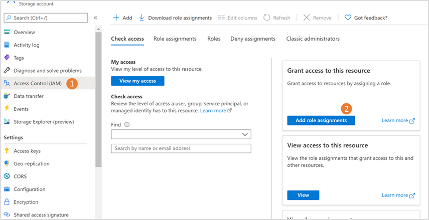

1. In the Add role assignment pane:

    1. Under **Role**, choose **Storage Account Backup Contributor**.
    1. Under **Assign access to**, choose **User, group or service principal**.
    1. Search for the Backup vault you want to use for backing up blobs in this storage account, and then select it from the search results.
    1. Select **Save**.

        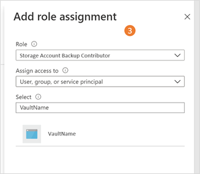

        >[!NOTE]
        >The role assignment might take up to 30 minutes to take effect.

## Create a backup policy

A backup policy defines the schedule and frequency of the recovery points creation, and its retention duration in the Backup vault. You can use a single backup policy for your vaulted backup, operational backup, or both. You can use the same backup policy to configure backup for multiple storage accounts to a vault.

To create a backup policy, follow these steps:

1. Go to **Backup center**, and then select **+ Policy**. This takes you to the create policy experience.

   :::image type="content" source="./media/blob-backup-configure-manage/add-policy-inline.png" alt-text="Screenshot shows how to initiate adding backup policy for vaulted blob backup." lightbox="./media/blob-backup-configure-manage/add-policy-expanded.png":::

2. Select the *data source type* as **Azure Blobs (Azure Storage)**, and then select **Continue**.

   :::image type="content" source="./media/blob-backup-configure-manage/datasource-type-selection-for-vaulted-blob-backup.png" alt-text="Screenshot shows how to select datasource type for vaulted blob backup.":::

3. On the **Basics** tab, enter a name for the policy and select the vault you want this policy to be associated with.

   :::image type="content" source="./media/blob-backup-configure-manage/add-vaulted-backup-policy-name.png" alt-text="Screenshot shows how to add vaulted blob backup policy name.":::

   You can view the details of the selected vault in this tab, and then select **continue**.
 
4. On the **Schedule + retention** tab, enter the *backup details* of the data store, schedule, and retention for these data stores, as applicable.

   1. To use the backup policy for vaulted backups, operational backups, or both, select the corresponding checkboxes.
   1. For each data store you selected, add or edit the schedule and retention settings:
      - **Vaulted backups**: Choose the frequency of backups between *daily* and *weekly*, specify the schedule when the backup recovery points need to be created, and then edit the default retention rule (selecting **Edit**) or add new rules to specify the retention of recovery points using a *grandparent-parent-child* notation.
      - **Operational backups**: These are continuous and don't require a schedule. Edit the default rule for operational backups to specify the required retention.

   :::image type="content" source="./media/blob-backup-configure-manage/define-vaulted-backup-schedule-and-retention-inline.png" alt-text="Screenshot shows how to configure vaulted blob backup schedule and retention." lightbox="./media/blob-backup-configure-manage/define-vaulted-backup-schedule-and-retention-expanded.png":::

5. Go to **Review and create**.
6. Once the review is complete, select **Create**.

## Configure backups

You can configure backup for one or more storage accounts in an Azure region if you want them to back up to the same vault using a single backup policy.

To configure backup for storage accounts, follow these steps:

1. Go to **Backup center** > **Overview**, and then select **+ Backup**.

   :::image type="content" source="./media/blob-backup-configure-manage/start-vaulted-backup.png" alt-text="Screenshot shows how to initiate vaulted blob backup.":::

2. On the **Initiate: Configure Backup** tab, choose **Azure Blobs (Azure Storage)** as the **Datasource type**.

   :::image type="content" source="./media/blob-backup-configure-manage/choose-datasource-for-vaulted-backup.png" alt-text="Screenshot shows how to initiate configuring vaulted blob backup.":::

3. On the **Basics** tab, specify **Azure Blobs (Azure Storage)** as the **Datasource type**, and then select the *Backup vault* that you want to associate with your storage accounts.

   You can view details of the selected vault on this tab, and then select **Next**.

   :::image type="content" source="./media/blob-backup-configure-manage/select-datasource-type-for-vaulted-backup.png" alt-text="Screenshot shows how to select datasource type to initiate vaulted blob backup.":::
 
4. Select the *backup policy* that you want to use for retention.

   You can view the details of the selected policy. You can also create a new backup policy, if needed. Once done, select **Next**.

   :::image type="content" source="./media/blob-backup-configure-manage/select-policy-for-vaulted-backup.png" alt-text="Screenshot shows how to select policy for vaulted blob backup.":::

5. On the **Datasources** tab, select the *storage accounts* you want to back up.

   :::image type="content" source="./media/blob-backup-configure-manage/select-storage-account-for-vaulted-backup.png" alt-text="Screenshot shows how to select storage account for vaulted blob backup." lightbox="./media/blob-backup-configure-manage/select-storage-account-for-vaulted-backup.png":::

   You can select multiple storage accounts in the region to back up using the selected policy. Search or filter the storage accounts, if required.
  
   If you've chosen the vaulted backup policy in step 4, you can also select specific containers to backup. Click "Change" under the "Selected containers" column. In     the context blade, choose "browse containers to backup" and unselect the ones you don't want to backup.

6. When you select the storage accounts and containers to protect, Azure Backup performs the following validations to ensure all prerequisites are met. The **Backup readiness** column shows if the Backup vault has enough permissions to configure backups for each storage account.

   1. Validates that the Backup vault has the required permissions to configure backup (the vault has the **Storage account backup contributor** role on all the selected storage accounts. If validation shows errors, then the selected storage accounts don't have **Storage account backup contributor** role. You can assign the required role, based on your current permissions. The error message helps you understand if you have the required permissions, and take the appropriate action:

      - **Role assignment not done**: This indicates that you (the user) have permissions to assign the **Storage account backup contributor** role and the other required roles for the storage account to the vault.

        Select the roles, and then select **Assign missing roles** on the toolbar to automatically assign the required role to the Backup vault, and trigger an autorevalidation.

        The role propagation may take some time (up to 10 minutes) causing the revalidation to fail. In this scenario, you need to wait for a few minutes and select **Revalidate** to retry validation.

      - **Insufficient permissions for role assignment**: This indicates that the vault doesn't have the required role to configure backups, and you (the user) don't have enough permissions to assign the required role. To make the role assignment easier, Azure Backup allows you to download the role assignment template, which you can share with users with permissions to assign roles for storage accounts. 

        To do this, select the storage accounts, and then select **Download role assignment template** to download the template. Once the role assignments are complete, select **Revalidate** to validate the permissions again, and then configure backup.

        :::image type="content" source="./media/blob-backup-configure-manage/vaulted-backup-role-assignment-success.png" alt-text="Screenshot shows that the role assignment is successful.":::

        >[!Note]
        >The template contains details for selected storage accounts only. So, if there are multiple users that need to assign roles for different storage accounts, you can select and download different templates accordingly.

    1. In case of vaulted backups, validates that the number of containers to be backed up is less than *100*. By default, all containers are selected; however, you can exclude containers that shouldn't be backed up. If your storage account has *>100* containers, you must exclude containers to reduce the count to *100 or below*.

      >[!Note]
      >In case of vaulted backups, the storage accounts to be backed up must contain at least *1 container*. If the selected storage account doesn't contain any containers or if no containers are selected, you may get an error while configuring backups.

7. Once validation succeeds, open the **Review and configure** tab.

8. Review the details on the **Review + configure** tab and select **Next** to initiate the *configure backup* operation.

You'll receive notifications about the status of configuring protection and its completion.

### Using Data protection settings of the storage account to configure backup

You can configure backup for blobs in a storage account directly from the ‘Data Protection’ settings of the storage account. 

1. Go to the storage account for which you want to configure backup for blobs, and then go to **Data Protection** in left pane (under **Data management**).

1. In the available data protection options, the first one allows you to enable operational backup using Azure Backup.

    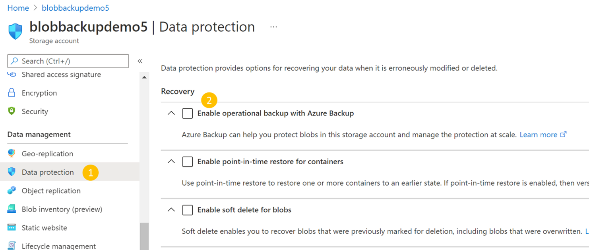

1. Select the checkbox corresponding to **Enable operational backup with Azure Backup**. Then select the Backup vault and the Backup policy you want to associate.
   You can select the existing vault and policy, or create new ones, as required.

    >[!IMPORTANT]
    >You should have assigned the **Storage account backup contributor** role to the selected vault. Learn more about [Grant permissions to the Backup vault on storage accounts](#grant-permissions-to-the-backup-vault-on-storage-accounts).
    
    - If you've already assigned the required role, select **Save** to finish configuring backup. Follow the portal notifications to track the progress of configuring backup.
    - If you haven’t assigned it yet, select **Manage identity**  and Follow the steps below to assign the roles. 

        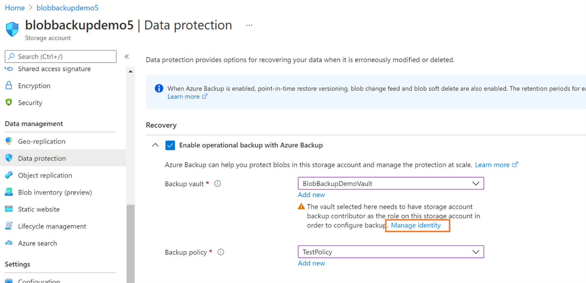

        1. On selecting **Manage identity**, brings you to the Identity pane of the storage account. 
        
        1. Select **Add role assignment** to initiate the role assignment.

            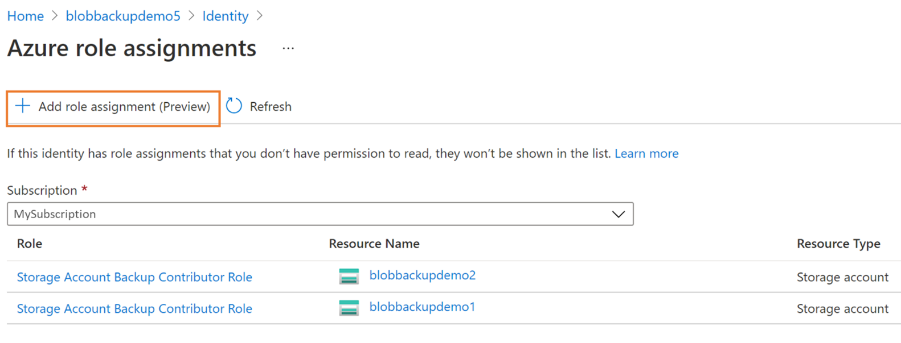

        1. Choose the scope, the subscription, the resource group, or the storage account you want to assign to the role.  We recommend  you to assign the role at resource group level if you want to configure operational backup for blobs for multiple storage accounts.

        1. From the **Role** drop-down, select the **Storage account backup contributor** role.

            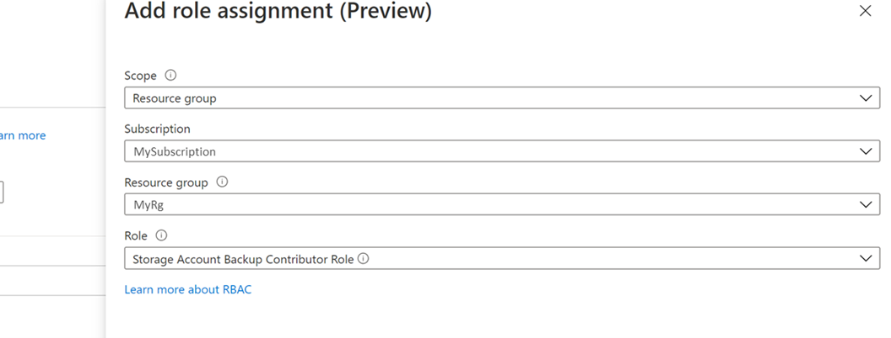

        1. Select **Save** to finish role assignment.
        
           You'll receive notification through the portal once this completes successfully. You can also see the new role added to the list of existing ones for the selected vault.

            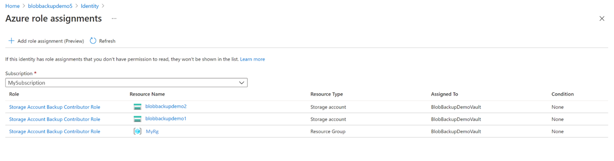

        1. Select the cancel icon (**x**) on the top right corner to return to the **Data protection** pane of the storage account.  Once back, continue configuring backup.

## Effects on backed-up storage accounts

# [Vaulted backup](#tab/vaulted-backup)

- In storage accounts (for which you've configured vaulted backups), the object replication rules get created under the **Object replication** item in the left pane.
- Object replication requires versioning and change-feed capabilities. So, Azure Backup service enables these features on the source storage account.

# [Operational backup](#tab/operational-backup)

Once backup is configured, changes taking place on block blobs in the storage accounts are tracked and data is retained according to the backup policy. You'll notice the following changes in the storage accounts for which backup is configured:

- The following capabilities are enabled on the storage account. These can be viewed in the **Data Protection** tab of the storage account.
  - Point in time restore for containers: With retention as specified in the backup policy
  - Soft delete for blobs: With retention as specified in the backup policy +5 days
  - Versioning for blobs
  - Blob change feed

  If the storage account configured for backup already had  **Point in time restore for containers** or **Soft delete for blobs** enabled (before backup was configured), Backup ensures that the retention is at least as defined in the backup policy. Therefore, for each property:

  - If the retention in the backup policy is greater than the retention originally present in the storage account: The retention on the storage account is modified according to the backup policy
  - If the retention in the backup policy is less than the retention originally present in the storage account: The retention on the storage account is left unchanged at the originally set duration.

  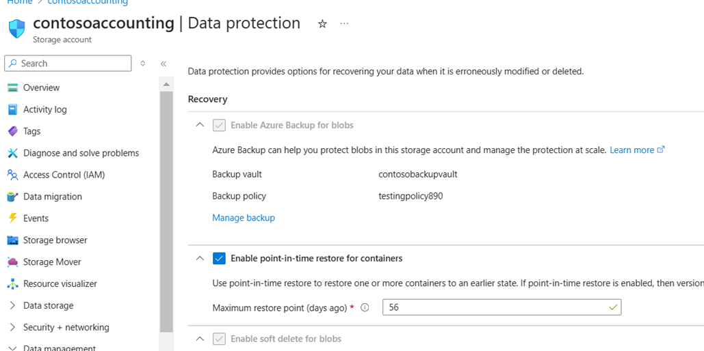

- A **Delete Lock** is applied by Backup on the protected Storage Account. The lock is intended to safeguard against cases of accidental deletion of the storage account. This can be viewed under **Storage Account** > **Locks**.

    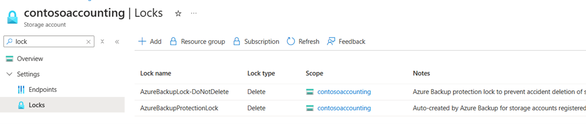

---

## Manage backups

You can use Backup Center as your single pane of glass for managing all your backups. Regarding backup for Azure Blobs, you can use Backup Center to do the following:

- As we've seen above, you can use it for creating Backup vaults and policies. You can also view all vaults and policies under the selected subscriptions.
- Backup Center gives you an easy way to monitor the state of protection of protected storage accounts as well as storage accounts for which backup isn't currently configured.
- You can configure backup for any storage accounts using the **+Backup** button.
- You can initiate restores using the **Restore** button and track restores using **Backup jobs**. For more information on performing restores, see [Restore Azure Blobs](blob-backup-support-matrix.md).
- Analyze your backup usage using Backup reports.

    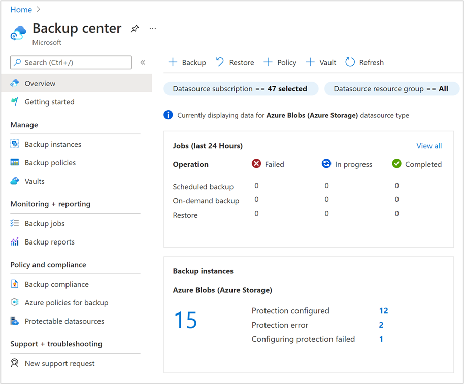

For more information, see [Overview of Backup Center](backup-center-overview.md).

## Stop protection

You can stop operational backup for your storage account according to your requirement.

>[!NOTE]
>When you remove backups, the **object replication policy** isn't removed from the source. So, you need to remove the policy separately. Stopping protection only dissociates the storage account from the Backup vault (and the backup tools, such as Backup center), and doesn’t disable blob point-in-time restore, versioning, and change feed that were configured.

To stop backup for a storage account, follow these steps:

1. Go to the backup instance for the storage account being backed up.  You can go to this from the storage account via **Storage account** -> **Data protection** -> **Manage backup settings**, or directly from the Backup Center via **Backup Center** -> **Backup instances** -> search for the storage account name.

    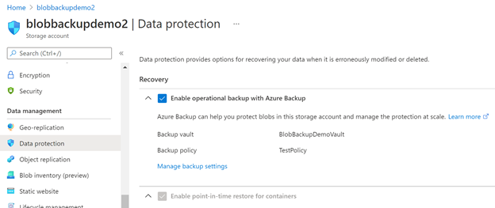

    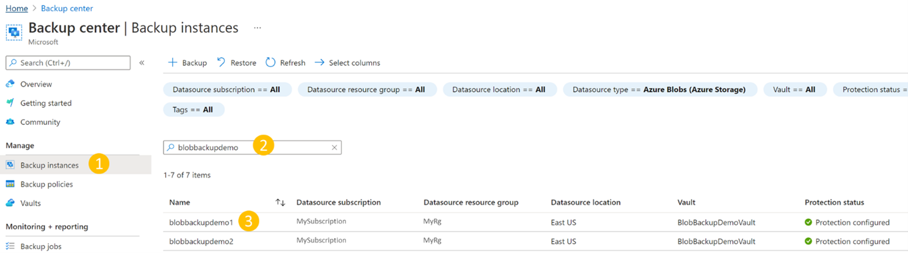

1. In the backup instance, select **Delete** to stop operational backup for the particular storage account. 
 
    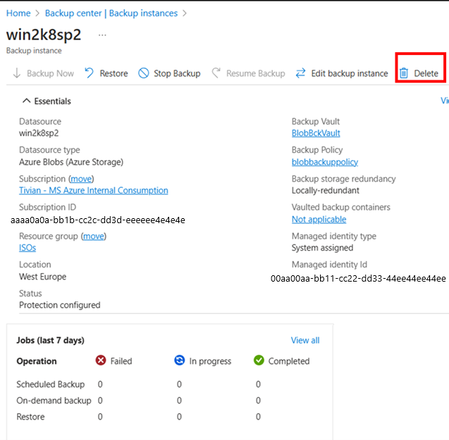

After stopping backup, you may disable other storage data protection capabilities (enabled for configuring backups) from the data protection pane of the storage account.

## Next steps

[Restore Azure Blobs](blob-restore.md)
