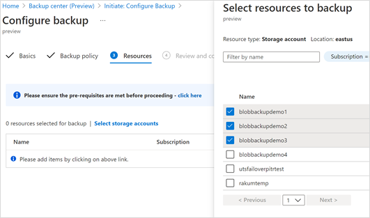
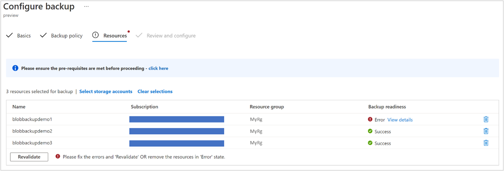

# Configure operational backup for Azure Blobs (in preview)

Azure Backup lets you easily configure operational backup for protecting block blobs in your storage accounts. This article explains how to configure operational backup on one or more storage accounts using the Azure portal. The article discusses the following:

- Things to know before you start
- Creating a Backup Vault
- Granting permissions to the Backup Vault on the storage accounts to be protected
- Creating a Backup policy
- Configuring operational backup on one or more storage accounts
- Effects on the backup up storage accounts

## Before you start

- Operational backup of blobs is a local backup solution that maintains data for a specified duration in the source storage account itself. This solution doesn't maintain an additional copy of data in the vault.
- This solution allows you to retain your data for restore for up to 360 days. Long retention durations may, however, lead to longer time taken during the restore operation.
- The solution can be used to perform restores to the source storage account only and may result in data being overwritten.
- If you delete a container from the storage account by calling the Delete Container operation, that container cannot be restored with a restore operation. Rather than deleting an entire container, delete individual blobs if you may want to restore them later. Also, Microsoft recommends enabling soft delete for containers, in addition to operational backup, to protect against accidental deletion of containers.
- Refer to the [support matrix](blob-backup-support-matrix.md) to learn more about the supported scenarios, limitations, and availability.

## Create a Backup vault

A [Backup vault](backup-vault-overview.md) is a management entity that stores recovery points created over time and provides an interface to perform backup related operations. These include taking on-demand backups, performing restores, and creating backup policies. Though operational backup of blobs is a local backup and doesn't "store" data in the vault, the vault is required for various management operations.

>[!NOTE]
>The Backup vault is a new resource that is used for backing up new supported workloads and is different from the already existing Recovery Services vault.

For instructions on how to create a Backup vault, see the [Backup vault documentation](backup-vault-overview.md#create-a-backup-vault).

## Grant permissions to the Backup vault on storage accounts

Operational backup also protects the storage account (that contains the blobs to be protected) from any accidental deletions by applying a Backup-owned Delete Lock. This requires the Backup vault to have certain permissions on the storage accounts that need to be protected. For convenience of use, these permissions have been consolidated under the Storage Account Backup Contributor role. Follow the instructions below for storage accounts that need to be protected:

1. In the storage account to be protected, navigate to the **Access Control (IAM) tab** on the left navigation pane.
1. Select **Add role assignments** to assign the required role.

    

1. In the Add role assignment pane:

    1. Under **Role**, choose **Storage Account Backup Contributor**.
    1. Under **Assign access to**, choose **User, group or service principal**.
    1. Type the **name of the Backup vault** that you want to protect the blobs in this storage account and select the same from the search results.
    1. Once done, select **Save**.

        

        >[!NOTE]
        >Allow up to 10 minutes for the role assignment to take effect.

## Create a backup policy

A backup policy typically governs the retention and schedule of your backups. Since operational backup for blobs is continuous in nature, you don't need a schedule to perform backups. The policy is essentially needed to specify the retention period. You can use and reuse the backup policy to configure backup for multiple storage accounts to a vault.

Here are the steps to create a backup policy for operational backup of your blobs:

1. In your Backup vault, navigate to **Backup policies** and select **+Add** to start creating a backup policy.

    

1. In the **Basics** tab, provide a name for your backup policy and select **Azure Blobs** as the datasource type. You can also view the details for your selected vault.

    

    >[!NOTE]
    >Although you'll see the **Backup storage redundancy** of the vault, the redundancy doesn't really apply to the operational backup of blobs since the backup is local in nature and no data is stored in the Backup vault. The Backup vault here is the management entity to help you manage the protection of block blobs in your storage accounts.

1. The **Backup policy** tab is where you specify the retention details. You'll see there's already a retention rule called **Default** with a retention period of 30 days. If you want to edit the retention duration, use the **edit retention rule** icon to edit and specify the duration for which you want the data to be retained. You can specify retention up to 360 days.

    

    >[!NOTE]
    >Restoring over long durations may lead to restore operations taking longer to complete. Furthermore, the time that it takes to restore a set of data is based on the number of write and delete operations made during the restore period. For example, an account with one million objects with 3,000 objects added per day and 1,000 objects deleted per day will require approximately two hours to restore to a point 30 days in the past. A retention period and restoration more than 90 days in the past would not be recommended for an account with this rate of change.

1. In the **Review + create** pane, verify all details for the policy, and select **Create** once done to finish creating the policy. A notification will confirm once the Backup policy has been created and is ready to be used.

    

## Configure backup

Backup of blobs is configured at the storage account level. So all the blobs in the storage account are protected with operational backup.

To start configuring backup:

1. Search for **Backup Center** in the search bar.
1. Navigate to **Overview** -> **+Backup**.

    

1. In the **Initiate: Configure Backup** tab, choose **Azure Blobs (Azure Storage)** as the Datasource type.

    

1. In the **Basics** tab, specify **Azure Blobs (Azure Storage)** as the **Datasource** type and select the Backup vault to which you want to associate your storage accounts. You can view details of the selected vault in the pane.

    

1. Next, select the backup policy that you want to use for specifying the retention. You can view the details of the selected policy in the lower part of the screen. The operational data store column shows the retention defined in the policy. "Operational" means that the data is maintained locally in the source storage account itself.

    

    You can also create a new backup policy. To do this, select **Create new** and follow the steps below:

    1. Provide a name for the policy you want to create. Ensure that the other boxes display the correct Datasource type and Vault name.
    1. In the **Backup policy** tab, select the edit retention rule icon to edit and specify the duration for which you want the data to be retained. You can specify retention up to 360 days. Restoring over long durations may lead to restore operations taking longer to complete.

        

    1. Once done, select **Review + create** to create the backup policy.

1. Next, you're required to choose the storage accounts for which you want to configure protection of blobs. You can choose multiple storage accounts at once and choose **Select**.

    However, make sure the vault you have chosen has the required permissions to configure backup on the storage accounts as detailed above in [Grant permissions to the Backup vault on storage accounts](#grant-permissions-to-the-backup-vault-on-storage-accounts).

    

    Backup checks if the vault has sufficient permissions to allow configuring of backup on the selected storage accounts.

    

    If validation results in errors (as with one of the storage accounts in the screenshot), go to the selected storage accounts and assign appropriate roles, as detailed [here](#grant-permissions-to-the-backup-vault-on-storage-accounts), and select **Revalidate**. New role assignment may take up to 10 minutes to take effect.

1. Once validation succeeds for all selected storage accounts, continue to **Review and configure** to configure backup. You'll see notifications informing you about the status of configuring protection and its completion.

## Effects on backed up storage accounts

Once backup is configured, changes taking place on block blobs in the storage accounts are tracked and data is retained according to the backup policy. You'll notice the following changes in the storage accounts for which backup is configured:

- The following capabilities are enabled on the storage account. These can be viewed in the **Data Protection** tab of the storage account.
  - Point in time restore for containers: With retention as specified in the backup policy
  - Soft delete for blobs: With retention as specified in the backup policy +5 days
  - Versioning for blobs
  - Blob change feed

  If the storage account configured for backup already had  **Point in time restore for containers** or **Soft delete for blobs** enabled (before backup was configured), Backup ensures that the retention is at least as defined in the backup policy. Therefore, for each property:

  - If the retention in the backup policy is greater than the retention originally present in the storage account: The retention on the storage account is modified according to the backup policy
  - If the retention in the backup policy is less than the retention originally present in the storage account: The retention on the storage account is left unchanged at the originally set duration.

  

- A **Delete Lock** is applied by Backup on the protected Storage Account. The lock is intended to safeguard against cases of accidental deletion of the storage account. This can be viewed under **Storage Account** > **Locks**.

    

## Manage operational backup

You can use Backup Center as your single pane of glass for managing all your backups. Regarding operational backup for Azure Blobs, you can use Backup Center to perform the following:

- As we've seen above, you can use it for creating Backup vaults and policies. You can also view all vaults and policies under the selected subscriptions.
- Backup Center gives you an easy way to monitor the state of protection of protected storage accounts as well as storage accounts for which backup isn't currently configured.
- You can configure backup for any storage accounts using the **+Backup** button.
- You can initiate restores using the **Restore** button and track restores using **Backup jobs**. For more information on performing restores, see [Restore Azure Blobs](blob-backup-support-matrix.md).
- Analyze your backup usage using Backup reports.

    

For more information, see [Overview of Backup Center (Preview)](backup-center-overview.md).

## Next steps

- [Restore Azure Blobs](blob-restore.md)
