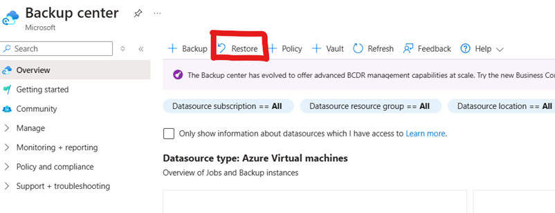
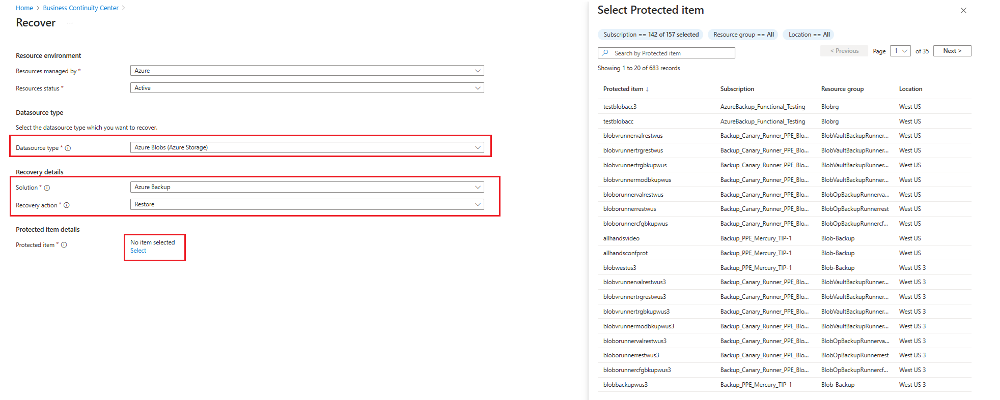
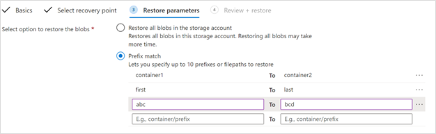
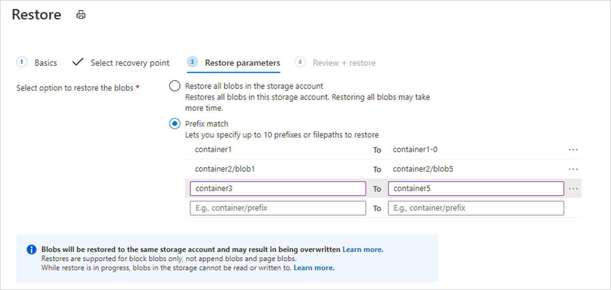

# Restore Azure Blobs

This article describes how to use the Azure portal to perform restores for Azure Blob from operational or vaulted backups. With operational backups, you can restore all block blobs in storage accounts with operational backup configured or a subset of blob content to any point-in-time within the retention range. With vaulted backups, you can perform restores using a recovery point created, based on your backup schedule.

## Before you start

# [Operational backup](#tab/operational-backup)

- Blobs will be restored to the same storage account. So blobs that have undergone changes since the time to which you're restoring will be overwritten.
- Only block blobs in a standard general-purpose v2 storage account can be restored as part of a restore operation. Append blobs, page blobs, and premium block blobs aren't restored.
- When you perform a restore operation, Azure Storage blocks data operations on the blobs in the ranges being restored for the duration of the operation.
- If a blob with an active lease is included in the range to restore, and if the current version of the leased blob is different from the previous version at the timestamp provided for PITR, the restore operation will fail atomically. We recommend breaking any active leases before initiating the restore operation.
- Snapshots aren't created or deleted as part of a restore operation. Only the base blob is restored to its previous state.
- If you delete a container from the storage account by calling the **Delete Container** operation, that container can't be restored with a restore operation. Rather than deleting an entire container, delete individual blobs if you may want to restore them later. Also, Microsoft recommends enabling soft delete for containers in addition to operational backup to protect against accidental deletion of containers.
- Refer to the [support matrix](blob-backup-support-matrix.md) for all limitations and supported scenarios.

# [Vaulted backup](#tab/vaulted-backup)

- Vaulted backups only support restoring data to another storage account, which is different from the one that was backed up.
- Ensure that the Backup vault has the *Storage account backup contributor* role assigned to the target storage account to which the backup data needs to be restored.

---

## Restore blobs

To initiate a restore through the Backup center, follow these steps:

1. In Backup center, go to **Restore** on the top bar.

    

1. On the **Initiate Restore** tab, choose **Azure Blobs (Azure Storage)** as the Datasource type and select the **Backup Instance** you want to restore. The backup instance is the storage account that contains the blobs you want to restore.

     

1. On the **Select recovery point** tab, select the type of backup you want to restore.

   - For operational backup, choose the date and time you want to restore your data. You can also use the slider to choose the point-in-time to restore from. The restoration details appear next to the date, which shows the valid duration from which you can restore your data. Operational backup for blobs is a continuous backup and gives granular control over points to recover data from.

   - For vaulted backup, choose a recovery point from which you want to perform the restore.
 
   :::image type="content" source="./media/blob-restore/select-backup-type-for-restore-inline.png" alt-text="Screenshot shows the restore options for blob backup." lightbox="./media/blob-restore/select-backup-type-for-restore-expanded.png":::

   >[!NOTE]
   > The time mentioned here is your local time.

1. On the **Restore parameters** tab, select the options based on the type of backups you've chosen to perform restore.

    

    For **operational backup**, choose one of these options:

    - **Restore all blobs in the storage account**: Using this option restores all block blobs in the storage account by rolling them back to the selected point in time. Storage accounts containing large amounts of data or witnessing a high churn may take longer times to restore.

    - **Browse and restore selected containers**: Using this option allows you to browse and select up to 10 containers to restore. You must have sufficient permissions to view the containers in the storage account, or else you might not be able to see the contents of the storage account.

    - **Select blobs to restore using prefix match**: This option lets you restore a subset of blobs using a prefix match. You can specify up to 10 lexicographical ranges of blobs within a single container or across multiple containers to return those blobs to their previous state at a given point in time. Here are a few things to keep in mind:

        - You can use a forward slash (/) to delineate the container name from the blob prefix
        - The start of the range specified is inclusive, however the specified range is exclusive.

    For more information on using prefixes to restore blob ranges, see [this section](#use-prefix-match-for-restoring-blobs).

   For vaulted backup, choose one of these options:

   - **Restore all backed-up containers**: Use this option to restore all backed-up containers in the storage account.
   - **Browse and select containers to restore**: Use this option to browse and select up to **100** containers to restore. You must have sufficient permission to view the containers in the storage account, or you can't see the contents of the storage account. Select the target storage account (and its subscription), that is, the storage account where the data needs to be restored.

     >[!Note]
     >The vault must have the *Storage account backup contributor* role assigned on the target storage account. Select **Validate** to ensure that the required permissions to perform the restore are assigned. Once done, proceed to the next tab.

   :::image type="content" source="./media/blob-restore/choose-options-for-vaulted-backup.png" alt-text="Screenshot shows the option to choose for vaulted backup." lightbox="./media/blob-restore/choose-options-for-vaulted-backup.png":::

1. Once you finish specifying what blobs to restore, continue to the **Review + restore** tab, and select **Restore** to initiate the restore.

1. **Track restore**: Use the **Backup Jobs** view to track the details and status of restores. To do this, navigate to **Backup Center** > **Backup Jobs**. The status will show **In progress** while the restore is being performed.

    

    When the restore operation successfully completes, the status will change to **Completed**. Once the restore completes successfully, you'll be able to read and write blobs in the storage account again.

## Additional topics

### Use prefix match for restoring blobs

Consider the following example:

The restore operation shown in the image performs the following actions:

- It restores the complete contents of *container1*.
- It restores blobs in the lexicographical range *blob1* through *blob5* in *container2*. This range restores blobs with names such as *blob1*, *blob11*, *blob100*, *blob2*, and so on. Because the end of the range is exclusive, it restores blobs whose names begin with *blob4*, but doesn't restore blobs whose names begin with *blob5*.
- It restores all blobs in *container3* and *container4*. Because the end of the range is exclusive, this range doesn't restore *container5*.

>[!Note]
>This capability is currently supported only for operational backups.

## Next steps

- [Overview of operational backup for Azure Blobs](blob-backup-overview.md)
