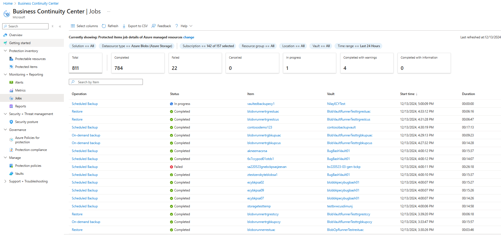

# Restore Azure Blobs

Block blobs in storage accounts with operational backup configured can be restored to any point in time within the retention range. Also, you can scope your restores to all block blobs in the storage account or to a subset of blobs.

## Before you start

- Blobs will be restored to the same storage account. So blobs that have undergone changes since the time to which you're restoring will be overwritten.
- Only block blobs in a standard general-purpose v2 storage account can be restored as part of a restore operation. Append blobs, page blobs, and premium block blobs aren't restored.
- While a restore job is in progress, blobs in the storage cannot be read or written to.
- A blob with an active lease cannot be restored. If a blob with an active lease is included in the range of blobs to restore, the restore operation will fail automatically. Break any active leases before starting the restore operation.
- Snapshots aren't created or deleted as part of a restore operation. Only the base blob is restored to its previous state.
- If you delete a container from the storage account by calling the **Delete Container** operation, that container cannot be restored with a restore operation. Rather than deleting an entire container, delete individual blobs if you may want to restore them later. Also, Microsoft recommends enabling soft delete for containers in addition to operational backup to protect against accidental deletion of containers.
- Refer to the [support matrix](blob-backup-support-matrix.md) for all limitations and supported scenarios.

## Restore blobs

You can initiate a restore through the Backup Center.

1. In Backup Center, go to **Restore** on the top bar.

    

1. In the **Initiate Restore** tab, choose **Azure Blobs (Azure Storage)** as the Datasource type and select the **Backup Instance** you want to restore. The backup instance here is the storage account that contains the blobs you want to restore.

     

1. In the **Select recovery point** tab, choose the date and time you want to restore your data from. You can also use the slider to choose the point in time to restore from. The info bubble next to the date shows the valid duration from which you can restore your data. Operational backup for blobs being continuous backup gives you granular control over points to recover data from.

    >[!NOTE]
    > The time depicted here is your local time.

    

1. In the **Restore parameters** tab, choose whether you want to restore all blobs in the storage account, specific containers, or a subset of blobs using prefix match. When using prefix match, you can specify up to 10 ranges of prefixes or filepaths. More details on using prefix match [here](#use-prefix-match-for-restoring-blobs).

    

    Choose one of these options:

    - **Restore all blobs in the storage account**: Using this option restores all block blobs in the storage account by rolling them back to the selected point in time. Storage accounts containing large amounts of data or witnessing a high churn may take longer times to restore.

    - **Browse and restore selected containers**: Using this option allows you to browse and select up to 10 containers to restore. You must have sufficient permissions to view the containers in the storage account, or else you might not be able to see the contents of the storage account.

    - **Select blobs to restore using prefix match**: This option lets you restore a subset of blobs using a prefix match. You can specify up to 10 lexicographical ranges of blobs within a single container or across multiple containers to return those blobs to their previous state at a given point in time. Here are a few things to keep in mind:

        - You can use a forward slash (/) to delineate the container name from the blob prefix
        - The start of the range specified is inclusive, however the specified range is exclusive.

    For more information on using prefixes to restore blob ranges, see [this section](#use-prefix-match-for-restoring-blobs).

1. Once you finish specifying what blobs to restore, continue to the **Review + restore** tab, and select **Restore** to initiate the restore.

1. **Track restore**: Use the **Backup Jobs** view to track the details and status of restores. To do this, navigate to **Backup Center** > **Backup Jobs**. The status will show **In progress** while the restore is being performed.

    

    When the restore operation successfully completes, the status will change to **Completed**. Once the restore completes successfully, you'll be able to read and write blobs in the storage account again.

## Additional topics

### Use prefix match for restoring blobs

Consider the following example:

The restore operation shown in the image performs the following actions:

- It restores the complete contents of *container1*.
- It restores blobs in the lexicographical range *blob1* through *blob5* in *container2*. This range restores blobs with names such as *blob1*, *blob11*, *blob100*, *blob2*, and so on. Because the end of the range is exclusive, it restores blobs whose names begin with *blob4*, but doesn't restore blobs whose names begin with *blob5*.
- It restores all blobs in *container3* and *container4*. Because the end of the range is exclusive, this range doesn't restore *container5*.

## Next steps

- [Overview of operational backup for Azure Blobs](blob-backup-overview.md)
