# Configure Azure Backup reports

A common requirement for backup admins is to obtain insights on backups based on data that spans a long period of time. Use cases for such a solution include:

- Allocating and forecasting of cloud storage consumed.
- Auditing of backups and restores.
- Identifying key trends at different levels of granularity.

Today, Azure Backup provides a reporting solution that uses [Azure Monitor logs](../azure-monitor/logs/log-analytics-tutorial.md) and [Azure workbooks](../azure-monitor/visualize/workbooks-overview.md). These resources help you get rich insights on your backups across your entire backup estate. This article explains how to configure and view Azure Backup reports.

## Supported scenarios

- Backup reports are supported for Azure VMs, SQL in Azure VMs, SAP HANA in Azure VMs, Microsoft Azure Recovery Services (MARS) agent, Microsoft Azure Backup Server (MABS), and System Center Data Protection Manager (DPM). For Azure File share backup, data is displayed for records created on or after June 1, 2020.
- For Azure File share backup, data on protected instances is displayed for records created after Feb 1st, 2021 (defaults to zero for older records).
- For DPM workloads, Backup reports are supported for DPM Version 5.1.363.0 and above and Agent Version 2.0.9127.0 and above.
- For MABS workloads, Backup reports are supported for MABS Version 13.0.415.0 and above and Agent Version 2.0.9170.0 and above.
- Backup reports can be viewed across all backup items, vaults, subscriptions, and regions as long as their data is being sent to a Log Analytics workspace that the user has access to. To view reports for a set of vaults, you only need to have reader access to the Log Analytics workspace to which the vaults are sending their data. You don't need to have access to the individual vaults.
- If you're an [Azure Lighthouse](../lighthouse/index.yml) user with delegated access to your customers' subscriptions, you can use these reports with Azure Lighthouse to view reports across all your tenants.
- Currently, data can be viewed in Backup Reports across a maximum of 100 Log Analytics Workspaces (across tenants).
- Data for log backup jobs currently isn't displayed in the reports.

[!INCLUDE [backup-center.md](../../includes/backup-center.md)]

## Get started

Follow these steps to start using the reports.

### 1. Create a Log Analytics workspace or use an existing one

Set up one or more Log Analytics workspaces to store your Backup reporting data. The location and subscription where this Log Analytics workspace can be created is independent of the location and subscription where your vaults exist.

To set up a Log Analytics workspace, see [Create a Log Analytics workspace in the Azure portal](../azure-monitor/logs/quick-create-workspace.md).

By default, the data in a Log Analytics workspace is retained for 30 days. To see data for a longer time horizon, change the retention period of the Log Analytics workspace. To change the retention period, see [Manage usage and costs with Azure Monitor logs](../azure-monitor/logs/manage-cost-storage.md).

### 2. Configure diagnostics settings for your vaults

Azure Resource Manager resources, such as Recovery Services vaults, record information about scheduled operations and user-triggered operations as diagnostics data.

In the monitoring section of your Recovery Services vault, select **Diagnostics settings** and specify the target for the Recovery Services vault's diagnostic data. To learn more about using diagnostic events, see [Use diagnostics settings for Recovery Services vaults](./backup-azure-diagnostic-events.md).

Azure Backup also provides a built-in Azure Policy definition, which automates the configuration of diagnostics settings for all vaults in a given scope. To learn how to use this policy, see [Configure vault diagnostics settings at scale](./azure-policy-configure-diagnostics.md).

> [!NOTE]
> After you configure diagnostics, it might take up to 24 hours for the initial data push to complete. After data starts flowing into the Log Analytics workspace, you might not see data in the reports immediately because data for the current partial day isn't shown in the reports. For more information, see [Conventions used in Backup reports](#conventions-used-in-backup-reports). We recommend that you start viewing the reports two days after you configure your vaults to send data to Log Analytics.

#### 3. View reports in the Azure portal

After you've configured your vaults to send data to Log Analytics, view your Backup reports by going to any vault's pane and selecting **Backup Reports**.

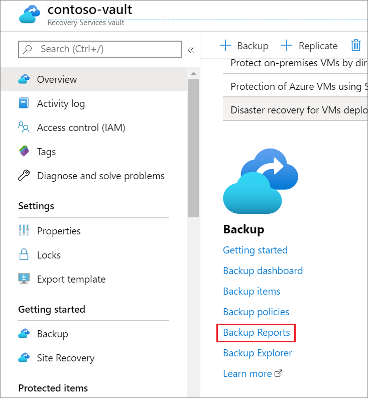

Select this link to open up the Backup report workbook.

> [!NOTE]
>
> - Currently, the initial load of the report might take up to 1 minute.
> - The Recovery Services vault is merely an entry point for Backup reports. After the Backup report workbook opens up from a vault's pane, select the appropriate set of Log Analytics workspaces to see data aggregated across all your vaults.

The report contains various tabs:

##### Summary

Use this tab to get a high-level overview of your backup estate. You can get a quick glance of the total number of backup items, total cloud storage consumed, the number of protected instances, and the job success rate per workload type. For more detailed information about a specific backup artifact type, go to the respective tabs.

   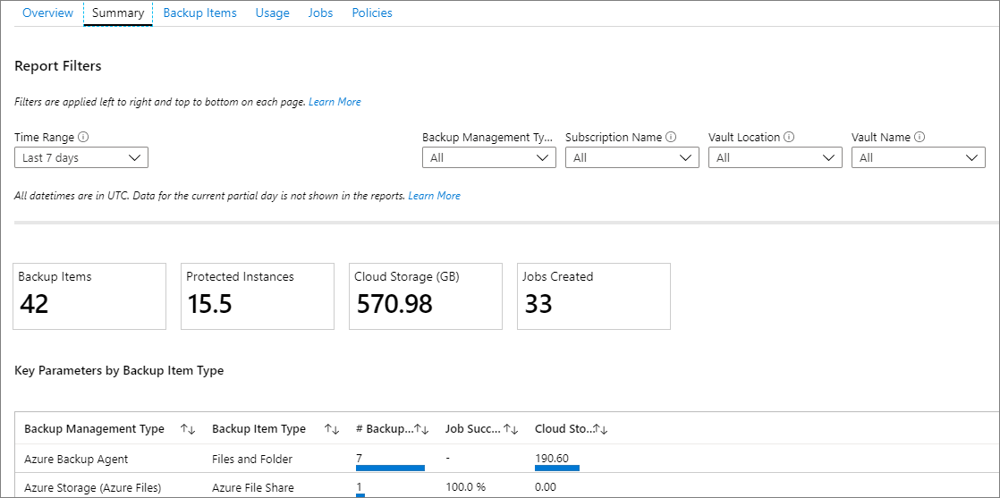

##### Backup Items

Use this tab to see information and trends on cloud storage consumed at a Backup-item level. For example, if you use SQL in an Azure VM backup, you can see the cloud storage consumed for each SQL database that's being backed up. You can also choose to see data for backup items of a particular protection status. For example, selecting the **Protection Stopped** tile at the top of the tab filters all the widgets underneath to show data only for Backup items in the Protection Stopped state.

   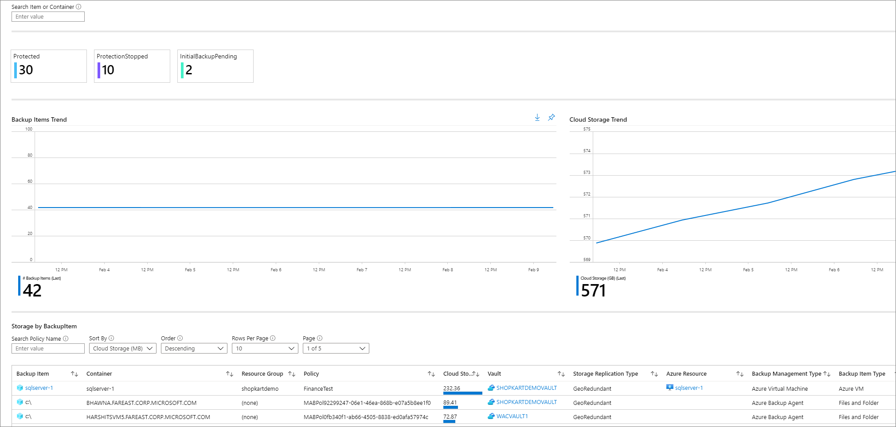

##### Usage

Use this tab to view key billing parameters for your backups. The information shown on this tab is at a billing entity (protected container) level. For example, if a DPM server is being backed up to Azure, you can view the trend of protected instances and cloud storage consumed for the DPM server. Similarly, if you use SQL in Azure Backup or SAP HANA in Azure Backup, this tab gives you usage-related information at the level of the virtual machine in which these databases are contained.

   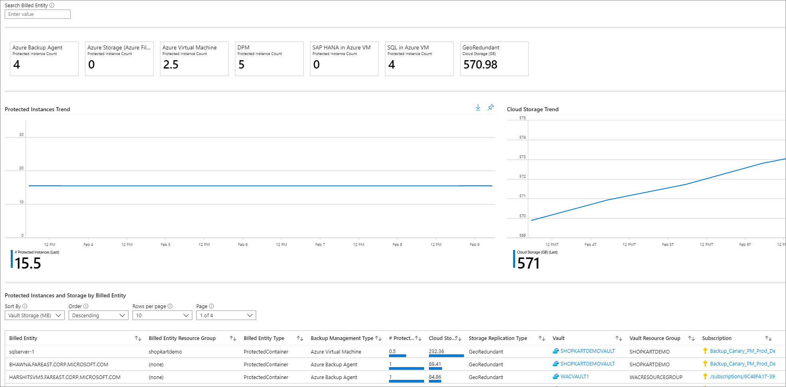

> [!NOTE]
> For DPM workloads, users might see a slight difference (of the order of 20 MB per DPM server) between the usage values shown in the reports as compared to the aggregate usage value as shown in the Recovery Services vault **Overview** tab. This difference is accounted for by the fact that every DPM server being registered for backup has an associated 'metadata' datasource which isn't surfaced as an artifact for reporting.

##### Jobs

Use this tab to view long-running trends on jobs, such as the number of failed jobs per day and the top causes of job failure. You can view this information at both an aggregate level and at a Backup-item level. Select a particular Backup item in a grid to view detailed information on each job that was triggered on that Backup item in the selected time range.

   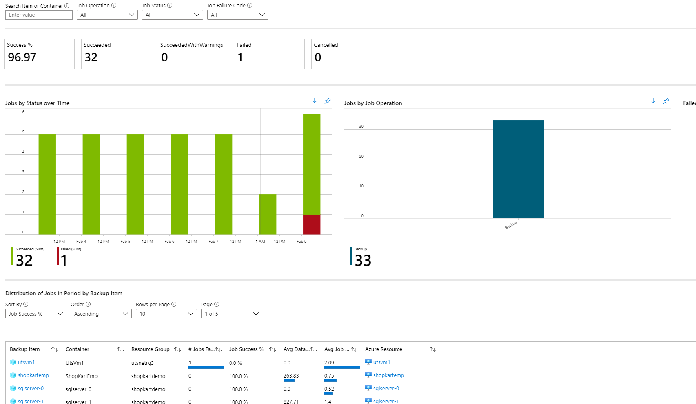

##### Policies

Use this tab to view information on all of your active policies, such as the number of associated items and the total cloud storage consumed by items backed up under a given policy. Select a particular policy to view information on each of its associated Backup items.

   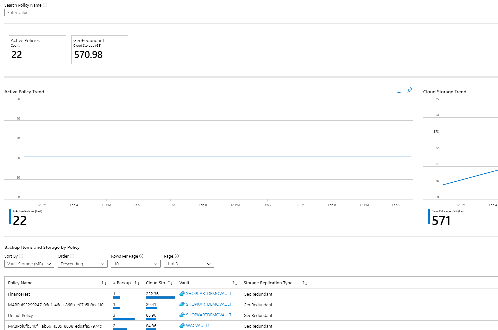

##### Optimize

Use this tab to gain visibility into potential cost-optimization opportunities for your backups. Following are the scenarios for which the Optimize tab currently provides insights:

###### Inactive resources

Using this view, you can identify those backup items that haven't had a successful backup for a significant duration of time. This could either mean that the underlying machine that's being backed up doesn't exist anymore (and so is resulting in failed backups), or there's some issue with the machine that's preventing backups from being taken reliably.

To view inactive resources, navigate to the **Optimize** tab, and select the **Inactive Resources** tile. Select this tile displays a grid that contains details of all the inactive resources that exist in the selected scope. By default, the grid shows items that don't have a recovery point in the last seven days. To find inactive resources for a different time range, you can adjust the **Time Range** filter at the top of the tab.

Once you've identified an inactive resource, you can investigate the issue further by navigating to the backup item dashboard or the Azure resource pane for that resource (wherever applicable). Depending on your scenario, you can choose to either stop backup for the machine (if it doesn't exist anymore) and delete unnecessary backups, which saves costs, or you can fix issues in the machine to ensure that backups are taken reliably.

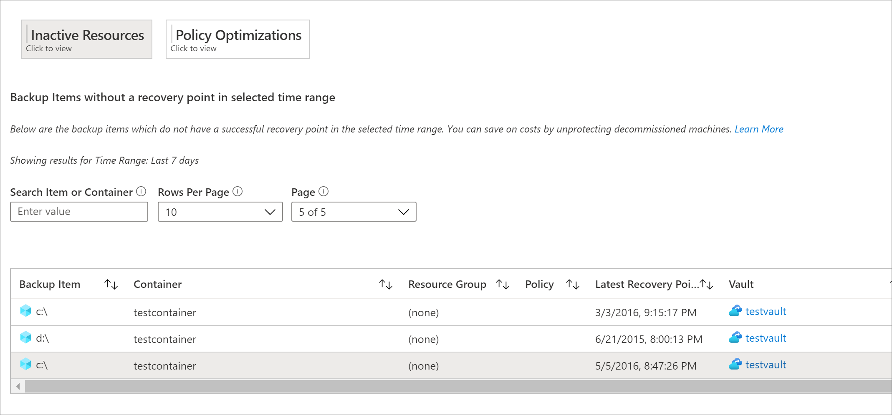

###### Backup Items with a large retention duration

Using this view, you can identify those items that have backups retained for a longer duration than required by your organization.

Selecting the **Policy Optimizations** tile followed by the **Retention Optimizations** tile displays a grid containing all backup items for which the retention of either the daily, weekly, monthly, or yearly retention point (RP) is greater than a specified value. By default, the grid displays all backup items in the selected scope. You can use the filters for daily, weekly, monthly, and yearly RP retention to filter the grid further and identify those items for which retention could potentially be reduced to save on backup storage costs.

For database workloads like SQL and SAP HANA, the retention periods shown in the grid correspond to the retention periods of the full backup points and not the differential backup points. The same applies for the retention filters as well.  

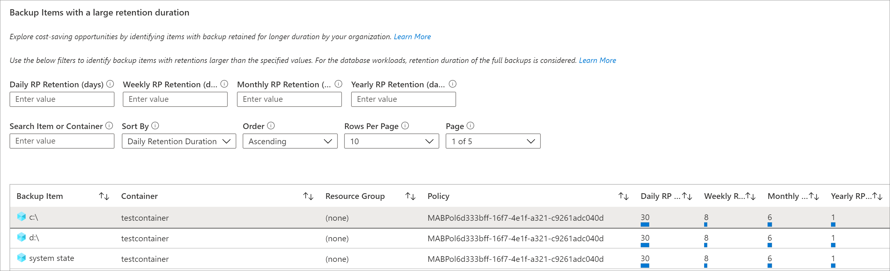

###### Databases configured for daily full backup

Using this view, you can identify database workloads that have been configured for daily full backup. Often, using daily differential backup along with weekly full backup is more cost-effective.

Selecting the **Policy Optimizations** tile followed by the **Backup Schedule Optimizations** tile displays a grid containing all databases with a daily full backup policy. You can choose to navigate to a particular backup item and modify the policy to use daily differential backup with weekly full backup.

The **Backup Management Type** filter at the top of the tab should have the items **SQL in Azure VM** and **SAP HANA in Azure VM** selected, for the grid to be able to display database workloads as expected.

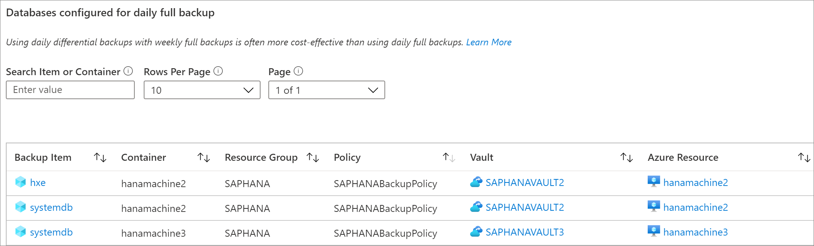

###### Policy adherence

Using this tab, you can identify whether all of your backup instances have had at least one successful backup every day. For items with weekly backup policy, you can use this tab to determine whether all backup instances have had at least one successful backup a week.

There are two types of policy adherence views available:

* **Policy Adherence by Time Period**: Using this view, you can identify how many items have had at least one successful backup in a given day and how many have not had a successful backup in that day. You can click on a row to see details of all backup jobs that have been triggered on the selected day. Note that if you increase the time range to a larger value, such as the last 60 days, the grid is rendered in weekly view, and displays the count of all items that have had at least one successful backup on every day in the given week. Similarly, there is a monthly view for larger time ranges.

In the case of items backed up weekly, this grid helps you identify all items that have had at least one successful backup in the given week. For a larger time range, such as the last 120 days, the grid is rendered in monthly view, and displays the count of all items that have had at least one successful backup in every week in the given month. Refer [Conventions used in Backup Reports](#conventions-used-in-backup-reports) for more details around daily, weekly and monthly views.

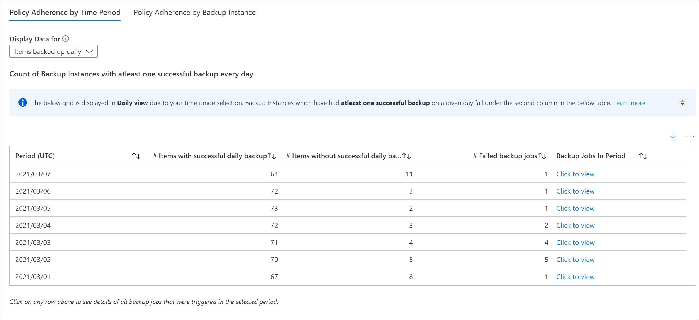

* **Policy Adherence by Backup Instance**: Using this view, you can policy adherence details at a backup instance level. A cell which is green denotes that the backup instance had at least one successful backup on the given day. A cell which is red denotes that the backup instance did not have even one successful backup on the given day. Daily, weekly and monthly aggregations follow the same behavior as the Policy Adherence by Time Period view. You can click on any row to view all backup jobs on the given backup instance in the selected time range.

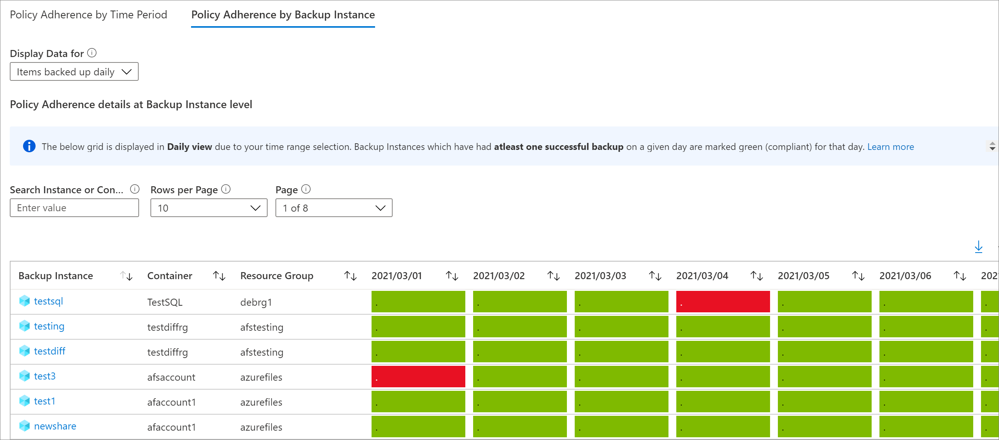

###### Email Azure Backup reports

Using the **Email Report** feature available in Backup Reports, you can create automated tasks to receive periodic reports via email. This feature works by deploying a logic app in your Azure environment that queries data from your selected Log Analytics (LA) workspaces, based on the inputs that you provide.

Once the logic app is created, you'll need to authorize connections to Azure Monitor Logs and Office 365. To do this, navigate to **Logic Apps** in the Azure portal and search for the name of the task you've created. Selecting the **API connections** menu item opens up the list of API connections that you need to authorize. [Learn more about how to configure emails and troubleshoot issues](backup-reports-email.md).

###### Customize Azure Backup reports

Backup Reports uses [system functions on Azure Monitor logs](backup-reports-system-functions.md). These functions operate on data in the raw Azure Backup tables in LA and return formatted data that helps you easily retrieve information of all your backup-related entities, using simple queries. 

To create your own reporting workbooks using Backup Reports as a base, you can navigate to Backup Reports, click on **Edit** at the top of the report, and view/edit the queries being used in the reports. Refer to [Azure workbooks documentation](../azure-monitor/visualize/workbooks-overview.md) to learn more about how to create custom reports. 

## Export to Excel

Select the down arrow button in the upper right of any widget, like a table or chart, to export the contents of that widget as an Excel sheet as-is with existing filters applied. To export more rows of a table to Excel, you can increase the number of rows displayed on the page by using the **Rows Per Page** drop-down arrow at the top of each grid.

## Pin to dashboard

Select the pin button at the top of each widget to pin the widget to your Azure portal dashboard. This feature helps you create customized dashboards tailored to display the most important information that you need.

## Cross-tenant reports

If you use [Azure Lighthouse](../lighthouse/index.yml) with delegated access to subscriptions across multiple tenant environments, you can use the default subscription filter. Select the filter button in the upper-right corner of the Azure portal to choose all the subscriptions for which you want to see data. Doing so lets you select Log Analytics workspaces across your tenants to view multitenanted reports.

## Conventions used in Backup reports

- Filters work from left to right and top to bottom on each tab. That is, any filter only applies to all those widgets that are positioned either to the right of that filter or below that filter.
- Selecting a colored tile filters the widgets below the tile for records that pertain to the value of that tile. For example, selecting the **Protection Stopped** tile on the **Backup Items** tab filters the grids and charts below to show data for backup items in the Protection Stopped state.
- Tiles that aren't colored aren't selectable.
- Data for the current partial day isn't shown in the reports. So, when the selected value of **Time Range** is **Last 7 days**, the report shows records for the last seven completed days. The current day isn't included.
- The report shows details of jobs (apart from log jobs) that were *triggered* in the selected time range.
- The values shown for **Cloud Storage** and **Protected Instances** are at the *end* of the selected time range.
- The Backup items displayed in the reports are those items that exist at the *end* of the selected time range. Backup items that were deleted in the middle of the selected time range aren't displayed. The same convention applies for Backup policies as well.
- If the selected time range spans a period of 30 days of less, charts are rendered in daily view, where there is one data point for every day. If the time range spans a period greater than 30 days and less than (or equal to) 90 days, charts are rendered in weekly view. For larger time ranges, charts are rendered in monthly view. Aggregating data weekly or monthly helps in better performance of queries and easier readability of data in charts.
- The Policy Adherence grids also follow a similar aggregation logic as described above. However, there are a couple of minor differences. The first difference is that for items with weekly backup policy, there is no daily view (only weekly and monthly views are available). Further, in the grids for items with weekly backup policy, a 'month' is considered as a 4-week period (28 days), and not 30 days, to eliminate partial weeks from consideration.

## Query load times

The widgets in the Backup report are powered by Kusto queries, which run on the user's Log Analytics workspaces. These queries typically involve the processing of large amounts of data, with multiple joins to enable richer insights. As a result, the widgets might not load instantaneously when the user views reports across a large backup estate. This table provides a rough estimate of the time that different widgets can take to load, based on the number of Backup items and the time range for which the report is being viewed.

| **# Data sources**                         | **Time horizon** | **Approximate load times**                                              |
| --------------------------------- | ------------- | ------------------------------------------------------------ |
| ~5 K                       | 1 month          | Tiles: 5-10 secs   Grids: 5-10 secs   Charts: 5-10 secs   Report-level filters: 5-10 secs|
| ~5 K                       | 3 months          | Tiles: 5-10 secs   Grids: 5-10 secs   Charts: 5-10 secs   Report-level filters: 5-10 secs|
| ~10 K                       | 3 months          | Tiles: 15-20 secs   Grids: 15-20 secs   Charts: 1-2 mins   Report-level filters: 25-30 secs|
| ~15 K                       | 1 month          | Tiles: 15-20 secs   Grids: 15-20 secs   Charts: 50-60 secs   Report-level filters: 20-25 secs|
| ~15 K                       | 3 months          | Tiles: 20-30 secs   Grids: 20-30 secs   Charts: 2-3 mins   Report-level filters: 50-60 secs |

## What happened to the Power BI reports?

- The earlier Power BI template app for reporting, which sourced data from an Azure storage account, is on a deprecation path. We recommend that you start sending vault diagnostic data to Log Analytics to view reports.

- In addition, the [V1 schema](./backup-azure-diagnostics-mode-data-model.md#v1-schema-vs-v2-schema) of sending diagnostics data to a storage account or an LA Workspace is also on a deprecation path. This means that if you've written any custom queries or automations based on the V1 schema, you're advised to update these queries to use the currently supported V2 schema.

## Next steps

[Learn more about monitoring and reporting with Azure Backup](./backup-azure-monitor-alert-faq.yml)