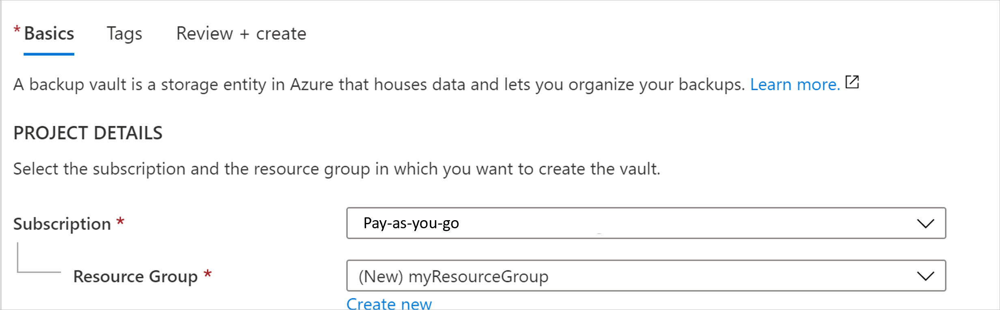
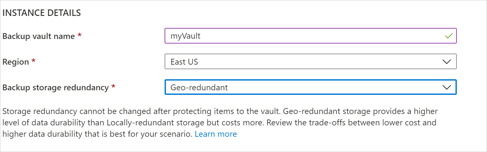
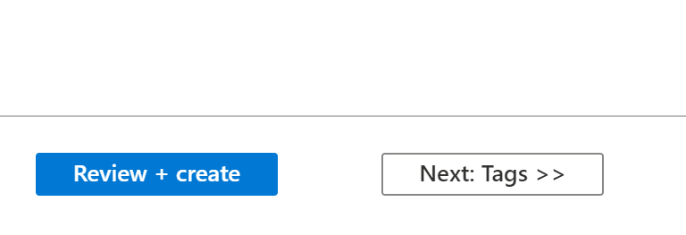
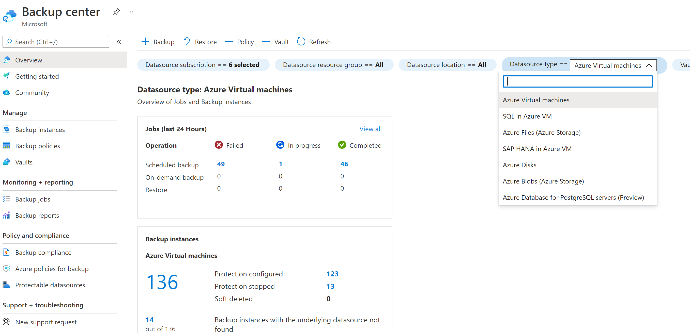
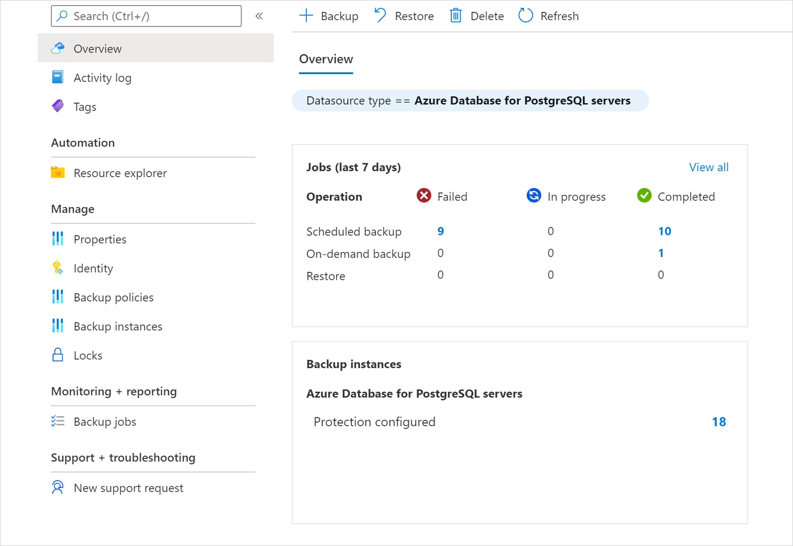
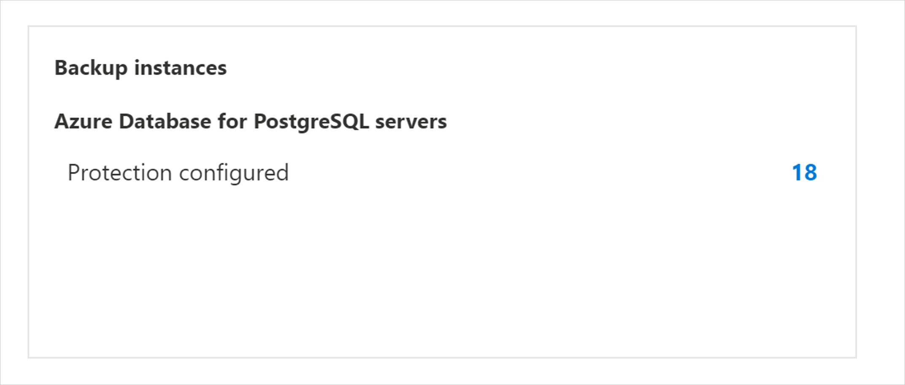
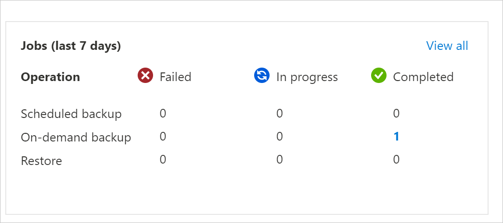

# Create and manage Backup vaults

This article describes how to create Backup vaults and manage them.

A Backup vault is a storage entity in Azure that houses backup data for certain newer workloads that Azure Backup supports. You can use Backup vaults to hold backup data for various Azure services, such Azure Database for PostgreSQL servers and newer workloads that Azure Backup will support. Backup vaults make it easy to organize your backup data, while minimizing management overhead. Backup vaults are based on the Azure Resource Manager model of Azure, which provides features such as:

- **Enhanced capabilities to help secure backup data**: With Backup vaults, Azure Backup provides security capabilities to protect cloud backups. The security features ensure you can secure your backups, and safely recover data, even if production and backup servers are compromised. [Learn more](backup-azure-security-feature.md)

- **Azure role-based access control (Azure RBAC)**: Azure RBAC provides fine-grained access management control in Azure. [Azure provides various built-in roles](../role-based-access-control/built-in-roles.md), and Azure Backup has three [built-in roles to manage recovery points](backup-rbac-rs-vault.md). Backup vaults are compatible with Azure RBAC, which restricts backup and restore access to the defined set of user roles. [Learn more](backup-rbac-rs-vault.md)

## Create a Backup vault

A Backup vault is a management entity that stores recovery points created over time and provides an interface to perform backup related operations. These include taking on-demand backups, performing restores, and creating backup policies.

To create a Backup vault, follow these steps.

### Sign in to Azure

Sign in to the [Azure portal](https://portal.azure.com).

### Create Backup vault

1. Type **Backup vaults** in the search box.
2. Under **Services**, select **Backup vaults**.
3. On the **Backup vaults** page, select **Add**.
4. On the **Basics** tab, under **Project details**, make sure the correct subscription is selected and then choose **Create new** resource group. Type *myResourceGroup* for the name.

    

5. Under **Instance details**, type *myVault* for the **Backup vault name** and choose your region of choice, in this case *East US* for your **Region**.
6. Now choose your **Storage redundancy**. Storage redundancy cannot be changed after protecting items to the vault.
7. We recommend that if you're using Azure as a primary backup storage endpoint, continue to use the default **Geo-redundant** setting.
8. If you don't use Azure as a primary backup storage endpoint, choose **Locally redundant**, which reduces the Azure storage costs. Learn more about [geo](../storage/common/storage-redundancy.md#geo-redundant-storage) and [local](../storage/common/storage-redundancy.md#locally-redundant-storage) redundancy.

    

9. Select the Review + create button at the bottom of the page.

    

## Delete a Backup vault

This section describes how to delete a Backup vault. It contains instructions for removing dependencies and then deleting a vault.

### Before you start

You can't delete a Backup vault with any of the following dependencies:

- You can't delete a vault that contains protected data sources (for example, Azure database for PostgreSQL servers).
- You can't delete a vault that contains backup data.

If you try to delete the vault without removing the dependencies, you'll encounter the following error messages:

>Cannot delete the Backup vault as there are existing backup instances or backup policies in the vault. Delete all backup instances and backup policies that are present in the vault and then try deleting the vault.

Ensure that you cycle through the **Datasource type** filter options in **Backup center** to not miss any existing Backup Instance or policy that needs to be removed, before being able to delete the Backup Vault.

### Proper way to delete a vault

>[!WARNING]
>The following operation is destructive and can't be undone. All backup data and backup items associated with the protected server will be permanently deleted. Proceed with caution.

To properly delete a vault, you must follow the steps in this order:

- Verify if there are any protected items:
  - Go to **Backup Instances** in the left navigation bar. All items listed here must be deleted first.

After you've completed these steps, you can continue to delete the vault.

### Delete the Backup vault

When there are no more items in the vault, select **Delete** on the vault dashboard. You'll see a confirmation text asking if you want to delete the vault.

1. Select **Yes** to verify that you want to delete the vault. The vault is deleted. The portal returns to the **New** service menu.

## Monitor and manage the Backup vault

This section explains how to use the Backup vault **Overview** dashboard to monitor and manage your Backup vaults. The overview pane contains two tiles: **Jobs** and **Instances**.

### Manage Backup instances

In the **Jobs** tile, you get a summarized view of all backup and restore related jobs in your Backup vault. Selecting any of the numbers in this tile allows you to view more information on jobs for a particular datasource type, operation type, and status.

### Manage Backup jobs

In the **Backup Instances** tile, you get a summarized view of all backup instances in your Backup vault. Selecting any of the numbers in this tile allows you to view more information on backup instances for a particular datasource type and protection status.

## Move a Backup vault across Azure subscriptions/resource groups

This section explains how to move a Backup vault (configured for Azure Backup) across Azure subscriptions and resource groups using the Azure portal.

>[!Note]
>You can also move Backup vaults to a different resource group or subscription using [PowerShell](/powershell/module/az.resources/move-azresource) and [CLI](/cli/azure/resource#az-resource-move).

### Supported regions

The vault move across subscriptions and resource groups is supported in all public and national regions.

### Use Azure portal to move Backup vault to a different resource group

1. Sign in to the [Azure portal](https://portal.azure.com/).

1. Open the list of Backup vaults and select the vault you want to move.

   The vault dashboard displays the vault details.

   :::image type="content" source="./media/backup-vault-overview/vault-dashboard-to-move-to-resource-group-inline.png" alt-text="Screenshot showing the dashboard of the vault to be moved to another resource group." lightbox="./media/backup-vault-overview/vault-dashboard-to-move-to-resource-group-expanded.png"::: 

1. In the vault **Overview** menu, click **Move**, and then select **Move to another resource group**.

   :::image type="content" source="./media/backup-vault-overview/select-move-to-another-resource-group-inline.png" alt-text="Screenshot showing the option for moving the Backup vault to another resource group." lightbox="./media/backup-vault-overview/select-move-to-another-resource-group-expanded.png":::
   >[!Note]
   >Only the admin subscription has the required permissions to move a vault.

1. In the **Resource group** drop-down list, select an existing resource group or select **Create new** to create a new resource group.

   The subscription remains the same and gets auto-populated.

   :::image type="content" source="./media/backup-vault-overview/select-existing-or-create-resource-group-inline.png" alt-text="Screenshot showing the selection of an existing resource group or creation of a new resource group." lightbox="./media/backup-vault-overview/select-existing-or-create-resource-group-expanded.png":::

1. On the **Resources to move** tab, the Backup vault that needs to be moved will undergo validation. This process may take a few minutes. Wait till the validation is complete.

   :::image type="content" source="./media/backup-vault-overview/move-validation-process-to-move-to-resource-group-inline.png" alt-text="Screenshot showing the Backup vault validation status." lightbox="./media/backup-vault-overview/move-validation-process-to-move-to-resource-group-expanded.png"::: 

1. Select the checkbox **I understand that tools and scripts associated with moved resources will not work until I update them to use new resource IDs** to confirm, and then select **Move**.
 
   >[!Note]
   >The resource path changes after moving vault across resource groups or subscriptions. Ensure that you update the tools and scripts with the new resource path after the move operation completes.

Wait till the move operation is complete to perform any other operations on the vault. Any operations performed on the Backup vault will fail if performed while move is in progress. When the process is complete, the Backup vault should appear in the target resource group.

>[!Important]
>If you encounter any error while moving the vault, refer to the [Error codes and troubleshooting section](#error-codes-and-troubleshooting).  

### Use Azure portal to move Backup vault to a different subscription

1. Sign in to the [Azure portal](https://portal.azure.com/).

1. Open the list of Backup vaults and select the vault you want to move.
   
   The vault dashboard displays the vault details.

   :::image type="content" source="./media/backup-vault-overview/vault-dashboard-to-move-to-another-subscription-inline.png" alt-text="Screenshot showing the dashboard of the vault to be moved to another Azure subscription." lightbox="./media/backup-vault-overview/vault-dashboard-to-move-to-another-subscription-expanded.png"::: 

1. In the vault **Overview** menu, click **Move**, and then select **Move to another subscription**.

   :::image type="content" source="./media/backup-vault-overview/select-move-to-another-subscription-inline.png" alt-text="Screenshot showing the option for moving the Backup vault to another Azure subscription." lightbox="./media/backup-vault-overview/select-move-to-another-subscription-expanded.png"::: 
   >[!Note]
   >Only the admin subscription has the required permissions to move a vault.

1. In the **Subscription** drop-down list, select an existing subscription.

   For moving vaults across subscriptions, the target subscription must reside in the same tenant as the source subscription. To move a vault to a different tenant, see [Transfer subscription to a different directory](../role-based-access-control/transfer-subscription.md).

1. In the **Resource group** drop-down list, select an existing resource group or select **Create new**  to create a new resource group.

   :::image type="content" source="./media/backup-vault-overview/select-existing-or-create-resource-group-to-move-to-other-subscription-inline.png" alt-text="Screenshot showing the selection of an existing resource group or creation of a new resource group in another Azure subscription." lightbox="./media/backup-vault-overview/select-existing-or-create-resource-group-to-move-to-other-subscription-expanded.png":::

1. On the **Resources to move** tab, the Backup vault that needs to be moved will undergo validation. This process may take a few minutes. Wait till the validation is complete.

   :::image type="content" source="./media/backup-vault-overview/move-validation-process-to-move-to-another-subscription-inline.png" alt-text="Screenshot showing the validation status of Backup vault to be moved to another Azure subscription." lightbox="./media/backup-vault-overview/move-validation-process-to-move-to-another-subscription-expanded.png"::: 

1. Select the checkbox **I understand that tools and scripts associated with moved resources will not work until I update them to use new resource   IDs** to confirm, and then select **Move**.
 
   >[!Note]
   >The resource path changes after moving vault across resource groups or subscriptions. Ensure that you update the tools and scripts with the new resource path after the move operation completes.

Wait till the move operation is complete to perform any other operations on the vault. Any operations performed on the Backup vault will fail if performed while move is in progress. When the process completes, the Backup vault should appear in the target Subscription and Resource group.

>[!Important]
>If you encounter any error while moving the vault, refer to the [Error codes and troubleshooting section](#error-codes-and-troubleshooting).

### Error codes and troubleshooting

Troubleshoot the following common issues you might encounter during Backup vault move:

#### BackupVaultMoveResourcesPartiallySucceeded   

**Cause**: You may face this error when Backup vault move succeeds only partially.

**Recommendation**: The issue should get resolved automatically within 36 hours. If it persists, contact Microsoft Support.

#### BackupVaultMoveResourcesCriticalFailure 

**Cause**: You may face this error when Backup vault move fails critically. 

**Recommendation**: The issue should get resolved automatically within 36 hours. If it persists, contact Microsoft Support. 

#### UserErrorBackupVaultResourceMoveInProgress 

**Cause**: You may face this error if you try to perform any operations on the Backup vault while it’s being moved. 

**Recommendation**: Wait till the move operation is complete, and then retry. 

#### UserErrorBackupVaultResourceMoveNotAllowedForMultipleResources

**Cause**: You may face this error if you try to move multiple Backup vaults  in a single attempt. 

**Recommentation**: Ensure that only one Backup vault is selected for every move operation. 

#### UserErrorBackupVaultResourceMoveNotAllowedUntilResourceProvisioned

**Cause**: You may face this error if the vault is not yet provisioned. 

**Recommendation**: Retry the operation after some time.

#### BackupVaultResourceMoveIsNotEnabled 

**Cause**: Resource move for Backup vault is currently not supported in the selected Azure region.

**Recommendation**: Ensure that you've selected one of the supported regions to move Backup vaults. See [Supported regions](#supported-regions).

#### UserErrorCrossTenantMSIMoveNotSupported 

**Cause**: This error occurs if the subscription with which resource is associated has moved to a different Tenant, but the Managed Identity is still associated with the old Tenant.

**Recommendation**: Remove the Managed Identity from the existing Tenant; move the resource and add it again to the new one.

## Perform Cross Region Restore using Azure portal (preview)

Follow these steps:

1. Sign in to [Azure portal](https://portal.azure.com/).

1. [Create a new Backup vault](create-manage-backup-vault.md#create-backup-vault) or choose an existing Backup vault, and then enable Cross Region Restore by going to **Properties** > **Cross Region Restore (Preview)**, and choose **Enable**.

   :::image type="content" source="./media/backup-vault-overview/enable-cross-region-restore-for-postgresql-database.png" alt-text="Screenshot shows how to enable Cross Region Restore for PostgreSQL database." lightbox="./media/backup-vault-overview/enable-cross-region-restore-for-postgresql-database.png":::

1. Go to the Backup vault’s **Overview** pane, and then [configure a backup for PostgreSQL database](backup-azure-database-postgresql.md).

1. Once the backup is complete in the primary region, it can take up to *12 hours* for the recovery point in the primary region to get replicated to the secondary region.

   To check the availability of recovery point in the secondary region, go to the **Backup center** > **Backup Instances** > **Filter  to Azure Database for PostgreSQL servers**, filter **Instance Region** as *Secondary Region*, and then select the required Backup Instance.

   :::image type="content" source="./media/backup-vault-overview/check-availability-of-recovery-point-in-secondary-region.png" alt-text="Screenshot shows how to check availability for the recovery points in the secondary region." lightbox="./media/backup-vault-overview/check-availability-of-recovery-point-in-secondary-region.png":::

1. The recovery points available in the secondary region are now listed.

   Choose **Restore to secondary region**.

   :::image type="content" source="./media/backup-vault-overview/initiate-restore-to-secondary-region.png" alt-text="Screenshot shows how to initiate restores to the secondary region." lightbox="./media/backup-vault-overview/initiate-restore-to-secondary-region.png":::

   You can also trigger restores from the respective backup instance.

   :::image type="content" source="./media/backup-vault-overview/trigger-restores-from-respective-backup-instance.png" alt-text="Screenshot shows how to trigger restores from the respective backup instance." lightbox="./media/backup-vault-overview/trigger-restores-from-respective-backup-instance.png":::

1. Select **Restore to secondary region** to review the target region selected, and then select the appropriate recovery point and restore parameters.

1. Once the restore starts, you can monitor the completion of the restore operation under **Backup Jobs** of the Backup vault by filtering **Jobs workload type** to *Azure Database for PostgreSQL servers* and **Instance Region** to *Secondary Region*.

   :::image type="content" source="./media/backup-vault-overview/monitor-postgresql-restore-to-secondary-region.png" alt-text="Screenshot shows how to monitor the postgresql restore to the secondary region." lightbox="./media/backup-vault-overview/monitor-postgresql-restore-to-secondary-region.png":::

## Next steps

- [Configure backup on Azure PostgreSQL databases](backup-azure-database-postgresql.md#configure-backup-on-azure-postgresql-databases)
