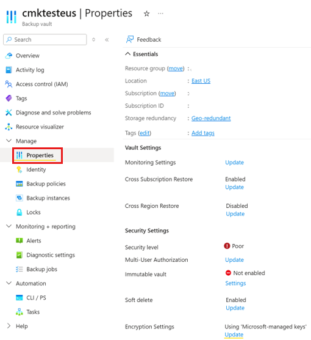
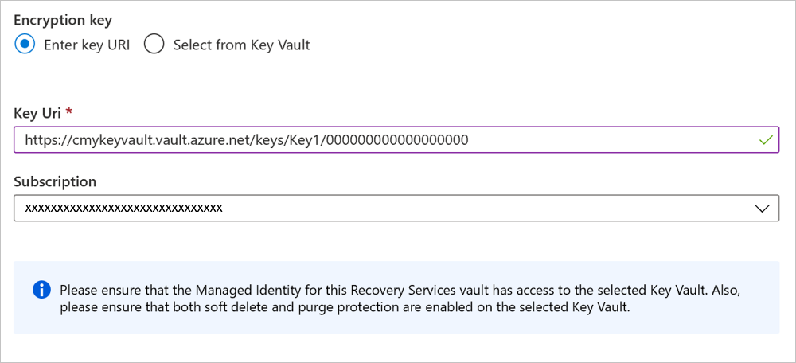
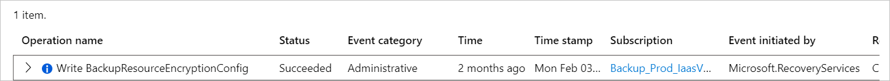

# Encryption of backup data in the Backup vault using customer-managed keys (preview)

Azure Backup allows you to encrypt your backup data using customer-managed keys (CMK) instead of using platform-managed keys, which are enabled by default. Your keys to encrypt the backup data must be stored in [Azure Key Vault](../key-vault/index.yml).

The encryption key used for encrypting backups might be different from the one used for the source. The data is protected using an AES 256-based data encryption key (DEK), which in turn, is protected using your key encryption keys (KEK). This provides you with full control over the data and the keys. To allow encryption, you must grant Backup vault the permissions to access the encryption key in the Azure Key Vault. You can change the key when required.

>[!Note]
>Support for customer-managed keys configuration for Backup vault is in preview.

## Support matrix

### Supported regions

CMK for Backup vault is currently available in the following regions: West Central US, Switzerland North. 

### Key Vault and managed HSM key requirements

- **Encryption settings** use Azure Key Vault or Managed HSM Key and Backup vault's managed identity details.

- The Backup vault's managed identity needs to have: 

  - Built-in [Crypto Service Encryption User role](/azure/role-based-access-control/built-in-roles#key-vault-crypto-service-encryption-user) assigned if your Key Vault is using IAM-based RBAC configuration.
  - **Get**, **Wrap**, and **Unwrap** permissions if your Key Vault is using *Access Policies based configuration*.
  - **Get**, **Wrap**, and **Unwrap** permissions granted via its Local RBAC on the key if you're using managed MSM.

- Ensure that you've a valid (non-expired), enabled Key Vault Key. Don't use disabled or expired key as it can't be used for encryption at rest and will lead to backup and restore operation failures. Key Vault term also indicates Managed HSM if you haven't noted earlier.

- Key Vault must have Soft Delete and Purge Protection enabled.

- Encryption settings support Azure Key Vault RSA and RSA-HSM keys only of sizes 2048, 3072, and 4096. [Learn more about keys](/azure/key-vault/keys/about-keys). Before you consider Key Vault region for encryption settings, see [Key Vault DR scenarios](/azure/key-vault/general/disaster-recovery-guidance) for region failover support.

- Managed HSM uses Local RBAC to manage the keys permissions. [Learn more](/azure/key-vault/managed-hsm/overview).

### Known limitations

- If you remove Key Vault access permissions given to the managed identity, PostgresSQL backup or restore operation will fail with generic error.
- If you remove Encryption Settings Key Vault permissions, disables System-assigned identity, or detaches/deletes the managed identity from the Backup vault being used for Encryption Settings, the background operations tiering and restore points expiry jobs will fail without surfacing errors to the Azure portal or other interfaces (REST API, CLI, and so on). These operations will continue to fail and incur cost until the required prerequisites and settings are restored.

## Before you start

- After you enable it for a Backup vault, encryption using customer-managed keys can't be reverted to use platform-managed keys (default). You can change the encryption keys, managed identity as per the requirements.

- CMK is applied on the Azure Backup Storage Vault and Vault-Archive tiers, and not applicable for operational-tier.

- Moving CMK encrypted Backup vault across Resource Groups and Subscriptions isn't currently supported.

- User-assigned Manged Identity for Backup vault feature is currently in preview.
- Ensure that you check the Key Vault Key requirements provided in [this section](#key-vault-and-managed-hsm-key-requirements).
- Once you enable the encryption settings on the Backup vault, don't disable/detach the managed identity, or remove Key Vault permissions  used for encryption settings. If you do these actions, it'll lead to failure of backup, restore, tiering, restore points expiry jobs, and will incur cost for the data stored in the Backup vault until: 

  - You can restore the Key Vault permissions.
  - You reenable System Assigned identity, grant the Key Vault permissions to it and perform Encryption Settings update operation, if the System-assigned identity was used for encryption settings.
  - You reattach the managed identity is reattached and has the required Key Vault permissions.
  - You ensure that it has permissions to access the Key Vault and key to use new User-assigned identity.

- Encryption settings use Azure Key Vault Key and Backup vault's managed identity details.

  >[!Note]
  >If the Key or Key Vault being used is deleted or access is revoked and can't be restored, you'll lose access to the data stored in the Backup vault. Also, ensure that you've appropriate permissions to provide/update managed identity, Backup vault, and Key Vault details. 

- Ensure that you've checked the [known limitations](#known-limitations) before you start using the encryption feature. 

- You can configure this feature via the Azure portal and REST APIs. 

## Enable encryption using customer-managed keys at vault creation

When you create a Backup vault, you can enable encryption on the backups using customer-managed keys. Learn how to [create a Backup vault](create-manage-backup-vault.md#create-a-backup-vault).

To enable the encryption, follow these steps:

1. Next to the **Basics** tab, on the **Vault Properties** tab, specify the *encryption key* and the *identity* to be used for encryption.

   :::image type="content" source="./media/encryption-at-rest-with-cmk-for-backup-vault/backup-vault-properties.png" alt-text="Screenshot shows the Backup vault property." lightbox="./media/encryption-at-rest-with-cmk-for-backup-vault/backup-vault-properties.png":::

   :::image type="content" source="./media/encryption-at-rest-with-cmk-for-backup-vault/add-key-uri.png" alt-text="Screenshot shows how to add key URI to the Backup vault." lightbox="./media/encryption-at-rest-with-cmk-for-backup-vault/add-key-uri.png":::

2. Select **Use customer-managed key** as the **Encryption type**.
3. To specify the key to be used for encryption, select the appropriate option.
4. Provide the *URI for the encryption key*.

   You can also browse and select the key.

5. To enable auto-rotation of the encryption key used for the Backup vault, click **Select from Key Vault** or run the *Version component* from the **Key URI** when you choose **Enter key URI**. [Learn more](encryption-at-rest-with-cmk.md#enable-autorotation-of-encryption-keys) about auto-rotation.

6. Specify the *user-assigned managed identity* to manage encryption with *customer-managed keys*.
7. Add **Tags** (optional) and continue creating the vault.

## Update the Backup vault properties to encrypt using customer-managed keys

To configure a vault, perform the following actions in the given sequence to achieve the intended results. Each action is discussed in detail in the sections below:

1. Enable managed identity for your Backup vault.

2. Assign permissions to the vault to access the encryption key in Azure Key Vault.

3. Enable soft-delete and purge protection on Azure Key Vault.

4. Assign the encryption key to the Backup vault.

### Enable managed identity for your Backup vault

Azure Backup uses system-assigned managed identities and user-assigned managed identities of the Backup vault to authenticate the vault to access encryption keys stored in Azure Key Vault. You've an option to use either system-assigned identity of Backup vault or user-assigned identity attached to Backup vault.

To enable managed identity for your Backup vault, see the following sections.

>[!NOTE]
>- Once enabled, you must **not** disable the managed identity (even temporarily). Disabling the managed identity might lead to inconsistent behavior.
>- Also, you can't update both Key Vault Key URI and managed identity in a single request due to security reasons. Please update one attribute at a time.

### Enable system-assigned managed identity for the vault

Follow these steps:

1. Go to your *Backup vault* > **Identity**.

    :::image type="content" source="./media/encryption-at-rest-with-cmk-for-backup-vault/enable-system-assigned-managed-identity-for-vault.png" alt-text="Screenshot shows how to open Identity settings." lightbox="./media/encryption-at-rest-with-cmk-for-backup-vault/enable-system-assigned-managed-identity-for-vault.png":::

2. Select the **System assigned** tab.

3. Change the **Status** to **On**.

4. Select **Save** to enable the identity for the vault.

An *Object ID* is generated, which is the system-assigned managed identity of the vault.

>[!NOTE]
>Disabling the managed identity might lead to inconsistent behavior.

#### Assign user-assigned managed identity to the vault (in preview)

To assign the user-assigned managed identity for your *Backup vault*, choose a client:

1. Go to your *Backup vault* > **Identity**.

   :::image type="content" source="./media/encryption-at-rest-with-cmk-for-backup-vault/assign-user-assigned-managed-identity-to-vault.png" alt-text="Screenshot shows how to assign the user-assigned managed identity to the vault." lightbox="./media/encryption-at-rest-with-cmk-for-backup-vault/assign-user-assigned-managed-identity-to-vault.png":::

2. Select the **User assigned** tab.

3. Select **+Add** to add a user-assigned managed identity.

4. In the **Add user assigned managed identity** pane, select the *subscription for your identity*.

5. Select the *identity* from the list. You can also filter by the *name of the identity* or the *resource group*.

6. Select **Add** to finish assigning the identity.

>[!Note]
>- Vaults using user-assigned managed identities for CMK encryption don't support the use of private endpoints for Backup.
>- Azure Key Vaults limiting access to specific networks aren't yet supported for use along with user-assigned managed identities for CMK encryption.

### Assign permissions to the Backup vault to access the encryption key in Azure Key Vault

You now need to permit the Backup vault to access the Azure Key Vault that contains the encryption key. This is done by allowing the Backup vault's managed identity to access the Key Vault.

**Scenario: Key Vault having Access Control (IAM) access configuration enabled.**

Follow these steps:

1. Go to *Azure Key Vault* > **Access Control** > **Add Role Assignment**.
2. Select **Key Vault Crypto Service Encryption User** role from **Job function** roles.
3. Select **Next** > **Assign Access to** > **Managed Identity** > **Select Members**.
4. Select your *Backup vault managed identity*.
5. Select **Next** and assign.

**Scenario: If your Key Vault has Access Policies configuration enabled**

Follow these steps:

1. Go to your *Azure Key Vault* > **Access Policies** > **+Create**.

    :::image type="content" source="./media/encryption-at-rest-with-cmk-for-backup-vault/access-policies.png" alt-text="Screenshot shows how to add Access Policies." lightbox="./media/encryption-at-rest-with-cmk-for-backup-vault/access-policies.png":::

 2. Under **Key Permissions**, select **Get**, **List**, **Unwrap Key**, and **Wrap Key** operations. This specifies the actions on the key that will be permitted.

    :::image type="content" source="./media/encryption-at-rest-with-cmk-for-backup-vault/key-permissions.png" alt-text="Screenshot shows how to assign key permissions." lightbox="./media/encryption-at-rest-with-cmk-for-backup-vault/key-permissions.png":::

3. Select **Next** to go to **Select Principal** and search for your vault in the search box using its name or managed identity. Once it shows up, select the *vault* > **Next**.

    :::image type="content" source="./media/encryption-at-rest-with-cmk-for-backup-vault/select-principal.png" alt-text="Screenshot of Select principal in your Azure Key Vault." lightbox="./media/encryption-at-rest-with-cmk-for-backup-vault/select-principal.png":::

4. Once done, select **Add** to add the new access policy.

5. Select **Save** to save changes made to the access policy of the Azure Key Vault.

>[!NOTE]
>- If you're using **user-assigned identities**, the same permissions must be assigned to the user-assigned identity.
>- You can also assign an RBAC role to the Backup vault that contains the above mentioned permissions, such as the *[Key Vault Crypto Officer](../key-vault/general/rbac-guide.md#azure-built-in-roles-for-key-vault-data-plane-operations)* role. These roles might contain additional permissions other than the ones discussed above.

### Enable soft-delete and purge protection on Azure Key Vault

You need to **enable soft delete and purge protection** on your Azure Key Vault that stores your encryption key.

You can do this from the Azure Key Vault UI as shown below. Alternatively, you can set these properties while creating the Key Vault. Learn more about these [Key Vault properties](../key-vault/general/soft-delete-overview.md).

:::image type="content" source="./media/encryption-at-rest-with-cmk-for-backup-vault/soft-delete-purge-protection.png" alt-text="Screenshot of soft delete and purge protection status enabled." lightbox="./media/encryption-at-rest-with-cmk-for-backup-vault/soft-delete-purge-protection.png":::

### Assign encryption key to the Backup vault

Before proceeding further, ensure that all the steps mentioned above are completed successfully:

- The Backup vault's managed identity is enabled and has been assigned the required permissions.
- The Azure Key Vault has the soft-delete and purge-protection enabled.

Once done, continue with selecting the encryption key for your vault.

To assign the key and follow the steps, choose a client by following these steps:

1. Go to your *Backup vault* > **Properties**.

    

2. Select **Update** under **Encryption Settings (preview)**.

   :::image type="content" source="./media/encryption-at-rest-with-cmk-for-backup-vault/update-encryption-settings.png" alt-text="Screenshot shows how to update encryption settings." lightbox="./media/encryption-at-rest-with-cmk-for-backup-vault/update-encryption-settings.png":::

3. In the **Encryption Settings** pane, select **Use your own key** and continue to specify the key using one of the following ways. 
 
   *Ensure that you use an RSA key, which is in enabled and active state.*

    1. Enter the **Key URI** with which you want to encrypt the data in this Backup vault. You can also obtain this key URI from the corresponding key in your Azure Key Vault. Ensure the key URI is copied correctly. It's recommended that you use the **Copy to clipboard** button provided with the key identifier.

       :::image type="content" source="./media/encryption-at-rest-with-cmk-for-backup-vault/key-uri.png" alt-text="Screenshot of the key URI in your Backup vault." lightbox="./media/encryption-at-rest-with-cmk-for-backup-vault/key-uri.png":::

        >[!NOTE]
        >When you try to update Encryption Settings but update operation fails due to internal error, the encryption setting is updated to **Inconsistent** and requires your attention.
       :::image type="content" source="./media/encryption-at-rest-with-cmk-for-backup-vault/encryption-key-with-full-key-uri.png" alt-text="Screenshot shows encryption key with full key URI." lightbox="./media/encryption-at-rest-with-cmk-for-backup-vault/encryption-key-with-full-key-uri.png":::

        >[!Note]
        >When specifying the encryption key using the full Key URI with version, the key will not be autorotated, and you need to do key updates manually by specifying the new key or version when required. Alternatively, remove the Version component of the Key URI to get automatic rotation.

        

    2. Browse and select the key from the Key Vault in the **Key picker** pane.

        >[!NOTE]
        >When you specify the encryption key using the key picker pane, the key will be auto-rotated whenever a new version for the key is enabled. [Learn more](encryption-at-rest-with-cmk.md#enable-autorotation-of-encryption-keys) on enabling autorotation of encryption keys.

        :::image type="content" source="./media/encryption-at-rest-with-cmk-for-backup-vault/key-vault-encryption.png" alt-text="Screenshot shows how to select key from Key Vault." lightbox="./media/encryption-at-rest-with-cmk-for-backup-vault/key-vault-encryption.png":::

4. Select **Update**.

5. **Tracking progress and status of encryption key update**: You can track the progress and status of the encryption key assignment under the Notifications. The encryption key updates are also logged in the vault's Activity Log under Backup Vault update (PATCH) operation.

    

### Update encryption settings details

You can update the encryption settings details anytime. Whenever you want to use a new key URI, ensure that your existing Key Vault still has access to the managed identity and the key is valid. Otherwise, the update operation will fail. 

>[!Note]
>The managed identity that you want to use for encryption needs to have the required permission before you use.   

## Back up to a vault encrypted with customer-managed keys

Before you configure protection, we recommend you to ensure that the following checklist is adhered.

>[!IMPORTANT]
> Before proceeding to configure protection, you must have **successfully** completed the following steps:
>
>1. Created a Backup vault.
>2. Enabled the Backup vault's system-assigned managed identity or assigned a user-assigned managed identity to the vault.
>3. Assigned permissions to your Backup vault (or the user-assigned managed identity) to access encryption keys from your Key Vault.
>4. Enabled soft delete and purge protection for your Key Vault
>5. Assigned a valid encryption key for your Backup vault
>
>If all the above steps are confirmed, only then proceed with configuring backup.

The process to configure and perform backups to a Backup vault encrypted with customer-managed keys is the same as to a vault that uses platform-managed keys with **no changes to the experience**.

## Troubleshoot Encryption Settings operations error

### UserErrorCMKMissingMangedIdentityPermissionOnKeyVault

**Error code**: UserErrorCMKMissingMangedIdentityPermissionOnKeyVault

**Cause**: This error occurs when:

- The managed identity being used for Encryption settings doesn't have the permissions to access the Key Vault. Also, the backup or restore jobs might fail with this error code if the access is removed after Encryption Settings are updated or managed identity is disable/detached from the Backup vault.
- You're using non-RSA (EC Key URI).

**Recommended action**: Ensure that the managed identity selected to use for encryption settings has the required permissions and the key is an RSA type, and then retry the operation.

### UserErrorCMKKeyVaultAuthFailure

**Error code**: UserErrorCMKKeyVaultAuthFailure

**Cause**: Encryption Settings managed identity doesn't have the required permissions to access the Key Vault or key. Backup vault Managed identity (system or user assigned used for Encryption Settings) should have the following permissions on your Key Vault:

- If Key Vault is using IAM – RBAC then Key Vault Crypto Service Encryption User built-in role permissions on the Key Vault.
- If you use *Access Policies*, **Get**, **Wrap** and **Unwrap** permissions are needed.

**Recommended action**: Check the Key Vault access policies and grant permissions accordingly.

## Next steps

[Overview of security features in Azure Backup](security-overview.md).
