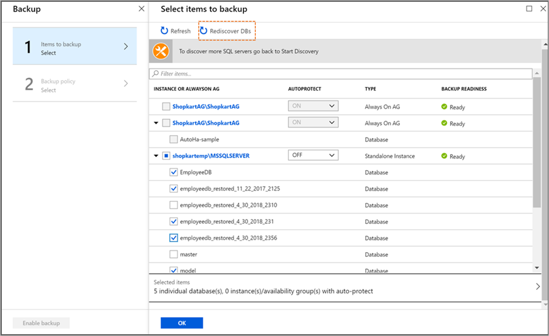

# FAQ about SQL Server databases that are running on an Azure VM backup

This article answers common questions about backing up SQL Server databases that run on Azure virtual machines (VMs) and that use the [Azure Backup](backup-overview.md) service.

## Can I use Azure backup for IaaS VM as well as SQL Server on the same machine?
Yes, you can have both VM backup and SQL backup on the same VM. In this case, we internally trigger copy-only full backup on the VM to not truncate the logs.

## Does the solution retry or auto-heal the backups?

Under some circumstances, the Azure Backup service triggers remedial backups. Auto-heal can happen for any of the six conditions mentioned below:

  - If log or differential backup fails due to LSN Validation Error, next log or differential backup is instead converted to a full backup.
  - If no full backup has happened before a log or differential backup, that log or differential backup is instead converted to a full backup.
  - If the latest full backup's point-in-time is older than 15 days, the next log or differential backup is instead converted to a full backup.
  - All the backup jobs that get canceled due to an extension upgrade are re-triggered after the upgrade is completed and the extension is started.
  - If you choose to overwrite the database during Restore, the next log/differential backup fails and a full backup is triggered instead.
  - In cases where a full backup is required to reset the log chains due to change in database recovery model, a full gets triggered automatically on the next schedule.

Auto-heal as a capability is enabled for all user by default; However in case you choose to opt-out of it, then perform the below:

  * On the SQL Server instance, in the *C:\Program Files\Azure Workload Backup\bin* folder, create or edit the **ExtensionSettingsOverrides.json** file.
  * In the **ExtensionSettingsOverrides.json**, set *{"EnableAutoHealer": false}*.
  * Save your changes and close the file.
  * On the SQL Server instance, open **Task Manage** and then restart the **AzureWLBackupCoordinatorSvc** service.
   

## Can I control as to how many concurrent backups run on the SQL server?

Yes. You can throttle the rate at which the backup policy runs to minimize the impact on a SQL Server instance. To change the setting:
1. On the SQL Server instance, in the *C:\Program Files\Azure Workload Backup\bin* folder, create the *ExtensionSettingsOverrides.json* file.
2. In the *ExtensionSettingsOverrides.json* file, change the **DefaultBackupTasksThreshold** setting to a lower value (for example, 5).  
  `{"DefaultBackupTasksThreshold": 5}`

3. Save your changes and close the file.
4. On the SQL Server instance, open **Task Manager**. Restart the **AzureWLBackupCoordinatorSvc** service.   
 While this method helps if the backup application is consuming a lot of resources, SQL Server [Resource Governor](https://docs.microsoft.com/sql/relational-databases/resource-governor/resource-governor?view=sql-server-2017) is a more generic way to specify limits on the amount of CPU, physical IO, and memory that incoming application requests can use.

> [!NOTE]
> In the UX you can still go ahead and schedule as many backups at any given time, however they will processed in a sliding window of say, 5, as per the above example.

## Can I run a full backup from a secondary replica?
As per SQL limitations, you can run Copy Only Full backup on Secondary Replica; however Full backup is not allowed.

## Can I protect availability groups on-premises?
No. Azure Backup protects SQL Server databases running in Azure. If an availability group (AG) is spread between Azure and on-premises machines, the AG can be protected only if the primary replica is running in Azure. Also, Azure Backup protects only the nodes that run in the same Azure region as the Recovery Services vault.

## Can I protect availability groups across regions?
The Azure Backup Recovery Services vault can detect and protect all nodes that are in the same region as the vault. If your SQL Server Always On availability group spans multiple Azure regions, set up the backup from the region that has the primary node. Azure Backup can detect and protect all databases in the availability group according to your backup preference. When your backup preference isn't met, backups fail and you get the failure alert.

## Do successful backup jobs create alerts?
No. Successful backup jobs don't generate alerts. Alerts are sent only for backup jobs that fail. Detailed behavior for portal alerts is documented [here](backup-azure-monitoring-built-in-monitor.md). However, in case you are interested do have alerts even for successful jobs, you can use [Monitoring using Azure Monitor](backup-azure-monitoring-use-azuremonitor.md).

## Can I see scheduled backup jobs in the Backup Jobs menu?
The **Backup Job** menu will only show ad-hoc backup jobs. For scheduled job use [Monitoring using Azure Monitor](backup-azure-monitoring-use-azuremonitor.md).

## Are future databases automatically added for backup?
Yes, you can achieve this capability with [auto-protection](backup-sql-server-database-azure-vms.md#enable-auto-protection).  

## If I delete a database from an autoprotected instance, what will happen to the backups?
If a database is dropped from an autoprotected instance, the database backups are still attempted. This implies that the deleted database begins to show up as unhealthy under **Backup Items** and is still protected.

The correct way to stop protecting this database is to do **Stop Backup** with **delete data** on this database.  

## If I do stop backup operation of an autoprotected database what will be its behavior?
If you do **stop backup with retain data**, no future backups will take place and the existing recovery points will remain intact. The database will still be considered as protected and be shown under the **Backup items**.

If you do **stop backup with delete data**, no future backups will take place and the existing recovery points will also be deleted. The database will be considered un-protected and be shown under the instance in the Configure Backup. However, unlike other up-protected databases that can be selected manually or that can get autoprotected, this database appears greyed out and can’t be selected. The only way to re-protect this database is to disable auto-protection on the instance. You can now select this database and configure protection on it or re-enable auto-protection on the instance again.

## If I change the name of the database after it has been protected, what will be the behavior?
A re-named database is treated as a new database. Hence, the service will treat this situation as if the database were not found and with fail the backups.

You can select the database, which is now renamed and configure protection on it. In case the auto-protection is enabled on the instance, the renamed database will be automatically detected and protected.

##  Why can’t I see an added database for an autoprotected instance?
A database that you [add to an autoprotected instance](backup-sql-server-database-azure-vms.md#enable-auto-protection) might not immediately appear under protected items. This is because the discovery typically runs every 8 hours. However, you can discover and protect new databases immediately if you manually run a discovery by selecting **Recover DBs**, as shown in the following image.

  

## Next steps

Learn how to [back up a SQL Server database](backup-azure-sql-database.md) that's running on an Azure VM.
