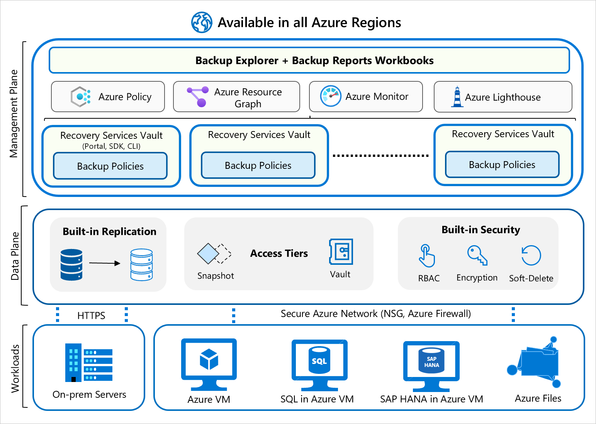

# Backup cloud and on-premises workloads to cloud

## Introduction

Azure Backup comprehensively protects your data assets in Azure through a simple, secure, and cost-effective solution that requires zero-infrastructure. It's Azure's built-in data protection solution for a wide range of workloads. It helps protect your mission critical workloads running in the cloud, and ensures your backups are always available and managed at scale across your entire backup estate.

### Intended audience

The primary target audience for this article is IT and application administrators, and implementers of large and mid-sized organizations, who want to learn about the capabilities of Azure’s built-in data protection technology, Azure Backup, and how to efficiently implement solutions that better protect your deployments. The article assumes you're familiar with core Azure technologies, data protection concepts and have experience working with a backup solution. The guidance covered in this article can make it easier to design your backup solution on Azure using established patterns and avoid known pitfalls.

### How this article is organized

While it’s easy to start protecting infrastructure and applications on Azure, when you ensure that the underlying Azure resources are set up correctly and being used optimally you can accelerate your time to value. This article covers a brief overview of design considerations and guidance for optimally configuring your Azure Backup deployment. It examines the core components (for example, Recovery Services vault, Backup Policy) and concepts (for example, governance) and how to think of them and their capabilities with links to detailed product documentation.

## Architecture

### Workloads

Azure Backup enables data protection for various workloads (on-premises and cloud). It's a secure and reliable built-in data protection mechanism in Azure. It can seamlessly scale its protection across multiple workloads without any management overhead for you. There are multiple automation channels as well to enable this (via PowerShell, CLI, Azure Resource Manager templates, and REST APIs.)

* **Scalable, durable, and secure storage -** Azure Backup uses reliable Blob storage with in-built security and high availability features. You can choose LRS, GRS, or RA-GRS storages for your backup data.  

* **Native workload integration -** Azure Backup provides native integration with Azure Workloads (VMs, SAP HANA, SQL in Azure VMs and even Azure Files) without requiring you to manage automation or infrastructure to deploy agents, write new scripts or provision storage.

### Data plane

* **Automated storage management** – Azure Backup automates provisioning and managing storage accounts for the backup data to ensure it scales as the backup data grows.

* **Malicious delete protection –** Protect against any accidental and malicious attempts for deleting your backups via soft delete of backups. The deleted backup data is stored for 14 days free of charge and allows it to be recovered from this state.

* **Secure encrypted backups-** Azure Backup ensures your backup data is stored in a secure manner, leveraging built-in security capabilities of the Azure platform like Azure RBAC and Encryption.

* **Backup data lifecycle management -** Azure Backup automatically cleans up older backup data to comply with the retention policies. You can also tier your data from operational storage to vault storage.

### Management plane

* **Access control** – Vaults (Recovery Services and Backup vaults) provide the management capabilities and are accessible via the Azure portal, Backup Center, Vault dashboards, SDK, CLI, and even REST APIs. It's also an Azure RBAC boundary, providing you the option to restrict access to backups only to authorized Backup Admins.

* **Policy management** – Azure Backup Policies within each vault define when the backups should be triggered and how long they need to be retained. You can also manage these policies and apply them across multiple items.

* **Monitoring and Reporting** – Azure Backup integrates with Log Analytics and provides the ability to see reports via Workbooks as well.

* **Snapshot management** – Azure Backup takes snapshots for some Azure native workloads (VMs and Azure Files), manages these snapshots and allows fast restores from them. This option drastically reduces the time to recover your data to the original storage.

## Vault considerations

Azure Backup uses  vaults (Recovery Services and Backup vaults) to orchestrate and manage backups. It also uses vaults to store backed-up data. Effective vault design helps organizations establish a structure to organize and manage backup assets in Azure to support your business priorities. Consider the following guidelines when creating a vault:  

### Align to subscription design strategy

Since the vault is scoped to a subscription, fit your vault design to meet the subscription design strategy such as *Application category strategy* where subscriptions are separated based on specific applications or services or along the lines of application archetypes. For more information, see this [article](/azure/cloud-adoption-framework/decision-guides/subscriptions/).

### Single or multiple vault

You can use a single vault or multiple vaults to organize and manage your backup. Consider the following guidelines:

* If your workloads are all managed by a single subscription and single resource, then you can use a single vault to monitor and manage your backup estate.

* If your workloads are spread across subscriptions, then you can create multiple vaults, one or more per subscription.
  * Backup Center allows you to have a single pane of glass to manage all tasks related to Backup. [Learn more here]().
  * You can customize your views with workbook templates. Backup Explorer is one such template for Azure VMs. [Learn more here](monitor-azure-backup-with-backup-explorer.md).
  * If you needed consistent policy across vaults, then you can use Azure policy to propagate backup policy across multiple vaults. You can write a custom [Azure Policy definition](../governance/policy/concepts/definition-structure.md) that uses the [‘deployifnotexists’](../governance/policy/concepts/effects.md#deployifnotexists) effect to propagate a backup policy across multiple vaults. You can also [assign](../governance/policy/assign-policy-portal.md) this Azure Policy definition to a particular scope (subscription or RG), so that it deploys a 'backup policy' resource to all Recovery Services vaults in the scope of the Azure Policy assignment. The settings of the backup policy (such as backup frequency, retention, and so on) should be specified by the user as parameters in the Azure Policy assignment.

* As your organizational footprint grows, you might want to move workloads across subscriptions for the following reasons: align by backup policy, consolidate vaults, trade-off on lower redundancy to save on cost (move from GRS to LRS).  Azure Backup supports moving a Recovery Services vault across Azure subscriptions, or to another resource group within the same subscription. [Learn more here](backup-azure-move-recovery-services-vault.md).

### Review default settings

Review the default settings for Storage Replication type and Security settings to meet your requirements before configuring backups in the vault.

* *Storage Replication type* by default is set to Geo-redundant (GRS). Once you configure the backup, the option to modify is disabled. Follow [these](backup-create-rs-vault.md#set-storage-redundancy) steps to review and modify the settings.

* *Soft delete* by default is Enabled on newly created vaults to protect backup data from accidental or malicious deletes. Follow [these](backup-azure-security-feature-cloud.md#enabling-and-disabling-soft-delete) steps to review and modify the settings.

* *Cross Region Restore* allows you to restore Azure VMs in a secondary region, which is an Azure paired region. This option allows you to conduct drills to meet audit or compliance requirements, and to restore the VM or its disk if there's a disaster in the primary region. CRR is an opt-in feature for any GRS vault. [Learn more here](backup-create-rs-vault.md#set-cross-region-restore).

* Before finalizing your vault design, review the [vault support matrixes](backup-support-matrix.md#vault-support) to understand the factors that might influence or limit your design choices.

## Backup Policy considerations

Azure Backup Policy has two components: *Schedule* (when to take backup) and *Retention* (how long to retain backup). You can define the policy based on the type of data that's being backed up, RTO/RPO requirements, operational or regulatory compliance needs and workload type (for example, VM, database, files). [Learn more here](backup-architecture.md#backup-policy-essentials).

Consider the following guidelines when creating Backup Policy:

### Schedule considerations

* Consider grouping VMs that require the same schedule start time, frequency, and retention settings within a single policy.

* Ensure the backup scheduled start time is during non-peak production application time.

* To distribute backup traffic, consider backing up different VMs at different times of the day and make sure the times don't overlap.

### Retention considerations

* Short-term retention can be "minutes" or "daily". Retention for "Weekly", "monthly" or "yearly" backup points is referred to as Long-term retention.

* Long-term retention:
  * Planned (compliance requirements) - if you know in advance that data is required years from the current time, then use Long-term retention.
  * Unplanned (on-demand requirement) - if you don't know in advance, then use you can use on-demand with specific custom retention settings (these custom retention settings aren't impacted by policy settings).

* On-demand backup with custom retention - if you need to take a backup not scheduled via backup policy, then you can use an on-demand backup. This can be useful for taking backups that don’t fit your scheduled backup or for taking granular backup (for example, multiple IaaS VM backups per day since scheduled backup permits only one backup per day). It's important to note that the retention policy defined in scheduled policy doesn't apply to on-demand backups.

### Optimize Backup Policy

* As your business requirements change, you might need to extend or reduce retention duration. When you do so, you can expect the following:  
  * If retention is extended, existing recovery points are marked and kept in accordance with the new policy.
  * If retention is reduced, recovery points are marked for pruning in the next clean-up job, and subsequently deleted.
  * The latest retention rules apply for all retention points (excluding on-demand retention points). So if the retention period is extended (for example to 100 days), then when the backup is taken, followed by retention reduction (for example from 100 days to seven days), all backup data will be retained according to  the last specified retention period (that is, 7 days).

* Azure Backup provides you the flexibility to *stop protecting and manage your backups*:
  * *Stop protection and retain backup data*. If you're retiring or decommissioning your data source (VM, application), but need to retain data for audit or compliance purposes, then you can use this option to stop all future backup jobs from protecting your data source and retain the recovery points that have been backed up. You can then restore or resume VM protection.
  * *Stop protection and delete backup data*. This option will stop all future backup jobs from protecting your VM and delete all the recovery points. You won't be able to restore the VM nor use Resume backup option.

  * If you resume protection (of a data source that has been stopped with retain data), then the retention rules will apply. Any expired recovery points will be removed (at the scheduled time).

* Before completing your policy design, it's important to be aware of the following factors that might influence your design choices.
  * A backup policy is scoped to a vault.
  * There's a limit on the number of items per policy (for example, 100 VMs). To scale, you can create duplicate policies with the same or different schedules.
  * You can't selectively delete specific recovery points.
  * You can't completely disable the scheduled backup and keep the data source in a protected state. The least frequent backup you can configure with the policy is to have one weekly scheduled backup. An alternative would be to stop protection with retain data and enable protection each time you want to take a backup, take an on-demand backup, and then turn off protection but retain the backup data. [Learn more here](backup-azure-manage-vms.md#stop-protecting-a-vm).

## Security considerations

To help you protect your backup data and meet the security needs of your business, Azure Backup provides confidentiality, integrity, and availability assurances against deliberate attacks and abuse of your valuable data and systems. Consider the following security guidelines for your Azure Backup solution:

### Authentication and authorization

* Azure role-based access control (Azure RBAC) enables fine-grained access management, segregation of  duties within your team and granting only the amount of access to users necessary to perform their jobs. [Learn more here](backup-rbac-rs-vault.md).

* Azure Backup provides three built-in roles to control backup management operations: Backup contributors, operators, and readers. [Learn more here](backup-rbac-rs-vault.md#mapping-backup-built-in-roles-to-backup-management-actions).

* Azure Backup has several security controls built into the service to prevent, detect, and respond to security vulnerabilities (Learn more)

* Storage accounts used by Recovery Services vaults are isolated and can't be accessed by users for any malicious purposes. The access is only allowed through Azure Backup management operations, such as restore.

### Encryption of data in transit and at rest

Encryption protects your data and helps you to meet your organizational security and compliance commitments.

* Within Azure, data in transit between Azure storage and the vault is protected by HTTPS. This data remains within the Azure network.

* Backup data is automatically encrypted using Microsoft-managed keys. Alternatively, you can use your own keys, also known as [customer managed keys](encryption-at-rest-with-cmk.md).

* Azure Backup supports backup and restore of Azure VMs that have their OS/data disks encrypted with Azure Disk Encryption (ADE). [Learn more here](backup-azure-vms-encryption.md).

### Protection of backup data from unintentional deletes

Azure Backup provides security features to help protect backup data even after deletion. With soft delete, if a user deletes the backup (of a VM, SQL Server database, Azure file share, SAP HANA database) the backup data is retained for 14 additional days, allowing the recovery of that backup item with no data loss. The additional 14 days retention of backup data in the "soft delete" state doesn't incur any cost to you. [Learn more here](backup-azure-security-feature-cloud.md).

### Monitoring and alerts of suspicious activity

Azure Backup provides built-in monitoring and alerting capabilities to view and configure actions for events related to Azure Backup. [Learn more here](security-overview.md#monitoring-and-alerts-of-suspicious-activity).

### Security features to help protect hybrid backups

Azure Backup service uses the Microsoft Azure Recovery Services (MARS) agent to back up and restore files, folders, and the volume or system state from an on-premises computer to Azure. MARS now provides security features: a passphrase to encrypt before upload and decrypt after download from Azure Backup, deleted backup data is retained for an additional 14 days from the date of deletion, and critical operation (ex. changing a passphrase) can be performed only by users who have valid Azure credentials. [Learn more here](backup-azure-security-feature.md).

## Network considerations

Azure Backup requires movement of data from your workload to the Recovery Services vault. Azure Backup provides several capabilities to protect backup data from being exposed inadvertently (such as a man-in-the-middle attack on the network). Consider the following guidelines:

### Internet connectivity

* *Azure VM backup* - all the required communication and data transfer between storage and Azure Backup service happens within the Azure network without needing to access your virtual network. So backup of Azure VMs placed inside secured networks doesn't require you to allow access to any IPs or FQDNs.

* *SAP HANA databases on Azure VM, SQL Server databases on Azure VM* - requires connectivity to the Azure Backup service, Azure Storage, and Azure Active Directory. This can be achieved by using private endpoints or by allowing access to the required public IP addresses or FQDNs. Not allowing proper connectivity to the required Azure services may lead to failure in operations like database discovery, configuring backup, performing backups, and restoring data. For complete network guidance while using NSG tags, Azure firewall, and HTTP Proxy, refer to these [SQL](backup-sql-server-database-azure-vms.md#establish-network-connectivity) and [SAP HANA](./backup-azure-sap-hana-database.md#establish-network-connectivity) articles.

* *Hybrid* - the MARS (Microsoft Azure Recovery Services) agent requires network access for all critical operations - install, configure, backup, and restore. The MARS agent can connect to the Azure Backup service over [Azure ExpressRoute](install-mars-agent.md#use-azure-expressroute) by using public peering (available for old circuits) and Microsoft peering, using [private endpoints](install-mars-agent.md#private-endpoints) or via [proxy/firewall with appropriate access controls](install-mars-agent.md#verify-internet-access).

### Private Endpoints for Azure Backup

Azure [Private Endpoint](../private-link/private-endpoint-overview.md) is a network interface that connects you privately and securely to a service powered by Azure Private Link. Azure Backup allows you to securely back up and restore your data from your Recovery Services vaults using private endpoints.

* When you enable private endpoints for the vault, they're only used for backup and restore of SQL and SAP HANA workloads in an Azure VM and MARS agent backups.  You can use the vault for the backup of other workloads as well (they won’t require private endpoints though). In addition to the backup of SQL and SAP HANA workloads and backup using the MARS agent, private endpoints are also used to perform file recovery in the case of Azure VM backup. [Learn more here](private-endpoints.md#recommended-and-supported-scenarios).

* Azure Active Directory doesn't currently support private endpoints. So, IPs and FQDNs required for Azure Active Directory will need to be allowed outbound access from the secured network when performing backup of databases in Azure VMs and backup using the MARS agent. You can also use NSG tags and Azure Firewall tags for allowing access to Azure AD, as applicable. Learn more about the [prerequisites here](./private-endpoints.md#before-you-start).

## Governance considerations

Governance in Azure is primarily implemented with [Azure Policy](../governance/policy/overview.md) and [Azure Cost Management](../cost-management-billing/cost-management-billing-overview.md). [Azure Policy](../governance/policy/overview.md) allows you to create, assign, and manage policy definitions to enforce rules for your resources. This feature keeps those resources in compliance with your corporate standards. [Azure Cost Management](../cost-management-billing/cost-management-billing-overview.md) allows you to track cloud usage and expenditures for your Azure resources and other cloud providers. Also, the following tools such as [Azure Price Calculator](https://azure.microsoft.com/pricing/calculator/) and [Azure Advisor](../advisor/advisor-overview.md)  play an important role in the cost management process.

### Azure Backup support two key scenarios via built-in Azure Policy

* Ensure newly created business-critical machines are automatically backed up with the right retention settings. Azure Backup provides a built-in policy (using Azure Policy) that can be assigned to all Azure VMs in a specified location within a subscription or resource group. When this policy is assigned to a given scope, all new VMs created in that scope are automatically configured for backup to an existing vault in the same location and subscription. The user can specify the vault and the retention policy to which the backed-up VMs should be associated. [Learn more here](backup-azure-auto-enable-backup.md).

* Ensure newly created vaults have diagnostics enabled to support reports. Often, adding a diagnostic setting manually per vault can be a cumbersome task. Also, any new vault created needs to have diagnostics settings enabled so you can view reports for this vault. To simplify the creation of diagnostics settings at scale (with Log Analytics as the destination), Azure Backup provides a built-in Azure Policy. This policy adds an LA diagnostic setting to all vaults in each subscription or resource group. The following sections provide instructions on how to use this policy. [Learn more here](azure-policy-configure-diagnostics.md).

### Azure Backup cost considerations

The Azure Backup service’s capabilities offer the flexibility to effectively manage your costs, and still meet your BCDR (business continuity and disaster recovery) business requirement. Consider the following guidelines:

* Use the pricing calculator to evaluate and optimize cost by adjusting various levers. [Learn more here](azure-backup-pricing.md)

* Backup Explorer: Use Backup Explorer or Backup Reports to understand and optimize backup storage growth, stopping backups for non-critical workloads or deleted VMs. You can get an aggregated view of your entire estate from a backup perspective. This includes not only information on your backup items, but also resources that aren't configured for backup. This ensures that you never miss protecting critical data in your growing estate and your backups are optimized for non-critical workloads or deleted workloads.

* Optimize backup policy
  * Optimize schedule and retention settings based on workload archetypes (for example, mission-critical, non-critical)
  * Optimize retention settings for Instant Restore
  * Choose the right backup type to meet requirements, while taking supported backup types (full, incremental, log, differential) by the workload in Azure Backup into consideration.

* Selectively backup disks: Exclude disk (preview feature) provides an efficient and cost-effective choice to selectively back up critical data. For example, back up only one disk when you don't want to back up the rest of the disks attached to a VM. This is also useful when you have multiple backup solutions. For example, when you back up your databases or data with a workload backup solution (SQL Server database in Azure VM backup) and you want to use Azure VM level backup for selected disks.

* Azure Backup takes snapshots of Azure VMs and stores them along with the disks to boost recovery point creation and to speed up restore operations. This is referred to as Instant Restore. By default, Instant Restore snapshots are kept for two days. This feature allows a restore operation from these snapshots by cutting down the restore times. It reduces the time needed to transform and copy data back from the vault. As a result, you'll see storage costs that correspond to snapshots taken during this period. [Learn more here](backup-instant-restore-capability.md#configure-snapshot-retention).

* Azure Backup vault's Storage Replication type by default is set to Geo-redundant (GRS). This option can't be changed after protecting items. Geo-redundant storage (GRS) provides a higher level of data durability than Locally redundant storage (LRS), allows an opt-in to use Cross Region Restore and costs more. Review the trade-offs between lower costs and higher data durability, and decide what's best for your scenario. [Learn more here](backup-create-rs-vault.md#set-storage-redundancy)

* If you're protecting both the workload running inside a VM and the VM itself, check to see if this dual protection is needed.

## Monitoring and Alerting considerations

As a backup user or administrator, you should be able to monitor all backup solutions and get notified on important scenarios. This section details the monitoring and notification capabilities provided by the Azure Backup service.

### Monitoring

* Azure Backup provides **in-built job monitoring** for operations such as configuring backup, backup, restore, delete backup, and so on. This is scoped to the vault, and ideal for monitoring a single vault. [Learn more here](backup-azure-monitoring-built-in-monitor.md#backup-jobs-in-recovery-services-vault).

* If you need to monitor operational activities at scale, then **Backup Explorer** provides an aggregated view of your entire backup estate, enabling detailed drill-down analysis and troubleshooting. It's a built-in Azure Monitor workbook that gives a single, central location to help you monitor operational activities across the entire backup estate on Azure, spanning tenants, locations, subscriptions, resource groups, and vaults. [Learn more here](monitor-azure-backup-with-backup-explorer.md).
  * Use it to identify resources that aren't configured for backup, and ensure that you don't ever miss protecting critical data in your growing estate.
  * The dashboard provides operational activities for the last seven days (maximum). If you need to retain this data, then you can export as an Excel file and retain them.
  * If you're an Azure Lighthouse user, you can view information across multiple tenants, enabling boundary-less monitoring.

* If you need to retain and view the operational activities for long-term, then use **Reports**. A common requirement for backup admins is to obtain insights on backups based on data that spans an extended period of time. Use cases for such a solution include:
  * Allocating and forecasting of cloud storage consumed.
  * Auditing of backups and restores.
  * Identifying key trends at different levels of granularity.

* In addition,
  * You can send data (for example, jobs, policies, and so on) to the **Log Analytics** workspace. This will enable the features of Azure Monitor Logs to enable correlation of data with other monitoring data collected by Azure Monitor, consolidate log entries from multiple Azure subscriptions and tenants into one location for analysis together, use log queries to perform complex analysis and gain deep insights on Log entries. [Learn more here](../azure-monitor/essentials/activity-log.md#send-to-log-analytics-workspace).
  * You can send data to Event Hub to send entries outside of Azure, for example to a third-party SIEM (Security Information and Event Management) or other log analytics solution. [Learn more here](../azure-monitor/essentials/activity-log.md#send-to-azure-event-hubs).
  * You can send data to an Azure Storage account if you want to retain your log data longer than 90 days for audit, static analysis, or backup. If you only need to retain your events for 90 days or less, you don't need to set up archives to a storage account, since Activity Log events are kept in the Azure platform for 90 days. [Learn more](../azure-monitor/essentials/activity-log.md#send-to--azure-storage).

### Alerting

* Alerts are primarily a way to get notified to take relevant action. The Backup Alerts section shows alerts generated by the Azure Backup service.

* Azure Backup provides an **in-built alert** notification mechanism via e-mail for failures, warnings, and critical operations. You can specify individual email addresses or distribution lists to be notified when an alert is generated. You can also choose whether to get notified for each individual alert or to group them in an hourly digest and then get notified.
  * These alerts are defined by the service and provide support for limited scenarios - backup/restore failures, Stop protection with retain data/Stop protection with delete data, and so on. [Learn more here](backup-azure-monitoring-built-in-monitor.md#alert-scenarios).
  * If a destructive operation such as stop protection with delete data is performed, an alert is raised and an email is sent to subscription owners, admins, and co-admins even if notifications are **not** configured for the Recovery Services vault.
  * Certain workloads can generate high frequency of failures (for example, SQL Server every 15 minutes). To prevent getting overwhelmed with alerts raised for each failure occurrence, the alerts are consolidated. [Learn more here](backup-azure-monitoring-built-in-monitor.md#consolidated-alerts).
  * The in-built alerts can't be customized and are restricted to emails defined in the Azure portal.

* If you need to **create custom alerts** (for example, alerts of successful jobs) then use Log Analytics. In Azure Monitor, you can create your own alerts in a Log Analytics workspace. Hybrid workloads (DPM/MABS) can also send data to LA and use LA to provide common alerts across workloads supported by Azure Backup.

* You can also get notifications through built-in Recovery Services vault **activity logs**. However, it supports limited scenarios and isn't suitable for operations such as scheduled backup, which aligns better with resource logs than with activity logs. To learn more about these limitations and how you can use Log Analytics workspace for monitoring and alerting at scale for all your workloads that are protected by Azure Backup, refer to this [article](backup-azure-monitoring-use-azuremonitor.md#using-log-analytics-to-monitor-at-scale).

## Next steps

We recommend that you read the following articles as starting points for using Azure Backup:

* [Azure Backup overview](backup-overview.md)
* [Frequently Asked Questions](backup-azure-backup-faq.yml)
