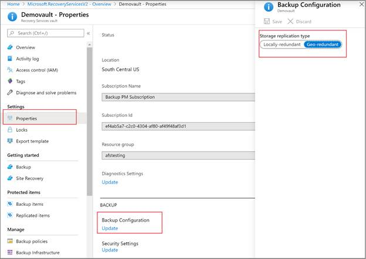
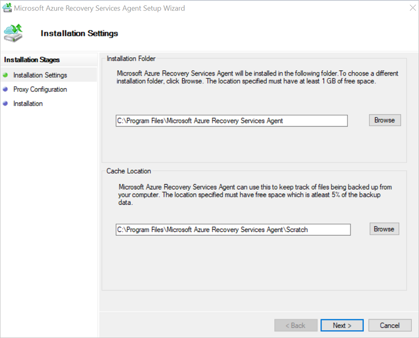
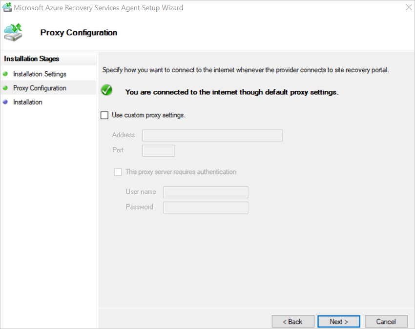
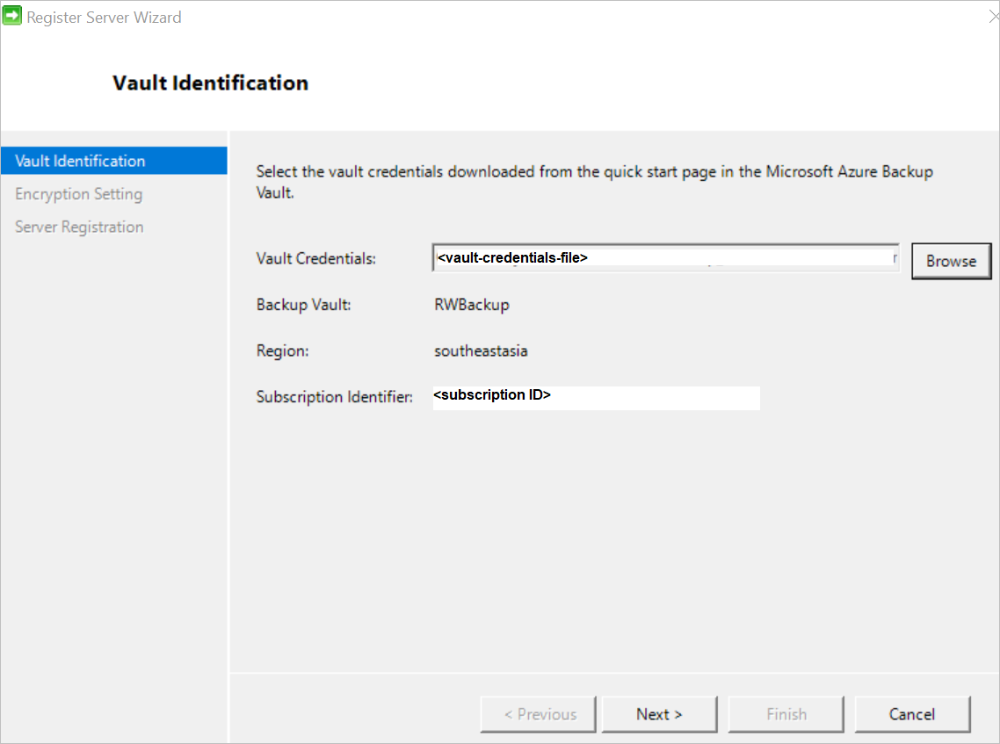

# Install the Azure Backup MARS agent

This article explains how to install the Microsoft Azure Recovery Services (MARS) agent. MARS is also known as the Azure Backup agent.

## About the MARS agent

Azure Backup uses the MARS agent to back up files, folders, and system state from on-premises machines and Azure VMs. Those backups are stored in a Recovery Services vault in Azure. You can run the agent:

* Directly on on-premises Windows machines. These machines can back up directly to a Recovery Services vault in Azure.
* On Azure VMs that run Windows side by side with the Azure VM backup extension. The agent backs up specific files and folders on the VM.
* On a Microsoft Azure Backup Server (MABS) instance or a System Center Data Protection Manager (DPM) server. In this scenario, machines and workloads back up to MABS or Data Protection Manager. Then MABS or Data Protection Manager uses the MARS agent to back up to a vault in Azure.

The data that's available for backup depends on where the agent is installed.

> [!NOTE]
> Generally, you back up an Azure VM by using an Azure Backup extension on the VM. This method backs up the entire VM. If you want to back up specific files and folders on the VM, install and use the MARS agent alongside the extension. For more information, see [Architecture of a built-in Azure VM backup](backup-architecture.md#architecture-built-in-azure-vm-backup).

## Before you start

* Learn how [Azure Backup uses the MARS agent to back up Windows machines](backup-architecture.md#architecture-direct-backup-of-on-premises-windows-server-machines-or-azure-vm-files-or-folders).
* Learn about the [backup architecture](backup-architecture.md#architecture-back-up-to-dpmmabs) that runs the MARS agent on a secondary MABS or Data Protection Manager server.
* Review [what's supported and what you can back up](backup-support-matrix-mars-agent.md) by the MARS agent.
* Make sure that you have an Azure account if you need to back up a server or client to Azure. If you don't have an account, you can create a [free one](https://azure.microsoft.com/free/) in just a few minutes.
* Verify internet access on the machines that you want to back up.
* Ensure the user performing the installation and configuration of the MARS agent has local administrator privileges on the server to be protected.

[!INCLUDE [How to create a Recovery Services vault](../../includes/backup-create-rs-vault.md)]

## Modify storage replication

By default, vaults use [geo-redundant storage (GRS)](https://docs.microsoft.com/azure/storage/common/storage-redundancy-grs).

* If the vault is your primary backup mechanism, we recommend that you use GRS.
* You can use [locally redundant storage (LRS)](https://docs.microsoft.com/azure/storage/common/storage-redundancy-lrs?toc=%2fazure%2fstorage%2fblobs%2ftoc.json) to reduce Azure storage costs.

To modify the storage replication type:

1. In the new vault, select **Properties** under the **Settings** section.

1. On the **Properties** page, under **Backup Configuration**, select **Update**.

1. Select the storage replication type, and select **Save**.

    

> [!NOTE]
> You can't modify the storage replication type after the vault is set up and contains backup items. If you want to do this, you need to re-create the vault.
>

### Verify internet access

If your machine has limited internet access, ensure that firewall settings on the machine or proxy allow the following URLs and IP addresses:

* URLs
  * `www.msftncsi.com`
  * `*.Microsoft.com`
  * `*.WindowsAzure.com`
  * `*.microsoftonline.com`
  * `*.windows.net`
* IP addresses
  * 20.190.128.0/18
  * 40.126.0.0/18

### Use Azure ExpressRoute

You can back up your data over Azure ExpressRoute by using public peering (available for old circuits) and Microsoft peering. Backup over private peering isn't supported.

To use public peering, first ensure access to the following domains and addresses:

* `http://www.msftncsi.com/ncsi.txt`
* `microsoft.com`
* `.WindowsAzure.com`
* `.microsoftonline.com`
* `.windows.net`

To use Microsoft peering, select the following services, regions, and relevant community values:

* Azure Active Directory (12076:5060)
* Azure region, according to the location of your Recovery Services vault
* Azure Storage, according to the location of your Recovery Services vault

For more information, see [ExpressRoute routing requirements](https://docs.microsoft.com/azure/expressroute/expressroute-routing).

> [!NOTE]
> Public peering is deprecated for new circuits.

All of the preceding URLs and IP addresses use the HTTPS protocol on port 443.

### Private Endpoints

[!INCLUDE [Private Endpoints](../../includes/backup-private-endpoints.md)]

## Download the MARS agent

Download the MARS agent so that you can install it on the machines that you want to back up.

If you've already installed the agent on any machines, make sure that you're running the latest version of the agent. Find the latest version in the portal, or go directly to the [download](https://aka.ms/azurebackup_agent).

1. In the vault, under **Getting Started**, select **Backup**.

    

1. Under **Where is your workload running?**, select **On-premises**. Select this option even if you want to install the MARS agent on an Azure VM.
1. Under **What do you want to back up?**, select **Files and folders**. You can also select **System State**. Many other options are available, but these options are supported only if you're running a secondary backup server. Select **Prepare Infrastructure**.

    

1. For **Prepare infrastructure**, under **Install Recovery Services agent**, download the MARS agent.

    

1. In the download menu, select **Save**. By default, the *MARSagentinstaller.exe* file is saved to your Downloads folder.

1. Select **Already download or using the latest Recovery Services Agent**, and then download the vault credentials.

    

1. Select **Save**. The file is downloaded to your Downloads folder. You can't open the vault credentials file.

## Install and register the agent

1. Run the *MARSagentinstaller.exe* file on the machines that you want to back up.
1. In the MARS Agent Setup Wizard, select **Installation Settings**. There, choose where to install the agent, and choose a location for the cache. Then select **Next**.
   * Azure Backup uses the cache to store data snapshots before sending them to Azure.
   * The cache location should have free space equal to at least 5 percent of the size of the data you'll back up.

    

1. For **Proxy Configuration**, specify how the agent that runs on the Windows machine will connect to the internet. Then select **Next**.

   * If you use a custom proxy, specify any necessary proxy settings and credentials.
   * Remember that the agent needs access to [specific URLs](#before-you-start).

    

1. For **Installation**, review the prerequisites, and select **Install**.
1. After the agent is installed, select **Proceed to Registration**.
1. In **Register Server Wizard** > **Vault Identification**, browse to and select the credentials file that you downloaded. Then select **Next**.

    

1. On the **Encryption Setting** page, specify a passphrase that will be used to encrypt and decrypt backups for the machine.

    * Save the passphrase in a secure location. You need it to restore a backup.
    * If you lose or forget the passphrase, Microsoft can't help you recover the backup data.

1. Select **Finish**. The agent is now installed, and your machine is registered to the vault. You're ready to configure and schedule your backup.

## Next steps

Learn how to [Back up Windows machines by using the Azure Backup MARS agent](backup-windows-with-mars-agent.md)
