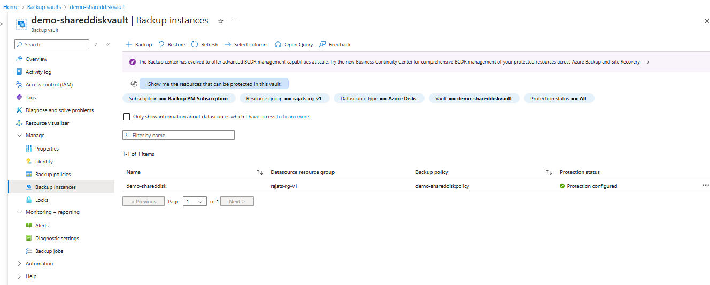
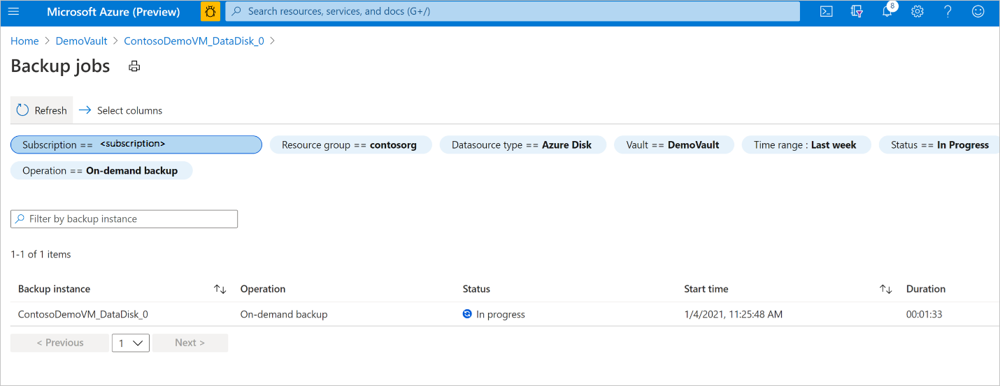

# Manage Azure Managed Disks

This article explains how to manage Azure Managed Disk from the Azure portal.

## Monitor a backup operation

The Azure Backup service creates a job for scheduled backups or if you trigger on-demand backup operation for tracking. To view the backup job status:

1. Go to the **Backup instance** screen. It shows the jobs dashboard with operation and status for the past seven days.

   

1. To view the status of the backup operation, select **View all** to show ongoing and past jobs of this backup instance.

   

1. Review the list of backup and restore jobs and their status. Select a job from the list of jobs to view job details.

   

## Monitor a restore operation

After you trigger the restore operation, the backup service creates a job for tracking. Azure Backup displays notifications about the job in the portal. To view the restore job progress:

1. Go to the **Backup instance** screen. It shows the jobs dashboard with operation and status for the past seven days.

    

1. To view the status of the restore operation, select **View all** to show ongoing and past jobs of this backup instance.

    

1. Review the list of backup and restore jobs and their status. Select a job from the list of jobs to view job details.

    

## Manage operations using the Azure portal

This section describes several Azure Backup supported management operations that make it easy to manage Azure Managed disks.

### Stop Protection

There are three ways by which you can stop protecting an Azure Disk:

- **Stop Protection and Retain Data (Retain forever)**: This option helps you stop all future backup jobs from protecting your disk. However, Azure Backup service will retain the recovery points that are backed up forever. You'll need to pay to keep the recovery points in the vault (see [Azure Backup pricing](https://azure.microsoft.com/pricing/details/backup/) for details). You'll be able to restore the disk, if needed. To resume disk protection, use the **Resume backup** option.

- **Stop Protection and Retain Data (Retain as per Policy)**: This option helps you stop all future backup jobs from protecting your disk. The recovery points will be retained as per policy and will be chargeable according to [Azure Backup pricing](https://azure.microsoft.com/pricing/details/backup/). However, the latest recovery point will be retained forever.

- **Stop Protection and Delete Data**: This option helps you stop all future backup jobs from protecting your disks and delete all the recovery points. You won't be able to restore the disk or use the **Resume backup** option.

#### Stop Protection and Retain Data

1. Go to **Backup center** and select **Azure Disks**.

1. From the list of disk backup instances, select the instance that you want to retain.

1. Select **Stop Backup**.

   :::image type="content" source="./media/manage-azure-managed-disks/select-disk-backup-instance-to-stop-inline.png" alt-text="Screenshot showing the selection of the Azure disk backup instance to be stopped." lightbox="./media/manage-azure-managed-disks/select-disk-backup-instance-to-stop-expanded.png":::
 
1. Select one of the following data retention options:

   1. Retain forever
   1. Retain as per policy
 
   :::image type="content" source="./media/manage-azure-managed-disks/data-retention-options-for-disk-inline.png" alt-text="Screenshot showing the options to stop disk backup instance protection." lightbox="./media/manage-azure-managed-disks/data-retention-options-for-disk-expanded.png":::

   You can also select the reason for stopping backups  from the drop-down list.

1. Click **Stop Backup**.

1. Select **Confirm** to stop data protection.

   :::image type="content" source="./media/manage-azure-managed-disks/confirm-stopping-disk-backup-inline.png" alt-text="Screenshot showing the options for disk backup instance retention to be selected." lightbox="./media/manage-azure-managed-disks/confirm-stopping-disk-backup-expanded.png":::

#### Stop Protection and Delete Data

1. Go to **Backup center** and select **Azure Disks**.

1. From the list of disk backup instances, select the instance that you want to delete.

1. Click **Stop Backup (Preview)**.

1. Select **Delete Backup Data**.

   Provide the name of the backup instance, reason for deletion, and any other comments.

   :::image type="content" source="./media/manage-azure-managed-disks/details-to-stop-disk-backup-inline.png" alt-text="Screenshot for the confirmation for stopping disk backup." lightbox="./media/manage-azure-managed-disks/details-to-stop-disk-backup-expanded.png":::

1. Select **Stop Backup**.

1. Select **Confirm** to stop data protection.

   :::image type="content" source="./media/manage-azure-managed-disks/confirm-stopping-disk-backup-inline.png" alt-text="Screenshot showing the options for disk backup instance retention to be selected." lightbox="./media/manage-azure-managed-disks/confirm-stopping-disk-backup-expanded.png":::

### Resume Protection

If you have selected the **Stop Protection and Retain data** option, you can resume protection for your disks.

>[!Note]
>When you start protecting a disk, the backup policy is applied to the retained data as well. The recovery points that have expired as per the policy will be cleaned up.

Use the following steps:

1. Go to **Backup center** and select **Azure Disks**.

1. From the list of disk backup instances, select the instance that you want to resume.

1. Select **Resume Backup (Preview)**.

   :::image type="content" source="./media/manage-azure-managed-disks/resume-disk-protection-inline.png" alt-text="Screenshot showing the option to resume protection of disk." lightbox="./media/manage-azure-managed-disks/resume-disk-protection-expanded.png":::

1. Select **Resume backup**.

   :::image type="content" source="./media/manage-azure-managed-disks/resume-disk-backup-inline.png" alt-text="Screenshot showing the option to resume disk backup." lightbox="./media/manage-azure-managed-disks/resume-disk-backup-expanded.png":::

### Delete Backup Instance

If you choose to stop all scheduled backup jobs and delete all existing backups, use **Delete Backup Instance**.

>[!Note]
>Deleting a backup instance will fail if the Snapshot Resource Group is deleted manually or permission to the Backup vault’s managed identity is revoked. In such failure cases, create the Snapshot Resource Group (with the same name) temporarily and provide Backup vault’s managed identity with required role permissions as documented [here](./backup-managed-disks-ps.md#assign-permissions). You can find the name of Snapshot Resource Group on the **Essentials** tab of **Backup instance** screen. 

To delete a disk backup instance, follow these steps:

1. Click **Delete** on the backup instance screen.

   :::image type="content" source="./media/manage-azure-managed-disks/initiate-deleting-backup-instance-inline.png" alt-text="Screenshot showing the process to delete a backup instance." lightbox="./media/manage-azure-managed-disks/initiate-deleting-backup-instance-expanded.png":::

1. Provide confirmation details including name of the Backup instance, reason for deletion, and additional comments.

   :::image type="content" source="./media/manage-azure-managed-disks/confirm-deleting-backup-instance-inline.png" alt-text="Screenshot showing to confirm the deletion of backup instances." lightbox="./media/manage-azure-managed-disks/confirm-deleting-backup-instance-expanded.png":::

1. Click **Delete** to confirm and proceed with deleting backup instance.

## Next steps

[Backup vaults overview](backup-vault-overview.md)