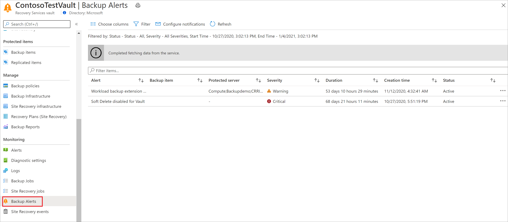

# Manage and monitor backed up SQL Server databases

This article describes common tasks for managing and monitoring SQL Server databases that are running on an Azure virtual machine (VM) and that are backed up to an Azure Backup Recovery Services vault by the [Azure Backup](backup-overview.md) service. You'll learn how to monitor jobs and alerts, stop and resume database protection, run backup jobs, and unregister a VM from backups.

If you haven't yet configured backups for your SQL Server databases, see [Back up SQL Server databases on Azure VMs](backup-azure-sql-database.md)

## Monitor backup jobs in the portal

Azure Backup shows all scheduled and on-demand operations under **Backup jobs** in **Backup center** in the Azure portal, except the scheduled log backups since they can be very frequent. The jobs you see in this portal includes database discovery and registration, configure backup, and backup and restore operations.

:::image type="content" source="./media/backup-azure-sql-database/backup-operations-in-backup-center-jobs-inline.png" alt-text="Screenshot showing the Backup jobs under Backup jobs." lightbox="./media/backup-azure-sql-database/backup-operations-in-backup-center-jobs-expanded.png":::

For details on Monitoring scenarios, go to [Monitoring in the Azure portal](backup-azure-monitoring-built-in-monitor.md) and [Monitoring using Azure Monitor](backup-azure-monitoring-use-azuremonitor.md).  

## View backup alerts

Because log backups occur every 15 minutes, monitoring backup jobs can be tedious. Azure Backup eases monitoring by sending email alerts. Email alerts are:

- Triggered for all backup failures.
- Consolidated at the database level by error code.
- Sent only for a database's first backup failure.

To monitor database backup alerts:

1. Sign in to the [Azure portal](https://portal.azure.com).

2. On the vault dashboard, select **Backup Alerts**.

   

## Stop protection for a SQL Server database

You can stop backing up a SQL Server database in a couple of ways:

- Stop all future backup jobs, and delete all recovery points.
- Stop all future backup jobs, and leave the recovery points intact.

If you choose to leave recovery points, keep these details in mind:

- All recovery points will remain intact forever, and all pruning will stop at stop protection with retain data.
- You'll be charged for the protected instance and the consumed storage. For more information, see [Azure Backup pricing](https://azure.microsoft.com/pricing/details/backup/).
- If you delete a data source without stopping backups, new backups will fail. Old recovery points will expire according to the policy, but the most recent recovery point will always be kept until you stop the backups and delete the data.

To stop protection for a database:

1. Go to **Backup center** and click **Backup Instances** from the menu.

2. Select **SQL in Azure VM** as the datasource type.

   :::image type="content" source="./media/backup-azure-sql-database/backup-center-instance-inline.png" alt-text="Screenshot showing to select SQL in Azure VM." lightbox="./media/backup-azure-sql-database/backup-center-instance-expanded.png":::

3. Select the database for which you want to stop protection.

   :::image type="content" source="./media/backup-azure-sql-database/sql-select-instance-inline.png" alt-text="Screenshot showing to select the database to stop protection." lightbox="./media/backup-azure-sql-database/sql-select-instance-expanded.png":::

4. On the database menu, select **Stop backup**.

   You can also right-click a particular row in the Backup Instances view and select **Stop Backup**.

   :::image type="content" source="./media/backup-azure-sql-database/sql-stop-backup-inline.png" alt-text="Screenshot showing to select Stop backup." lightbox="./media/backup-azure-sql-database/sql-stop-backup-expanded.png":::

5. On the **Stop Backup** menu, select whether to retain or delete data. If you want, provide a reason and comment.

    

6. Select **Stop backup**.

> [!NOTE]
>
>For more information about the delete data option, see the FAQ below:
>
>- [If I delete a database from an autoprotected instance, what will happen to the backups?](faq-backup-sql-server.yml#if-i-delete-a-database-from-an-autoprotected-instance--what-will-happen-to-the-backups-)
>- [If I do stop backup operation of an autoprotected database what will be its behavior?](faq-backup-sql-server.yml#if-i-change-the-name-of-the-database-after-it-has-been-protected--what-will-be-the-behavior-)
>
>

## Resume protection for a SQL database

When you stop protection for the SQL database, if you select the **Retain Backup Data** option, you can later resume protection. If you don't retain the backup data, you can't resume protection.

To resume protection for a SQL database:

1. Open the backup item and select **Resume backup**.

    

2. On the **Backup policy** menu, select a policy, and then select **Save**.

## Run an on-demand backup

You can run different types of on-demand backups:

- Full backup
- Copy-only full backup
- Differential backup
- Log backup

While you need to specify the retention duration for Copy-only full backup, the retention range for on-demand full backup will automatically be set to 45 days from current time.

For more information, see [SQL Server backup types](backup-architecture.md#sql-server-backup-types).

## Modify policy

Modify policy to change backup frequency or retention range.

> [!NOTE]
> Any change in the retention period will be applied retrospectively to all the older recovery points besides the new ones.

In the vault dashboard, go to **Manage** > **Backup Policies** and choose the policy you want to edit.

  

  

Policy modification will impact all the associated Backup Items and trigger corresponding **configure protection** jobs.

>[!Note]
>Modification of policy will affect existing recovery points also.    For recovery points in archive that haven't stayed for a duration of 180 days in Archive Tier, deletion of those recovery points lead to early deletion cost. [Learn more](../storage/blobs/access-tiers-overview.md).

### Inconsistent policy

Sometimes, a modify policy operation can lead to an **inconsistent** policy version for some backup items. This happens when the corresponding **configure protection** job fails for the backup item after a modify policy operation is triggered. It appears as follows in the backup item view:

  

You can fix the policy version for all the impacted items in one click:

  

## Unregister a SQL Server instance

Before you unregister the server, [disable soft delete](./backup-azure-security-feature-cloud.md#disabling-soft-delete-using-azure-portal), and then delete all backup items.

>[!NOTE]
>Deleting backup items with soft delete enabled will lead to 14 days retention, and you will need to wait before the items are completely removed. However, if you've deleted the backup items with soft delete enabled, you can undelete them, disable soft-delete, and then delete them again for immediate removal. [Learn more](./backup-azure-security-feature-cloud.md#permanently-deleting-soft-deleted-backup-items)

Unregister a SQL Server instance after you disable protection but before you delete the vault.

1. On the vault dashboard, under **Manage**, select **Backup Infrastructure**.  

   

2. Under **Management Servers**, select **Protected Servers**.

   

3. In **Protected Servers**, select the server to unregister. To delete the vault, you must unregister all servers.

4. Right-click the protected server, and select **Unregister**.

   

## Re-register extension on the SQL Server VM

Sometimes, the workload extension on the VM may become impacted for one reason or another. In such cases, all the operations triggered on the VM will begin to fail. You may then need to re-register the extension on the VM. The **Re-register** operation reinstalls the workload backup extension on the VM for operations to continue. You can find this option under **Backup Infrastructure** in the Recovery Services vault.

Use this option with caution. When triggered on a VM with an already healthy extension, this operation will cause the extension to get restarted. This may cause all the in-progress jobs to fail. Check for one or more of the [symptoms](backup-sql-server-azure-troubleshoot.md#re-registration-failures) before triggering the re-register operation.

## Next steps

For more information, see [Troubleshoot backups on a SQL Server database](backup-sql-server-azure-troubleshoot.md).