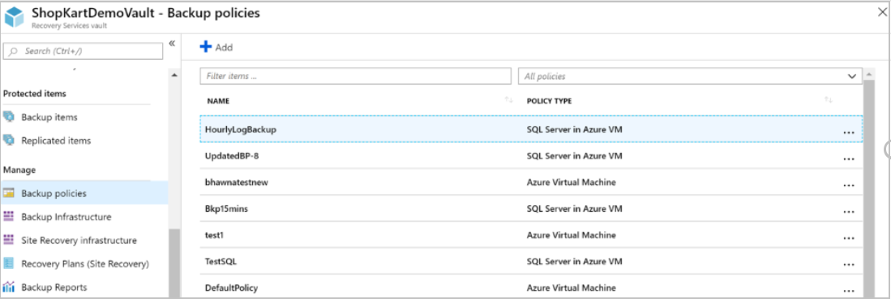
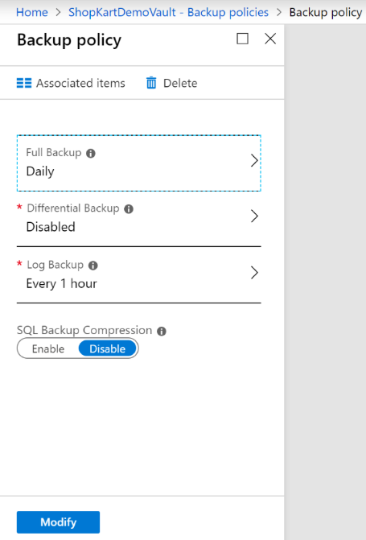
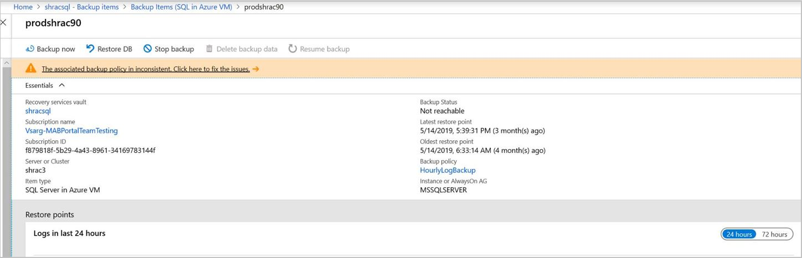
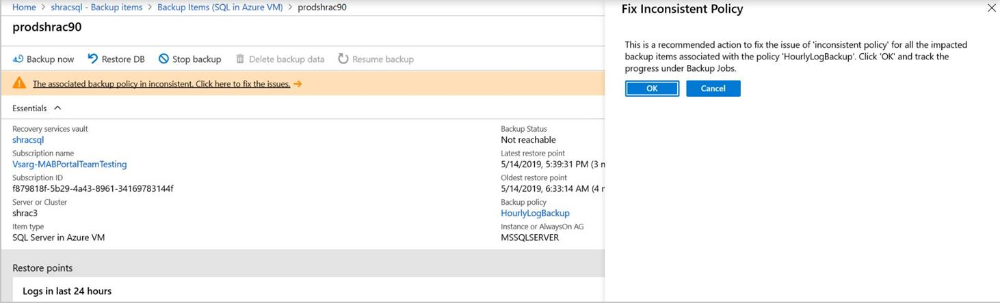
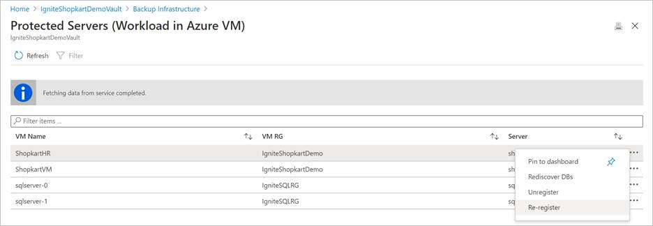

# Manage and monitor backed up SQL Server databases

This article describes common tasks for managing and monitoring SQL Server databases that are running on an Azure virtual machine (VM) and that are backed up to an Azure Backup Recovery Services vault by the [Azure Backup](backup-overview.md) service. You'll learn how to monitor jobs and alerts, stop and resume database protection, run backup jobs, and unregister a VM from backups.

If you haven't yet configured backups for your SQL Server databases, see [Back up SQL Server databases on Azure VMs](backup-azure-sql-database.md)

>[!Note]
>See the [SQL backup support matrix](sql-support-matrix.md) to know more about the supported configurations and scenarios.

## Monitor backup jobs in the portal

Azure Backup shows all scheduled and on-demand operations under **Backup jobs** in **Backup center** in the Azure portal, except the scheduled log backups since they can be very frequent. The jobs you see in this portal includes database discovery and registration, configure backup, and backup and restore operations.

:::image type="content" source="./media/backup-azure-sql-database/backup-operations-in-backup-center-jobs-inline.png" alt-text="Screenshot showing the Backup jobs under Backup jobs." lightbox="./media/backup-azure-sql-database/backup-operations-in-backup-center-jobs-expanded.png":::

For details on Monitoring scenarios, go to [Monitoring in the Azure portal](backup-azure-monitoring-built-in-monitor.md) and [Monitoring using Azure Monitor](backup-azure-monitoring-use-azuremonitor.md).  

## View backup alerts

Azure Backup raises built-in alerts via Azure Monitor for the following SQL database backups scenarios:

- Backup failures
- Restore failures
- Unsupported backup type is configured
- Workload extension unhealthy
- Deletion of backup data

For more information on the supported alert scenarios, see [Azure Monitor alerts for Azure Backup](backup-azure-monitoring-built-in-monitor.md?tabs=recovery-services-vaults#azure-monitor-alerts-for-azure-backup).

To monitor database backup alerts, follow these steps:

1. In the Azure portal, go to **Backup center** and filter for **SQL in Azure VM** data source type.

   :::image type="content" source="./media/backup-azure-sql-database/sql-alerts-inline.png" alt-text="Screenshot showing the Backup alerts menu item." lightbox="./media/backup-azure-sql-database/sql-alerts-expanded.png":::

1. Select the **Alerts** menu item to view the list of all alerts that were fired for SQL database backups in the selected time period.

   :::image type="content" source="./media/backup-azure-sql-database/sql-alerts-list-inline.png" alt-text="Screenshot showing the Backup alerts list." lightbox="./media/backup-azure-sql-database/sql-alerts-list-expanded.png":::

1. To configure notifications for these alerts, you must create an alert processing rule.

   Learn about [Configure notifications for alerts](backup-azure-monitoring-built-in-monitor.md?tabs=recovery-services-vaults#configuring-notifications-for-alerts).

## Stop protection for a SQL Server database

You can stop backing up a SQL Server database in a couple of ways:

- Stop all future backup jobs, and delete all recovery points.
- Stop all future backup jobs, and leave the recovery points intact.

If you choose to leave recovery points, keep these details in mind:

- All recovery points will remain intact forever, and all pruning will stop at stop protection with retain data.
- You'll be charged for the protected instance and the consumed storage. For more information, see [Azure Backup pricing](https://azure.microsoft.com/pricing/details/backup/).
- If you delete a data source without stopping backups, new backups will fail. Old recovery points will expire according to the policy, but the most recent recovery point will always be kept until you stop the backups and delete the data.

To stop protection for a database:

1. Go to **Backup center** and click **Backup Instances** from the menu.

2. Select **SQL in Azure VM** as the datasource type.

   :::image type="content" source="./media/backup-azure-sql-database/backup-center-instance-inline.png" alt-text="Screenshot showing to select SQL in Azure VM." lightbox="./media/backup-azure-sql-database/backup-center-instance-expanded.png":::

3. Select the database for which you want to stop protection.

   :::image type="content" source="./media/backup-azure-sql-database/sql-select-instance-inline.png" alt-text="Screenshot showing to select the database to stop protection." lightbox="./media/backup-azure-sql-database/sql-select-instance-expanded.png":::

4. On the database menu, select **Stop backup**.

   You can also right-click a particular row in the Backup Instances view and select **Stop Backup**.

   :::image type="content" source="./media/backup-azure-sql-database/sql-stop-backup-inline.png" alt-text="Screenshot showing to select Stop backup." lightbox="./media/backup-azure-sql-database/sql-stop-backup-expanded.png":::

5. On the **Stop Backup** menu, select whether to retain or delete data. If you want, provide a reason and comment.

    

6. Select **Stop backup**.

> [!NOTE]
>
>For more information about the delete data option, see the FAQ below:
>
>- [If I delete a database from an autoprotected instance, what will happen to the backups?](faq-backup-sql-server.yml#if-i-delete-a-database-from-an-autoprotected-instance--what-will-happen-to-the-backups-)
>- [If I do stop backup operation of an autoprotected database what will be its behavior?](faq-backup-sql-server.yml#if-i-change-the-name-of-the-database-after-it-has-been-protected--what-will-be-the-behavior-)
>
>

## Resume protection for an SQL database

When you stop protection for the SQL database, if you select the **Retain Backup Data** option, you can later resume protection. If you don't retain the backup data, you can't resume protection.

To resume protection for an SQL database, follow these steps:

1. Open the backup item and select **Resume backup**.

    

2. On the **Backup policy** menu, select a policy, and then select **Save**.

## Run an on-demand backup

You can run different types of on-demand backups:

- Full backup
- Copy-only full backup
- Differential backup
- Log backup

>[!Note]
>The retention period of this backup is determined by the type of on-demand backup you have run.
>
>- *On-demand full* retains backups for a minimum of *45 days* and a maximum of *99 years*.
>- *On-demand copy only full* accepts any v0alue for retaintion.
>- *On-demand differential* retains backup as per the retention of scheduled differentials set in policy.
>- *On-demand log* retains backups as per the retention of scheduled logs set in policy.

For more information, see [SQL Server backup types](backup-architecture.md#sql-server-backup-types).

## Modify policy

Modify policy to change backup frequency or retention range.

> [!NOTE]
> Any change in the retention period will be applied retrospectively to all the older recovery points besides the new ones.

In the vault dashboard, go to **Manage** > **Backup Policies** and choose the policy you want to edit.

  

  

Policy modification will impact all the associated Backup Items and trigger corresponding **configure protection** jobs.

>[!Note]
>Modification of policy will affect existing recovery points also.    For recovery points in archive that haven't stayed for a duration of 180 days in Archive Tier, deletion of those recovery points lead to early deletion cost. [Learn more](../storage/blobs/access-tiers-overview.md).

### Inconsistent policy

Sometimes, a modify policy operation can lead to an **inconsistent** policy version for some backup items. This happens when the corresponding **configure protection** job fails for the backup item after a modify policy operation is triggered. It appears as follows in the backup item view:

  

You can fix the policy version for all the impacted items in one click:

  

## Unregister a SQL Server instance

Before you unregister the server, [disable soft delete](./backup-azure-security-feature-cloud.md#disabling-soft-delete-using-azure-portal), and then delete all backup items.

>[!NOTE]
>Deleting backup items with soft delete enabled will lead to 14 days retention, and you will need to wait before the items are completely removed. However, if you've deleted the backup items with soft delete enabled, you can undelete them, disable soft-delete, and then delete them again for immediate removal. [Learn more](./backup-azure-security-feature-cloud.md#permanently-deleting-soft-deleted-backup-items)

Unregister a SQL Server instance after you disable protection but before you delete the vault.

1. On the vault dashboard, under **Manage**, select **Backup Infrastructure**.  

   

2. Under **Management Servers**, select **Protected Servers**.

   

3. In **Protected Servers**, select the server to unregister. To delete the vault, you must unregister all servers.

4. Right-click the protected server, and select **Unregister**.

   

## Re-register extension on the SQL Server VM

Sometimes, the workload extension on the VM may become impacted for one reason or another. In such cases, all the operations triggered on the VM will begin to fail. You may then need to re-register the extension on the VM. The **Re-register** operation reinstalls the workload backup extension on the VM for operations to continue. You can find this option under **Backup Infrastructure** in the Recovery Services vault.

Use this option with caution. When triggered on a VM with an already healthy extension, this operation will cause the extension to get restarted. This may cause all the in-progress jobs to fail. Check for one or more of the [symptoms](backup-sql-server-azure-troubleshoot.md#re-registration-failures) before triggering the re-register operation.

## Manage database backup when backed-up VM is moved/deleted

The backed-up SQL VM is deleted or moved using Resource move. The experience depends on the following characteristics of the new VM.

New VM subscription | New VM Name | New VM Resource group | New VM Region | Experience
------------------- | ----------- | --------------------- | ------------- | ---------------------------------
Same                | Same        | Same                  | Same          | **What will happen to backups of _old_ VM?**    You’ll receive an alert that backups will be stopped on the _old_ VM. The backup data will be retained as per the last active policy. You can choose to stop protection and delete data and unregister the old VM once all backup data is cleaned up as per policy.      **How to get backup data from _old_ VM to _new_ VM?**       No SQL backups will be triggered automatically on the _new_ virtual machine. You must re-register the VM to the same vault. Then it will appear as a valid target, and SQL data can be restored to the latest available point-in-time via the alternate location recovery capability. After you restore SQL data, SQL backups will continue on this machine. VM backup will continue as-is, if previously configured.
Same                | Same        | Different             | Same          | **What will happen to backups of _old_ VM?**      You’ll receive an alert that backups will be stopped on the _old_ VM. The backup data will be retained as per the last active policy. You can choose to stop protection and delete data and unregister the old VM once all backup data is cleaned up as per policy.       **How to get backup data from _old_ VM to _new_ VM?**    As the new virtual machine is in a different resource group, it will be treated as a new machine and you've to explicitly configure SQL backups (and VM backup too, if  previously configured) to the same vault. Then proceed to restore the SQL backup item of the old VM to latest available point-in-time via the _alternate location recovery_ to the new VM. The SQL backups will now continue.
Same                | Same        | Same or different     | Different     | **What will happen to backups of _old_ VM?**      You’ll receive an alert that backups will be stopped on the _old_ VM. The backup data will be retained as per the last active policy. You can choose to stop protection and delete data and unregister the old VM once all backup data is cleaned up as per policy.    **How to get backup data from _old_ VM to _new_ VM?     As the new virtual machine is in a different region, you’ve to configure SQL backups to a vault in the new region.     If the new region is a paired region, you can choose to restore SQL data to latest available point-in-time via the ‘cross region restore’ capability from the SQL backup item of the _old_ VM.    If the new region is a non-paired region, direct restore from the previous SQL backup item isn't supported. However, you can choose the *restore as files* option, from the SQL backup item of the ‘old’ VM, to get the data to a mounted share in a VM of the old region, and then mount it to the new VM.
Different           | Same or different        | Same or different     | Same or different     | **What will happen to backups of _old_ VM?**     You’ll receive an alert that backups will be stopped on the _old_ VM. The backup data will be retained as per the last active policy. You can choose to stop protection + delete data and unregister the old VM once all backup data is cleaned up as per policy.    **How to get backup data from _old_ VM to _new_ VM?**    As the new virtual machine is in a different subscription, you’ve to configure SQL backups to a vault in the new subscription. If it's a new vault in different subscription, direct restore from the previous SQL backup item isn't supported. However, you can choose the *restore as files* option, from the SQL backup item of the _old_ VM, to get the data to a mounted share in a VM of the old subscription, and then mount it to the new VM.

## Next steps

For more information, see [Troubleshoot backups on a SQL Server database](backup-sql-server-azure-troubleshoot.md).