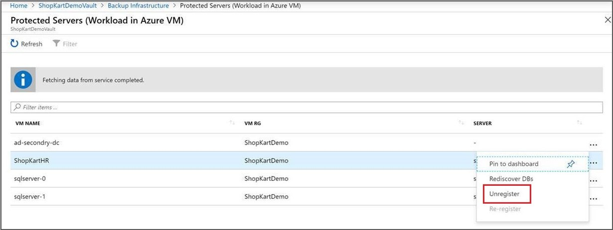

# Manage and monitor backed up SQL Server databases

This article describes common tasks for managing and monitoring SQL Server databases that are running on an Azure virtual machine (VM) and that are backed up to an Azure Backup Recovery Services vault by the [Azure Backup](backup-overview.md) service. You'll learn how to monitor jobs and alerts, stop and resume database protection, run backup jobs, and unregister a VM from backups.

If you haven't yet configured backups for your SQL Server databases, see [Back up SQL Server databases on Azure VMs](backup-azure-sql-database.md)

## Monitor manual backup jobs in the portal

Azure Backup shows all manually triggered jobs in the **Backup jobs** portal. The jobs you see in this portal include database discovery and registering, and backup and restore operations.

> [!NOTE]
> The **Backup jobs** portal doesn't show scheduled backup jobs. Use SQL Server Management Studio to monitor scheduled backup jobs, as described in the next section.
>

For details on Monitoring scenarios, go to [Monitoring in the Azure portal](backup-azure-monitoring-built-in-monitor.md) and [Monitoring using Azure Monitor](backup-azure-monitoring-use-azuremonitor.md).  

## View backup alerts

Because log backups occur every 15 minutes, monitoring backup jobs can be tedious. Azure Backup eases monitoring by sending email alerts. Email alerts are:

- Triggered for all backup failures.
- Consolidated at the database level by error code.
- Sent only for a database's first backup failure.

To monitor database backup alerts:

1. Sign in to the [Azure portal](https://portal.azure.com).

2. On the vault dashboard, select **Alerts and Events**.

   

3. In **Alerts and Events**, select **Backup Alerts**.

   

## Stop protection for a SQL Server database

You can stop backing up a SQL Server database in a couple of ways:

* Stop all future backup jobs, and delete all recovery points.
* Stop all future backup jobs, and leave the recovery points intact.

If you choose to leave recovery points, keep these details in mind:

* All recovery points will remain intact forever, all pruning shall stop at stop protection with retain data.
* You will be charged for the protected instance and the consumed storage. For more information, see [Azure Backup pricing](https://azure.microsoft.com/pricing/details/backup/).
* If you delete a data source without stopping backups, new backups will fail.

To stop protection for a database:

1. On the vault dashboard, select **Backup Items**.

2. Under **Backup Management Type**, select **SQL in Azure VM**.

    

3. Select the database for which you want to stop protection.

    

4. On the database menu, select **Stop backup**.

    

5. On the **Stop Backup** menu, select whether to retain or delete data. If you want, provide a reason and comment.

    

6. Select **Stop backup**.

>
> [!NOTE]
Refer the below FAQ for more information on delete data option:  
* [If I delete a database from an autoprotected instance, what will happen to the backups?](faq-backup-sql-server.md#if-i-delete-a-database-from-an-autoprotected-instance-what-will-happen-to-the-backups) 
* [If I do stop backup operation of an autoprotected database what will be its behavior?](faq-backup-sql-server.md#if-i-change-the-name-of-the-database-after-it-has-been-protected-what-will-be-the-behavior)
>
>

## Resume protection for a SQL database

When you stop protection for the SQL database, if you select the **Retain Backup Data** option, you can later resume protection. If you don't retain the backup data, you can't resume protection.

To resume protection for a SQL database:

1. Open the backup item and select **Resume backup**.

    

2. On the **Backup policy** menu, select a policy, and then select **Save**.

## Run an on-demand backup

You can run different types of on-demand backups:

* Full backup
* Copy-only full backup
* Differential backup
* Log backup

While you need to specify the retention duration for Copy-only full backup, the retention range for other backup types is automatically set to 30 days from current time.  
For more information, see [SQL Server backup types](backup-architecture.md#sql-server-backup-types).

## Unregister a SQL Server instance

Unregister a SQL Server instance after you disable protection but before you delete the vault:

1. On the vault dashboard, under **Manage**, select **Backup Infrastructure**.  

   

2. Under **Management Servers**, select **Protected Servers**.

   

3. In **Protected Servers**, select the server to unregister. To delete the vault, you must unregister all servers.

4. Right-click the protected server, and select **Unregister**.

   

## Re-register extension on the SQL Server VM

Sometimes, the workload extension on the VM may get impacted for one reason or the other. In such cases, all the operations triggered on the VM will begin to fail. You may then need to re-register the extension on the VM. **Re-register** operation reinstalls the workload backup extension on the VM for operations to continue.   

It is advised to use this option with caution; when triggered on a VM with an already healthy extension, this operation will cause the extension to get restarted. This may result in all the in-progress jobs to fail. Kindly check for one or more of the [symptoms](backup-sql-server-azure-troubleshoot.md#re-registration-failures) before triggering the re-register operation.

## Next steps

For more information, see [Troubleshoot backups on a SQL Server database](backup-sql-server-azure-troubleshoot.md).
