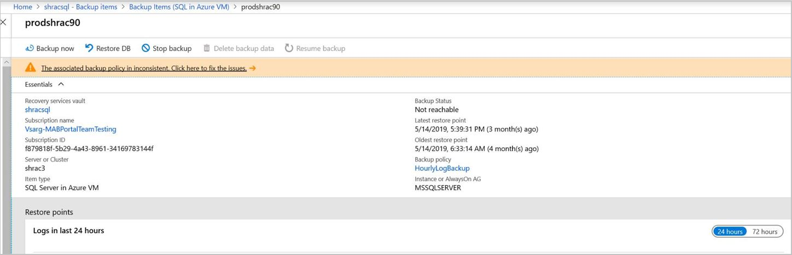
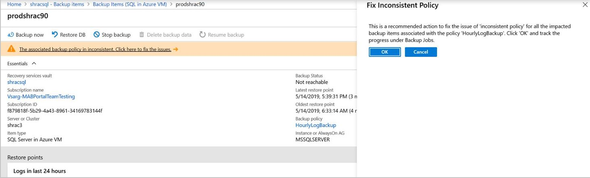
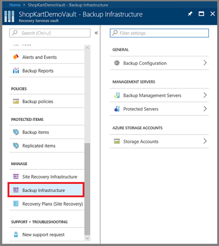
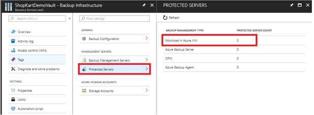
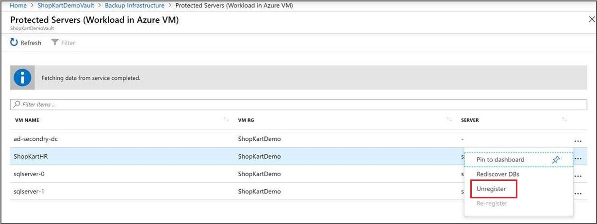
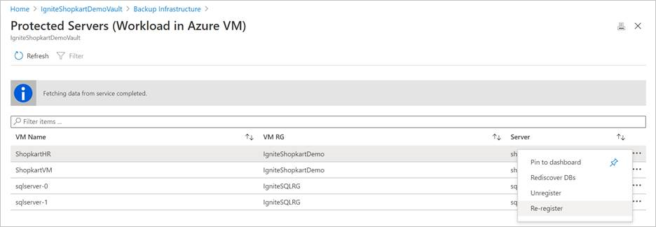

# Manage and monitor SQL Server database and instance snapshot (preview) backups 

This article describes common tasks for managing and monitoring SQL Server databases running on an Azure virtual machine (VM) and backed up to an Azure Backup Recovery Services vault by using the Azure portal. Azure Backup allows you to manage both SQL database backups and [SQL instance snapshot backups (preview)](backup-azure-sql-database.md#snapshot-backup-for-sql-instances-in-azure-vm-preview). You can also use [Azure CLI](backup-azure-sql-manage-cli.md) and [REST API](manage-azure-sql-vm-rest-api.md) to manage SQL database backups. You can monitor jobs and alerts, stop and resume database protection, run backup jobs, and unregister a VM from backups.

If you didn't configure backups for your SQL Server databases, see [Back up SQL Server databases on Azure VMs](backup-azure-sql-database.md)

To view the backup and restore scenarios that we support today, see the [support matrix](sql-support-matrix.md#scenario-support). For common questions, see the [frequently asked questions](faq-backup-sql-server.yml).

>[!NOTE]
>SQL Server instance snapshot backup management isn't supported with [Resiliency](../resiliency/resiliency-overview.md). [Learn more about the supported and unsupported scenarios for SQL Server instance snapshot backup (preview)](sql-support-matrix.md#sql-server-instance-snapshot-backups-supported-scenarios-preview).

## Configure simultaneous backups

You can configure SQL Server streaming backups to store recovery points and transaction logs simultaneously in local storage and a Recovery Services vault.

To configure simultaneous backups, follow these steps:

1. Go to the `C:\Program Files\Azure Workload Backup\bin\plugins` location, and then create the file **PluginConfigSettings.json**, if it's not present.
2. Add the comma separated key value entities, with keys `EnableLocalDiskBackupForBackupTypes` and `LocalDiskBackupFolderPath` to the JSON file.

   - Under `EnableLocalDiskBackupForBackupTypes`, list the backup types that you want to store locally.

     For example, if you want to store the *Full* and *Log* backups, mention `["Full", "Log"]`. To store only the log backups, mention `["Log"]`.

   - Under `LocalDiskBackupFolderPath`, mention the *path to the local folder*. Ensure that you use the *double forward slash* while mentioning the path in the JSON file.
   
     For example, if the preferred path for local backup is `E:\LocalBackup`, mention the path in JSON as `E:\\LocalBackup`.

     The final JSON should appear as:
 
     ```json
     {
        "EnableLocalDiskBackupForBackupTypes": ["Log"],
        "LocalDiskBackupFolderPath": "E:\\LocalBackup",
     }
     ```

     If there are other prepopulated entries in the JSON file, add the preceding two entries at the bottom of the JSON file *just before the closing curly bracket*.

3. For the changes to take effect immediately instead of regular one hour, go to **TaskManager** > **Services**, right-click **AzureWLbackupPluginSvc**, and then select **Stop**.

   >[!Caution]
   >This action cancels all the ongoing backup jobs.

   The naming convention of the stored backup file and the folder structure for the SQL Server database is `{LocalDiskBackupFolderPath}\{SQLInstanceName}\{DatabaseName}`.

   For example, if you have a database `Contoso` under the SQL instance `MSSQLSERVER`, the files are located at in `E:\LocalBackup\MSSQLSERVER\Contoso`.

   The name of the file is the `VDI device set guid`, which is used for the backup operation.

4. Check if the target location under `LocalDiskBackupFolderPath` has *read* and *write* permissions for `NT Service\AzureWLBackupPluginSvc`.

   >[!Note]
   >For a folder on the local VM disks, right-click the folder and configure the required permissions for `NT Service\AzureWLBackupPluginSvc` on the **Security** tab.
   
   If you're using a network or SMB share, configure the permissions by running the following PowerShell cmdlets from a user console that already has the permission to access the share:

   ```azurepowershell
   $cred = Get-Credential
   New-SmbGlobalMapping -RemotePath <FileSharePath> -Credential $cred -LocalPath <LocalDrive>:  -FullAccess @("<Comma Separated list of accounts>") -Persistent $true
   ```

   **Example**:
   
   ```azurepowershell
   $cred = Get-Credential
   New-SmbGlobalMapping -RemotePath \\i00601p1imsa01.file.core.windows.net\rsvshare -Credential $cred -LocalPath Y:  -FullAccess @("NT AUTHORITY\SYSTEM","NT Service\AzureWLBackupPluginSvc") -Persistent $true
   ```

## View backup items for SQL database and SQL Server instance

After you configure snapshot backup for a SQL Server instance (preview), Azure Backup shows the backup items in the Azure portal. Azure creates one backup item for the protected SQL instance, which you use for instance-level actions. These items appear under **SQL Server in Azure VM (Snapshot backup)**.

Azure also creates a separate backup item for each protected database in the instance. You use these items to perform database-level actions, such as restoring a database. These items appear under **SQL database in Azure VM** with backup type as **Snapshot backup**.

To view the database backup items, follow these steps:

1. On the **Recovery Services vault** and select **Protected items** > **Backup items**.

1. On the **Backup items** pane, select the required datasource type - **SQL Database in Azure VM** or **SQL Server in Azure VM (Snapshot backup) (Preview)**.

   :::image type="content" source="media/manage-monitor-sql-database-backup/sql-backup-items-overview.png" alt-text="Screenshot that shows the Backup items pane in Azure portal, with the datasources." lightbox="media/manage-monitor-sql-database-backup/sql-backup-items-overview.png":::

1. On the selected datasource backup items pane, view the backup items for the database.

   - **SQL Database in Azure VM**: Shows the list of all database‑level backup items, with the Backup type field indicating whether each database uses streaming or snapshot backups.

     :::image type="content" source="media/manage-monitor-sql-database-backup/sql-database-backup-items.png" alt-text="Screenshot that shows the list of SQL database backup items." lightbox="media/manage-monitor-sql-database-backup/sql-database-backup-items.png":::

   - **SQL Server in Azure VM (Snapshot) (Preview)**: Shows the list of all available instance‑level snapshots.

     :::image type="content" source="media/manage-monitor-sql-database-backup/sql-instance-backup-items.png" alt-text="Screenshot that shows the list of SQL instance backup items." lightbox="media/manage-monitor-sql-database-backup/sql-instance-backup-items.png":::

## Monitor backup jobs for SQL database and SQL Server instance snapshot

Azure Backup allows you to monitor backup jobs for SQL databases and SQL instance snapshots in the Azure portal. The following sections describe how to monitor backup jobs for each backup type.

### Monitor backup jobs for SQL database

Azure Backup shows all scheduled and on-demand operations under **Jobs** in **Resiliency** in the Azure portal, except for the scheduled log backups since they can be frequent. The jobs you see in this portal includes database discovery and registration, configure backup, and backup and restore operations.

:::image type="content" source="./media/backup-azure-sql-database/monitor-sql-database-backup-operations.png" alt-text="Screenshot shows the Backup jobs in Resiliency." lightbox="./media/backup-azure-sql-database/monitor-sql-database-backup-operations.png":::

For more information on Monitoring scenarios, see [Monitoring in the Azure portal](backup-azure-monitoring-built-in-monitor.md) and [Monitoring using Azure Monitor](backup-azure-monitoring-use-azuremonitor.md).  

### Monitor backup jobs for SQL Server instance snapshot backup (preview)

To monitor SQL in Azure VM backups, go to the **Recovery Services vault**, and select **Monitoring** > **Backup Jobs**.

The **Backup Jobs** pane provides the **Backup jobs** details. Jobs for streaming backups appear with the type **SQLDatabase**, whereas jobs for snapshot backups appear with the type **SQLInstance**.

## View backup alerts

Azure Backup raises built-in alerts via Azure Monitor for the following SQL database backups scenarios:

- Backup failures
- Restore failures
- Unsupported backup type is configured
- Workload extension unhealthy
- Deletion of backup data

For more information on the supported alert scenarios, see [Azure Monitor alerts for Azure Backup](monitoring-and-alerts-overview.md#azure-monitor-alerts-for-azure-backup).

To monitor database backup alerts, follow these steps:

1. In the [Azure portal](https://portal.azure.com), go to **Resiliency** select **Monitoring + Reporting** > **Alerts**.

   :::image type="content" source="./media/backup-azure-sql-database/alerts-list.png" alt-text="Screenshot shows the list of alerts." lightbox="./media/backup-azure-sql-database/alerts-list.png":::

1. On the **Alerts** pane, select the **Alert rule** for the SQL database to view the resources for which the alerts are triggered.

   :::image type="content" source="./media/backup-azure-sql-database/sql-alerts.png" alt-text="Screenshot shows the failed Backup alerts list." lightbox="./media/backup-azure-sql-database/sql-alerts.png":::

1. To configure notifications for these alerts, you must create an alert processing rule.

   Learn about [Configure notifications for alerts](backup-azure-monitor-alerts-notification.md#configure-notifications-for-alerts).

## Stop protection for a SQL database and SQL Server instance snapshot backup

You can stop protection for a SQL database or SQL Server instance snapshot backup in the Azure portal. When you stop protection, you can choose to retain or delete the backup data. If you retain the backup data, you can later resume protection. If you delete the backup data, you can't resume protection.

The following sections describe how to stop protection for a SQL database and SQL Server instance snapshot backup.

### Stop protection for a SQL database

Azure Backup provides the following options to stop protection of a SQL Server database:

- **Stop protection and retain backup data (Retain forever)**: Stops all future backup jobs from protecting a SQL Server database and retains the existing backup data in the Recovery Services vault forever. This retention incurs a storage fee as per [Azure Backup pricing](https://azure.microsoft.com/pricing/details/backup/). If needed, you can use the backup data to restore the SQL Server database and use the **Resume backup** option to resume protection.
- **Stop protection and retain backup data (Retain as per policy)**: Stops all future backup jobs from protecting a SQL Server database and retains the existing backup data in the Recovery Services vault as per policy. However, the latest recovery point is retained forever. This retention incurs a storage fee as per [Azure Backup pricing](https://azure.microsoft.com/pricing/details/backup/). If needed, you can use the backup data to restore the SQL Server database and use the **Resume backup** option to resume protection. This feature is only available for immutable vaults.
- **Stop protection and delete backup data**: Stops future backup jobs for a SQL Server database and deletes all backup data. You can't restore the SQL Server database or use the **Resume backup** option.

To stop protection for a database:

1. Go to **Resiliency** and select **Protection inventory** > **Protected items**.

   :::image type="content" source="./media/backup-azure-sql-database/protected-items.png" alt-text="Screenshot shows how to select a protected SQL database item." lightbox="./media/backup-azure-sql-database/protected-items.png":::
2. On the **Protected items** pane, select **SQL in Azure VM** as the datasource type, and select a protected item from the list.

3. On the selected **protected item** pane, select the database instance for which you want to stop protection.

   :::image type="content" source="./media/backup-azure-sql-database/sql-select-instance.png" alt-text="Screenshot shows how to select the database to stop protection." lightbox="./media/backup-azure-sql-database/sql-select-instance.png":::

4. On the selected database instance pane, select **Stop backup**.

   You can also right-click a particular row in the database instances view and select **Stop Backup**.

   :::image type="content" source="./media/backup-azure-sql-database/sql-stop-backup.png" alt-text="Screenshot shows the selection of Stop backup." lightbox="./media/backup-azure-sql-database/sql-stop-backup.png":::

5. On the **Stop Backup** pane, select whether to retain or delete data. If you want, provide a reason and comment.

    :::image type="content" source="./media/backup-azure-sql-database/stop-backup.png" alt-text="Screenshot shows the options to retain or delete data on the Stop Backup pane.":::

6. Select **Stop backup**.

For more information about the delete data option, see the following FAQs:

- [If I delete a database from an autoprotected instance, what happens to the backups?](faq-backup-sql-server.yml#if-i-delete-a-database-from-an-autoprotected-instance--what-will-happen-to-the-backups-)
- [If I do stop backup operation of an autoprotected database what happens to its behavior?](faq-backup-sql-server.yml#if-i-ve-changed-the-name-of-the-database-after-it-has-been-protected--what-will-be-the-behavior-)

### Stop protection for SQL instance snapshot backup (preview)

You can stop and resume snapshot backups at both the database and instance levels. You access the Stop backup and Resume backup options from the backup item details.

- **Stop backup at instance level**: When you stop backup at the instance level, Azure Backup stops backups for the instance and all underlying databases. You can choose to delete data or retain data (forever or per policy). Azure retains restore points for the underlying databases indefinitely, regardless of the selected retention or deletion option. To remove these restore points, you must explicitly stop backup and delete data for each database.

- **Stop backup at database level**: When you stop backup at the database level, only the selected database stops backing up. Azure deletes or retains restore points based on your selection. Other databases in the instance and instance-level backups remain unaffected.

To stop backup for SQL Server instance in Azure VM, follow these steps:

1. On the **Recovery Services vault**, select **Protected items** > **Backup items**.
1. On the **Backup items** pane, select **SQL Server in Azure VM (Snapshot backup)(Preview)**.
1. On the **Backup Items (SQL Server in Azure VM (Snapshot backup)(Preview))** pane, select **View details** corresponding to the database instance for which you want to stop protection.
1. On the selected database instance pane, select **Stop backup**.
1. On the **Stop Backup** pane, for **Stop backup level**, select **Retain backup data** or **Delete backup data**.

   >[!NOTE]
   > If you want to stop protection for specific databases in a SQL Server instance, for **Database(s)**, select **View DBs** and choose the required databases from the list.

1. For **Reason**, select an appropriate option from the list.
1. Select **Stop backup** to initiate the stop protection process.

## Resume protection for a SQL database and SQL Server instance

When you stop protection for the SQL database or SQL Server instance (preview), if you select the **Retain Backup Data** option, you can later resume protection. If you don't retain the backup data, you can't resume protection.

To resume protection for a SQL database or SQL Server instance, follow these steps:

1. Open the backup item and select **Resume backup**.

    

2. On the **Backup policy** menu, select a policy, and select **Save**.

## Run an on-demand backup for SQL Server database

You can run different types of on-demand backups:

- Full backup
- Copy-only full backup
- Differential backup
- Log backup

The following types of on-demand backup determine the retention period of the backups:

- *On-demand full* retains backups for a minimum of *45 days* and a maximum of *99 years*.
- *On-demand copy only full* accepts any value for retention.
- *On-demand differential* retains backup as per the retention of scheduled differentials set in policy.
- *On-demand log* retains backups as per the retention of scheduled logs set in policy.

For more information, see [SQL Server backup types](backup-architecture.md#sql-server-backup-types).

To run an on-demand backup at the SQL database level, follow these steps:

1.  Go to the **Recovery Services vault** and select **Protected items** > **Backup items**.

1.  On the **Backup items** pane, select **SQL Database in Azure VM**.

1.  On the **Backup Items (SQL Database in Azure VM)** pane, for the required backup item with **Snapshot backup type**, select **View details**.

1.  On the selected backup item pane, select **Backup now**.

1.  On the **Backup now** pane, select one of the supported **Backup type** - **Copy only full**, **Log**, **Full**, or **Differential**.  
      
     The supported on-demand backup types at the database level depend on whether you create the original backup item by using streaming backups or snapshot backups.  

    :::image type="content" source="./media/back-up-sql-server-instance-snapshot/sql-backup-type-selection.png" alt-text="Screenshot that shows how to trigger an on-demand backup for a SQL database in Azure portal." lightbox="./media/back-up-sql-server-instance-snapshot/sql-backup-type-selection.png":::

1.  Select **OK**.


## Modify backup policy for SQL database

Backup policy modification allows you to change the backup frequency or retention range. Any change to the retention period applies retrospectively to all existing and new recovery points. When you reduce the retention period for differential backups, existing differentials are cleaned up based on the new retention value. Differential backups depend on a previous full backup for recovery. The full backup remains retained until the retention of the last dependent differential backup expires.

For example, if you reduce differential retention from 30 days to 15 days, differential backups are deleted 15 days after creation. However, the associated full backup is retained until all those differentials expire. If differential backups are in a soft-deleted state when the retention policy changes, the same dependency rules apply. Soft-deleted backups are retained for further 14 days after retention expiry before permanent deletion.

To modify a SQL database backup policy, follow these steps:

1. Go to the **Recovery Services vault**, and select **Manage** > **Backup policies**.

1. On the **Backup policies** pane, choose the policy you want to edit.

   :::image type="content" source="./media/backup-azure-sql-database/modify-backup-policy.png" alt-text="Screenshot that shows how to modify a backup policy." lightbox="./media/backup-azure-sql-database/modify-backup-policy.png":::

1. On the **Modify policy** pane, make the required changes, and select **Update**.
  
   :::image type="content" source="./media/backup-azure-sql-database/modify-backup-policy-impact.png" alt-text="Screenshot that shows the impact of modifying a backup policy on associated backup items." lightbox="./media/backup-azure-sql-database/modify-backup-policy-impact.png":::

Policy modification impacts all the associated Backup Items and triggers corresponding **configure protection** jobs.

Modification of policy affects existing recovery points also. For recovery points in archive that didn't stay for a duration of 180 days in Archive Tier, deletion of those recovery points leads to early deletion cost. [Learn more](../storage/blobs/access-tiers-overview.md).

### Inconsistent policy

Sometimes, a modify policy operation can lead to an **inconsistent** policy version for some backup items. This issue happens when the corresponding **configure protection** job fails for the backup item after a modify policy operation is triggered. It appears as follows in the backup item view:

  

You can fix the policy version for all the impacted items in one click:

  

## Modify a backup policy for SQL Server instance snapshot backup (preview)

When you modify retention settings for SQL Server instance snapshot backup (preview), the changes apply to all existing and future recovery points. However, any new retention category (weekly, monthly, or yearly) that you add to an existing policy applies only to future recovery points.

To modify an existing SQL instance snapshot backup policy, follow these steps:

1.  Go to the **Recovery Services vault** and select **Manage** > **Backup policies**.

2.  On the **Backup policies** pane, select the required existing backup policy type from the list:

    - SQL Server in Azure VM (Streaming backup)

    - SQL Server in Azure VM (Snapshot backup)

    :::image type="content" source="media/manage-monitor-sql-database-backup/sql-backup-policy-list.png" alt-text="Screenshot of Azure Recovery Services vault with Backup policies tab selected, listing SQL Server, and VM backup policy options." lightbox="media/manage-monitor-sql-database-backup/sql-backup-policy-list.png":::

3.  On the **Modify policy** pane, do the required changes, and select **Update**.

### Change a backup policy for SQL Server instance snapshot backup (preview)

To change the policy associated with a backup item for SQL Server instance snapshot backup (preview), follow these steps:

1.  Go to the **Recovery Services vault** and select **Protected items** > **Backup items**.

2.  On the **Backup items** pane, select **SQL Server in Azure VM (Snapshot backup) (Preview)**.

3.  On the **Backup Items** pane, for the required backup instance for which you want to change policy, select **View details**.

4.  On the selected backup instance pane, under **Essentials**, select the backup policy.  
      
    :::image type="content" source="media/manage-monitor-sql-database-backup/backup-policy-change.png" alt-text="Screenshot that shows how to change policy for a SQL instance backup item." lightbox="media/manage-monitor-sql-database-backup/backup-policy-change.png":::

5.  On the **Change Backup Policy** pane, for **Backup policy**, select a policy from the list, and select **Change** and assign the required policy.

## Unregister a SQL Server instance

Before you unregister the server, [disable soft delete](./backup-azure-security-feature-cloud.md?tabs=azure-portal#disable-soft-delete), and delete all backup items.

Deletion of backup items with soft delete enabled lead to 14 days retention, and you need to wait before the items are removed. However, if the backup items are deleted with soft delete enabled, you can undelete them, disable Soft delete, and delete them again for immediate removal. [Learn more](./backup-azure-security-feature-cloud.md#delete-soft-deleted-backup-items-permanently)

You need to unregister the SQL Server instance before deleting the vault.

To unregister a SQL Server instance, follow these steps:

1. On the vault dashboard, under **Manage**, select **Backup Infrastructure**.  

   

2. Under **Management Servers**, select **Protected Servers**.

   

3. In **Protected Servers**, select the server to unregister. To delete the vault, you must unregister all servers.

4. Right-click the protected server, and select **Unregister**.

   

## Re-register extension on the SQL Server VM

Sometimes, the workload extension on the VM may become impacted for one reason or another. In such cases, all the operations triggered on the VM begin to fail. You may then need to re-register the extension on the VM. The **Re-register** operation reinstalls the workload backup extension on the VM for operations to continue. You can find this option under **Backup Infrastructure** in the Recovery Services vault.



Use this option with caution. When triggered on a VM with an already healthy extension, this operation causes the extension to get restarted. This operation might cause all the in-progress jobs to fail. Check for one or more of the [symptoms](backup-sql-server-azure-troubleshoot.md#re-registration-failures) before triggering the re-register operation.

## Modify backup snapshot operations for SQL Server instances in Azure VM (preview)

Azure Backup allows you to add or remove databases from SQL instance snapshot backup configuration.

To add or remove databases from the backed-up SQL instance, follow these steps:

1.  Go to the **Recovery Services vault**, and select **Protected items** > **Backup items**.

2.  On the **Backup items** pane, select **SQL Server in Azure VM (Snapshot backup) (Preview)**.

3.  On the **Backup Items** pane, for the required backup instance where you want to add or remove the database, select **View details**.

4.  On the selected backup instance pane, select **Add new database** and add the required database to the SQL backup instance.  
      
    To remove a database from the SQL backup instance, select **Remove database**.  
      
      
    :::image type="content" source="media/manage-monitor-sql-database-backup/add-remove-database-sql.png" alt-text="Screenshot that shows the Azure Backup Items pane for SQL Server VM with add new database and remove database options." lightbox="media/manage-monitor-sql-database-backup/add-remove-database-sql.png":::

## Manage database backup when backed-up VM is moved/deleted

The backed-up SQL VM is deleted or moved using Resource move. The experience depends on the following characteristics of the new VM.

New VM subscription | New VM Name | New VM Resource group | New VM Region | Experience
------------------- | ----------- | --------------------- | ------------- | ---------------------------------
Same                | Same        | Same                  | Same          | **What happens to backups of _old_ VM?** <br><br> You receive an alert that backups are stopped on the _old_ VM. The backup data is retained as per the last active policy. You can choose to stop protection and delete data and unregister the old VM once all backup data is cleaned up as per policy.   <br><br> **How to get backup data from _old_ VM to _new_ VM?**    <br><br> No SQL backups are triggered automatically on the _new_ virtual machine. You must re-register the VM to the same vault. Then it appears as a valid target, and SQL data can be restored to the latest available point-in-time via the alternate location recovery capability. After you restore SQL data, SQL backups continue on this machine. VM backup continues as-is, if previously configured.
Same                | Same        | Different             | Same          | **What happens to backups of _old_ VM?**   <br><br> You receive an alert that backups are stopped on the _old_ VM. The backup data is retained as per the last active policy. You can choose to stop protection and delete data and unregister the old VM once all backup data is cleaned up as per policy.     <br><br>**How to get backup data from _old_ VM to _new_ VM?** <br><br> The new virtual machine is in a different resource group, so Azure treats it as a new machine. You must explicitly configure SQL backups (and VM backup, if previously configured) to the same vault. Then proceed to restore the SQL backup item of the old VM to latest available point-in-time via the _alternate location recovery_ to the new VM. The SQL backups then continue.
Same                | Same        | Same or different     | Different     | **What happens to backups of _old_ VM?**   <br><br> You receive an alert that backups are stopped on the _old_ VM. The backup data is retained as per the last active policy. You can choose to stop protection and delete data and unregister the old VM once all backup data is cleaned up as per policy. <br><br> **How to get backup data from _old_ VM to _new_ VM? <br><br>  As the new virtual machine is in a different region, you’ve to configure SQL backups to a vault in the new region.  <br><br> In a paired region, you can restore SQL data to the latest available point‑in‑time by using cross‑region restore from the old VM’s SQL backup item. <br><br> If the new region is a nonpaired region, direct restore from the previous SQL backup item isn't supported. However, you can choose the *restore as files* option, from the SQL backup item of the ‘old’ VM, to get the data to a mounted share in a VM of the old region, and mount it to the new VM.
Different           | Same or different        | Same or different     | Same or different     | **What happens to backups of _old_ VM?** <br><br>  You receive an alert that backups are stopped on the _old_ VM. The backup data is retained as per the last active policy. You can choose to stop protection + delete data and unregister the old VM once all backup data is cleaned up as per policy. <br><br> **How to get backup data from _old_ VM to _new_ VM?** <br><br> As the new virtual machine is in a different subscription, you’ve to configure SQL backups to a vault in the new subscription. If it's a new vault in different subscription, direct restore from the previous SQL backup item isn't supported. However, you can choose the *restore as files* option, from the SQL backup item of the _old_ VM, to get the data to a mounted share in a VM of the old subscription, and mount it to the new VM.

## Next steps

For more information, see [Troubleshoot backups on a SQL Server database](backup-sql-server-azure-troubleshoot.md).


## Related content

- [Back up SQL server databases in Azure VMs using Azure Backup via REST API](backup-azure-sql-vm-rest-api.md).
- [Restore SQL Server databases in Azure VMs with REST API](restore-azure-sql-vm-rest-api.md).
- [Manage SQL server databases in Azure VMs with REST API](manage-azure-sql-vm-rest-api.md).

