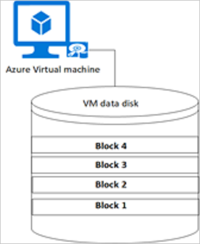
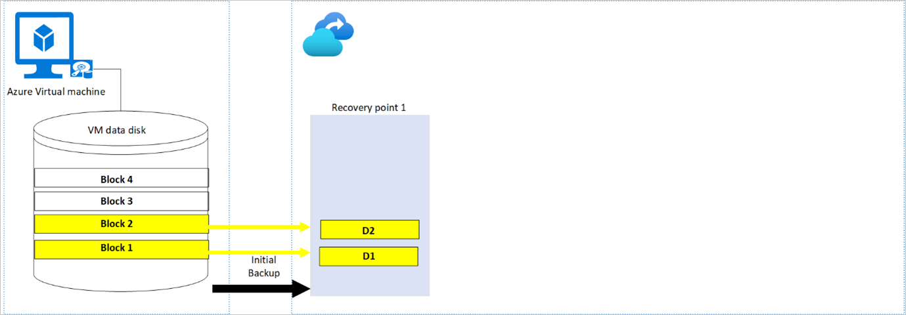
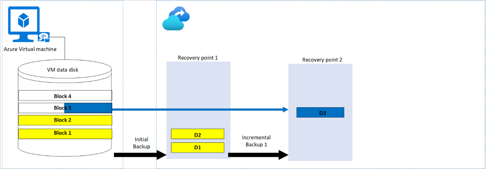
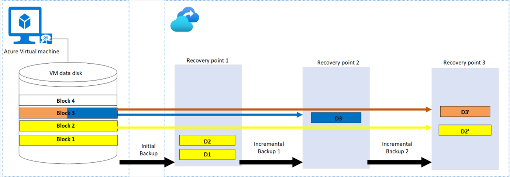
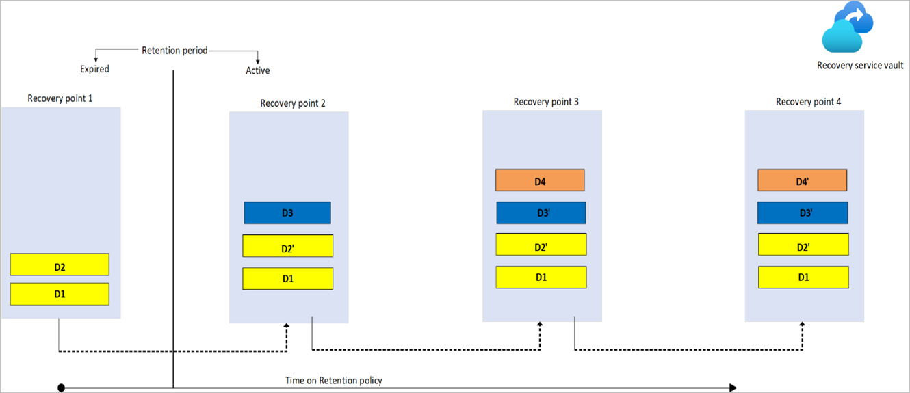
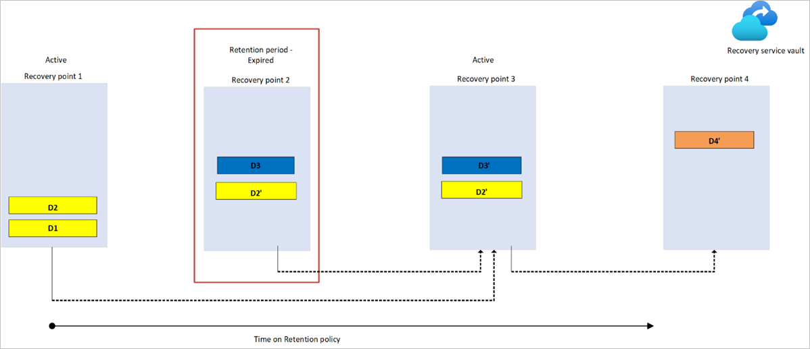
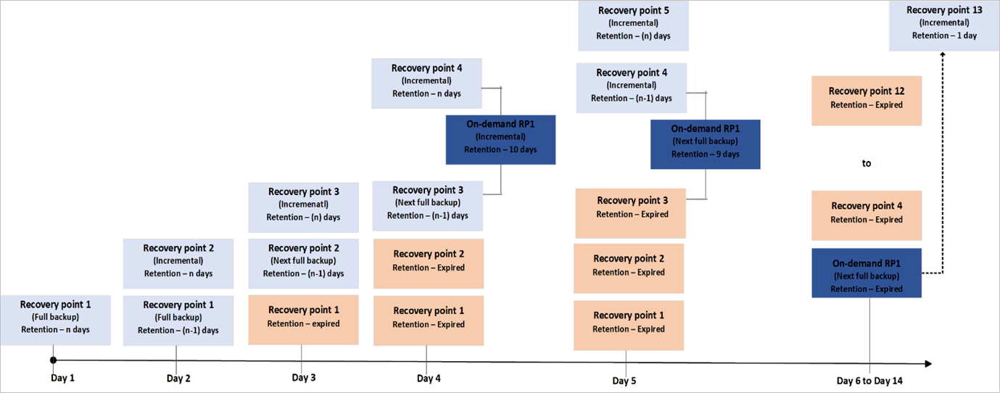

# Manage recovery points

This article describes how retention works for virtual machines. Whenever backups happen, recovery points are created from which restore operations  can be carried out.

For virtual machines, the initial backup is a full backup and the subsequent backups are incremental backups.

## Recovery points and retention

### Scheduled initial and incremental backup

Let’s take a simplified example of the virtual machine *V1* with a data disk composed of four blocks: Block 1, Block 2, Block 3, and Block 4. Each block is 16 KB in size.

**Step 1 -Initial Backup:** The initial backup is a full backup. It acts as a baseline on which subsequent incremental backups are applied. Suppose there's data written into Block 1 and Block 2 on the source VM. The same data will be replicated as D1 and D2 on the Recovery Services vault storage.

**Step 2 -Incremental backup 1:** Consider there's new data added to block 3 of the VM. The same data will be replicated on the next incremental backup and only the block that is changed is stored as D3.  During each step, even if 1 KB of the block changes, the entire 16-KB block is uploaded in the recovery point.

**Step 3 -Incremental backup 2:**  Now consider there are data changes on block 3 and block 2 on the source VM. These changes will be replicated on the next incremental backup as D3' and D2'.

### On-demand backup

You can choose to run an on-demand backup of a VM anytime after you set up protection on it.

- The on-demand backup will be a full backup if it's triggered before the first scheduled initial backup.
- If the initial backup is complete, and an on-demand backup is triggered, then it's an incremental backup.
- The retention time of recovery points created for an on-demand backup is the retention value that you specify when you trigger the backup.

### Storage cost

The **recovery point** created for the initial backup contains all the blocks that have the data. The subsequent incremental recovery points consist only of the blocks that have changed data. The storage costs correspond to the sum of all the blocks spanning across all the recovery points.

Let's use the above example to understand the storage cost after each step:

|Step  |Backup type  |Blocks changed  |Storage type |
|------|---------|---------|---------|
|1     |     Initial backup    | Block 1, Block 2        |    Corresponding to recovery point 1(D1+D2)     |
|2     |  Incremental Backup 1       |  Block 3       |   Corresponding to recovery point 1(D1+D2) + recovery point 2(D3)      |
|3     |    Incremental Backup 2     |    Block 2, Block 3     |   Corresponding to recovery point 1(D1+D2) + recovery point 2(D3) + recovery point 3(D2’+D3’)      |

### Recovery point expiration

Each recovery point has a retention duration, as specified in the backup policy. The cleanup happens at regular intervals and all the recovery points that have expired are cleaned up.

When the recovery point expires, it either gets deleted or merged.

### Case 1: Initial recovery point expires

When the initial recovery point expires, it merges with the next incremental recovery point. All the data blocks that are overwritten in the incremental recovery point get deleted and the rest are merged. The incremental backup then becomes the initial full backup. Let’s review with an example:

- *Recovery Point 1* that is created during the initial backup has the full backup of the VM.
- When *Recovery Point 1* expires, *Recovery Point 2* is the next full backup.
- Block D1 gets merged with *Recovery Point 2* and D2 is deleted since the data in block 2 is overwritten in *Recovery Point 2*. This change is captured as block D2'.
- Block D1 is retained in the consecutive recovery points as is, until there are any changes made to it before the next backup.

### Case 2: In-between incremental recovery point expires

- If *Recovery Point 2* expires before *Recovery Point 1*, the data from *Recovery Point 2* is merged with the next available recovery point: *Recovery Point 3*. So block D3 is merged with *Recovery Point 3*.
- *Recovery Point 1* is still the full backup with block D1 and D2.

### Case 3: On-demand recovery point expires

In this example, a schedule (daily backup) policy is scheduled to run with *n* days retention period.  If an on-demand backup is triggered on the fourth day before the next scheduled backup and its retention period is specified as 10 days, then it will still be an incremental backup. A recovery point (*On-demand RP1*) will be created after *Recovery Point 3* and before *Recovery Point 4*.  At the end of Day 14, the on-demand recovery point (*On-demand RP1*) gets expired, and it will be merged with the next available recovery point. The data blocks that are still present on the server are merged, while the data blocks that changed (overwritten or deleted) are deleted from the expired recovery point.

### Impact of policy change on recovery points

When a policy is modified, it's applied to both new and existing recovery points. For more information, see [Impact of policy change on recovery points](backup-architecture.md#impact-of-policy-change-on-recovery-points).

### Impact of stop protection on recovery points

There are two ways to stop protecting a VM:

- **Stop protection and delete backup data.** This option will stop all future backup jobs from protecting your VM and deletes all the recovery points. If [soft delete](backup-azure-security-feature-cloud.md) is enabled, the deleted data will be retained for 14 days. Charges aren't incurred for items in soft-deleted state. The data can be undeleted within the period of 14 days. If soft delete isn't enabled, the data will be immediately cleaned up and you won't be able to restore the VM or use the **Resume backup** option.
- **Stop protection and retain backup data.** This option will stop all future backup jobs from protecting your VM. However, the Azure Backup service will forever retain the recovery points that have been backed up. You'll need to pay to keep the recovery points in the vault (see [Azure Backup pricing](https://azure.microsoft.com/pricing/details/backup/) for details). You'll be able to restore the VM if needed. If you decide to resume VM protection, then you can use the **Resume backup** option. After resuming backup, retention rules will be applied to expiration points. You can also delete the backed-up data using the  **Delete backup data** option.

## Impact of deleting a VM without stop protection

Deleting a VM without stop protection has impact on recovery points, and is an undesirable scenario. Ideally backups should be stopped before deleting the virtual machine. Since the resource doesn't exist, the scheduled backups will fail with the [VMNotFoundV2 error](backup-azure-vms-troubleshoot.md#320001-resourcenotfound---could-not-perform-the-operation-as-vm-no-longer-exists--400094-bcmv2vmnotfound---the-virtual-machine-doesnt-exist--an-azure-virtual-machine-wasnt-found). The recovery points will be cleaned periodically according to the retention policy, but the last copy of the virtual machine will remain forever and you'll be billed accordingly. Depending on your scenario, you have the following two options:

- **Option 1:** Restore the VM using any of the recovery points. If you want to recover the deleted VM, restore using the same name and in the same resource group. If you protect the restored VM to the same vault, then the existing recovery points will automatically get attached.
- **Option 2:** Go to the Recovery Services vault and stop protection with delete data.

### Impact of expired recovery points for items in soft deleted state

If [soft delete](backup-azure-security-feature-cloud.md) is enabled for the recovery services vault, then the expired recovery point stays in soft deleted state and isn't cleaned up. No charges are incurred when a recovery point is in soft-deleted state.

### Impact of churn on backup performance

Suppose the total storage of a VM is 8 TB and the churn is 5%. Then the corresponding incremental backup storage will be 5% of 8 TB that is 0.4 TB. Higher churn corresponds to higher backend storage for subsequent incremental backups. The churn impacts the backup performance. Higher the churn, the slower the backup process, and greater the consumption of backend storage.

To understand how churn impacts the backup performance, look at this scenario:

|Virtual machines  |VM1  |VM2  |VM3  |
|---------|---------|---------|---------|
|Number of data disks    | 4 (A1, A2, A3, A4)        | 4(B1, B2, B3, B4)        |  4(C1, C2, C3, C4)       |
|Size of each disk   |      4 TB   | 4 TB        |  4 TB       |
|Backup data churn    |   A1- 4 TB      | B1-1 TB; B2-1 TB   B3-1 TB; B4-1 TB  |   C1-2 TB; C4-2 TB      |

The backup performance will be in the order VM2>VM3>VM1. The reason for this is the churned data is spread across the various disks. Since the backup of disks happens in parallel, VM2 will show the best performance.

## Frequently asked question

### How can I find the retention period of an on-demand backup?

The **Recovery Point Expiry Time in UTC** field in the backup jobs of on-demand backups displays the retention period of the recovery point. To learn more, see [Run an on-demand backup](backup-azure-manage-vms.md#run-an-on-demand-backup). 

## Next steps

- [Azure Backup architecture and components](backup-architecture.md)
