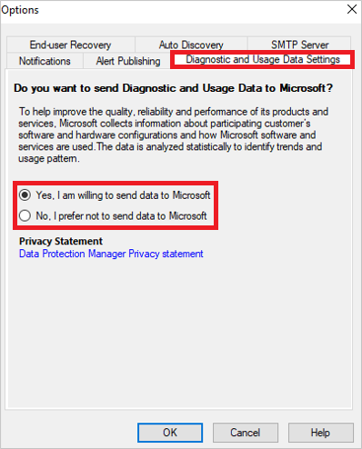

# Manage telemetry settings

>[!NOTE]
>This feature is applicable for MABS V3 UR2 and later.

This article provides information about how to manage the telemetry (Diagnostics and utility data) settings in Microsoft Azure Backup Server (MABS).

By default, MABS sends diagnostic and connectivity data to Microsoft. Microsoft uses this data to provide and improve the quality, security, and integrity of Microsoft products and services.

Administrators can turn off this feature at any point of time. For more information on the data collected, see the [following section](#telemetry-data-collected).

## Turn on/off telemetry from console

1. In the Microsoft Azure Backup Server console, go to **Management** and click **Options** in the top pane.
1. In the **Options** dialog box, select **Diagnostic and Usage Data Settings**.

    

1. Select the diagnostic and usage data sharing preference from the options displayed and then click **OK**.

    >[!NOTE]
    >We recommend you to read the [Privacy Statement](https://privacy.microsoft.com/privacystatement) before you select the option.
    >- To turn on telemetry, select **Yes, I am willing to send data to Microsoft**.
    >- To turn off telemetry, select **No, I prefer not to send data to Microsoft**.

## Telemetry data collected

| Data related To | Data collected* |
| --- | --- |
| **Setup** | Version of MABS installed.   Version of the MABS update rollup installed.    Unique machine identifier.    Operating system on which MABS is installed.    Unique cloud subscription identifier.   MARS agent version.   Whether tiered storage is enabled.    Size of the storage used. |
| **Workload Protected** | Workload unique Identifier.   Size of the workload being backed up.   Workload type and its version number.   If the workload is currently being protected by MABS.   Unique Identifier of the Protection Group under which the workload is protected.   Location where the workload is getting backed up - to disk/tape or cloud.|
| **Jobs** | Status of the backup/restore job.    Size of the data backed up/restored.   Failure message, in case backup/restore job fails.   Time taken for the restore job.  Details of the workload for which the backup/restore job was run. |
| **Telemetry change status** | The status change details for the telemetry settings, if enabled or disabled, and when. |
| **MABS Console Crash Error** | The details of the error when a MABS console crashes.|

## Next steps

[Protect workloads](./back-up-hyper-v-virtual-machines-mabs.md)