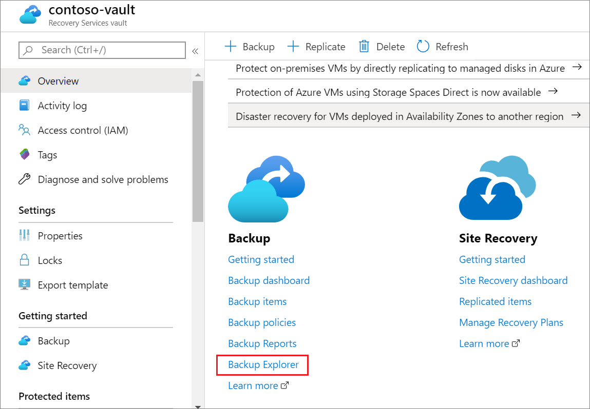
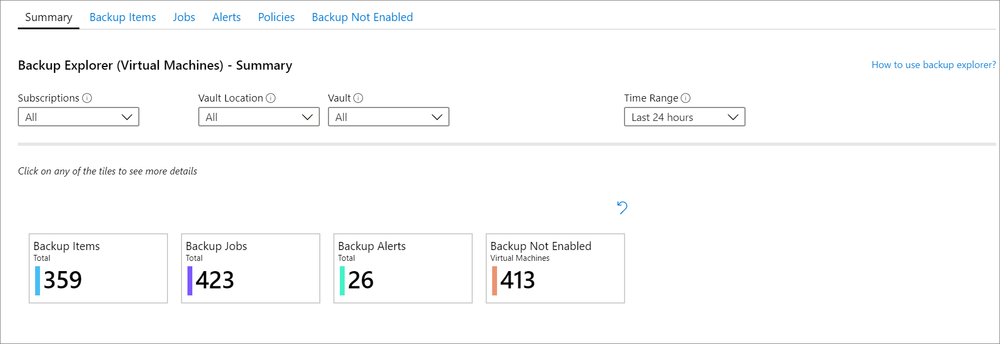

# Monitor your backups with Backup Explorer

As organizations back up more and more machines to the cloud, it becomes increasingly important to monitor these backups efficiently. The best way to begin is to use a central location for viewing operational information across a large estate.

Backup Explorer is a built-in Azure Monitor workbook that gives Azure Backup customers this single, central location. Backup Explorer helps you monitor operational activities across the entire Backup estate on Azure, spanning tenants, locations, subscriptions, resource groups, and vaults. Broadly, Backup Explorer provides the following capabilities:

* **At-scale perspective**: Get an aggregated view of the backup items, jobs, alerts, policies, and resources that aren't yet configured for backup across the entire estate.
* **Drill-down analysis**: Display detailed information about each of your jobs, alerts, policies, and backup items, all in one place.
* **Actionable interfaces**: After you identify an issue, you can resolve it by going seamlessly to the relevant backup item or Azure resource.

These capabilities are provided out-of-box by native integration with Azure Resource Graph and Azure Monitor workbooks.

> [!NOTE]
>
> * Backup Explorer is currently available only for Azure virtual machines (VMs) data.
> * Backup Explorer is meant to be an operational dashboard for viewing information about your backups over the last 7 days (maximum).
> * Backup Explorer is currently not supported in national clouds.
> * Currently, customizing the Backup Explorer template isn't supported.
> * We don't recommend writing custom automations on Azure Resource Graph data.
> * Currently, Backup Explorer allows you to monitor backups across a maximum of 1000 subscriptions (across tenants).

## Get started

You can access Backup Explorer by going to any of your Recovery Services vaults and selecting the **Backup Explorer** link in the **Overview** pane.

Selecting the link opens Backup Explorer, which provides an aggregated view across all the vaults and subscriptions that you have access to. If you're using an Azure Lighthouse account, you can view data across all the tenants that you have access to. For more information, see the "Cross-tenant views" section at the end of this article.

## Backup Explorer use cases

Backup Explorer displays multiple tabs, each providing detailed information about a specific backup artifact (for example, a backup item, job, or policy). This section provides a brief overview of each of the tabs. The videos provide sample use cases for each backup artifact, along with descriptions of the available controls.

### The Summary tab

The **Summary** tab provides a quick glance at the overall condition of your backup estate. For example, you can view the number of items being protected, the number of items for which protection hasn't been enabled, or how many jobs were successful in the last 24 hours.

> [!VIDEO https://www.microsoft.com/videoplayer/embed/RE4nQYd]

### The Backup Items tab

You can filter and view each of your backup items by subscription, vault, and other characteristics. By selecting the name of a backup item, you can open the Azure pane for that item. For example, from the table, you might observe that the last backup failed for item *X*. By selecting *X*, you can open the item's **Backup** pane, where you can trigger an on-demand backup operation.

> [!VIDEO https://www.microsoft.com/videoplayer/embed/RE4nQYc]

### The Jobs tab

Select the **Jobs** tab to view the details of all the jobs that were triggered over the last 7 days. Here, you can filter by *Job Operation*, *Job Status*, and *Error Code* (for failed jobs).

> [!VIDEO https://www.microsoft.com/videoplayer/embed/RE4nOrh]

### The Alerts tab

Select the **Alerts** tab to view details of all alerts that were generated on your vaults over the last 7 days. You can filter alerts by type (*Backup Failure* or *Restore Failure*), current status (*Active* or *Resolved*), and severity (*Critical*, *Warning*, or *Information*). You can also select a link to go the Azure VM and take any necessary action.

> [!VIDEO https://www.microsoft.com/videoplayer/embed/RE4nTxe]

### The Policies tab

You can select the **Policies** tab to view key information about all the backup policies that have been created across your backup estate. You can view the number of items associated with each policy, along with the retention range and backup frequency specified by the policy.

> [!VIDEO https://www.microsoft.com/videoplayer/embed/RE4nLKV]

### The Backup Not Enabled tab

Backup should be enabled for all machines that require protection. With Backup Explorer, backup administrators can quickly identify which machines in an organization aren't yet protected by backup. To view this information, select the **Backup Not Enabled** tab.

The **Backup Not Enabled** pane displays a table with a list of unprotected machines. Your organization might assign different tags to production machines and test machines, or to machines that serve a variety of functions. Because each class of machines needs a separate backup policy, filtering by tags helps you view information that's specific to each. Selecting the name of any machine redirects you to that machine's **Configure Backup** pane, where you can choose to apply an appropriate backup policy.

> [!VIDEO https://www.microsoft.com/videoplayer/embed/RE4nQXZ]

## Export to Excel

You can export the contents of any table or chart as an Excel spreadsheet. The contents are exported as is, with your existing filters applied. To export additional table rows, you can increase the number of rows to be displayed on the page by using the **Rows Per Page** drop-down list at the top of each tab.

## Pin to the dashboard

You can select the "pin" icon at the top of each table or chart to pin it to your Azure portal dashboard. Pinning this information helps you create a customized dashboard that's tailored to display the information that's most important to you.

## Cross-tenant views

If you're an Azure Lighthouse user with delegated access to subscriptions across multiple tenant environments, you can use the default subscription filter. You display the subscriptions that you want to see data for by selecting the "filter" icon at the top right of the Azure portal. When you use this feature, Backup Explorer aggregates information about all the vaults across your selected subscriptions. To learn more, see [What is Azure Lighthouse?](../lighthouse/overview.md).

## Next steps

[Learn how to use Azure Monitor for getting insights on your backup data](./backup-azure-monitoring-use-azuremonitor.md)
