# Offline seeding using Azure Data Box for DPM and MABS

> [!NOTE]
> This feature is applicable for Data Protection Manager (DPM) 2019 UR2 (and later) and MABS v3 UR2 (and later).

This article explains how you can use Azure Data Box to seed initial backup data offline from DPM and MABS to an Azure Recovery Services vault.

You can use [Azure Data Box](../databox/data-box-overview.md) to seed your large initial DPM/MABS backups offline (without using the network) to a Recovery Services vault. This process saves time and network bandwidth that would otherwise be consumed moving large amounts of backup data online over a high-latency network.

Offline backup based on Azure Data Box provides two distinct advantages over [offline backup based on the Azure Import/Export service](backup-azure-backup-server-import-export.md):

- You don't need to procure your own Azure-compatible disks and connectors. Azure Data Box ships the disks associated with the selected [Data Box SKU](https://azure.microsoft.com/services/databox/data/).

- Azure Backup (MARS Agent) can directly write backup data onto the supported SKUs of Azure Data Box. This capability eliminates the need for you to provision a staging location for your initial backup data. You also don't need utilities to format and copy that data onto the disks.

## Supported platforms

The following platforms are supported:

- Windows Server 2019 64 bit (Standard, Datacenter, Essentials)
- Windows Server 2016 64 bit (Standard, Datacenter, Essentials)

## Backup data size and supported Data Box SKUs

The following Data Box SKUs are supported:

| Backup Data Size (after compression by MARS)\* per server | Supported Azure Data Box SKU |
| --- | --- |
| \<= 7.2 TB | [Azure Data Box Disk](../databox/data-box-disk-overview.md) |
| > 7.2 TB and <= 80 TB\*\* | [Azure Data Box (100 TB)](../databox/data-box-overview.md) |

\*Typical compression rates vary between 10-20% <br>
\*\*Reach out to [SystemCenterFeedback@microsoft.com](mailto:SystemCenterFeedback@microsoft.com) if you expect to have more than 80 TB of initial backup data for a single data source.

> [!IMPORTANT]
> Initial backup data from a single data source must be contained within a single Azure Data Box or Azure Data Box disk, and can't be shared between multiple devices of the same or different SKUs. However, an Azure Data Box may contain initial backups from multiple data sources.

## Before you begin

The MARS agent running on DPM/MABS should be upgraded to the [latest version](https://aka.ms/azurebackup_agent) (2.0.9171.0 or later).

Ensure the following:

### Azure Subscription and required permissions

- A valid Azure subscription.
- The user intended to perform the offline backup policy must be an owner of the Azure subscription.
- The Data Box job and the Recovery Services vault to which the data needs to be seeded must be available in the same subscriptions.
    > [!NOTE]
    > We recommend that the target storage account and the Recovery Services vault be in the same region. However, this isn't mandatory.

### Order and receive the Data Box device

Ensure that the required Data Box devices are in *Delivered* state before triggering offline backup. See [Backup Data Size and supported Data Box SKUs](#backup-data-size-and-supported-data-box-skus) to order the most suitable SKU for your requirement. Follow the steps in [this article](../databox/data-box-disk-deploy-ordered.md) to order and receive your Data Box devices.

> [!IMPORTANT]
> Don't select *BlobStorage* for the **Account kind**. The DPM/MABS server requires an account that supports Page Blobs which isn't supported when *BlobStorage* is selected. Select  **Storage V2 (general purpose v2)** as the **Account kind** when creating the target storage account for your Azure Data Box job.

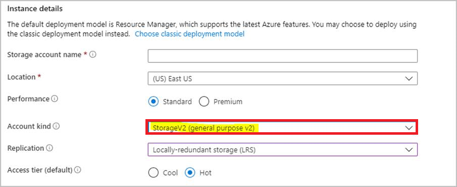

## Setup Azure Data Box devices

Once you receive the Azure Data Box device, depending on the Azure Data Box SKU you've ordered, perform the steps in the appropriate sections below to set up and prepare the Data Box devices for the DPM/MABS Server to identify and transfer the initial backup data.

### Setup Azure Data Box disk

If you ordered one or more Azure Data Box disks (up to 8 TB each), follow the steps mentioned [here](../databox/data-box-disk-deploy-set-up.md) to unpack, connect, and unlock your Data Box disk.

> [!NOTE]
> It's possible that the DPM/MABS server doesn't have a USB port. In such a scenario, you can connect your Azure Data Box disk to another server/client and expose the root of the device as a network share.

## Setup Azure Data Box

If you ordered an Azure Data Box (up to 100 TB), follow the steps mentioned [here](../databox/data-box-deploy-set-up.md) to set up your Data Box.

### Mount your Azure Data Box as local system

The DPM/MABS server operates in the System context and so requires the same level of privilege to be provided to the mount path where the Azure Data Box is connected. Follow the steps below to ensure you can mount your Data Box device as local system using the NFS protocol.

1. Enable the Client for NFS feature on the DPM/MABS Server.
Specify alternate source: *WIM:D:\Sources\Install.wim:4*
2. Download **PSExec** from [https://download.sysinternals.com/files/PSTools.zip](https://download.sysinternals.com/files/PSTools.zip) to the DPM/MABS server.
3. Open an elevated command prompt and execute the following command with the directory containing *PSExec.exe* as current directory.

   ```cmd
   psexec.exe  -s  -i  cmd.exe
   ```

4. The command window that opens as a result of the above command is in the Local System context. Use this command window to execute steps to mount the Azure Page Blob Share as a network drive on your Windows Server.
5. Follow the steps [here](../databox/data-box-deploy-copy-data-via-nfs.md#connect-to-data-box) to connect your DPM/MABS Server to the Data Box device via NFS and execute the following command on the Local System command prompt to mount the Azure Page Blobs share:

    ```cmd
    mount -o nolock \\<DeviceIPAddres>\<StorageAccountName_PageBlob X:
    ```

6. Once mounted, check if you can access X:  from your server. If you can, continue with the next section of this article.

## Transfer initial backup data to Azure Data Box devices

1. On your DPM/MABS Server, follow the steps to [create a new protection group](/system-center/dpm/create-dpm-protection-groups). If you're adding an online protection to the existing protection group, right-click the existing protection group, and select **Add Online Protection** and start from **Step 8**.
2. On the **Select Group Members** page, specify the computers and sources you want to back up.
3. On the **Select data protection method** page, specify how you want to handle short and long-term backup. Make sure you select **I want online protection.**

   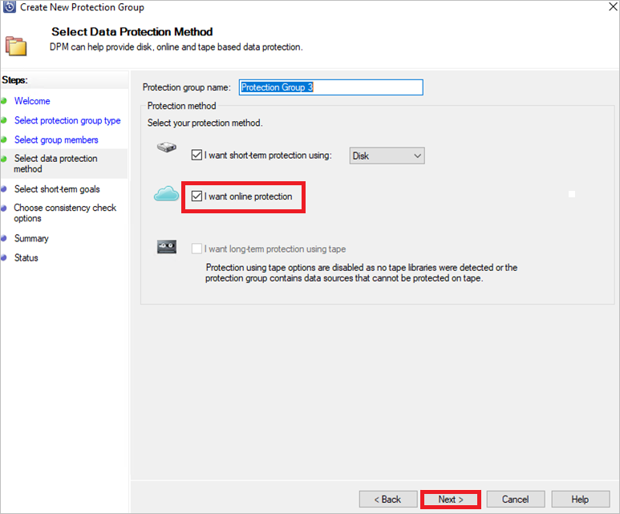

4. On **Select short-term goals** page, specify how you want to back up to short-term storage on disk.
5. On the **Review disk allocation** page, review the storage pool disk space allocated for the protection group.
6. On the **Choose replica creation method** page, select **Automatically over the network.**
7. On the **Choose consistency check options** page, select how you want to automate consistency checks.
8. On the **Specify online protection data** page, select the member you want enable online protection.

    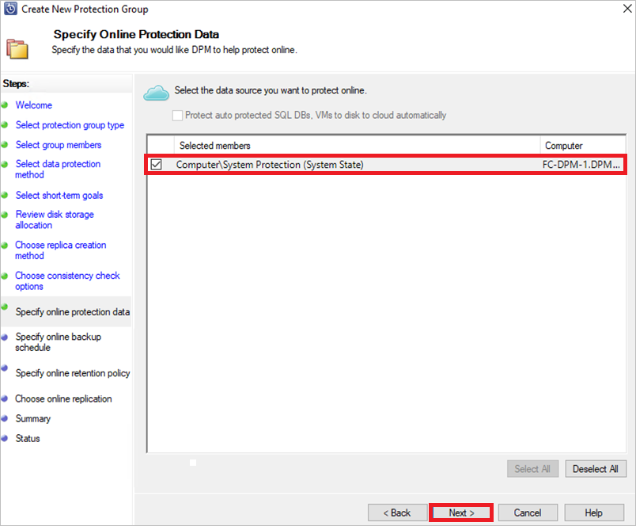

9. On the **Specify online backup schedule** page, specify how often incremental backups to Azure should occur.
10. On the **Specify online retention policy** page, specify how the recovery points created from the daily/weekly/monthly/yearly backups are retained in Azure.
11. On the **Choose online replication** screen of the wizard, choose the option **Transfer using Microsoft owned disks** and select **Next**.

    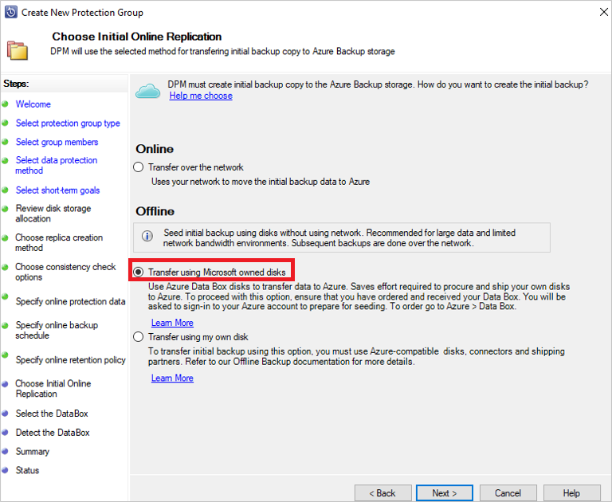

12. Sign into Azure when prompted, using the user credentials that have owner access on the Azure Subscription. After a successful sign-in, the following screen is displayed:

    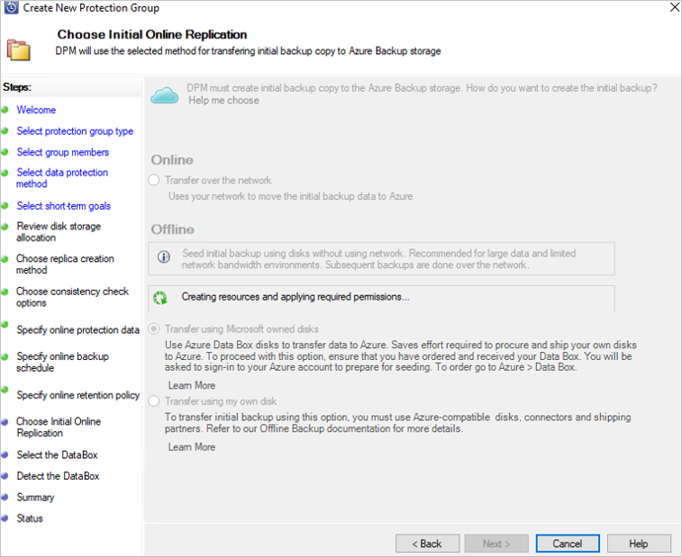

     The DPM/MABS server will then fetch the Data Box jobs in the subscription that are in *Delivered* state.

     > [!NOTE]
     > The first time sign-in takes longer than usual. The Azure PowerShell module gets installed in the background, and also the Microsoft Entra Application is registered.
     >
     >  - The following PowerShell modules are installed:<br>
          - AzureRM.Profile     *5.8.3*<br>
          - AzureRM.Resources   *6.7.3*<br>
          - AzureRM.Storage     *5.2.0*<br>
          - Azure.Storage       *4.6.1*<br>
     >  - The Microsoft Entra application is registered as *AzureOfflineBackup_\<object GUID of the user>*.

13. Select the correct Data box order for which you've unpacked, connected, and unlocked your Data Box disk. Select **Next**.

    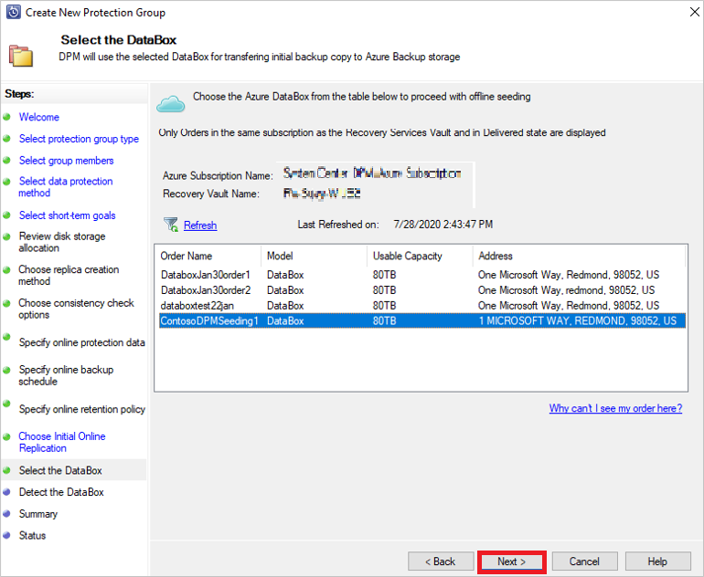

14. On the **Detect the DataBox** screen, enter the path of your Data Box device, and then select **Detect Device**.

    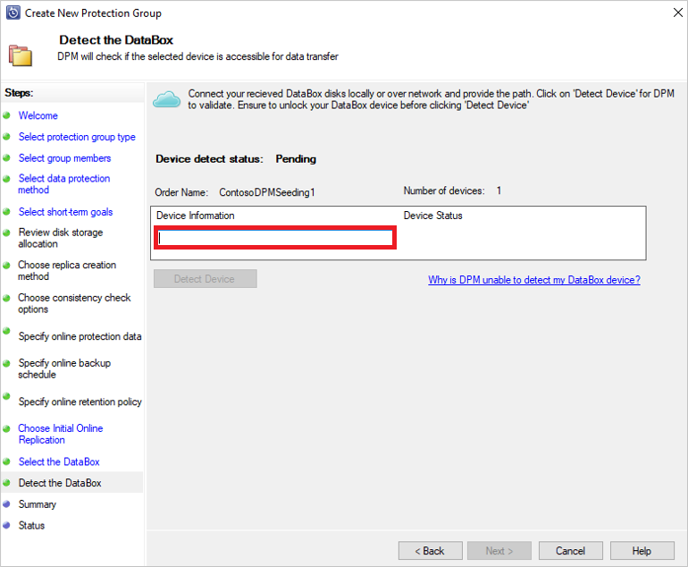

    > [!IMPORTANT]
    > Provide the network path to the root directory of the Azure Data Box disk. This directory must contain a directory by the name *PageBlob* as shown below:
    >
    > 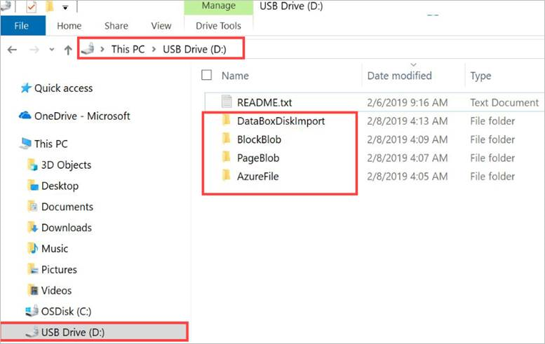
    >
    > For example, if the path of the disk is `\\mydomain\myserver\disk1\` and *disk1* contains a directory called *PageBlob*, the path to be provided on the DPM/MABS Server wizard is `\\mydomain\myserver\disk1\`.
    > If you [setup an Azure Data Box 100 TB device](./offline-backup-azure-data-box.md#set-up-azure-data-box), provide the following as the network path to the device `\\<DeviceIPAddress>\<StorageAccountName>_PageBlob`.

15. Select **Next**. On the **Summary** page, review your settings and select **Create Group**.

    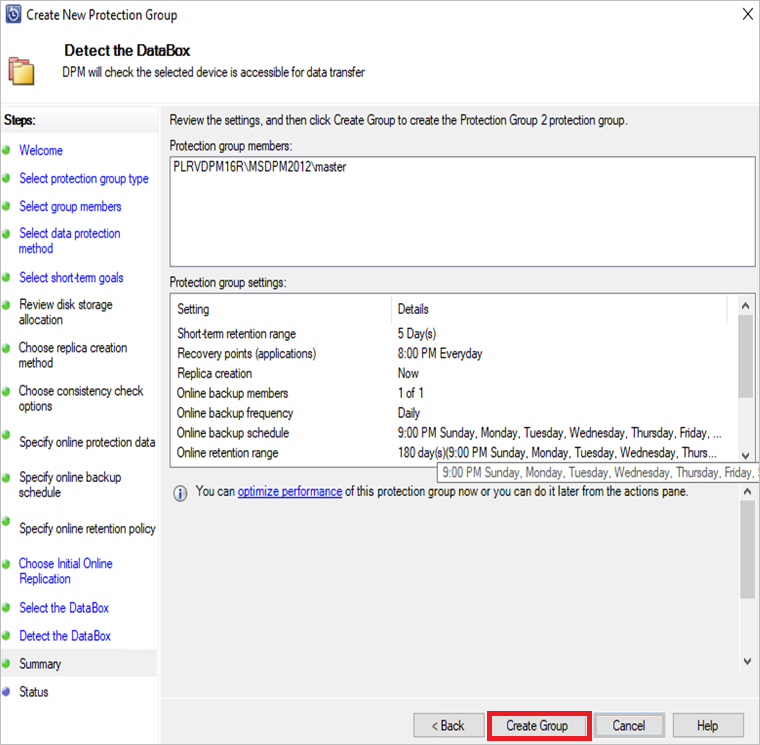

    The following screen confirms that the Protection Group is created successfully.

    

16. Select **Close** on the screen above.

    With this, the initial replication of the data occurs to the DPM/MABS disk. When it finishes the protection, the group status will show protection status as **OK** on the **Protection** page.

17. To initiate the offline-backup copy to your Azure Data Box device, right-click the **Protection Group**, and then choose the **Create recovery point** option. You then choose the **Online Protection** option.

    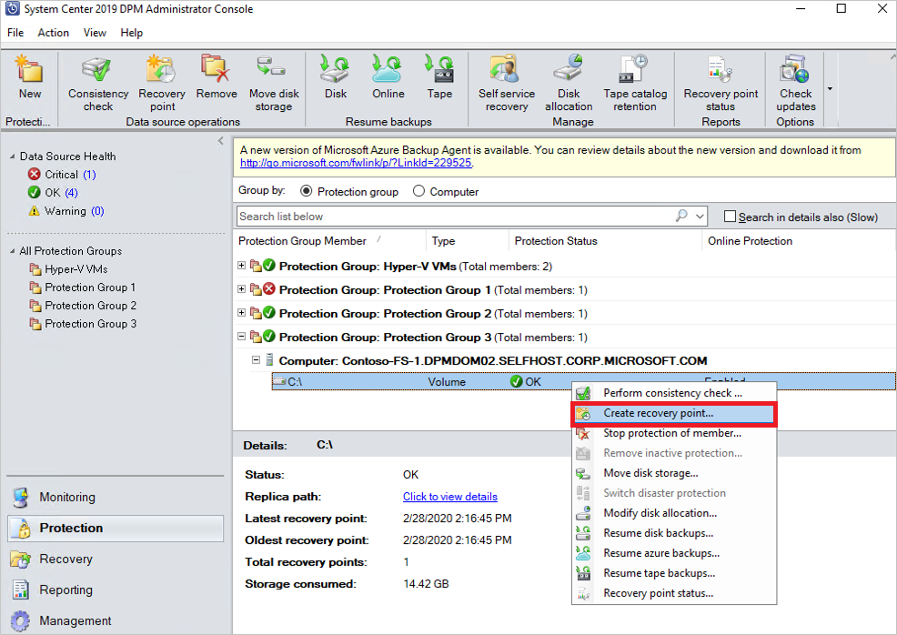

    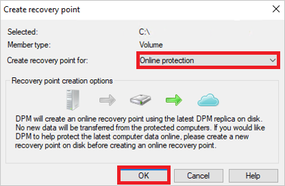

   The DPM/MABS server will start backing up the data you selected to the Azure Data Box device. This might take from several hours to a few days, depending on the size of the data and connection speed between the DPM/MABS server and the Azure Data Box Disk.

   You can monitor the status of the job in the **Monitoring** pane. Once the backup of the data is complete, you'll see a screen that resembles the one below:

   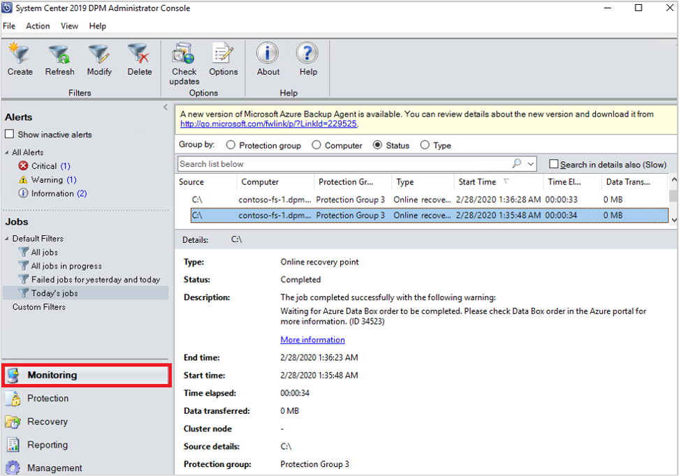

## Post-backup steps

Follow these steps once the data backup to the Azure Data Box Disk is successful.

- Follow the steps in [this article](../databox/data-box-disk-deploy-picked-up.md) to ship the Azure Data Box disk to Azure. If you used an Azure Data Box 100-TB device, follow [these steps](../databox/data-box-deploy-picked-up.md) to ship the Azure Data Box to Azure.
- [Monitor the Data Box job](../databox/data-box-disk-deploy-upload-verify.md) in the Azure portal. Once the Azure Data Box job is *Complete*, the DPM/MABS server automatically moves the data from the Storage Account to the Recovery Services vault at the time of the next scheduled backup. It will then mark the backup job as *Job Completed* if a recovery point is successfully created.

  > [!NOTE]
  > The DPM/MABS server triggers the backups at the times scheduled during protection group creation. However, these jobs will flag *Waiting for Azure Data Box job to be completed* until the time the job is complete.

- After the DPM/MABS Server successfully creates a recovery point corresponding to the initial backup, you may delete the Storage Account (or specific contents) associated with the Azure Data Box job.

## Troubleshooting

The Microsoft Azure Backup (MAB) agent on the DPM server creates a Microsoft Entra application for you, in your tenant. This application requires a certificate for authentication that's created and uploaded when configuring offline seeding policy.

We use Azure PowerShell for creating and uploading the certificate to the Microsoft Entra Application.

### Issue

At the time of configuring offline backup, due to a known code defect in the Azure PowerShell cmdlet you're unable to add multiple certificates to the same Microsoft Entra Application created by the MAB agent. This will impact you if you've configured an offline seeding policy for the same or a different server.

### Verify if the issue is caused by this specific root cause

To ensure that the failure is due to the [Issue](#issue) above, perform one of the following steps:

#### Step 1

Check if you see one of the following error messages in the DPM/MABS console at the time of configuring offline backup:

**Unable to create Offline Backup policy for the current Azure account as this server’s authentication information could not be uploaded to Azure. (ID: 100242)**

:::image type="content" source="./media/offline-backup-azure-data-box-dpm-mabs/azure-recovery-services-agent.png" alt-text="Azure recovery services agent.":::

**Unable to make service calls to Azure that are required for querying Import Job status and moving backup data into the recovery Services Vault. (ID:100230)**

:::image type="content" source="./media/offline-backup-azure-data-box-dpm-mabs/azure-recovery-services-agent-error-screen.png" alt-text="Screenshot of error screen for Azure recovery services agent.":::

#### Step 2

1. Open the **Temp** folder in the installation path (default temp folder path is *C:\Program Files\Microsoft Azure Recovery Services Agent\Temp*. Look for the *CBUICurr* file and open the file.
2. In the *CBUICurr* file, scroll to the last line and check if the failure is due to "Unable to create a Microsoft Entra application credential in customer's account. Exception: Update to existing credential with KeyId \<some guid> isn't allowed".

### Workaround

To resolve this issue, do the following steps and retry the policy configuration.

1. Sign into the Azure sign-in page that appears on the DPM/MABS server UI using a different account with admin access on the subscription that will have the Data Box job created.
2. If no other server has offline seeding configured and no other server is dependent on the `AzureOfflineBackup_<Azure User Id>` application, then delete this application from **Azure portal > Microsoft Entra ID > App registrations**.

   > [!NOTE]
   > Check if the application `AzureOfflineBackup_<Azure User Id>` doesn't have any other offline seeding configured and also no other server is dependent on this application. Go to **Settings > Keys** under the Public Keys section. It shouldn't have any other **public keys** added. See the following screenshot for reference:
   >
   > 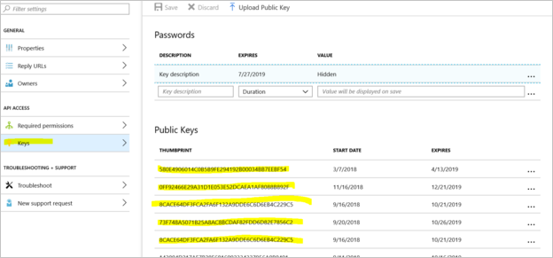

#### Step 3

From the DPM/MABS server you're trying to configure offline backup, do the following actions:

1. Open the **Manage computer certificate application** > **Personal** tab and look for the certificate with the name `CB_AzureADCertforOfflineSeeding_<ResourceId>`.
2. Select the certificate above, right-click **All Tasks** and **Export** without private key, in the .cer format.
3. Go to the Azure Offline Backup application mentioned in **point 2**. In the **Settings** > **Keys** > **Upload Public Key,** upload the certificate exported in the step above.

   

4. In the server, open the registry by typing **regedit** in the **Run** window.
5. Go to the registry *Computer\HKEY\_LOCAL\_MACHINE\SOFTWARE\Microsoft\Windows Azure Backup\Config\CloudBackupProvider*. Right-click **CloudBackupProvider** and add a new string value with name `AzureADAppCertThumbprint_<Azure User Id>`.

    >[!NOTE]
    > To get the Azure user ID, perform one of these actions:
    >
    >- From the Azure-connected PowerShell, run the `Get-AzureRmADUser -UserPrincipalName "Account Holder's email as defined in the portal"` command.
    > - Navigate to the registry path `Computer\HKEY_LOCAL_MACHINE\SOFTWARE\Microsoft\Windows Azure Backup\DbgSettings\OnlineBackup` with the name *CurrentUserId*.

6. Right-click the string added in the step above and select **Modify**. In the value, provide the thumbprint of the certificate you exported in **point 2** and select **OK**.
7. To get the value of thumbprint, double-click on the certificate, then select **Details**  and scroll-down until you see the thumbprint field. Select **Thumbprint** and copy the value.

   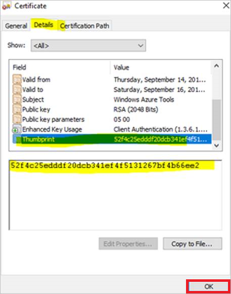

## Next steps

- [Offline seeding using own disk (using Azure Import/Export service)](backup-azure-backup-server-import-export.md)
