# Azure Backup offline backup by using Azure Data Box

This article describes how you can use Azure Data Box to seed large initial backup data offline from the MARS Agent to a Recovery Services vault.

You can use [Azure Data Box](../databox/data-box-overview.md) to seed your large initial Microsoft Azure Recovery Services (MARS) backups offline (without using network) to a Recovery Services vault. This process saves time and network bandwidth that would otherwise be consumed moving large amounts of backup data online over a high-latency network.  Offline backup based on Azure Data Box provides two distinct advantages over [offline backup based on the Azure Import/Export service](./backup-azure-backup-import-export.md):

- There's no need to procure your own Azure-compatible disks and connectors. Azure Data Box ships the disks associated with the selected [Data Box SKU](https://azure.microsoft.com/services/databox/data/).
- Azure Backup (MARS Agent) can directly write backup data onto the supported SKUs of Azure Data Box. This capability eliminates the need for you to provision a staging location for your initial backup data. You also don't need utilities to format and copy that data onto the disks.

## Support matrix

This section explains the supported scenarios.

### Supported platforms

The process to seed data from the MARS Agent by using Azure Data Box is supported on the following Windows SKUs.

| **OS**                                 | **SKU**                                                      |
| -------------------------------------- | ------------------------------------------------------------ |
| **Workstation**                        |                                                              |
| Windows 10 64 bit                     | Enterprise, Pro, Home                                       |
| Windows 8.1 64 bit                    | Enterprise, Pro                                             |
| Windows 8 64 bit                      | Enterprise, Pro                                             |
| Windows 7 64 bit                      | Ultimate, Enterprise, Professional, Home Premium, Home Basic, Starter |
| **Server**                             |                                                              |
| Windows Server 2022 64 bit            | Standard, Datacenter, Essentials                            |
| Windows Server 2019 64 bit            | Standard, Datacenter, Essentials                            |
| Windows Server 2016 64 bit            | Standard, Datacenter, Essentials                            |
| Windows Server 2012 R2 64 bit         | Standard, Datacenter, Foundation                            |
| Windows Server 2012 64 bit            | Datacenter, Foundation, Standard                            |
| Windows Storage Server 2016 64 bit    | Standard, Workgroup                                         |
| Windows Storage Server 2012 R2 64 bit | Standard, Workgroup, Essential                              |
| Windows Storage Server 2012 64 bit    | Standard, Workgroup                                         |
| Windows Server 2008 R2 SP1 64 bit     | Standard, Enterprise, Datacenter, Foundation                |
| Windows Server 2008 SP2 64 bit        | Standard, Enterprise, Datacenter                            |

### Backup data size and supported Data Box SKUs

| Backup data size (post-compression by MARS)* per server | Supported Azure Data Box SKU                                      |
| ------------------------------------------------------------ | ------------------------------------------------------------ |
| <=7.2 TB                                                    | [Azure Data Box disk](../databox/data-box-disk-overview.md) |
| >7.2 TB and <=80 TB**                                      | [Azure Data Box (100 TB)](../databox/data-box-overview.md) |

*Typical compression rates vary between 10% and 20%. <br>
**If you expect to have more than 80 TB of initial backup data for a single MARS server, contact [AskAzureBackupTeam@microsoft.com](mailto:AskAzureBackupTeam@microsoft.com).

>[!IMPORTANT]
>Initial backup data from a single server must be contained within a single Azure Data Box instance or Azure Data Box disk and can't be shared between multiple devices of the same or different SKUs. But an Azure Data Box device can contain initial backups from multiple servers.

## Prerequisites

### Azure subscription and required permissions

- The process requires an Azure subscription.
- The process requires that the user designated to perform the offline backup policy is an owner of the Azure subscription.
- The Data Box job and the Recovery Services vault (to which the data needs to be seeded) are required to be in the same subscriptions.
- We recommend that the target storage account associated with the Azure Data Box job and the Recovery Services vault are in the same region. However, this isn't necessary.

### Get Azure PowerShell 3.7.0

*This is the most important prerequisite for the process*. Before you install Azure PowerShell, version 3.7.0, perform the following checks.

#### Step 1: Check the PowerShell version

1. Open Windows PowerShell, and run the following command:

    ```powershell
    Get-Module -ListAvailable AzureRM*
    ```

1. If the output displays a version higher than 3.7.0, do "Step 2." Otherwise, skip to "Step 3."

#### Step 2: Uninstall the PowerShell version

Uninstall the current version of PowerShell.

1. Remove the dependent modules by running the following command in PowerShell:

    ```powershell
    foreach ($module in (Get-Module -ListAvailable AzureRM*).Name |Get-Unique)  { write-host "Removing Module $module" Uninstall-module $module }
    ```

2. To ensure the successful deletion of all the dependent modules, run the following command:

    ```powershell
    Get-Module -ListAvailable AzureRM*
    ```

#### Step 3: Install PowerShell version 3.7.0

After you've verified that no AzureRM modules are present, install version 3.7.0 by using one of the following methods:

- From GitHub, use [this link](https://github.com/Azure/azure-powershell/releases/tag/v3.7.0-March2017).

Or you can:

- Run the following command in the PowerShell window:

    ```powershell
    Install-Module -Name AzureRM -RequiredVersion 3.7.0
    ```

Azure PowerShell could have also been installed by using an MSI file. To remove it, uninstall it by using the **Uninstall programs** option in Control Panel.

### Order and receive the Data Box device

The offline backup process using MARS and Azure Data Box requires the Data Box devices to be in a Delivered state before you trigger offline backup by using the MARS Agent. To order the most suitable SKU for your requirement, see [Backup data size and supported Data Box SKUs](#backup-data-size-and-supported-data-box-skus). Follow the steps in [Tutorial: Order an Azure Data Box disk](../databox/data-box-disk-deploy-ordered.md) to order and receive your Data Box devices.

> [!IMPORTANT]
> Don't select *BlobStorage* for the **Account kind**. The MARS Agent requires an account that supports page blobs, which isn't supported when *BlobStorage* is selected. Select **Storage V2 (general purpose v2)** as the **Account kind** when you create the target storage account for your Azure Data Box job.

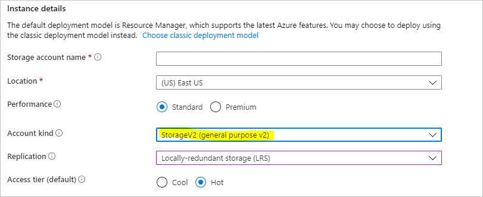

## Install and set up the MARS Agent

1. Make sure you uninstall any previous installations of the MARS Agent.
1. Download the latest MARS Agent from [this website](https://aka.ms/azurebackup_agent).
1. Run *MARSAgentInstaller.exe*, and do *only* the steps to [install and register the agent](./install-mars-agent.md#install-and-register-the-agent) to the Recovery Services vault where you want your backups to be stored.

   > [!NOTE]
   > The Recovery Services vault must be in the same subscription as the Azure Data Box job.

   After the agent is registered to the Recovery Services vault, follow the steps in the next sections.

## Set up Azure Data Box devices

Depending on the Azure Data Box SKU you ordered, do the steps covered in the appropriate sections that follow. The steps show you how to set up and prepare the Data Box devices for the MARS Agent to identify and transfer the initial backup data.

### Set up Azure Data Box disks

If you ordered one or more Azure Data Box disks (up to 8 TB each), follow the steps mentioned here to [unpack, connect, and unlock your Data Box disk](../databox/data-box-disk-deploy-set-up.md).

>[!NOTE]
>It's possible that the server with the MARS Agent doesn't have a USB port. In that situation, you can connect your Azure Data Box disk to another server or client and expose the root of the device as a network share.

### Set up Azure Data Box

If you ordered an Azure Data Box instance (up to 100 TB), follow the steps here [to set up your Data Box instance](../databox/data-box-deploy-set-up.md).

#### Mount your Azure Data Box instance as a Local System

The MARS Agent operates in the Local System context, so it requires the same level of privilege to be provided to the mount path where the Azure Data Box instance is connected.

To ensure you can mount your Data Box device as a Local System by using the NFS protocol:

1. Enable the client for the NFS feature on the Windows server that has the MARS Agent installed. Specify the alternate source *WIM:D:\Sources\Install.wim:4*.
1. Download PsExec from the [Sysinternals](/sysinternals/downloads/psexec) page to the server with the MARS Agent installed.
1. Open an elevated command prompt, and run the following command with the directory that contains *PSExec.exe* as the current directory.

    ```cmd
    psexec.exe  -s  -i  cmd.exe
    ```

   The command window that opens because of the previous command is in the Local System context. Use this command window to execute the steps to mount the Azure page blob share as a network drive on your Windows server.
1. Follow the steps in [Connect to Data Box](../databox/data-box-deploy-copy-data-via-nfs.md#connect-to-data-box) to connect your server with the MARS Agent to the Data Box device via NFS. Run the following command on the Local System command prompt to mount the Azure page blobs share.

    ```cmd
    mount -o nolock \\<DeviceIPAddress>\<StorageAccountName_PageBlob X:  
    ```

   After the share is mounted, check to see if you can access X: from your server. If you can, continue with the next section of this article.

## Transfer initial backup data to Azure Data Box devices

1. Open the **Microsoft Azure Backup** application on your server.
1. On the **Actions** pane, select **Schedule Backup**.

    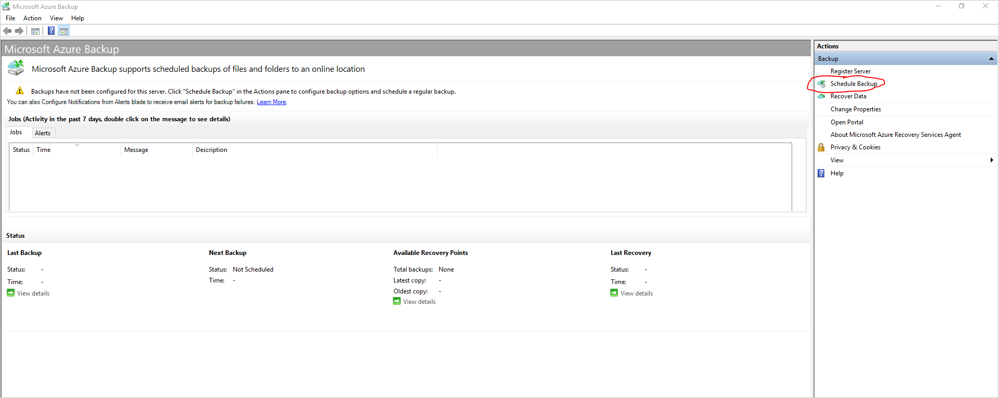

1. Follow the steps in the **Schedule Backup Wizard**.

1. Add items by selecting the **Add Items** button. Keep the total size of the items within the [size limits supported by the Azure Data Box SKU](#backup-data-size-and-supported-data-box-skus) that you ordered and received.

    

1. Select the appropriate backup schedule and retention policy for **Files and Folders** and **System State**. System state is applicable only for Windows Servers and not for Windows clients.
1. On the **Choose Initial Backup Type (Files and Folders)** page of the wizard, select the option **Transfer using Microsoft Azure Data Box disks** and select **Next**.

    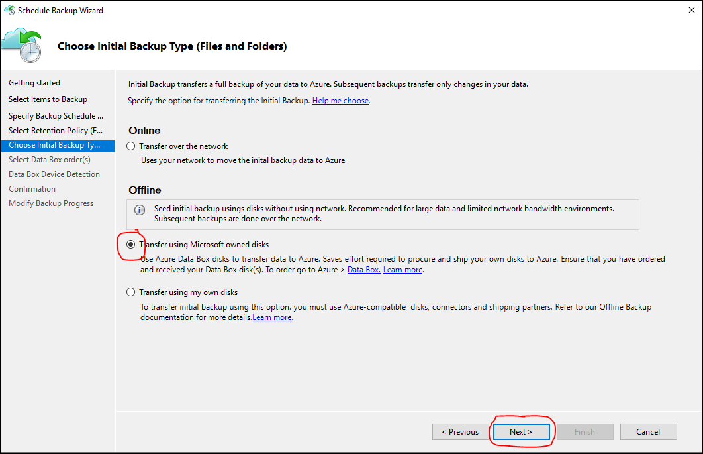

1. Sign in to Azure when prompted by using the user credentials that have Owner access on the Azure subscription. After you succeed in doing so, you should see a page that resembles this one.

    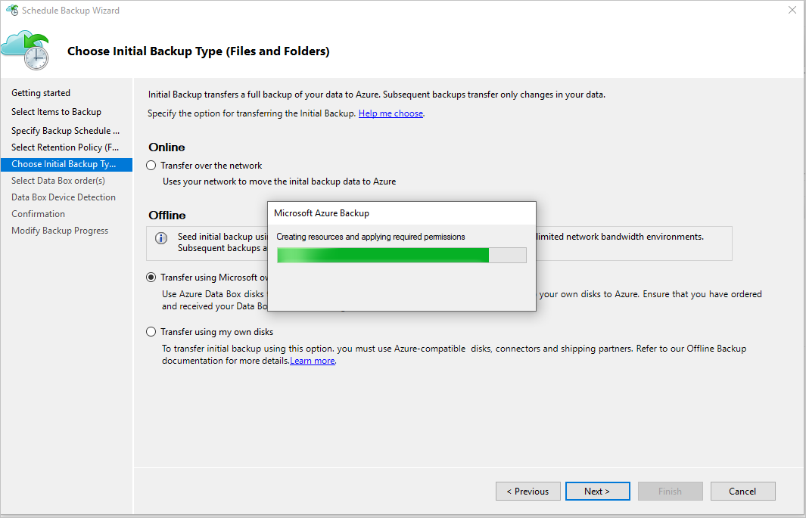

   The MARS Agent then fetches the Data Box jobs in the subscription that are in the Delivered state.

    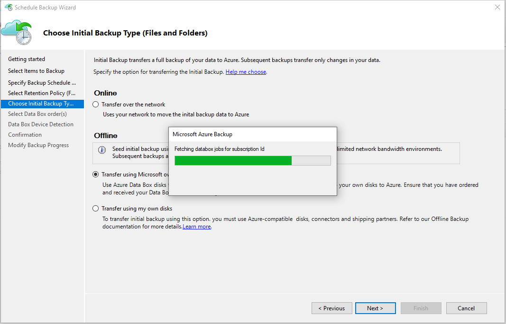

1. Select the correct Data Box order for which you've unpacked, connected, and unlocked your Data Box disk. Select **Next**.

    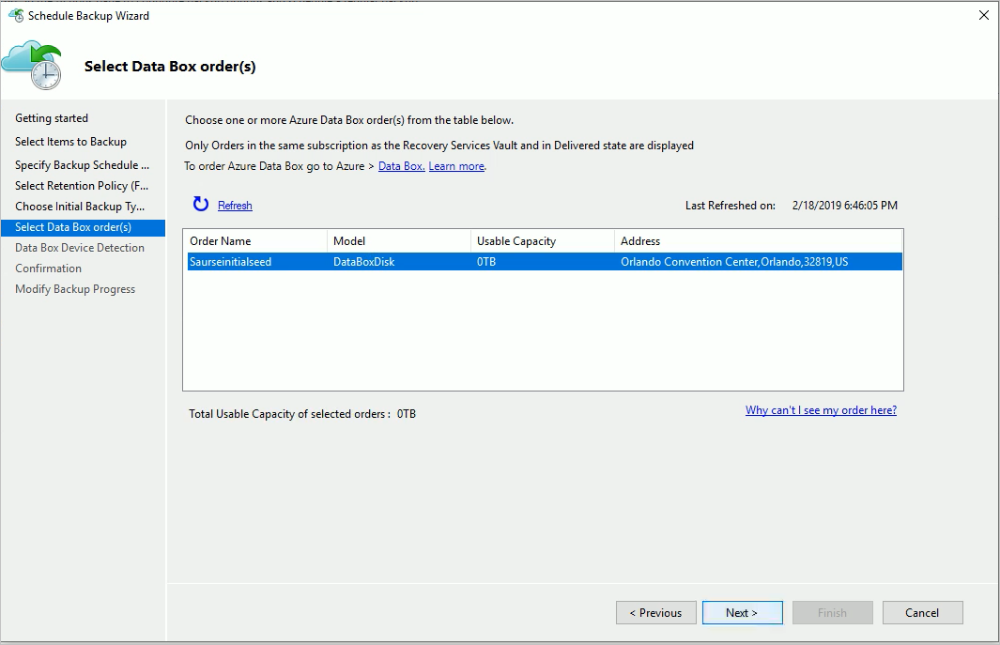

1. Select **Detect Device** on the **Data Box Device Detection** page. This action makes the MARS Agent scan for locally attached Azure Data Box disks and detect them.

    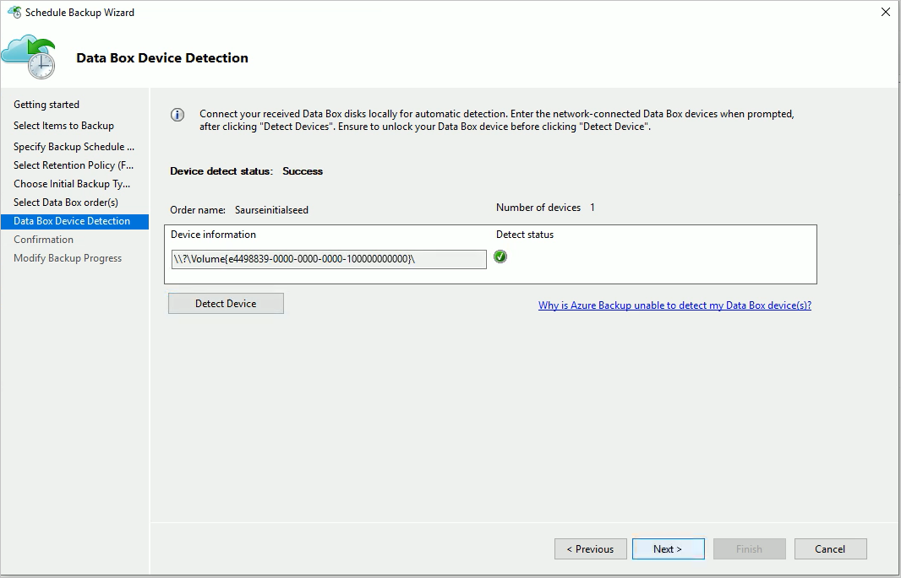

    If you connected the Azure Data Box instance as a network share (because of unavailability of USB ports or because you ordered and mounted the 100-TB Data Box device), detection fails at first. You're given the option to enter the network path to the Data Box device.

    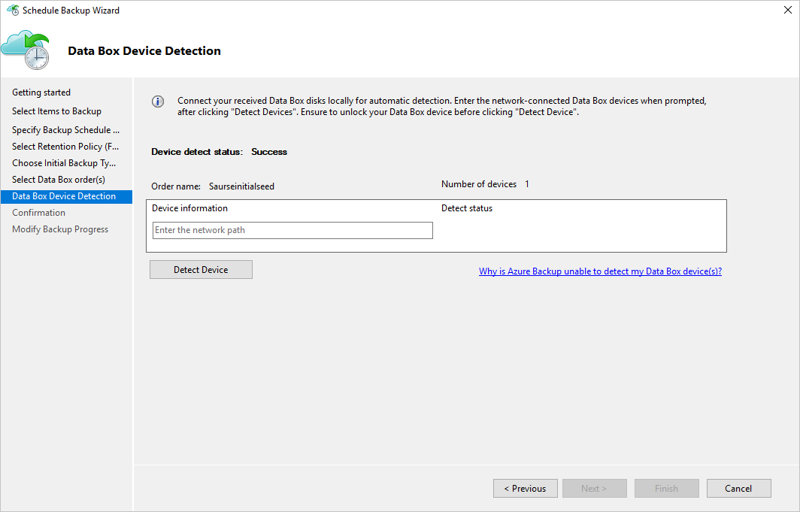

    >[!IMPORTANT]
    > Provide the network path to the root directory of the Azure Data Box disk. This directory must contain a directory by the name *PageBlob*.
    >
    >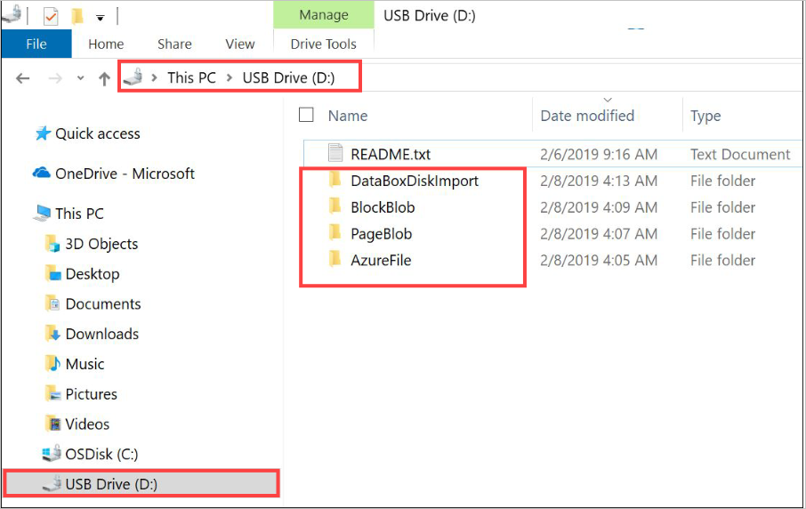
    >
    >For example, if the path of the disk is `\\mydomain\myserver\disk1\` and *disk1* contains a directory called *PageBlob*, the path you enter on the MARS Agent wizard page is `\\mydomain\myserver\disk1\`.
    >
    >If you [set up an Azure Data Box 100-TB device](#set-up-azure-data-box-devices), enter `\\<DeviceIPAddress>\<StorageAccountName>_PageBlob` as the network path to the device.

1. Select **Next**, and select **Finish** on the next page to save the backup and retention policy with the configuration of offline backup by using Azure Data Box.

   The following page confirms that the policy is saved successfully.

    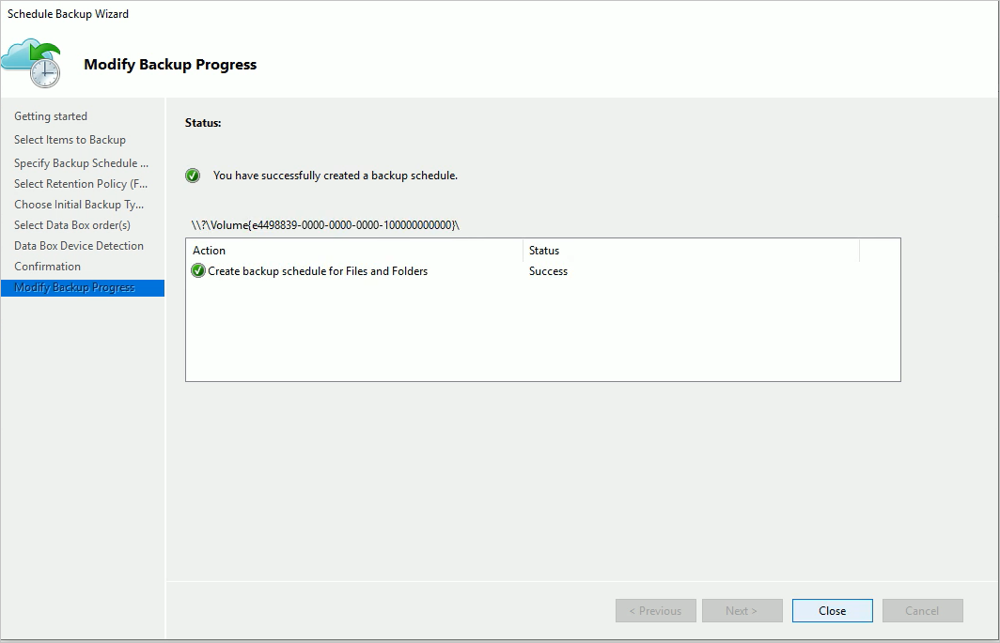

1. Select **Close** on the previous page.

1. Select **Back Up Now** in the **Actions** pane of the MARS Agent console. Select **Back Up** on the wizard page.

    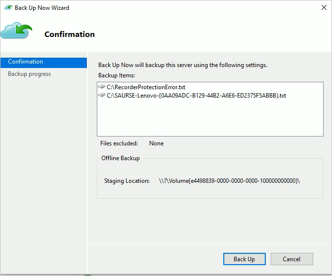

The MARS Agent starts backing up the data you selected to the Azure Data Box device. This process might take from several hours to a few days. The amount of time depends on the number of files and connection speed between the server with the MARS Agent and the Azure Data Box disk.

After the backup of the data is finished, you'll see a page on the MARS Agent that resembles this one.

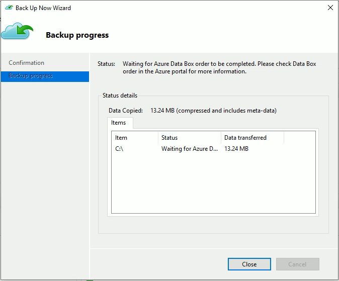

## Post-backup steps

This section explains the steps to take after the backup of the data to the Azure Data Box Disk is successful.

- Follow the steps in this article to [ship the Azure Data Box disk to Azure](../databox/data-box-disk-deploy-picked-up.md). If you used an Azure Data Box 100-TB device, follow these steps to [ship the Azure Data Box device to Azure](../databox/data-box-deploy-picked-up.md).

- [Monitor the Data Box job](../databox/data-box-disk-deploy-upload-verify.md) in the Azure portal. After the Azure Data Box job is finished, the MARS Agent automatically moves the data from the storage account to the Recovery Services vault at the time of the next scheduled backup. It then marks the backup job as *Job Completed* if a recovery point is successfully created.

    >[!NOTE]
    >The MARS Agent triggers backups at the times scheduled during policy creation. These jobs flag "Waiting for Azure Data Box job to be completed" until the time the job is finished.

- After the MARS Agent successfully creates a recovery point that corresponds to the initial backup, you can delete the storage account or specific contents associated with the Azure Data Box job.

## Troubleshooting

The Microsoft Azure Recovery Services (MARS) Agent creates a Microsoft Entra application for you in your tenant. This application requires a certificate for authentication that's created and uploaded when you configure an offline seeding policy. We use Azure PowerShell to create and upload the certificate to the Microsoft Entra application.

### Problem

When you configure offline backup, you might face a problem because of a bug in the Azure PowerShell cmdlet. You might be unable to add multiple certificates to the same Microsoft Entra application created by the MAB Agent. This problem will affect you if you configured an offline seeding policy for the same or a different server.

### Verify if the problem is caused by this specific root cause

To see if your problem is the same as the one previously described, do one of the following steps.

#### Step 1 of verification

Check to see if the following error message appears in the MAB console when you configured offline backup.

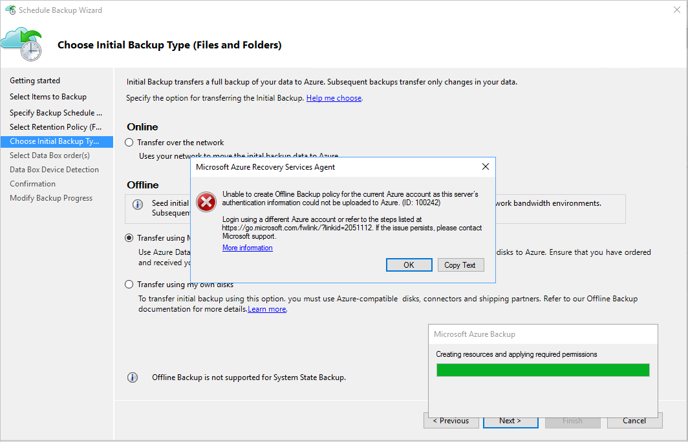

#### Step 2 of verification

1. Open the **Temp** folder in the installation path. The default temp folder path is *C:\Program Files\Microsoft Azure Recovery Services Agent\Temp*. Look for the *CBUICurr* file, and open the file.

1. In the *CBUICurr* file, scroll to the last line and check to see if the problem is the same as the one in this error message: `Unable to create an Azure AD application credential in customer's account. Exception: Update to existing credential with KeyId <some guid> is not allowed`.

### Workaround

As a workaround to resolve this problem, do the following steps and retry the policy configuration.

#### Step 1 of workaround

Sign in to PowerShell that appears on the MAB UI by using a different account with admin access on the subscription that will have the Data Box job created.

#### Step 2 of workaround

If no other server has offline seeding configured and no other server is dependent on the `AzureOfflineBackup_<Azure User Id>` application, delete this application. Select **Azure portal** > **Microsoft Entra ID** > **App registrations**.

>[!NOTE]
> Check to see if the `AzureOfflineBackup_<Azure User Id>` application doesn't have any other offline seeding configured and also if no other server is dependent on this application. Go to **Settings** > **Keys** under the **Public Keys** section. It shouldn't have any other public keys added. See the following screenshot for reference.
>
>

#### Step 3

From the server you're trying to configure for offline backup, perform the following actions.

1. Go to the **Manage computer certificate application** > **Personal** tab, and look for the certificate with the name `CB_AzureADCertforOfflineSeeding_<Timestamp>`.

2. Select the certificate, right-click **All Tasks**, and select **Export** without a private key in the .cer format.

3. Go to the Azure offline backup application mentioned in step 2. Select **Settings** > **Keys** > **Upload Public Key**. Upload the certificate you exported in the previous step.

    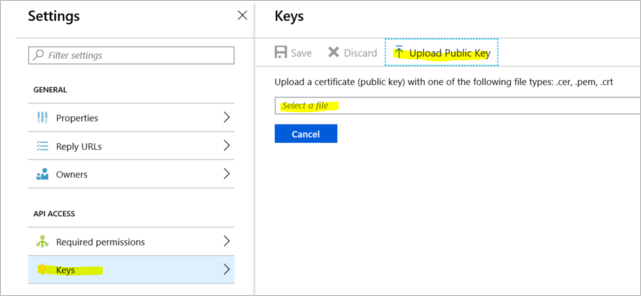

4. In the server, open the registry by entering **regedit** in the run window.

5. Go to the registry *Computer\HKEY_LOCAL_MACHINE\SOFTWARE\Microsoft\Windows Azure Backup\Config\CloudBackupProvider.* Right-click **CloudBackupProvider**, and add a new string value with the name `AzureADAppCertThumbprint_<Azure User Id>`.

    >[!NOTE]
    > To get the Azure user ID, perform one of these actions:
    >
    >- From the Azure-connected PowerShell, run the `Get-AzureRmADUser -UserPrincipalName "Account Holder's email as defined in the portal"` command.
    > - Go to the registry path `Computer\HKEY_LOCAL_MACHINE\SOFTWARE\Microsoft\Windows Azure Backup\DbgSettings\OnlineBackup` with the name *CurrentUserId*.

6. Right-click the string added in the previous step, and select **Modify**. In the value, provide the thumbprint of the certificate you exported in step 2. Select **OK**.

7. To get the value of the thumbprint, double-click the certificate. Select the **Details** tab, and scroll down until you see the thumbprint field. Select **Thumbprint**, and copy the value.

    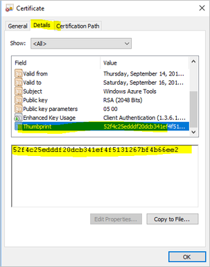

## Questions

For any questions or clarifications about any problems you faced, contact [AskAzureBackupTeam@microsoft.com](mailto:AskAzureBackupTeam@microsoft.com).
