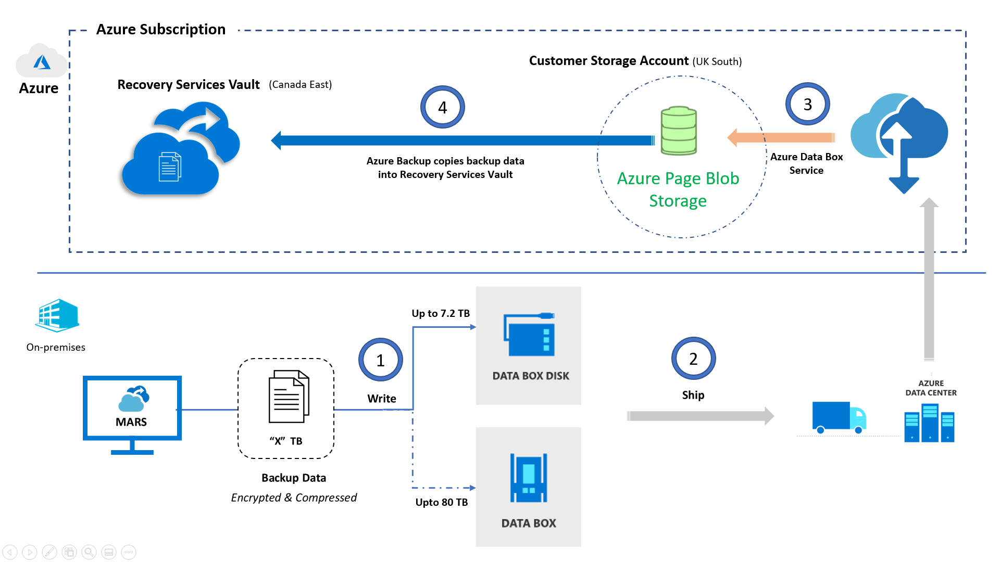
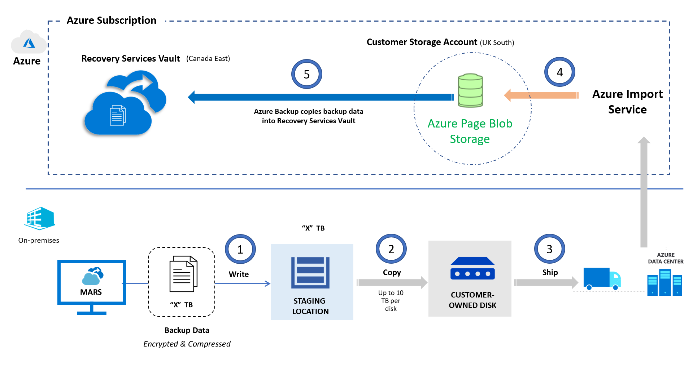

# Overview of offline backup

This article gives an overview of offline backup.

Initial full backups to Azure typically transfer large amounts of data online and require more network bandwidth when compared to subsequent backups that transfer only incremental changes. Remote offices or datacenters in certain geographies don't always have sufficient network bandwidth. For this reason, these initial backups take several days. During this time, the backups continuously use the same network that was provisioned for applications running in the on-premises datacenter.

Azure Backup supports offline backup, which transfers initial backup data offline, without the use of network bandwidth. It provides a mechanism to copy backup data onto physical storage devices. The devices are then shipped to a nearby Azure datacenter and uploaded onto a Recovery Services vault. This process ensures robust transfer of backup data without using any network bandwidth.

## Offline backup options

Offline backup is offered in two modes based on the ownership of the storage devices:

- Offline backup based on Azure Data Box (preview)
- Offline backup based on the Azure Import/Export service

## Offline backup based on Azure Data Box (preview)

This mode is currently supported with the Microsoft Azure Recovery Services (MARS) Agent, in preview. This option takes advantage of [Azure Data Box](https://azure.microsoft.com/services/databox/) to ship Microsoft-proprietary, secure, and tamper-resistant transfer appliances with USB connectors to your datacenter or remote office. Backup data is directly written onto these devices. This option saves the effort required to procure your own Azure-compatible disks and connectors or to provision temporary storage as a staging location. Microsoft also handles the end-to-end transfer logistics, which you can track through the Azure portal.

An architecture that describes the movement of backup data with this option is shown here.

Here's a summary of the architecture:

1. Azure Backup directly copies backup data to these preconfigured devices.
2. You can then ship these devices back to an Azure datacenter.
3. Azure Data Box copies the data onto a customer-owned storage account.
4. Azure Backup automatically copies backup data from the storage account to the designated Recovery Services vault. Incremental online backups are scheduled.

To use offline backup based on Azure Data Box, see [Offline backup using Azure Data Box](offline-backup-azure-data-box.md).

## Offline backup based on the Azure Import/Export service

This option is supported by Microsoft Azure Backup Server (MABS), System Center Data Protection Manager (DPM) DPM-A, and the MARS Agent. It uses the [Azure Import/Export service](https://docs.microsoft.com/azure/storage/common/storage-import-export-service). You can transfer initial backup data to Azure by using your own Azure-compatible disks and connectors. This approach requires that you provision temporary storage known as the staging location and use prebuilt utilities to format and copy the backup data onto customer-owned disks.

An architecture that describes the movement of backup data with this option is shown here.

Here's a summary of the architecture:

1. Instead of sending the backup data over the network, Azure Backup writes the backup data to a staging location.
2. The data in the staging location is written to one or more SATA disks by using a custom utility.
3. As part of the preparatory work, the utility creates an Azure import job. The SATA drives are shipped to the nearest Azure datacenter and reference the import job to connect the activities.
4. At the Azure datacenter, the data on the disks is copied to an Azure storage account.
5. Azure Backup copies the backup data from the storage account to the Recovery Services vault. Incremental backups are scheduled.

To use offline backup based on the Azure Import/Export service with the MARS Agent, see [Offline backup workflow in Azure Backup](https://docs.microsoft.com/azure/backup/backup-azure-backup-import-export).

To use the same along with MABS or DPM-A, see [Offline backup workflow for DPM and Azure Backup Server](https://docs.microsoft.com/azure/backup/backup-azure-backup-server-import-export).

## Offline backup support summary

The following table compares the two available options so that you can make the appropriate choices based on your scenario.

| **Consideration**                                            | **Offline backup based on Azure Data Box**                     | **Offline backup based on the Azure Import/Export service**                |
| ------------------------------------------------------------ | ------------------------------------------------------------ | ------------------------------------------------------------ |
| Azure Backup deployment models                              | MARS Agent (preview)                                              | MARS Agent, MABS, DPM-A                                           |
| Maximum backup data per server (MARS) or per protection group (MABS, DPM-A) | [Azure Data Box disk](https://docs.microsoft.com/azure/databox/data-box-disk-overview) - 7.2 TB   [Azure Data Box](https://docs.microsoft.com/azure/databox/data-box-overview) - 80 TB       | 80 TB (up to 10 disks of 8 TB each)                          |
| Security (data, device, and service)                           | [Data](https://docs.microsoft.com/azure/databox/data-box-security#data-box-data-protection) - AES 256-bit encrypted   [Device](https://docs.microsoft.com/azure/databox/data-box-security#data-box-device-protection) - Rugged case, proprietary, credential-based interface to copy data   [Service](https://docs.microsoft.com/azure/databox/data-box-security#data-box-service-protection) - Protected by Azure security features | Data - BitLocker encrypted                                 |
| Temporary staging location provisioning                     | Not required                                                | More than or equal to the estimated backup data size        |
| Supported regions                                           | [Azure Data Box disk regions](https://docs.microsoft.com/azure/databox/data-box-disk-overview#region-availability)   [Azure Data Box regions](https://docs.microsoft.com/azure/databox/data-box-disk-overview#region-availability) | [Azure Import/Export service regions](https://docs.microsoft.com/azure/storage/common/storage-import-export-service#region-availability) |
| Cross-country shipping                                     | Not supported       Source address and destination Azure datacenter must be in the same country/region* | Supported                                                    |
| Transfer logistics (delivery, transport, pickup)           | Fully Microsoft managed                                     | Customer managed                                            |
| Pricing                                                      | [Azure Data Box pricing](https://azure.microsoft.com/pricing/details/databox/)   [Azure Data Box disk pricing](https://azure.microsoft.com/pricing/details/databox/disk/) | [Azure Import/Export service pricing](https://azure.microsoft.com/pricing/details/storage-import-export/) |

*If your country/region doesn't have an Azure datacenter, you need to ship your disks to an Azure datacenter in another country/region.

## Next steps

- [Azure Backup offline backup by using Azure Data Box](offline-backup-azure-data-box.md#backup-data-size-and-supported-data-box-skus)
- [Offline backup workflow in Azure Backup](backup-azure-backup-import-export.md)
- [Offline backup workflow for DPM and Azure Backup Server](backup-azure-backup-server-import-export.md)
