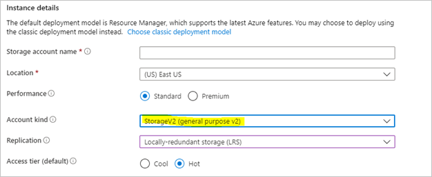
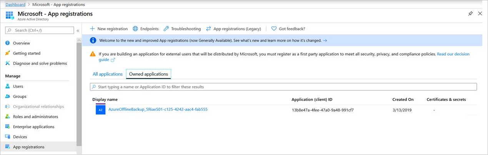
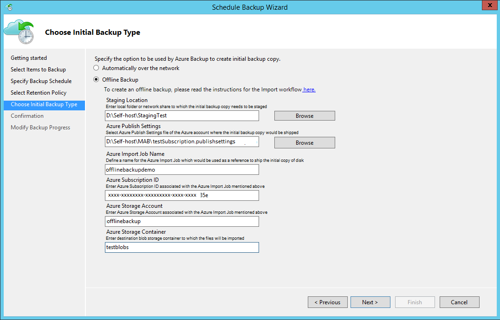
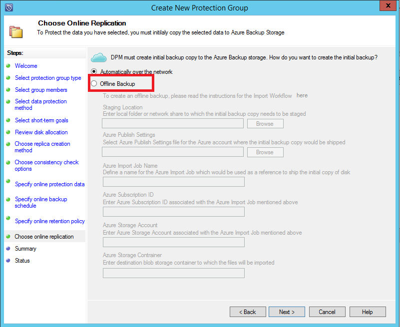
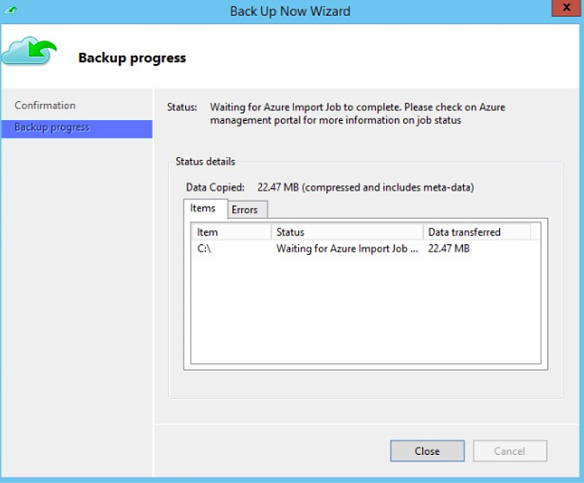
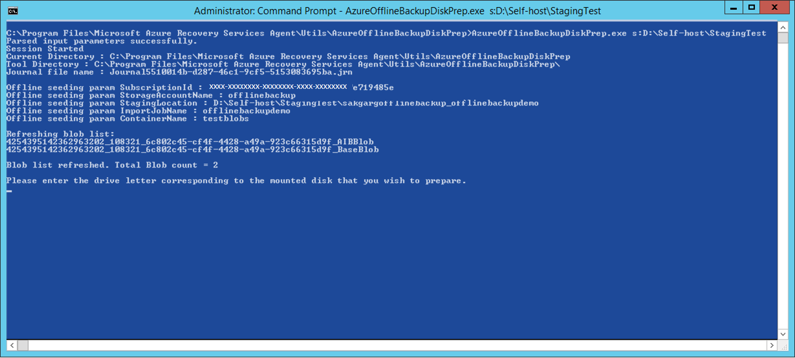
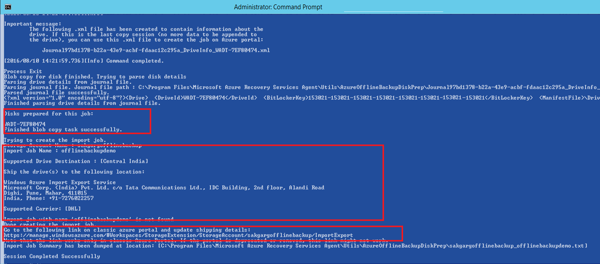
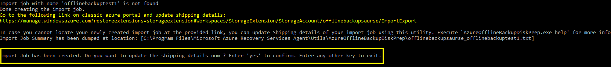
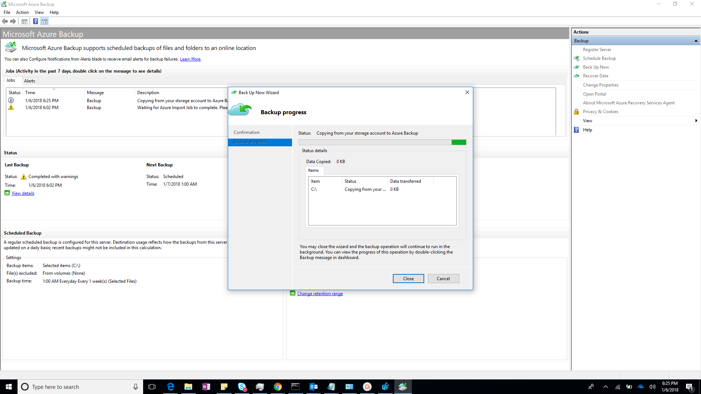

# Offline backup workflow for DPM and Azure Backup Server (previous versions)

 This article describes about offline backup and how to finish this workflow for System Center Data Protection Manager (DPM) and Microsoft Azure Backup Server (MABS).

>[!IMPORTANT]
>These steps are applicable for DPM 2019 RTM and earlier versions and MABS v3 RTM and earlier versions.

Azure Backup has several built-in efficiencies that save network and storage costs during the initial full backups of data to Azure. Initial full backups typically transfer large amounts of data and require more network bandwidth when compared to subsequent backups that transfer only the deltas/incrementals. Azure Backup compresses the initial backups. Through the process of offline seeding, Azure Backup can use disks to upload the compressed initial backup data offline to Azure.

The offline-seeding process of Azure Backup is tightly integrated with the [Azure Import/Export service](../import-export/storage-import-export-service.md). You can use this service to transfer data to Azure by using disks. If you have terabytes (TBs) of initial backup data that need to be transferred over a high-latency and low-bandwidth network, you can use the offline-seeding workflow to ship the initial backup copy on one or more hard drives to an Azure datacenter.

> [!NOTE]
> The process of offline backup for the Microsoft Azure Recovery Services (MARS) Agent is distinct from DPM and MABS. For information on using offline backup with the MARS Agent, see [Offline backup workflow in Azure Backup](backup-azure-backup-import-export.md). Offline backup isn't supported for system state backups done by using the Azure Backup Agent.
>

## Offline backup process

With the offline-seeding capability of Azure Backup and the Azure Import/Export service, it's simple to upload the data offline to Azure by using disks. The offline backup process involves the following steps:

> [!div class="checklist"]
>
> * The backup data is written to a staging location instead of being sent over the network.
> * The data on the staging location is then written to one or more SATA disks by using the *AzureOfflineBackupDiskPrep* utility.
> * An Azure import job is automatically created by the utility.
> * The SATA drives are then sent to the nearest Azure datacenter.
> * After the upload of the backup data to Azure is finished, Azure Backup copies the backup data to the backup vault and the incremental backups are scheduled.

## Supported configurations

Offline backup is supported for all deployment models of Azure Backup that back up data from on-premises to the Microsoft cloud. These models include:

- Backup of files and folders with the MARS Agent or the Azure Backup Agent.
- Backup of all workloads and files with DPM.
- Backup of all workloads and files with MABS.

>[!NOTE]
>Azure CSP subscriptions aren't supported for use with offline seeding for DPM 2019 RTM and earlier versions, and MABS v3 RTM and earlier versions. Online backups over the network are still supported.

## Prerequisites

Ensure that the following prerequisites are met before you start the offline backup workflow:

* A [Recovery Services vault](backup-azure-recovery-services-vault-overview.md) has been created. To create one, follow the steps in [Create a Recovery Services vault](tutorial-backup-windows-server-to-azure.md#create-a-recovery-services-vault)
* An Azure Backup Agent or MABS or DPM has been installed on either Windows Server or a Windows client, as applicable, and the computer is registered with the Recovery Services vault. Ensure that only the [latest version of Azure Backup](https://go.microsoft.com/fwlink/?linkid=229525) is used.
* [Download the Azure publish settings file](https://portal.azure.com/#blade/Microsoft_Azure_ClassicResources/PublishingProfileBlade) on the computer from which you plan to back up your data. The subscription from which you download the publish settings file can be different from the subscription that contains the Recovery Services vault. If your subscription is on sovereign Azure clouds, then use the following links as appropriate to download the Azure publish settings file.

    | Sovereign cloud region | Azure publish settings file link |
    | --- | --- |
    | United States | [Link](https://portal.azure.us#blade/Microsoft_Azure_ClassicResources/PublishingProfileBlade) |
    | China | [Link](https://portal.azure.cn/#blade/Microsoft_Azure_ClassicResources/PublishingProfileBlade) |

* An Azure storage account with the Resource Manager deployment model has been created in the subscription from which you downloaded the publish settings file. In the storage account, create a new blob container, which will be used as the destination.

  

* A staging location, which might be a network share or any additional drive on the computer, internal or external, with enough disk space to hold your initial copy, is created. For example, if you want to back up a 500-GB file server, ensure that the staging area is at least 500 GB. (A smaller amount is used due to compression.)
* For disks sent to Azure, ensure that only 2.5-inch SSD or 2.5-inch or 3.5-inch SATA II/III internal hard drives are used. You can use hard drives up to 10 TB. Check the [Azure Import/Export service documentation](../import-export/storage-import-export-requirements.md#supported-hardware) for the latest set of drives that the service supports.
* The SATA drives must be connected to a computer (referred to as a *copy computer*) from where the copy of backup data from the staging location to the SATA drives is done. Ensure that BitLocker is enabled on the copy computer.

## Prepare the server for the offline backup process

>[!NOTE]
> If you can't find the listed utilities, such as *AzureOfflineBackupCertGen.exe*, in your installation of the MARS Agent, write to AskAzureBackupTeam@microsoft.com to get access to them.

* Open an elevated command prompt on the server, and run the following command:

    ```cmd
    AzureOfflineBackupCertGen.exe CreateNewApplication SubscriptionId:<Subs ID>
    ```

    The tool creates an Azure Offline Backup Active Directory Application if one doesn't exist.

    If an application already exists, this executable asks you to manually upload the certificate to the application in the tenant. Follow the steps in [this section](#upload-an-offline-backup-certificate-manually) to upload the certificate manually to the application.

* The *AzureOfflineBackupCertGen.exe* tool generates an *OfflineApplicationParams.xml* file. Copy this file to the server with MABS or DPM.
* Install the [latest MARS Agent](https://aka.ms/azurebackup_agent) on the DPM instance or the Azure Backup server.
* Register the server to Azure.
* Run the following command:

    ```cmd
    AzureOfflineBackupCertGen.exe AddRegistryEntries SubscriptionId:<subscriptionid> xmlfilepath:<path of the OfflineApplicationParams.xml file>  storageaccountname:<storageaccountname to be used for offline backup>
    ```

* The previous command creates the file `C:\Program Files\Microsoft Azure Recovery Services Agent\Scratch\MicrosoftBackupProvider\OfflineApplicationParams_<Storageaccountname>.xml`.

## Upload an offline backup certificate manually

To manually upload the offline backup certificate to a previously created Microsoft Entra application meant for offline backup, follow these steps:

1. Sign in to the Azure portal.
1. Go to **Microsoft Entra ID** > **App registrations**.
1. On the **Owned applications** tab, locate an application with the display name format `AzureOfflineBackup _<Azure User Id`.

    

1. Select the application. Under **Manage** on the left pane, go to **Certificates & secrets**.
1. Check for pre-existing certificates or public keys. If there's none, you can safely delete the application by selecting the **Delete** button on the application's **Overview** page. Then you can retry the steps to [prepare the server for the offline backup](#prepare-the-server-for-the-offline-backup-process) process, and skip the following steps. Otherwise, continue to follow these steps from the DPM instance or Azure Backup server where you want to configure offline backup.
1. From **Start** – **Run**, type *Certlm.msc*. In the **Certificates - Local Computer** window, select the **Certificates – Local Computer** > **Personal** tab. Look for the certificate with the name `CB_AzureADCertforOfflineSeeding_<ResourceId>`.
1. Select the certificate, right-click **All Tasks**, and then select **Export**, without a private key, in the .cer format.
1. Go to the Azure offline backup application in the Azure portal.
1. Select **Manage** > **Certificates & secrets** > **Upload certificate**. Upload the certificate exported in the previous step.

    

1. On the server, open the registry by entering **regedit** in the run window.
1. Go to the registry entry *Computer\HKEY_LOCAL_MACHINE\SOFTWARE\Microsoft\Windows Azure Backup\Config\CloudBackupProvider*.
1. Right-click **CloudBackupProvider**, and add a new string value with the name `AzureADAppCertThumbprint_<Azure User Id>`.

    >[!NOTE]
    > To find the Azure user ID, do one of the following steps:
    >
    >* From the Azure-connected PowerShell, run the `Get-AzureRmADUser -UserPrincipalName "Account Holder's email as appears in the portal"` command.
    >* Go to the registry path `Computer\HKEY_LOCAL_MACHINE\SOFTWARE\Microsoft\Windows Azure Backup\DbgSettings\OnlineBackup; Name: CurrentUserId;`.

1. Right-click the string added in the previous step, and select **Modify**. In the value, provide the thumbprint of the certificate you exported in step 7. Then select **OK**.
1. To get the value of the thumbprint, double-click the certificate. Select the **Details** tab, and scroll down until you see the thumbprint field. Select **Thumbprint**, and copy the value.

    

1. Continue to the [Finish the offline workflow](#finish-the-offline-backup-workflow) section to proceed with the offline backup process.

## Finish the offline backup workflow

The information in this section helps you finish the offline backup workflow so that your data can be delivered to an Azure datacenter and uploaded to Azure Storage. If you have questions about the import service or any aspect of the process, see the [Import service overview documentation](../import-export/storage-import-export-service.md) referenced earlier.

### Initiate offline backup

1. When you schedule a backup, you see the following page in Windows Server, a Windows client, or DPM.

    

    Here's the corresponding page in DPM. <br/>

    

    The boxes that you fill in are:

   * **Staging Location**: The temporary storage location to which the initial backup copy is written. The staging location might be on a network share or a local computer. If the copy computer and source computer are different, specify the full network path of the staging location.
   * **Azure Publish Settings**: The local path to the publish settings file.
   * **Azure Import Job Name**: The unique name by which the Azure Import/Export service and Azure Backup track the transfer of data sent on disks to Azure.
   * **Azure Subscription ID**: The Azure subscription ID for the subscription from where you downloaded the Azure publish settings file.
   * **Azure Storage Account**: The name of the storage account in the Azure subscription associated with the Azure publish settings file.
   * **Azure Storage Container**: The name of the destination storage blob in the Azure storage account where the backup data is imported.

   Save the **Staging Location** and the **Azure Import Job Name** information you provided. It's required to prepare the disks.

1. Finish the workflow. To initiate the offline backup copy, select **Back Up Now** on the Azure Backup Agent management console. The initial backup is written to the staging area as part of this step.

    

    To finish the corresponding workflow in DPM or Azure Backup Server, right-click the **Protection Group**, and then select **Create recovery point** > **Online Protection**.

    

    After the operation finishes, the staging location is ready to be used for disk preparation.

    

### Prepare SATA drives and ship to Azure

The *AzureOfflineBackupDiskPrep* utility is used to prepare the SATA drives that are sent to the nearest Azure datacenter. This utility is available in the installation directory of the Recovery Services Agent in the following path:

`*\\Microsoft Azure Recovery Services Agent\Utils\*`

1. Go to the directory, and copy the *AzureOfflineBackupDiskPrep* directory to a copy computer on which the SATA drives to be prepared are connected. Ensure that:

   * The copy computer can access the staging location for the offline-seeding workflow by using the same network path that was provided in the workflow in the "Initiate offline backup" section.
   * BitLocker is enabled on the copy computer.
   * The copy computer can access the Azure portal. If necessary, the copy computer can be the same as the source computer.

     > [!IMPORTANT]
     > If the source computer is a virtual machine, then it's mandatory to use a different physical server or client machine as the copy computer.

1. Open an elevated command prompt on the copy computer with the *AzureOfflineBackupDiskPrep* utility directory as the current directory. Run the following command:

    `*.\AzureOfflineBackupDiskPrep.exe*   s:<*Staging Location Path*>   [p:<*Path to AzurePublishSettingsFile*>]`

    | Parameter | Description |
    | --- | --- |
    | s:&lt;*Staging Location Path*&gt; |This mandatory input is used to provide the path to the staging location that you entered in the workflow in the "Initiate offline backup" section. |
    | p:&lt;*Path to PublishSettingsFile*&gt; |This optional input is used to provide the path to the Azure publish settings file that you entered in the workflow in the "Initiate offline backup" section. |

    > [!NOTE]
    > The &lt;Path to AzurePublishSettingFile&gt; value is mandatory when the copy computer and source computer are different.
    >
    >

    When you run the command, the utility requests the selection of the Azure import job that corresponds to the drives that need to be prepared. If only a single import job is associated with the provided staging location, you see a page like this one.

     <br/>

1. Enter the drive letter without the trailing colon for the mounted disk that you want to prepare for transfer to Azure. When prompted, provide confirmation for the formatting of the drive.

    The tool then begins to prepare the disk and copy the backup data. You might need to attach additional disks when prompted by the tool if the provided disk doesn't have sufficient space for the backup data. <br/>

    After the tool finishes successfully, one or more disks that you provided are prepared for shipping to Azure. An import job with the name you provided during the workflow in the "Initiate offline backup" section also is created in Azure. Finally, the tool displays the shipping address to the Azure datacenter where the disks need to be shipped.

    <br/>

1. At the end of the command execution, you also see the option to update shipping information.

    <br/>

1. You can enter the details right away. The tool guides you through the process that involves a series of inputs. If you don't have information like the tracking number or other details related to shipping, you can end the session. The steps to update shipping details later are provided in this article.

1. Ship the disks to the address that the tool provided. Keep the tracking number for future reference.

   > [!IMPORTANT]
   > No two Azure import jobs can have the same tracking number. Ensure that drives prepared by the utility under a single Azure import job are shipped together in a single package and that there's a single unique tracking number for the package. Don't combine drives prepared as part of different Azure import jobs in a single package.

1. When you have the tracking number information, go to the source computer, which is awaiting import job completion. Run the following command in an elevated command prompt with the *AzureOfflineBackupDiskPrep* utility directory as the current directory.

   `*.\AzureOfflineBackupDiskPrep.exe*  u:`

   You can optionally run the following command from a different computer, such as the copy computer, with the *AzureOfflineBackupDiskPrep* utility directory as the current directory.

   `*.\AzureOfflineBackupDiskPrep.exe*  u:  s:<*Staging Location Path*>   p:<*Path to AzurePublishSettingsFile*>`

    | Parameter | Description |
    | --- | --- |
    | u: | This mandatory input is used to update shipping details for an Azure import job. |
    | s:&lt;*Staging Location Path*&gt; | This mandatory input is used when the command isn't run on the source computer. It's used to provide the path to the staging location that you entered in the workflow in the "Initiate offline backup" section. |
    | p:&lt;*Path to PublishSettingsFile*&gt; | This mandatory input is used when the command isn't run on the source computer. It's used to provide the path to the Azure publish settings file that you entered in the workflow in the "Initiate offline backup" section. |

    The utility automatically detects the import job that the source computer is waiting on or the import jobs associated with the staging location when the command is run on a different computer. It then provides the option to update shipping information through a series of inputs.

    <br/>

1. After all the inputs are provided, review the details carefully and commit the shipping information you provided by entering **yes**.

    <br/>

1. After the shipping information is successfully updated, the utility provides a local location where the shipping details you entered are stored.

    <br/>

   > [!IMPORTANT]
   > Ensure that the drives reach the Azure datacenter within two weeks of providing the shipping information by using the *AzureOfflineBackupDiskPrep* utility. Failure to do so can result in the drives not being processed.

After you finish the previous steps, the Azure datacenter is ready to receive the drives and further process them to transfer the backup data from the drives to the classic-type Azure storage account you created.

### Time to process the drives

The amount of time it takes to process an Azure import job varies. The process time depends on factors like shipping time, job type, type and size of the data being copied, and the size of the disks provided. The Azure Import/Export service doesn't have an SLA. After disks are received, the service strives to finish the backup data copy to your Azure storage account in 7 to 10 days. The next section describes how you can monitor the status of the Azure import job.

### Monitor Azure import job status

While your drives are in transit or at the Azure datacenter to be copied to the storage account, the Azure Backup Agent or DPM or the MABS console on the source computer shows the following job status for your scheduled backups:

  `Waiting for Azure Import Job to complete. Please check on Azure Management portal for more information on job status`

To check the import job status:

1. Open an elevated command prompt on the source computer, and run the following command:

     `AzureOfflineBackupDiskPrep.exe u:`

1. The output shows the current status of the import job.

    <br/>

For more information on the various states of the Azure import job, see [View the status of Azure Import/Export jobs](../import-export/storage-import-export-view-drive-status.md).

### Finish the workflow

After the import job finishes, initial backup data is available in your storage account. At the time of the next scheduled backup, Azure Backup copies the contents of the data from the storage account to the Recovery Services vault.

   <br/>

At the time of the next scheduled backup, Azure Backup performs incremental backup over the initial backup copy.

## Next steps

* For any questions about the Azure Import/Export service workflow, see [Use the Microsoft Azure Import/Export service to transfer data to Blob storage](../import-export/storage-import-export-service.md).
