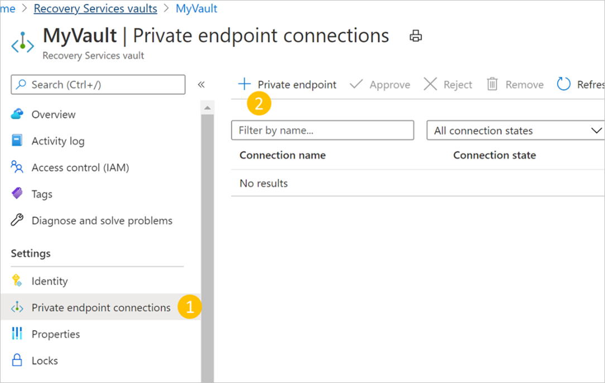
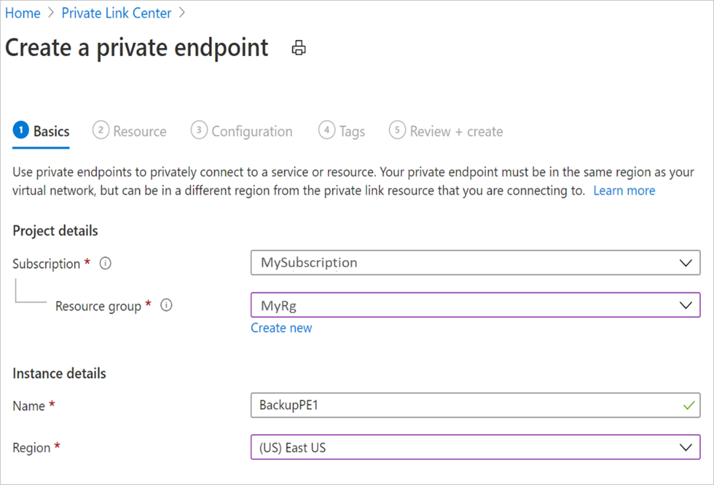
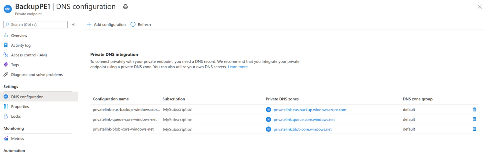
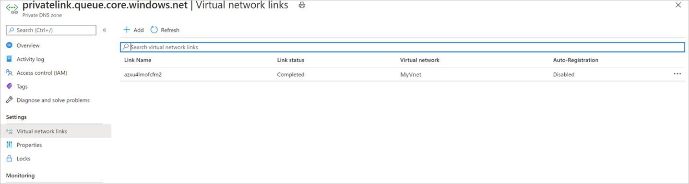
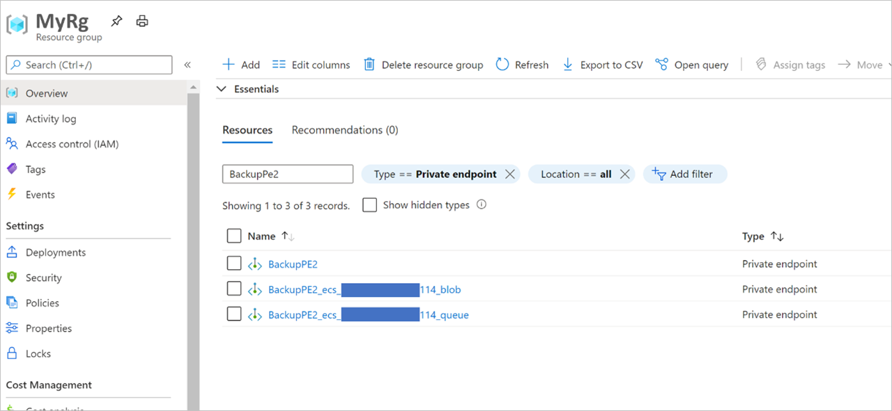
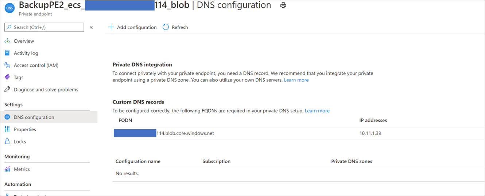
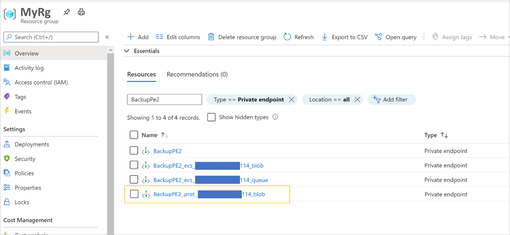
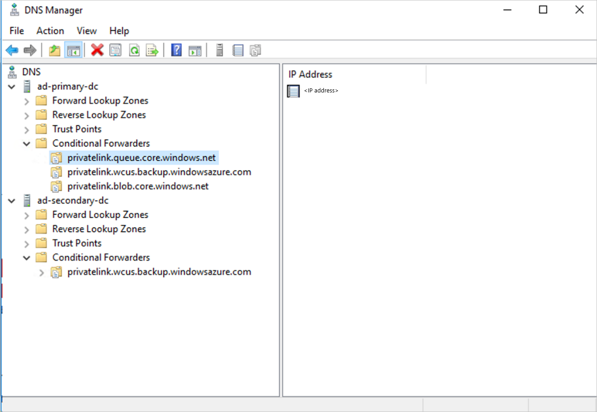
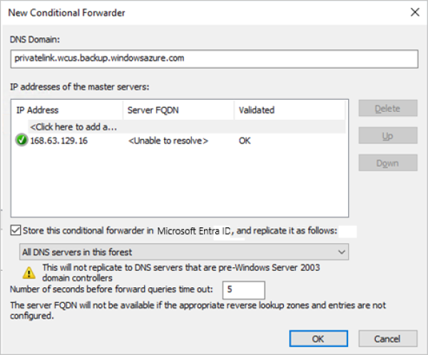

# Create and use private endpoints (v1 experience) for Azure Backup

This article provides information about the process of creating [private endpoints for Azure Backup](private-endpoints-overview.md) and the scenarios where  private endpoints help maintain the security of your resources.

>[!Note]
>Azure Backup now provides a new experience for creating private endpoints. [Learn more](backup-azure-private-endpoints-concept.md).

## Before you start

Ensure that you've read the [prerequisites](private-endpoints-overview.md#before-you-start) and the [supported scenarios](private-endpoints-overview.md#recommended-and-supported-scenarios) before proceeding to create private endpoints.

These details help you understand the limitations and conditions that need to be fulfilled before creating private endpoints for your vaults.

## Get started with creating private endpoints for Backup

The following sections discuss the steps involved in creating and using private endpoints for Azure Backup inside your virtual networks.

>[!IMPORTANT]
> It's highly recommended that you follow steps in the same sequence as mentioned in this document. Failure to do so may lead to the vault being rendered incompatible to use private endpoints and requiring you to restart the process with a new vault.

## Create a Recovery Services vault

Private endpoints for Backup can be only created for Recovery Services vaults that don't have any items protected to it (or haven't had any items attempted to be protected or registered to it in the past). So we suggest you create a new vault to start with. For more information about creating a new vault, see  [Create and configure a Recovery Services vault](backup-create-rs-vault.md).

See [this section](#create-a-recovery-services-vault-using-the-azure-resource-manager-client) to learn how to create a vault using the Azure Resource Manager client. This creates a vault with its managed identity already enabled.

## Deny public network access to the vault

You can configure your vaults to deny access from public networks.

Follow these steps:

1. Go to the *vault* > **Networking**.

2. On the **Public access** tab, select **Deny** to prevent access from public networks.

   :::image type="content" source="./media/backup-azure-private-endpoints/deny-public-network.png" alt-text="Screenshot showing how to select the Deny option.":::

   >[!Note]
   >- Once you deny access, you can still access the vault, but you can't move data to/from networks that don't contain private endpoints. For more information, see [Create private endpoints for Azure Backup](#create-private-endpoints-for-azure-backup).
   >- Denying public access is currently not supported for [vaults that have cross-regions restore](backup-create-rs-vault.md#set-cross-region-restore) enabled.

3. Select **Apply** to save the changes.

## Enable Managed Identity for your vault

Managed identities allow the vault to create and use private endpoints. This section talks about enabling the managed identity for your vault.

1. Go to your Recovery Services vault -> **Identity**.

    

1. Change the **Status** to **On** and select **Save**.

1. An **Object ID** is generated, which is the vault’s managed identity.

    >[!NOTE]
    >Once enabled, the Managed Identity must **not** be disabled (even temporarily). Disabling the managed identity may lead to inconsistent behavior.

## Grant permissions to the vault to create required private endpoints

To create the required private endpoints for Azure Backup, the vault (the Managed Identity of the vault) must have permissions to the following resource groups:

- The Resource Group that contains the target VNet
- The Resource Group where the Private Endpoints are to be created
- The Resource Group that contains the Private DNS zones, as discussed in detail [here](#create-private-endpoints-for-azure-backup)

We recommend that you grant the **Contributor** role for those three resource groups to the vault (managed identity). The following steps describe how to do this for a particular resource group (this needs to be done for each of the three resource groups):

1. Go to the Resource Group and navigate to **Access Control (IAM)** on the left bar.
1. Once in **Access Control**, go to **Add a role assignment**.

    

1. In the **Add role assignment** pane, choose **Contributor** as the **Role**, and use the **Name** of the vault as the **Principal**. Select your vault and select **Save** when done.

    

To manage permissions at a more granular level, see [Create roles and permissions manually](#create-roles-and-permissions-manually).

## Create Private Endpoints for Azure Backup

This section explains how to create a private endpoint for your vault.

1. Navigate to your vault created above and go to **Private endpoint connections** on the left navigation bar. Select **+Private endpoint** on the top to start creating a new private endpoint for this vault.

    

1. Once in the **Create Private Endpoint** process, you'll be required to specify details for creating your private endpoint connection.

    1. **Basics**: Fill in the basic details for your private endpoints. The region should be the same as the vault and the resource   being backed up.

        

    1. **Resource**: This tab requires you to select the PaaS resource for which you want to create your connection. Select **Microsoft.RecoveryServices/vaults** from the resource type for your desired subscription. Once done, choose the name of your Recovery Services vault as the **Resource** and **AzureBackup** as the **Target sub-resource**.

        

    1. **Configuration**: In configuration, specify the virtual network and subnet where you want the private endpoint to be created. This will be the Vnet where the VM is present.

        To connect privately, you need required DNS records. Based on your network setup, you can choose one of the following:

          - Integrate your private endpoint with a private DNS zone: Select **Yes** if you wish to integrate.
          - Use your custom DNS server: Select **No** if you wish to use your own DNS server.

        Managing DNS records for both these are [described later](#manage-dns-records).

          

    1. Optionally, you can add **Tags** for your private endpoint.
    1. Continue to **Review + create** once done entering details. When the validation completes, select **Create** to create the private endpoint.

## Approve Private Endpoints

If the user creating the private endpoint is also the owner of the Recovery Services vault, the private endpoint created above will be auto-approved. Otherwise, the owner of the vault must approve the private endpoint before being able to use it. This section discusses manual approval of private endpoints through the Azure portal.

See [Manual approval of private endpoints using the Azure Resource Manager Client](#manual-approval-of-private-endpoints-using-the-azure-resource-manager-client) to use the Azure Resource Manager client for approving private endpoints.

1. In your Recovery Services vault, navigate to **Private endpoint connections** on the left bar.
1. Select the private endpoint connection you wish to approve.
1. Select **Approve** on the top bar. You can also select **Reject** or **Remove** if you wish to reject or delete the endpoint connection.

    

## Manage DNS records

As described previously, you need the required DNS records in your private DNS zones or servers in order to connect privately. You can either integrate your private endpoint directly with Azure private DNS zones or use your custom DNS servers to achieve this, based on your network preferences. This will need to be done for all three services: Backup, Blobs, and Queues.

Additionally, if your DNS zone or server is present in a subscription that's different than the one containing the private endpoint, also see [Create DNS entries when the DNS server/DNS zone is present in another subscription](#create-dns-entries-when-the-dns-serverdns-zone-is-present-in-another-subscription).

### When integrating private endpoints with Azure private DNS zones

If you choose to integrate your private endpoint with private DNS zones, Azure Backup will add the required DNS records. You can view the private DNS zones being used under **DNS configuration** of the private endpoint. If these DNS zones aren't present, they'll be created automatically when creating the private endpoint. 

>[!Note]
>The managed identity assigned to the vault should have the permissions to add DNS records in the Azure Private DNS zone.

However, you must verify that your virtual network (which contains the resources to be backed up) is properly linked with all three private DNS zones, as described below.



>[!Note]
>If you're using proxy servers, you can choose to bypass the proxy server or perform your backups through the proxy server. To bypass a proxy server, continue to the following sections. To use the proxy server for performing your backups, see [proxy server setup details for Recovery Services vault](#set-up-proxy-server-for-recovery-services-vault-with-private-endpoint).
#### Validate virtual network links in private DNS zones

For **each private DNS** zone listed above (for Backup, Blobs and Queues), do the following:

1. Navigate to the respective **Virtual network links** option on the left navigation bar.
1. You should be able to see an entry for the virtual network for which you've created the private endpoint, like the one shown below:

    

1. If you don’t see an entry, add a virtual network link to all those DNS zones that don't have them.

    

## When using custom DNS server or host files

- If you're using a custom DNS server, you can use conditional forwarder for backup service, blob, and queue FQDNs to redirect the DNS requests to Azure DNS (168.63.129.16). Azure DNS redirects it to Azure Private DNS zone. In such setup, ensure that a virtual network link for Azure Private DNS zone exists as mentioned in [this section](#when-using-custom-dns-server-or-host-files).

  The following table lists the Azure Private DNS zones required by Azure Backup:

  |Zone |Service |
  |--- |--- |
  |`privatelink.<geo>.backup.windowsazure.com` |Backup  |
  |`privatelink.blob.core.windows.net`         |Blob    |
  |`privatelink.queue.core.windows.net`        |Queue   |

  >[!NOTE]
  > In the above text, `<geo>` refers to the region code (for example *eus* and *ne* for East US and North Europe respectively). Refer to the following lists for regions codes:
  >
  > - [All public clouds](https://download.microsoft.com/download/1/2/6/126a410b-0e06-45ed-b2df-84f353034fa1/AzureRegionCodesList.docx)
  > - [China](/azure/china/resources-developer-guide#check-endpoints-in-azure)
  > - [Germany](../germany/germany-developer-guide.md#endpoint-mapping)
  > - [US Gov](../azure-government/documentation-government-developer-guide.md)
  > - [Geo-code list - sample XML](scripts/geo-code-list.md)

- If you're using custom DNS servers or host files and don't have the Azure Private DNS zone setup, you need to add the DNS records required by the private endpoints to your DNS servers or in the host file.

  - **For the backup Service**: Navigate to the private endpoint you created, and then go to **DNS configuration**. Then add an entry for each FQDN and IP displayed as *Type A* records in your DNS zone for Backup.
  
    If you're using a host file for name resolution, make corresponding entries in the host file for each IP and FQDN according to the format - `<private ip><space><backup service privatelink FQDN>`.

  - **For the blob and queue**: Azure backup creates the private endpoints for blobs and queues using the managed identity permissions. The private endpoints for blobs and queues follow a standard naming pattern, they start with `<the name of the private endpoint>_ecs` or `<the name of the private endpoint>_prot`, and are suffixed with `_blob` and `_queue` respectively.

    Navigate to the private endpoint created by Azure Backup following the above pattern, and then go to **DNS configuration**. Then add an entry for each FQDN and IP displayed as *Type A* records in your DNS zone for Backup.
  
    If you're using a host file for name resolution, make corresponding entries in the host file for each IP and FQDN according to the format - `<private ip><space><blob/queue FQDN>`.

>[!Note]
>Azure Backup may allocate new storage account for your vault for the backup data, and the extension or agent needs to access the respective endpoints. For more about how to add more DNS records after registration and backup, see [the guidance in the Use Private Endpoints for Backup](#use-private-endpoints-for-backup) section.

## Use Private Endpoints for Backup

Once the private endpoints created for the vault in your VNet have been approved, you can start using them for performing your backups and restores.

>[!IMPORTANT]
>Ensure that you've completed all the steps mentioned above in the document successfully before proceeding. To recap, you must have completed the steps in the following checklist:
>
>1. Created a (new) Recovery Services vault
>2. Enabled the vault to use system assigned Managed Identity
>3. Assigned relevant permissions to the Managed Identity of the vault
>4. Created a Private Endpoint for your vault
>5. Approved the Private Endpoint (if not auto approved)
>6. Ensured all DNS records are appropriately added (except blob and queue records for custom servers, which will be discussed in the following sections)

### Check VM connectivity

In the VM in the locked down network, ensure the following:

1. The VM should have access to Microsoft Entra ID.
2. Execute **nslookup** on the backup URL (`xxxxxxxx.privatelink.<geo>.backup.windowsazure.com`) from your VM, to ensure connectivity. This should return the private IP assigned in your virtual network.

### Configure backup

Once you ensure the above checklist and access to have been successfully completed, you can continue to configure backup of workloads to the vault. If you're using a custom DNS server, you'll need to add DNS entries for blobs and queues that are available after configuring the first backup.

#### DNS records for blobs and queues (only for custom DNS servers/host files) after the first registration

After you have configured backup for at least one resource on a private endpoint enabled vault, add the required DNS records for blobs and queues as described below.

1. Navigate to your Resource Group, and search for the private endpoint you created.
1. Aside from the private endpoint name given by you, you'll see two more private endpoints being created. These start with `<the name of the private endpoint>_ecs` and are suffixed with `_blob` and `_queue` respectively.

    

1. Navigate to each of these private endpoints. In the DNS configuration option for each of the two private endpoints, you'll see a record with and an FQDN and an IP address. Add both of these to your custom DNS server, in addition to the ones described earlier.
If you're using a host file, make corresponding entries in the host file for each IP/FQDN according to the following format:

    `<private ip><space><blob service privatelink FQDN>`<br>
    `<private ip><space><queue service privatelink FQDN>`

    

In addition to the above, there's another entry needed after the first backup, which is discussed [later](#dns-records-for-blobs-only-for-custom-dns-servershost-files-after-the-first-backup).

### Backup and restore of workloads in Azure VM (SQL and SAP HANA)

Once the private endpoint is created and approved, no other changes are required from the client side to use the private endpoint (unless you're using SQL Availability Groups, which we discuss later in this section). All communication and data transfer from your secured network to the vault will be performed through the private endpoint. However, if you remove private endpoints for the vault after a server (SQL or SAP HANA) has been registered to it, you'll need to re-register the container with the vault. You don't need to stop protection for them.

#### DNS records for blobs (only for custom DNS servers/host files) after the first backup

After you run the first backup and you're using a custom DNS server (without conditional forwarding), it's likely that your backup will fail. If that happens:

1. Navigate to your Resource Group, and search for the private endpoint you created.
1. Aside from the three private endpoints discussed earlier, you'll now see a fourth private endpoint with its name starting with `<the name of the private endpoint>_prot` and are suffixed with `_blob`.

    

1. Navigate to this new private endpoint. In the DNS configuration option, you'll see a record with an FQDN and an IP address. Add these to your private DNS server, in addition to the ones described earlier.

    If you're using a host file, make the corresponding entries in the host file for each IP and FQDN according to the following format:

    `<private ip><space><blob service privatelink FQDN>`

>[!NOTE]
>At this point, you should be able to run **nslookup** from the VM and resolve to private IP addresses when done on the vault’s Backup and Storage URLs.

### When using SQL Availability Groups

When using SQL Availability Groups (AG), you'll need to provision conditional forwarding in the custom AG DNS as described below:

1. Sign in to your domain controller.
1. Under the DNS application, add conditional forwarders for all three DNS zones (Backup, Blobs, and Queues) to the host IP 168.63.129.16 or  the custom DNS server IP address, as necessary. The following screenshots show when you're forwarding to the Azure host IP. If you're using your own DNS server, replace with the IP of your DNS server.

    

    

### Back up and restore through MARS agent and DPM server

When using the MARS Agent to back up your on-premises resources, make sure your on-premises network (containing your resources to be backed up) is peered with the Azure VNet that contains a private endpoint for the vault, so you can use it. You can then continue to install the MARS agent and configure backup as detailed here. However, you must ensure all communication for backup happens through the peered network only.

But if you remove private endpoints for the vault after a MARS agent has been registered to it, you'll need to re-register the container with the vault. You don't need to stop protection for them.

>[!NOTE]
> - Private endpoints are supported with only DPM server 2022 and later.
> - Private endpoints are not yet supported with MABS.

## Deleting Private EndPoints

See [this section](/rest/api/virtualnetwork/privateendpoints/delete) to learn how to delete Private EndPoints.

## Additional topics

### Create a Recovery Services vault using the Azure Resource Manager client

You can create the Recovery Services vault and enable its Managed Identity (enabling the Managed Identity is required, as we'll later see) using the Azure Resource Manager client. A sample for doing this is shared below:

```rest
armclient PUT /subscriptions/<subscriptionid>/resourceGroups/<rgname>/providers/Microsoft.RecoveryServices/Vaults/<vaultname>?api-version=2017-07-01-preview @C:\<filepath>\MSIVault.json
```

The JSON file above should have the following content:

Request JSON:

```json
{
  "location": "eastus2",
  "name": "<vaultname>",
  "etag": "W/\"datetime'2019-05-24T12%3A54%3A42.1757237Z'\"",
  "tags": {
    "PutKey": "PutValue"
  },
  "properties": {},
  "id": "/subscriptions/<subscriptionid>/resourceGroups/<rgname>/providers/Microsoft.RecoveryServices/Vaults/<vaultname>",
  "type": "Microsoft.RecoveryServices/Vaults",
  "sku": {
    "name": "RS0",
    "tier": "Standard"
  },
  "identity": {
    "type": "systemassigned"
  }
}
```

Response JSON:

```json
{
   "location": "eastus2",
   "name": "<vaultname>",
   "etag": "W/\"datetime'2020-02-25T05%3A26%3A58.5181122Z'\"",
   "tags": {
     "PutKey": "PutValue"
   },
   "identity": {
     "tenantId": "<tenantid>",
     "principalId": "<principalid>",
     "type": "SystemAssigned"
   },
   "properties": {
     "provisioningState": "Succeeded",
     "privateEndpointStateForBackup": "None",
     "privateEndpointStateForSiteRecovery": "None"
   },
   "id": "/subscriptions/<subscriptionid>/resourceGroups/<rgname>/providers/Microsoft.RecoveryServices/Vaults/<vaultname>",
   "type": "Microsoft.RecoveryServices/Vaults",
   "sku": {
     "name": "RS0",
     "tier": "Standard"
   }
 }
```

>[!NOTE]
>The vault created in this example through the Azure Resource Manager client is already created with a system-assigned managed identity.

### Managing permissions on Resource Groups

The Managed Identity for the vault needs to have the following permissions in the resource group and virtual network where the private endpoints will be created:

- `Microsoft.Network/privateEndpoints/*`
This is required to perform CRUD on private endpoints in the resource group. It should be assigned on the resource group.
- `Microsoft.Network/virtualNetworks/subnets/join/action`
This is required on the virtual network where private IP is getting attached with the private endpoint.
- `Microsoft.Network/networkInterfaces/read`
This is required on the resource group to get the network interface created for the private endpoint.
- Private DNS Zone Contributor Role
This role already exists and can be used to provide `Microsoft.Network/privateDnsZones/A/*` and `Microsoft.Network/privateDnsZones/virtualNetworkLinks/read` permissions.

You can use one of the following methods to create roles with required permissions:

#### Create roles and permissions manually

Create the following JSON files and use the PowerShell command at the end of the section to create roles:

//PrivateEndpointContributorRoleDef.json

```json
{
  "Name": "PrivateEndpointContributor",
  "Id": null,
  "IsCustom": true,
  "Description": "Allows management of Private Endpoint",
  "Actions": [
    "Microsoft.Network/privateEndpoints/*",
  ],
  "NotActions": [],
  "AssignableScopes": [
    "/subscriptions/00000000-0000-0000-0000-000000000000"
  ]
}
```

//NetworkInterfaceReaderRoleDef.json

```json
{
  "Name": "NetworkInterfaceReader",
  "Id": null,
  "IsCustom": true,
  "Description": "Allows read on networkInterfaces",
  "Actions": [
    "Microsoft.Network/networkInterfaces/read"
  ],
  "NotActions": [],
  "AssignableScopes": [
    "/subscriptions/00000000-0000-0000-0000-000000000000"
  ]
}
```

//PrivateEndpointSubnetContributorRoleDef.json

```json
{
  "Name": "PrivateEndpointSubnetContributor",
  "Id": null,
  "IsCustom": true,
  "Description": "Allows adding of Private Endpoint connection to Virtual Networks",
  "Actions": [
    "Microsoft.Network/virtualNetworks/subnets/join/action"
  ],
  "NotActions": [],
  "AssignableScopes": [
    "/subscriptions/00000000-0000-0000-0000-000000000000"
  ]
}
```

```azurepowershell
 New-AzRoleDefinition -InputFile "PrivateEndpointContributorRoleDef.json"
 New-AzRoleDefinition -InputFile "NetworkInterfaceReaderRoleDef.json"
 New-AzRoleDefinition -InputFile "PrivateEndpointSubnetContributorRoleDef.json"
```

#### Use a script

1. Start the **Cloud Shell** in the Azure portal and select **Upload file** in the PowerShell window.

    

1. Upload the following script: [VaultMsiPrereqScript](https://download.microsoft.com/download/1/2/6/126a410b-0e06-45ed-b2df-84f353034fa1/VaultMsiPrereqScript.ps1)

1. Go to your home folder (for example: `cd /home/user`)

1. Run the following script:

    ```azurepowershell
    ./VaultMsiPrereqScript.ps1 -subscription <subscription-Id> -vaultPEResourceGroup <vaultPERG> -vaultPESubnetResourceGroup <subnetRG> -vaultMsiName <msiName>
    ```

    These are the parameters:

    - **subscription**: **SubscriptionId that has the resource group where the private endpoint for the vault is to be created and the subnet where the vault's private endpoint will be attached

    - **vaultPEResourceGroup**: Resource group where the private endpoint for the vault will be created

    - **vaultPESubnetResourceGroup**: Resource group of the subnet to which the private endpoint will be joined

    - **vaultMsiName**: Name of the vault's MSI, which is the same as **VaultName**

1. Complete the authentication and the script will take the context of the given subscription provided above. It will create the appropriate roles if they're missing from the tenant and will assign roles to the vault's MSI.

### Creating Private Endpoints using Azure PowerShell

#### Auto-approved private endpoints

```azurepowershell
$vault = Get-AzRecoveryServicesVault `
        -ResourceGroupName $vaultResourceGroupName `
        -Name $vaultName

$privateEndpointConnection = New-AzPrivateLinkServiceConnection `
        -Name $privateEndpointConnectionName `
        -PrivateLinkServiceId $vault.ID `
        -GroupId "AzureBackup"  

$vnet = Get-AzVirtualNetwork -Name $vnetName -ResourceGroupName $VMResourceGroupName
$subnet = $vnet | Select -ExpandProperty subnets | Where-Object {$_.Name -eq '<subnetName>'}


$privateEndpoint = New-AzPrivateEndpoint `
        -ResourceGroupName $vmResourceGroupName `
        -Name $privateEndpointName `
        -Location $location `
        -Subnet $subnet `
        -PrivateLinkServiceConnection $privateEndpointConnection `
        -Force
```

### Manual approval of private endpoints using the Azure Resource Manager Client

1. Use **GetVault** to get the Private Endpoint Connection ID for your private endpoint.

    ```rest
    armclient GET /subscriptions/<subscriptionid>/resourceGroups/<rgname>/providers/Microsoft.RecoveryServices/vaults/<vaultname>?api-version=2017-07-01-preview
    ```

    This will return the Private Endpoint Connection ID. The name of the connection can be retrieved by using the first part of the connection ID as follows:

    `privateendpointconnectionid = {peName}.{vaultId}.backup.{guid}`

1. Get the **Private Endpoint Connection ID** (and the **Private Endpoint Name**, wherever required) from the response and replace it in the following JSON and Azure Resource Manager URI and try changing the Status to “Approved/Rejected/Disconnected”, as demonstrated in the sample below:

    ```rest
    armclient PUT /subscriptions/<subscriptionid>/resourceGroups/<rgname>/providers/Microsoft.RecoveryServices/Vaults/<vaultname>/privateEndpointConnections/<privateendpointconnectionid>?api-version=2020-02-02-preview @C:\<filepath>\BackupAdminApproval.json
    ```

    JSON:

    ```json
    {
    "id": "/subscriptions/<subscriptionid>/resourceGroups/<rgname>/providers/Microsoft.RecoveryServices/Vaults/<vaultname>/privateEndpointConnections/<privateendpointconnectionid>",
    "properties": {
        "privateEndpoint": {
        "id": "/subscriptions/<subscriptionid>/resourceGroups/<pergname>/providers/Microsoft.Network/privateEndpoints/pename"
        },
        "privateLinkServiceConnectionState": {
        "status": "Disconnected",  //choose state from Approved/Rejected/Disconnected
        "description": "Disconnected by <userid>"
        }
    }
    }
    ```

### Set up proxy server for Recovery Services vault with private endpoint

To configure a proxy server for Azure VM or on-premises machine, follow these steps:

1. Add the following domains that need to be accessed from the proxy server.

   | Service | Domain names | Port |
   | ------- | ------ | ---- |
   | Azure Backup | *.backup.windowsazure.com | 443 |
   | Azure Storage | *.blob.core.windows.net <br><br> *.queue.core.windows.net <br><br> *.blob.storage.azure.net | 443 |
   | Microsoft Entra ID <br><br> Updated domain URLs mentioned under sections 56 and 59 in [Microsoft 365 Common and Office Online](/microsoft-365/enterprise/urls-and-ip-address-ranges?view=o365-worldwide&preserve-view=true#microsoft-365-common-and-office-online). | *.msftidentity.com, *.msidentity.com, account.activedirectory.windowsazure.com, accounts.accesscontrol.windows.net, adminwebservice.microsoftonline.com, api.passwordreset.microsoftonline.com, autologon.microsoftazuread-sso.com, becws.microsoftonline.com, clientconfig.microsoftonline-p.net, companymanager.microsoftonline.com, device.login.microsoftonline.com, graph.microsoft.com, graph.windows.net, login.microsoft.com, login.microsoftonline.com, login.microsoftonline-p.com, login.windows.net, logincert.microsoftonline.com, loginex.microsoftonline.com, login-us.microsoftonline.com, nexus.microsoftonline-p.com, passwordreset.microsoftonline.com, provisioningapi.microsoftonline.com <br><br> 20.190.128.0/18, 40.126.0.0/18, 2603:1006:2000::/48, 2603:1007:200::/48, 2603:1016:1400::/48, 2603:1017::/48, 2603:1026:3000::/48, 2603:1027:1::/48, 2603:1036:3000::/48, 2603:1037:1::/48, 2603:1046:2000::/48, 2603:1047:1::/48, 2603:1056:2000::/48, 2603:1057:2::/48 <br><br> *.hip.live.com, *.microsoftonline.com, *.microsoftonline-p.com, *.msauth.net, *.msauthimages.net, *.msecnd.net, *.msftauth.net, *.msftauthimages.net, *.phonefactor.net, enterpriseregistration.windows.net, management.azure.com, policykeyservice.dc.ad.msft.net | As applicable. |

1. Allow access to these domains in the proxy server and link private DNS zone ( `*.privatelink.<geo>.backup.windowsazure.com`, `*.privatelink.blob.core.windows.net`, `*.privatelink.queue.core.windows.net`) with the VNET where proxy server is created or uses a custom DNS server with the respective DNS entries. <br><br> The VNET where proxy server is running and the VNET where private endpoint NIC is created should be peered, which would allow the proxy server to redirect the requests to private IP.

   >[!NOTE]
   >In the above text, `<geo>` refers to the region code (for example *eus* and *ne* for East US and North Europe respectively). Refer to the following lists for regions codes:
   >
   >- [All public clouds](https://download.microsoft.com/download/1/2/6/126a410b-0e06-45ed-b2df-84f353034fa1/AzureRegionCodesList.docx)
   >- [China](/azure/china/resources-developer-guide#check-endpoints-in-azure)
   >- [Germany](../germany/germany-developer-guide.md#endpoint-mapping)
   >- [US Gov](../azure-government/documentation-government-developer-guide.md)
   >- [Geo-code list - sample XML](scripts/geo-code-list.md)

The following diagram shows a setup (while using the Azure Private DNS zones) with a proxy server, whose VNet is linked to a private DNS zone with required DNS entries. The proxy server can also have its own custom DNS server, and the above domains can be conditionally forwarded to 168.63.129.16. If you're using a custom DNS server/host file for DNS resolution, see the sections on [managing DNS entries](#manage-dns-records) and [configuring protection](#configure-backup).

:::image type="content" source="./media/private-endpoints/setup-with-proxy-server-inline.png" alt-text="Diagram showing a setup with a proxy server." lightbox="./media/private-endpoints/setup-with-proxy-server-expanded.png":::

### Create DNS entries when the DNS server/DNS zone is present in another subscription

In this section, we’ll discuss the cases where you’re using a DNS zone that’s present in a subscription, or a Resource Group that’s different from the one containing the private endpoint for the Recovery Services vault, such as a hub and spoke topology. As the managed identity used for creating private endpoints (and the DNS entries) has permissions only on the Resource Group in which the private endpoints are created, the required DNS entries are needed additionally. Use the following PowerShell scripts to create DNS entries.

>[!Note]
>Refer to the entire process described below to achieve the required results. The process needs to be repeated twice - once during the first discovery (to create DNS entries required for communication storage accounts), and then once during the first backup (to create DNS entries required for back-end storage accounts).

#### Step 1: Get required DNS entries

Use the [PrivateIP.ps1](https://download.microsoft.com/download/1/2/6/126a410b-0e06-45ed-b2df-84f353034fa1/PrivateIP.ps1) script to list down all the DNS entries that need to be created.

>[!Note]
>The `subscription` in the syntax below refers to the subscription where the vault’s private endpoint is to be created.

**Syntax for using the script**

```azurepowershell
./PrivateIP.ps1 -Subscription "<VaultPrivateEndpointSubscriptionId>" -VaultPrivateEndpointName "<vaultPrivateEndpointName>" -VaultPrivateEndpointRGName <vaultPrivateEndpointRGName> -DNSRecordListFile dnsentries.txt
```

**Sample output**

```
ResourceName                                                                 DNS                                                                       PrivateIP
<vaultId>-ab-pod01-fc1         privatelink.eus.backup.windowsazure.com         10.12.0.15
<vaultId>-ab-pod01-fab1        privatelink.eus.backup.windowsazure.com         10.12.0.16
<vaultId>-ab-pod01-prot1       privatelink.eus.backup.windowsazure.com         10.12.0.17
<vaultId>-ab-pod01-rec2        privatelink.eus.backup.windowsazure.com         10.12.0.18
<vaultId>-ab-pod01-ecs1        privatelink.eus.backup.windowsazure.com         10.12.0.19
<vaultId>-ab-pod01-id1         privatelink.eus.backup.windowsazure.com         10.12.0.20
<vaultId>-ab-pod01-tel1        privatelink.eus.backup.windowsazure.com         10.12.0.21
<vaultId>-ab-pod01-wbcm1       privatelink.eus.backup.windowsazure.com         10.12.0.22
abcdeypod01ecs114        privatelink.blob.core.windows.net       10.12.0.23
abcdeypod01ecs114        privatelink.queue.core.windows.net      10.12.0.24
abcdeypod01prot120       privatelink.blob.core.windows.net       10.12.0.28
abcdeypod01prot121       privatelink.blob.core.windows.net       10.12.0.32
abcdepod01prot110       privatelink.blob.core.windows.net       10.12.0.36
abcdeypod01prot121       privatelink.blob.core.windows.net       10.12.0.30
abcdeypod01prot122       privatelink.blob.core.windows.net       10.12.0.34
abcdepod01prot120       privatelink.blob.core.windows.net       10.12.0.26

```

#### Step 2: Create  DNS entries

Create DNS entries corresponding to the ones above. Based on the type of DNS you're using, you have two alternatives for creating DNS entries.

**Case 1**: If you’re using a custom DNS server, you need to manually create entries for each record from the script above and verify that the FQDN (ResourceName.DNS) resolves to a Private IP within the VNET.

**Case 2**: If you’re using Azure Private DNS Zone, you can use the [CreateDNSEntries.ps1](https://download.microsoft.com/download/1/2/6/126a410b-0e06-45ed-b2df-84f353034fa1/CreateDNSEntries.ps1) script to automatically create DNS entries in the Private DNS Zone. In the following syntax, the `subscription` is the one where Private DNS Zone exists.

**Syntax for using the script**

```azurepowershell
/CreateDNSEntries.ps1 -Subscription <PrivateDNSZoneSubId> -DNSResourceGroup <PrivateDNSZoneRG> -DNSRecordListFile dnsentries.txt
```

#### Summary of the entire process

To set up private endpoint for Recovery Services vault correctly through this workaround, you need to:

1. Create a private endpoint for vault (as described earlier in the article).
1. Trigger discovery. The discovery for SQL/HANA will fail with _UserErrorVMInternetConnectivityIssue_ because DNS entries are absent for communication storage account.
1. Run the scripts to get DNS entries and create corresponding DNS entries for communication storage account mentioned earlier in this section.
1. Retrigger discovery. This time, discovery should succeed.
1. Trigger backup. Backup for SQL/HANA and MARS could fail because DNS entries are absent for back-end storage accounts as mentioned earlier in this section.
1. Run the scripts to create DNS entries for back-end storage account.
1. Retrigger backup. This time, backups should succeed.

## Frequently asked questions

### Can I create a private endpoint for an existing Backup vault?<br>

No, private endpoints can be created for new Backup vaults only. So the vault must not have ever had any items protected to it. In fact, no attempts to protect any items to the vault can be made before creating private endpoints.

### I tried to protect an item to my vault, but it failed and the vault still doesn't contain any items protected to it. Can I create private endpoints for this vault?<br>

No, the vault must not have had any attempts to protect any items to it in the past.

### I have a vault that's using private endpoints for backup and restore. Can I later add or remove private endpoints for this vault even if I have backup items protected to it?<br>

Yes. If you already created private endpoints for a vault and protected backup items to it, you can later add or remove private endpoints as required.

### Can the private endpoint for Azure Backup also be used for Azure Site Recovery?<br>

No, the private endpoint for Backup can only be used for Azure Backup. You'll need to create a new private endpoint for Azure Site Recovery, if it's supported by the service.

### I missed one of the steps in this article and went on to protect my data source. Can I still use private endpoints?<br>

Not following the steps in the article and continuing to protect items may lead to the vault not being able to use private endpoints. It's therefore recommended you refer to this checklist before proceeding to protect items.

### Can I use my own DNS server instead of using the Azure private DNS zone or an integrated private DNS zone?<br>

Yes, you can use your own DNS servers. However, make sure all required DNS records are added as suggested in this section.

### Do I need to perform any additional steps on my server after I've followed the process in this article?<br>

After following the process detailed in this article, you don't need to do additional work to use private endpoints for backup and restore.

## Next steps

- Read about all the [security features in Azure Backup](security-overview.md).
