# Private Endpoints for Azure Backup

Azure Backup allows you to securely back up and restore your data from your Recovery Services vaults using [private endpoints](https://docs.microsoft.com/azure/private-link/private-endpoint-overview). Private endpoints use one or more private IP addresses from your VNet, effectively bringing the service into your VNet.

This article will help you understand the process of creating private endpoints for Azure Backup and the scenarios where using private endpoints helps maintain the security of your resources.

## Before you start

- Private endpoints can be created for new Recovery Services vaults only (that don't have any items registered to the vault). So private endpoints must be created before you attempt to protect any items to the vault.
- One virtual network can contain private endpoints for multiple Recovery Services vaults. Also, one Recovery Services vault can have private endpoints for it in multiple virtual networks. However, the maximum number of private endpoints that can be created for a vault is 12.
- Once a private endpoint is created for a vault, the vault will be locked down. It won't be accessible (for backups and restores) from networks apart from ones that contain a private endpoint for the vault. If all private endpoints for the vault are removed, the vault will be accessible from all networks.
- While a Recovery Services vault is used by (both) Azure Backup and Azure Site Recovery, this article discusses use of private endpoints for Azure Backup only.
- Azure Active Directory doesn't currently support private endpoints. So IPs and FQDNs required for Azure Active Directory to work in a region will need to be allowed outbound access from the secured network when performing backup of databases in Azure VMs and backup using the MARS agent. You can also use NSG tags and Azure Firewall tags for allowing access to Azure AD, as applicable.
- Virtual networks with Network Policies aren't supported for Private Endpoints. You'll need to disable Network Polices before continuing.
- You need to re-register the Recovery Services resource provider with the subscription if you registered it before May 1st 2020. To re-register the provider, go to your subscription in the Azure portal, navigate to **Resource provider** on the left navigation bar, then select **Microsoft.RecoveryServices** and click **Re-register**.

## Recommended and supported scenarios

While private endpoints are enabled for the vault, they're used for backup and restore of SQL and SAP HANA workloads in an Azure VM and MARS agent backup only. You can use the vault for backup of other workloads as well (they wouldn't require private endpoints though). In addition to backup of SQL and SAP HANA workloads and backup using the MARS agent, private endpoints are also used to perform file recovery in the case of Azure VM backup. For more information, see the following table:

| Backup of workloads in Azure VM (SQL, SAP HANA), Backup  using MARS Agent | Use of private endpoints is recommended to allow backup  and restore without needing to allow-list any IPs/FQDNs for Azure Backup or Azure  Storage  from your virtual networks. |
| ------------------------------------------------------------ | ------------------------------------------------------------ |
| **Azure  VM backup**                                         | VM backup doesn't require you to allow access to any IPs or FQDNs. So it doesn't require private endpoints for backup and restore  of disks.  <br><br>   However, file recovery from a vault containing  private endpoints would be restricted to virtual networks that contain a private  endpoint for the vault. <br><br>    When using ACL’ed unmanaged disks, ensure the  storage account containing the disks allows access to **trusted Microsoft services** if it's ACL’ed. |
| **Azure  Files backup**                                      | Azure Files backups are stored in the local  storage account. So it doesn't require private endpoints for backup and  restore. |

## Creating and using Private Endpoints for Backup

This section talks about the steps involved in creating and using private endpoints for Azure Backup inside your virtual networks.

>[!IMPORTANT]
> It is highly recommended that you follow steps in the same sequence as mentioned in this document. Failure to do so may lead to the vault being rendered incompatible to use private endpoints and requiring you to restart the process with a new vault.

>[!NOTE]
> Certain elements of the Azure portal experience may not be currently available. Please refer to the alternate experiences in such scenarios until full availability in your region.

[!INCLUDE [How to create a Recovery Services vault](../../includes/backup-create-rs-vault.md)]

See [this section](#create-a-recovery-services-vault-using-the-azure-resource-manager-client) to learn how to create a vault using the Azure Resource Manager client. This creates a vault with its managed identity already enabled. Learn more about Recovery Services vaults [here](https://docs.microsoft.com/azure/backup/backup-azure-recovery-services-vault-overview).

## Enable Managed Identity for your vault

Managed identities allow the vault to create and use private endpoints. This section talks about enabling the managed identity for your vault.

1. Go to your Recovery Services vault -> **Identity**.

    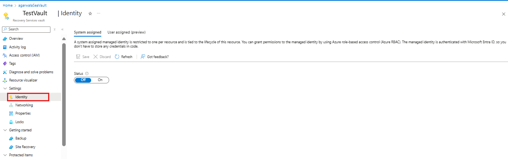

1. Change the **Status** to **On** and click **Save**.

1. An **Object ID** is generated, which is the vault’s managed identity.

    >[!NOTE]
    >Once enabled, the Managed Identity must NOT be disabled (even temporarily). Disabling the managed identity may lead to inconsistent behavior.

## DNS changes

Using private endpoints requires Private DNS Zones to allow the Backup extension to resolve private link FQDNs to private IPs. Altogether, three private DNS zones are required. While two of these zones must be mandatorily created, the third can be either opted to be integrated with the private endpoint (while creating the private endpoint) or can be created separately.

You can also use your custom DNS servers. Refer to [DNS changes for custom DNS servers](#dns-changes-for-custom-dns-servers) for details about using custom DNS servers.

### Creating Mandatory DNS zones

There are two mandatory DNS zones that need to be created:

- `privatelink.blob.core.windows.net` (for backup/restore data)
- `privatelink.queue.core.windows.net` (for service communication)

1. Search for **Private DNS Zone** in the **All services** search bar and select **Private DNS zone** from the drop-down list.

    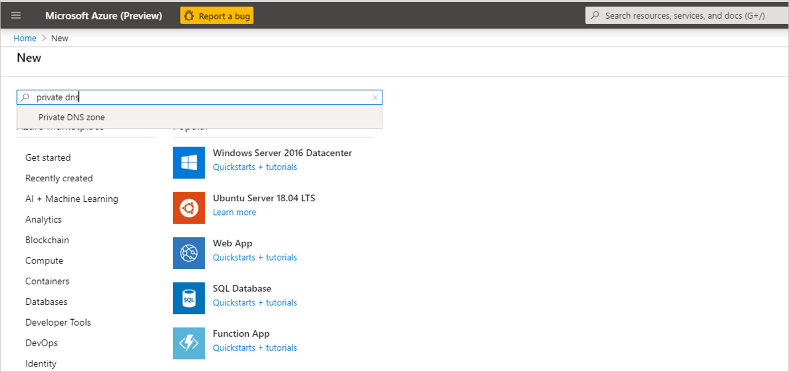

1. Once in the **Private DNS zone** pane, click the **+Add** button to start creating a new zone.

1. In the **Create private DNS zone** pane, fill in the details required. The subscription must be the same as where the private endpoint will be created.

    The zones must be named as:

    - `privatelink.blob.core.windows.net`
    - `privatelink.queue.core.windows.net`

    | **Zone**                           | **Service** | **Subscription and Resource Group (RG) details**                  |
    | ---------------------------------- | ----------- | ------------------------------------------------------------ |
    | `privatelink.blob.core.windows.net`  | Blob        | **Subscription**: Same as where private  endpoint needs to be created  **RG**: Either the RG of the VNET or that of the Private Endpoint |
    | `privatelink.queue.core.windows.net` | Queue       | **RG**: Either the RG of the VNET or that of the Private Endpoint |

    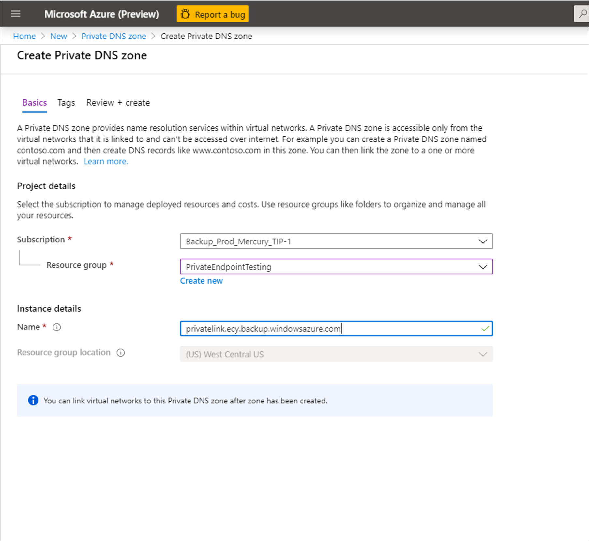

1. Once done, proceed to review and create the DNS zone.

### Optional DNS zone

Customers can choose to integrate their private endpoints with private DNS zones for Azure Backup (discussed in the section on creating private endpoints) for service communication. If you don't wish to integrate with the private DNS zone, you can opt to use your own DNS server or create a private DNS zone separately. This is in addition to the two mandatory private DNS zones discussed in the previous section.

If you wish to create a separate private DNS zone in Azure, you can do the same using the same steps used for creating mandatory DNS zones. The naming and subscription details are shared below:

| **Zone**                                                     | **Service** | **Subscription and Resource Group details**                  |
| ------------------------------------------------------------ | ----------- | ------------------------------------------------------------ |
| `privatelink.<geo>.backup.windowsazure.com`  <br><br>   **Note**: *geo* here refers to  the region code. For example, *wcus* and *ne* for West Central US and North Europe respectively. | Backup      | **Subscription**: Same as where the Private Endpoint needs to be created  **RG**: Any RG within the subscription |

Refer to [this list](https://download.microsoft.com/download/1/2/6/126a410b-0e06-45ed-b2df-84f353034fa1/AzureRegionCodesList.docx) for region codes.

For URL naming conventions in national regions:

- [China](https://docs.microsoft.com/azure/china/resources-developer-guide#check-endpoints-in-azure)
- [Germany](https://docs.microsoft.com/azure/germany/germany-developer-guide#endpoint-mapping)
- [US Gov](https://docs.microsoft.com/azure/azure-government/documentation-government-developer-guide)

### Linking private DNS zones with your virtual network

The DNS zones created above must now be linked to the virtual network where your servers to be backed up are located. This needs to be done for all the DNS zones you created.

1. Go to your DNS zone (that you created in the previous step) and navigate to **Virtual network links** on the left bar. Once there, click the **+Add** button
1. Fill in the required details. The **Subscription** and **Virtual network** fields must be filled with corresponding details of the virtual network where your servers exist. The other fields must be left as is.

    

## Grant permissions to the vault to create required private endpoints

To create the required private endpoints for Azure Backup, the vault (the Managed Identity of the vault) must have permissions to the following resource groups:

- The Resource Group that contains the target VNet
- The Resource Group where the Private Endpoints are to be created
- The Resource Group that contains the Private DNS zones

We recommend that you grant the **Contributor** role for those three resource groups to the vault (managed identity). The following steps describe how to do this for a particular resource group (this needs to be done for each of the three resource groups):

1. Go to the Resource Group and navigate to **Access Control (IAM)** on the left bar.
1. Once in **Access Control**, go to **Add a role assignment**.

    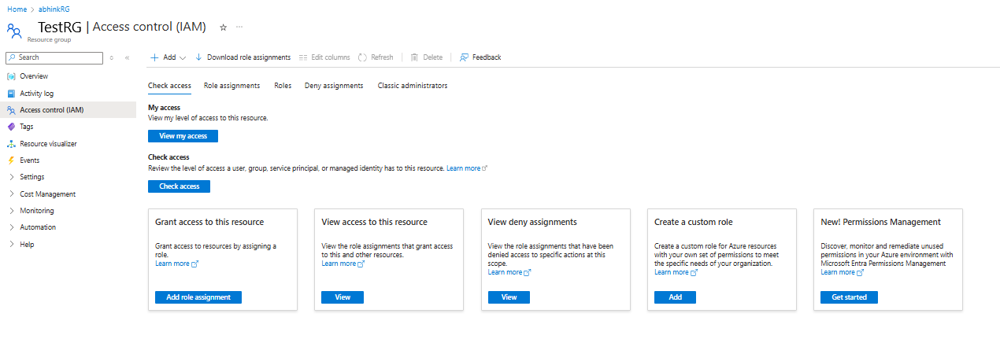

1. In the **Add role assignment** pane, choose **Contributor** as the **Role**, and use the **Name** of the vault as the **Principal**. Select your vault and click **Save** when done.

    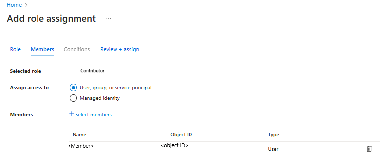

To manage permissions at a more granular level, see [Create roles and permissions manually](#create-roles-and-permissions-manually).

## Creating and approving Private Endpoints for Azure Backup

### Creating Private Endpoints for Backup

This section describes the process of creating a private endpoint for your vault.

1. In the search bar, search for and select **Private Link**. This takes you to the **Private Link Center**.

    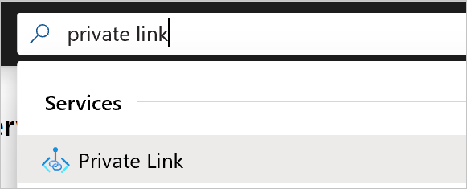

1. On the left navigation bar, click on **Private Endpoints**. Once in the **Private Endpoints** pane, click **+Add** to start creating a Private Endpoint for your vault.

    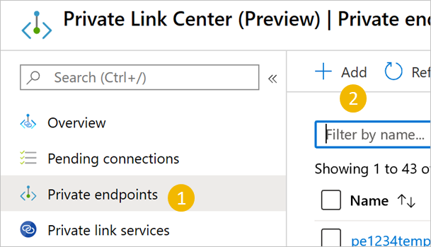

1. Once in the **Create Private Endpoint** process, you'll be required to specify details for creating your private endpoint connection.

    1. **Basics**: Fill in the basic details for your private endpoints. The region should be the same as the vault and the resource.

        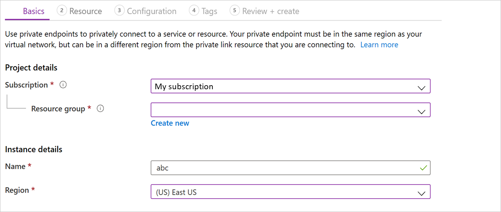

    1. **Resource**: This tab requires you to mention the PaaS resource for which you want to create your connection. Select **Microsoft.RecoveryServices/vaults** from the resource type for your desired subscription. Once done, choose the name of your Recovery Services vault as the **Resource** and **AzureBackup** as the **Target sub-resource**.

        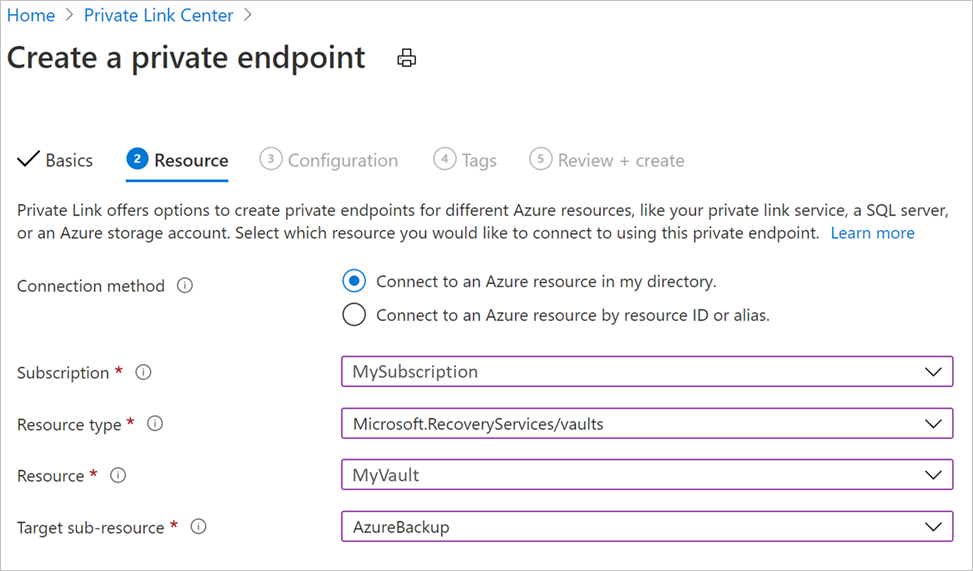

    1. **Configuration**: In configuration, specify the virtual network and subnet where you want the private endpoint to be created. This would be the Vnet where the VM is present. You can opt to **integrate your private endpoint** with a private DNS zone. Alternately, you can also use your custom DNS server or create a private DNS zone.

        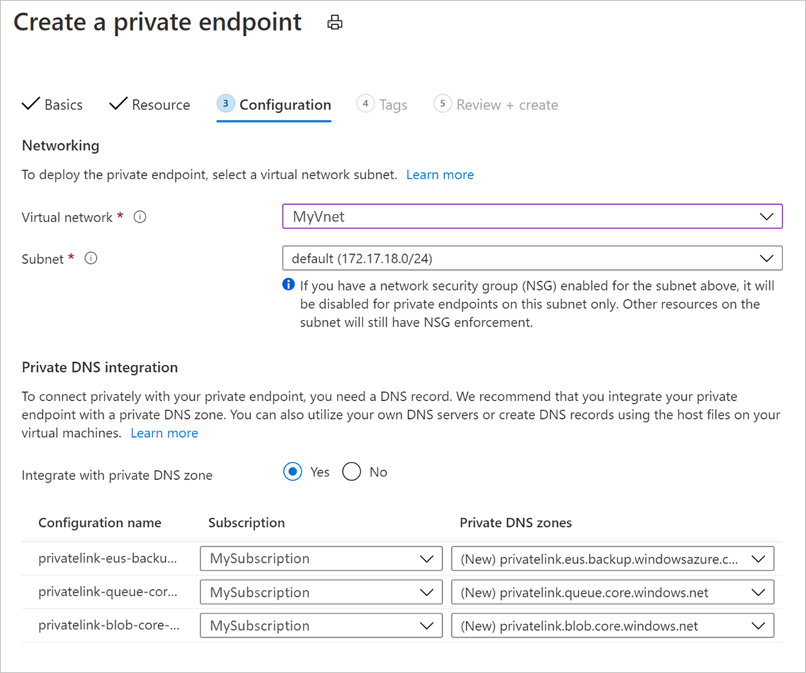

    1. Optionally, you can add **Tags** for your private endpoint.

    1. Proceed to **Review + create** once done entering details. When the validation completes, click **Create** to create the private endpoint.

## Approving Private Endpoints

If the user creating the private endpoint is also the owner of the Recovery Services vault, the private endpoint created above will be auto-approved. Otherwise, the owner of the vault must approve the private endpoint before being able to use it. This section discusses manual approval of private endpoints through the Azure portal.

See [Manual approval of private endpoints using the Azure Resource Manager Client](#manual-approval-of-private-endpoints-using-the-azure-resource-manager-client) to use the Azure Resource Manager client for approving private endpoints.

1. In your Recovery Services vault, navigate to **Private endpoint connections** on the left bar.
1. Select the private endpoint connection you wish to approve.
1. Select **Approve** on the top bar. You can also select **Reject** or **Remove** if you wish to reject or delete the endpoint connection.

    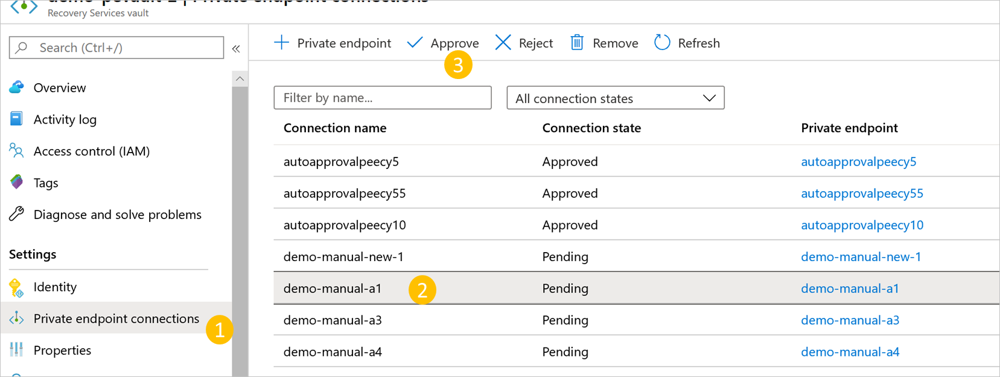

## Adding DNS records

>[!NOTE]
> This step is not required if you are using an integrated DNS zone. However, if you have created your own Azure Private DNS zone or are using a custom private DNS zone, please make sure entries are made as described in this section.

Once you've created the optional private DNS zone and the private endpoints for your vault, you'll need to add DNS records to your DNS zone. You can do this either manually or using a PowerShell script. This needs to be done for your Backup DNS zone only, those for Blobs and Queues will automatically be updated.

### Add records manually

This requires you to make entries for each FQDN in your private endpoint into your Private DNS Zone.

1. Go to your **private DNS zone** and navigate to the **Overview** option on the left bar. Once there, click **+Record set** to start adding records.

    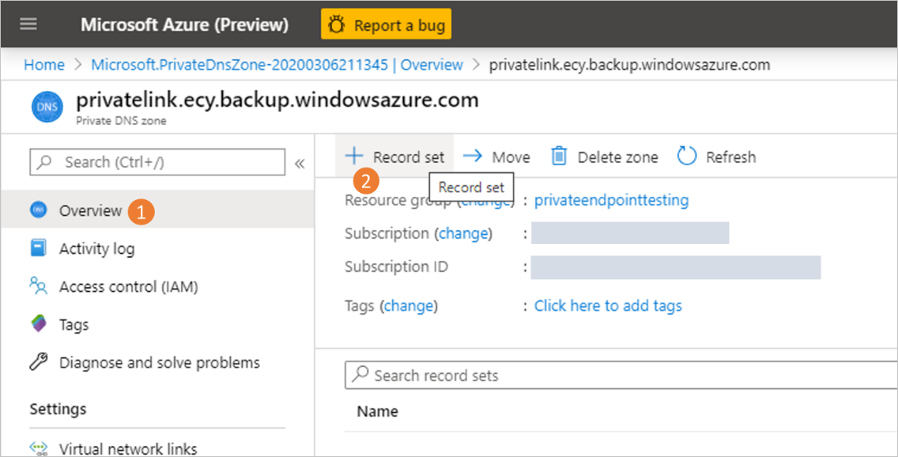

1. In the **Add Record Set** pane that opens, add one entry for each FQDN and private IP as an **A type** record. The list of FQDNs and IPs can be obtained from your Private Endpoint (under **Overview**). As shown in the example below, the first FQDN from the private endpoint is being added to the record set in the private DNS zone.

    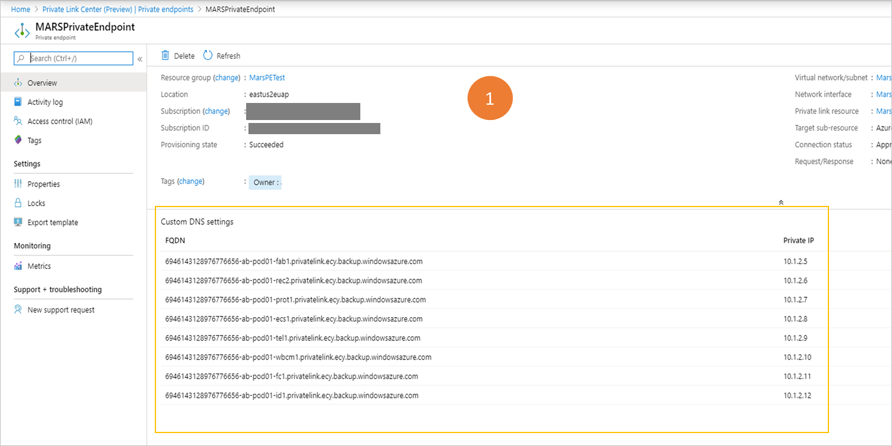

    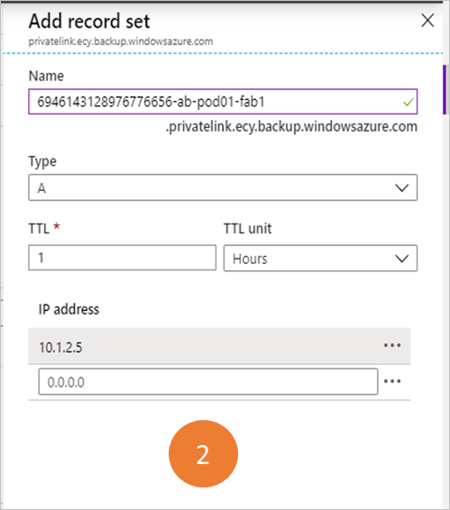

### Add records using PowerShell script

1. Start the **Cloud Shell** in the Azure portal and select **Upload file** in the PowerShell window.

    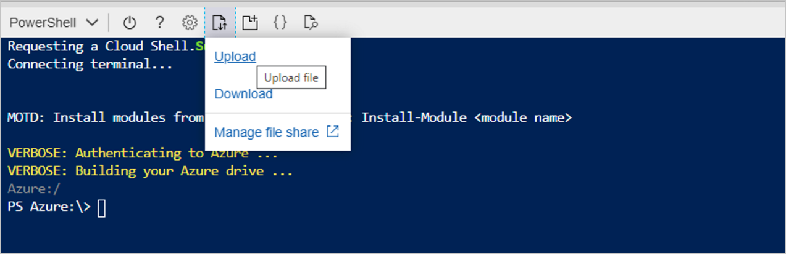

1. Upload this script: [DnsZoneCreation](https://download.microsoft.com/download/1/2/6/126a410b-0e06-45ed-b2df-84f353034fa1/dnszonerecordcreation.ps1)

1. Go to your home folder (for example: `cd /home/user`)

1. Run the following script:

    ```azurepowershell
    ./dnszonerecordcreation.ps1 -Subscription <SubscriptionId> -VaultPEName <VaultPE Name> -VaultPEResourceGroup <Vault PE RG> -DNSResourceGroup <Private DNS RG> -Privatezone <privatednszone>
    ```

    These are the parameters:

    - **subscription**: The subscription where the resources (vault's private endpoint and private DNS zone) reside
    - **vaultPEName**: Name of the private endpoint created for the vault
    - **vaultPEResourceGroup**: Resource group that contains the vault's private endpoint
    - **dnsResourceGroup**: Resource group that contains the private DNS zones
    - **Privatezone**: Name of the private DNS zone

## Using Private Endpoints for Backup

Once the private endpoints created for the vault in your VNet have been approved, you can start using them for performing your backups and restores.

>[!IMPORTANT]
>Please ensure that you have completed all the steps mentioned above in the document successfully before proceeding. To recap, you must have completed the steps in the following checklist:
>
>1. Created a (new) Recovery Services Vault
>1. Enabled the vault to use system assigned Managed Identity
>1. Created three Private DNS zones (two if using an integrated DNS zone for Backup)
>1. Linked your Private DNS zones to your Azure Virtual Network
>1. Assigned relevant permissions to the Managed Identity of the vault
>1. Created a Private Endpoint for your vault
>1. Approved the Private Endpoint (if not auto approved)
>1. Added required DNS records to your private DNS zone for Backup (applicable only if not using an integrated private DNS zone)

### Backup and restore of workloads in Azure VM (SQL, SAP HANA)

Once the private endpoint is created and approved, no additional changes are required from the client side to use the private endpoint. All communication and data transfer from your secured network to the vault will be performed through the private endpoint.
However, if you remove private endpoints for the vault after a server (SQL/SAP HANA) has been registered to it, you'll need to re-register the container with the vault. You don't need to stop protection for them.

### Backup and restore through MARS Agent

When using the MARS Agent to back up your on-premises resources, make sure your on-premises network (containing your resources to be backed up) is peered with the Azure VNet that contains a private endpoint for the vault, so you can use it. You can then continue to install the MARS agent and configure backup as detailed here. You must, however, ensure all communication for backup happens through the peered network only.

However, if you remove private endpoints for the vault after a MARS agent has been registered to it, you'll need to re-register the container with the vault. You don't need to stop protection for them.

## Additional topics

### Create a Recovery Services vault using the Azure Resource Manager client

You can create the Recovery Services Vault and enable its Managed Identity (enabling the Managed Identity is required, as we'll later see) using the Azure Resource Manager client. A sample for doing this is shared below:

```rest
armclient PUT /subscriptions/<subscriptionid>/resourceGroups/<rgname>/providers/Microsoft.RecoveryServices/Vaults/<vaultname>?api-version=2017-07-01-preview @C:\<filepath>\MSIVault.json
```

The JSON file above should have the following content:

Request JSON:

```json
{
  "location": "eastus2",
  "name": "<vaultname>",
  "etag": "W/\"datetime'2019-05-24T12%3A54%3A42.1757237Z'\"",
  "tags": {
    "PutKey": "PutValue"
  },
  "properties": {},
  "id": "/subscriptions/<subscriptionid>/resourceGroups/<rgname>/providers/Microsoft.RecoveryServices/Vaults/<vaultname>",
  "type": "Microsoft.RecoveryServices/Vaults",
  "sku": {
    "name": "RS0",
    "tier": "Standard"
  },
  "identity": {
    "type": "systemassigned"
  }
}
```

Response JSON:

```json
{
   "location": "eastus2",
   "name": "<vaultname>",
   "etag": "W/\"datetime'2020-02-25T05%3A26%3A58.5181122Z'\"",
   "tags": {
     "PutKey": "PutValue"
   },
   "identity": {
     "tenantId": "<tenantid>",
     "principalId": "<principalid>",
     "type": "SystemAssigned"
   },
   "properties": {
     "provisioningState": "Succeeded",
     "privateEndpointStateForBackup": "None",
     "privateEndpointStateForSiteRecovery": "None"
   },
   "id": "/subscriptions/<subscriptionid>/resourceGroups/<rgname>/providers/Microsoft.RecoveryServices/Vaults/<vaultname>",
   "type": "Microsoft.RecoveryServices/Vaults",
   "sku": {
     "name": "RS0",
     "tier": "Standard"
   }
 }
```

>[!NOTE]
>The vault created in this example through the Azure Resource Manager client is already created with a system-assigned managed identity.

### Managing permissions on Resource Groups

The Managed Identity for the vault needs to have the following permissions in the resource group and virtual network where the private endpoints will be created:

- `Microsoft.Network/privateEndpoints/*`
This is required to perform CRUD on private endpoints in the resource group. It should be assigned on the resource group.
- `Microsoft.Network/virtualNetworks/subnets/join/action`
This is required on the virtual network where private IP is getting attached with the private endpoint.
- `Microsoft.Network/networkInterfaces/read`
This is required on the resource group to get the network interface created for the private endpoint.
- Private DNS Zone Contributor Role
This role already exists and can be used to provide `Microsoft.Network/privateDnsZones/A/*` and `Microsoft.Network/privateDnsZones/virtualNetworkLinks/read` permissions.

You can use one of the following methods to create roles with required permissions:

#### Create roles and permissions manually

Create the following JSON files and use the PowerShell command at the end of the section to create roles:

//PrivateEndpointContributorRoleDef.json

```json
{
  "Name": "PrivateEndpointContributor",
  "Id": null,
  "IsCustom": true,
  "Description": "Allows management of Private Endpoint",
  "Actions": [
    "Microsoft.Network/privateEndpoints/*",
  ],
  "NotActions": [],
  "AssignableScopes": [
    "/subscriptions/00000000-0000-0000-0000-000000000000"
  ]
}
```

//NetworkInterfaceReaderRoleDef.json

```json
{
  "Name": "NetworkInterfaceReader",
  "Id": null,
  "IsCustom": true,
  "Description": "Allows read on networkInterfaces",
  "Actions": [
    "Microsoft.Network/networkInterfaces/read"
  ],
  "NotActions": [],
  "AssignableScopes": [
    "/subscriptions/00000000-0000-0000-0000-000000000000"
  ]
}
```

//PrivateEndpointSubnetContributorRoleDef.json

```json
{
  "Name": "PrivateEndpointSubnetContributor",
  "Id": null,
  "IsCustom": true,
  "Description": "Allows adding of Private Endpoint connection to Virtual Networks",
  "Actions": [
    "Microsoft.Network/virtualNetworks/subnets/join/action"
  ],
  "NotActions": [],
  "AssignableScopes": [
    "/subscriptions/00000000-0000-0000-0000-000000000000"
  ]
}
```

```azurepowershell
 New-AzRoleDefinition -InputFile "PrivateEndpointContributorRoleDef.json"
 New-AzRoleDefinition -InputFile "NetworkInterfaceReaderRoleDef.json"
 New-AzRoleDefinition -InputFile "PrivateEndpointSubnetContributorRoleDef.json"
```

#### Use a script

1. Start the **Cloud Shell** in the Azure portal and select **Upload file** in the PowerShell window.

    

1. Upload the following script: [VaultMsiPrereqScript](https://download.microsoft.com/download/1/2/6/126a410b-0e06-45ed-b2df-84f353034fa1/VaultMsiPrereqScript.ps1)

1. Go to your home folder (for example: `cd /home/user`)

1. Run the following script:

    ```azurepowershell
    ./VaultMsiPrereqScript.ps1 -subscription <subscription-Id> -vaultPEResourceGroup <vaultPERG> -vaultPESubnetResourceGroup <subnetRG> -vaultMsiName <msiName>
    ```

    These are the parameters:

    - **subscription**: **SubscriptionId that has the resource group where the private endpoint for the vault is to be created and the subnet where the vault's private endpoint will be attached

    - **vaultPEResourceGroup**: Resource group where the private endpoint for the vault will be created

    - **vaultPESubnetResourceGroup**: Resource group of the subnet to which the private endpoint will be joined

    - **vaultMsiName**: Name of the vault's MSI, which is the same as **VaultName**

1. Complete the authentication and the script will take the context of the given subscription provided above. It will create the appropriate roles if they're missing from the tenant and will assign roles to the vault's MSI.

### Creating Private Endpoints using Azure PowerShell

#### Auto-approved private endpoints

```azurepowershell
$vault = Get-AzRecoveryServicesVault `
        -ResourceGroupName $vaultResourceGroupName `
        -Name $vaultName
  
$privateEndpointConnection = New-AzPrivateLinkServiceConnection `
        -Name $privateEndpointConnectionName `
        -PrivateLinkServiceId $vault.ID `
        -GroupId "AzureBackup"  
  
$privateEndpoint = New-AzPrivateEndpoint `
        -ResourceGroupName $vmResourceGroupName `
        -Name $privateEndpointName `
        -Location $location `
        -Subnet $subnet `
        -PrivateLinkServiceConnection $privateEndpointConnection `
        -Force
```

### Manual approval of private endpoints using the Azure Resource Manager Client

1. Use **GetVault** to get the Private Endpoint Connection ID for your private endpoint.

    ```rest
    armclient GET /subscriptions/<subscriptionid>/resourceGroups/<rgname>/providers/Microsoft.RecoveryServices/vaults/<vaultname>?api-version=2017-07-01-preview
    ```

    This will return the Private Endpoint Connection ID. The name of the connection can be retrieved by using the first part of the connection ID as follows:

    `privateendpointconnectionid = {peName}.{vaultId}.backup.{guid}`

1. Get the **Private Endpoint Connection ID** (and the **Private Endpoint Name**, wherever required) from the response and replace it in the following JSON and Azure Resource Manager URI and try changing the Status to “Approved/Rejected/Disconnected”, as demonstrated in the sample below:

    ```rest
    armclient PUT /subscriptions/<subscriptionid>/resourceGroups/<rgname>/providers/Microsoft.RecoveryServices/Vaults/<vaultname>/privateEndpointConnections/<privateendpointconnectionid>?api-version=2020-02-02-preview @C:\<filepath>\BackupAdminApproval.json
    ```

    JSON:

    ```json
    {
    "id": "/subscriptions/<subscriptionid>/resourceGroups/<rgname>/providers/Microsoft.RecoveryServices/Vaults/<vaultname>/privateEndpointConnections/<privateendpointconnectionid>",
    "properties": {
        "privateEndpoint": {
        "id": "/subscriptions/<subscriptionid>/resourceGroups/<pergname>/providers/Microsoft.Network/privateEndpoints/pename"
        },
        "privateLinkServiceConnectionState": {
        "status": "Disconnected",  //choose state from Approved/Rejected/Disconnected
        "description": "Disconnected by <userid>"
        }
    }
    }
    ```

### DNS changes for custom DNS servers

#### Create DNS zones for custom DNS servers

You need to create three private DNS zones and link them to your virtual network.

| **Zone**                                                     | **Service** |
| ------------------------------------------------------------ | ----------- |
| `privatelink.<geo>.backup.windowsazure.com`      | Backup      |
| `privatelink.blob.core.windows.net`                            | Blob        |
| `privatelink.queue.core.windows.net`                           | Queue       |

>[!NOTE]
>In the text above, *geo* refers to  the region code. For example, *wcus* and *ne* for West Central US and North Europe respectively.

Refer to [this list](https://download.microsoft.com/download/1/2/6/126a410b-0e06-45ed-b2df-84f353034fa1/AzureRegionCodesList.docx) for region codes.

#### Adding DNS records for custom DNS servers

This requires you to make entries for each FQDN in your private endpoint into your Private DNS Zone.

It should be noted that we'll be using the private endpoints created for Backup, Blob, and Queue service.

- The private endpoint for the vault uses the name specified while creating the private endpoint
- The private endpoints for blob and queue services are prefixed with the name of the same for the vault.

For example, the following picture shows the three private endpoints created for a private endpoint connection with the name *pee2epe*:

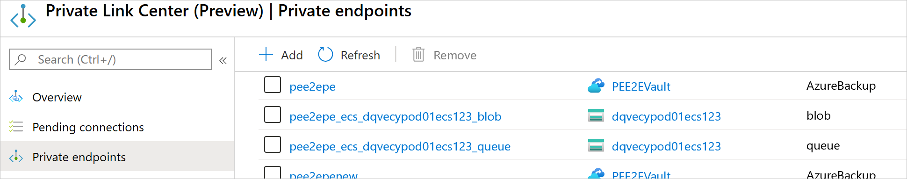

DNS zone for the Backup service (`privatelink.<geo>.backup.windowsazure.com`):

1. Navigate to your private endpoint for Backup in the **Private Link Center**. The overview page lists the FQDN and private IPs for your private endpoint.

1. Add one entry for each FQDN and private IP as an A type record.

    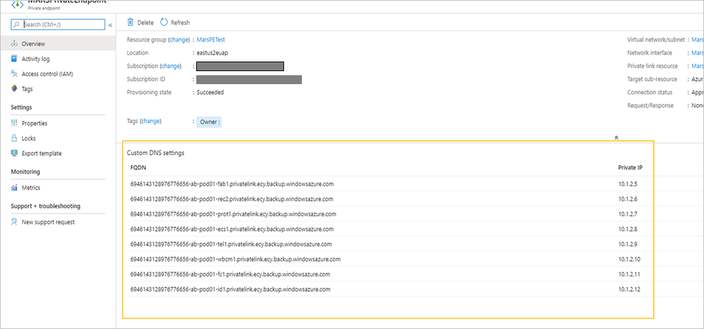

DNS zone for the Blob service (`privatelink.blob.core.windows.net`):

1. Navigate to your private endpoint for Blob in the **Private Link Center**. The overview page lists the FQDN and private IPs for your private endpoint.

1. Add an entry for the FQDN and private IP as an A type record.

    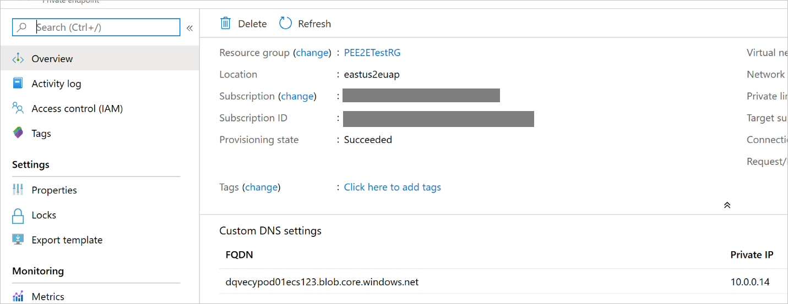

DNS zone for the Queue service (`privatelink.queue.core.windows.net`):

1. Navigate to your private endpoint for Queue in the **Private Link Center**. The overview page lists the FQDN and private IPs for your private endpoint.

1. Add an entry for the FQDN and private IP as an A type record.

    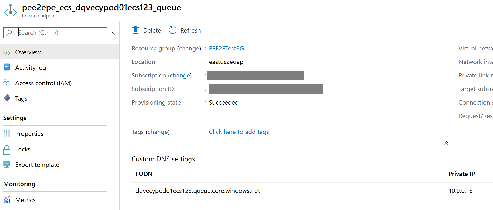

## Frequently Asked Questions

Q. Can I create a private endpoint for an existing Backup vault?<br>
A. No, private endpoints can be created for new Backup vaults only. So the vault must not have ever had any items protected to it. In fact, no attempts to protect any items to the vault can be made before creating private endpoints.

Q. I tried to protect an item to my vault, but it failed and the vault still doesn't contain any items protected to it. Can I create private endpoints for this vault?<br>
A. No, the vault must not have had any attempts to protect any items to it in the past.

Q. I have a vault that is using private endpoints for backup and restore. Can I later add or remove private endpoints for this vault even if I have backup items protected to it?<br>
A. Yes. If you already created private endpoints for a vault and protected backup items to it, you can later add or remove private endpoints as required.

Q. Can the private endpoint for Azure Backup also be used for Azure Site Recovery?<br>
A. No, the private endpoint for Backup can only be used for Azure Backup. You'll need to create a new private endpoint for Azure Site Recovery, if it's supported by the service.

Q. I missed one of the steps in this article and went on to protect my data source. Can I still use private endpoints?<br>
A. Not following the steps in the article and continuing to protect items may lead to the vault not being able to use private endpoints. It's therefore recommended you refer to this checklist before proceeding to protect items.

Q. Can I use my own DNS server instead of using the Azure private DNS zone or an integrated private DNS zone?<br>
A. Yes, you can use your own DNS servers. However, make sure all required DNS records are added as suggested in this section.

Q. Do I need to perform any additional steps on my server after I've followed the process in this article?<br>
A. After following the process detailed in this article, you don't need to do additional work to use private endpoints for backup and restore.

## Next steps

- Read about all the [security features in Azure Backup](security-overview.md)
