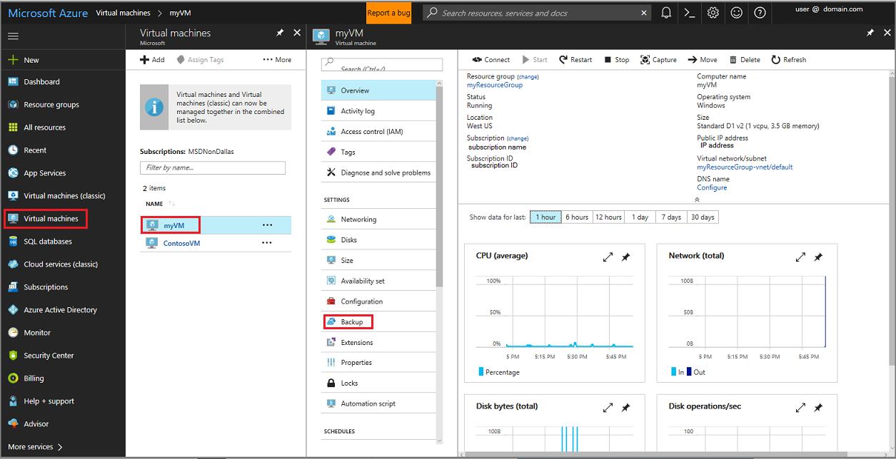
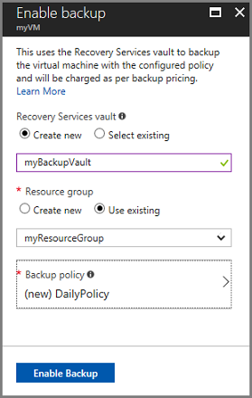
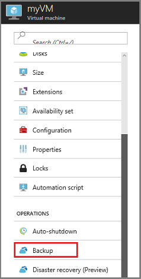
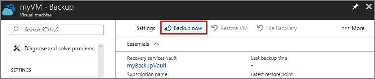
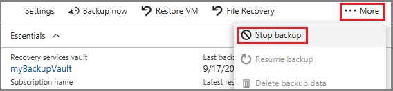
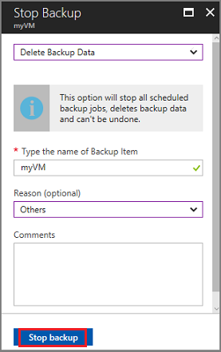

# Back up Azure virtual machines with the Azure portal

Backing up your data is a good practice for business and data continuity. In Azure you back up data to a storage entity called a Recovery Services vault. It is easy to use the Azure portal to back up a virtual machine; the Backup service is integrated into the virtual machine service. This article details using the Azure portal to create the Recovery Services vault and then back up a virtual machine.

If you don't have an Azure subscription, create a [free account](https://azure.microsoft.com/free/?WT.mc_id=A261C142F) before you begin. 

## Sign in to Azure

Sign in to the Azure portal at http://portal.azure.com.

This quickstart assumes you already have a virtual machine running in Azure. If you don't have a virtual machine in Azure, create one using the quickstart for [creating a Windows virtual machine in Azure](../virtual-machines/windows/quick-create-portal.md).

## Back up your virtual machine

1. In the menu on the left, select **Virtual machines**. The Virtual machines menu opens.

2. From the Virtual machines menu, select **myVM**. The menu for **myVM** opens.

3. In the **myVM** menu, in the *Settings* section, click **Backup** to open the **Enable backup** menu. It may be necessary to scroll down the menu to see Backup.  

  

4. In the **Enable backup** menu, make the following selections to create a new vault in the same resource group and location as the virtual machine:
  - For Recovery Services vault select **Create new** and enter **myBackupVault** as the name of the vault. 
  - For Resource group, select **Use existing** and choose **myResourceGroup** from the drop-down menu. The resource group, myResourceGroup, is the group containing the virtual machine, myVM. 
  - For Backup policy use **(new) DailyPolicy**
  - Click **Enable Backup** to create the vault and establish the policy.

    

## Create an initial backup

Though you enabled the schedule for backup policy, which backs up the virtual machine once a day, the first backup has not occurred. It is a good practice to trigger an initial backup so your virtual machine is protected. Triggering the backup activity generates a restore point. Restore points are also called recovery points. Use the following steps to trigger the initial backup. 

1. On the myVM menu, click **Backup** to open the Backup dashboard.  

  

2. On the **Backup** dashboard click **Backup now**.

  

  The **Backup Now** menu opens. The backup job you are triggering isn't handled by the backup policy. For this reason, you must specify how long to retain the restore point.

3. On the **Backup Now** menu, enter the date of the last day to retain the recovery point, and click **Backup**. 

  The initial backup takes a while to complete. It may take as long as 20 minutes or more to create the restore point. Once the restore point has been created, you see it in the Restore points tile on the Backup dashboard.

  

## Clean up resources

If you are going to continue on to a Backup tutorial that explains how to restore data for your virtual machine, go to Next steps. If you are not going to use the backup data or the Recovery Services vault, then use the following steps to delete the restore points and your Recovery Services vault.

1. On the myVM menu, click **Backup** to open the Backup dashboard.  

  

2. In the Backup dashboard, click **...More** to show additional options, then click **Stop backup** to open the Stop Backup menu.  

  

3. In the Stop Backup menu, select the upper drop-down menu and choose **Delete Backup Data**. 

4. In the **Type the name of the Backup item** dialog, type *myVM*. 

5. Once the backup item is verified, the Stop backup button is enabled. Click **Stop Backup** to delete the restore point and the Recovery Services vault. 

  

In this quickstart you learned how to:

  > [!div class="checklist"]
> * Create a recovery services vault
> * Schedule a daily backup
> * Trigger the initial backup for a virtual machine

## Next steps
To learn more, see the tutorial for backing up multiple virtual machines.

> [!div class="nextstepaction"]
> [Back up virtual machines at scale](tutorial-backup-azure-vm.md)
