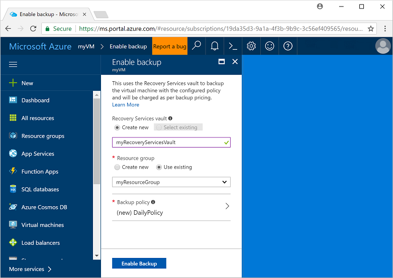
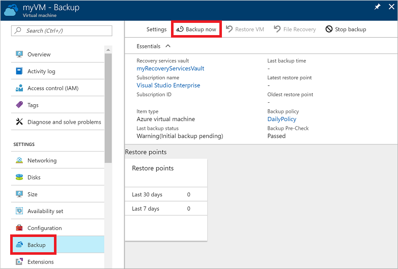
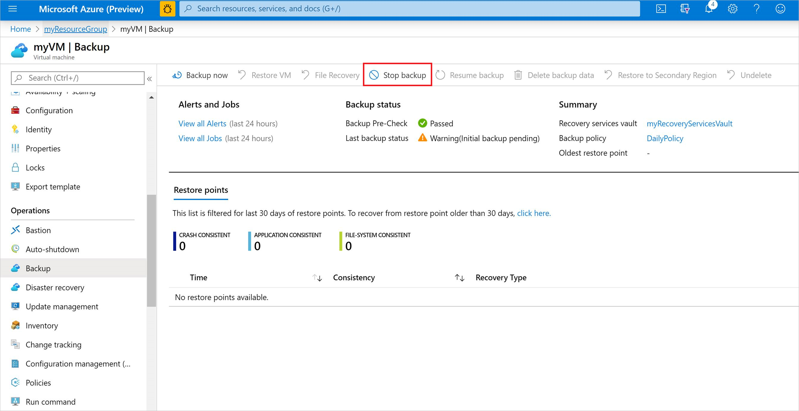

# Back up a virtual machine in Azure
Azure backups can be created through the Azure portal. This method provides a browser-based user interface to create and configure Azure backups and all related resources. You can protect your data by taking backups at regular intervals. Azure Backup creates recovery points that can be stored in geo-redundant recovery vaults. This article details how to back up a virtual machine (VM) with the Azure portal. 

This quickstart enables backup on an existing Azure VM. If you need to create a VM, you can [create a VM with the Azure portal](../virtual-machines/windows/quick-create-portal.md).

## Log in to Azure

Log in to the Azure portal at https://portal.azure.com.

## Select a VM to back up
Create a simple scheduled daily backup to a Recovery Services Vault. 

1. In the menu on the left, select **Virtual machines**. 
2. From the list, choose a VM to back up. If you used the sample VM quickstart commands, the VM is named *myVM* in the *myResourceGroup* resource group.
3. In the **Operations** section, choose **Backup**. The **Enable backup** window opens.

## Enable backup on a VM
A Recovery Services vault is a logical container that stores the backup data for each protected resource, such as Azure VMs. When the backup job for a protected resource runs, it creates a recovery point inside the Recovery Services vault. You can then use one of these recovery points to restore data to a given point in time.

1. Select **Create new** and provide a name for the new vault, such as *myRecoveryServicesVault*.
2. If not already selected, choose **Use existing**, then select the resource group of your VM from the drop-down menu.

    

    By default, the vault is set for Geo-Redundant storage. To further protect your data, this storage redundancy level ensures that your backup data is replicated to a secondary Azure region that is hundreds of miles away from the primary region.

    You create and use policies to define when a backup job runs and how long the recovery points are stored. The default protection policy runs a backup job each day and retains recovery points for 30 days. You can use these default policy values to quickly protect your VM. 

3. To accept the default backup policy values, select **Enable Backup**.

It takes a few moments to create the Recovery Services vault.

## Start a backup job
You can start a backup now rather than wait for the default policy to run the job at the scheduled time. This first backup job creates a full recovery point. Each backup job after this initial backup creates incremental recovery points. Incremental recovery points are storage and time-efficient, as they only transfer changes made since the last backup.

1. On the **Backup** window for your VM, select **Backup now**.

    

2. To accept the backup retention policy of 30 days, leave the default **Retain Backup Till** date. To start the job, select **Backup**.

## Monitor the backup job
In the **Backup** window for your VM, the status of the backup and number of completed restore points are shown. Once the VM backup job is complete, information on the **Last backup time**, **Latest restore point**, and **Oldest restore point** is shown on the right-hand side of the **Overview** window.

## Clean up deployment
When no longer needed, you can disable protection on the VM, remove the restore points and Recovery Services vault, then delete the resource group and associated VM resources

If you are going to continue on to a Backup tutorial that explains how to restore data for your VM, skip the steps in this section and go to [Next steps](#next-steps).

1. Select the **Backup** option for your VM.

2. Select **...More** to show additional options, then choose **Stop backup**.

    

3. Select **Delete Backup Data** from the drop-down menu.

4. In the **Type the name of the Backup item** dialog, enter your VM name, such as *myVM*. Select **Stop Backup**.

    Once the VM backup has been stopped and recovery points removed, you can delete the resource group. If you used an existing VM, you may wish to leave the resource group and VM in place.

5. In the menu on the left, select **Resource groups**. 
6. From the list, choose your resource group. If you used the sample VM quickstart commands, the resource group is named *myResourceGroup*.
7. Select **Delete resource group**. To confirm, enter the resource group name, then select **Delete**.

    

## Next steps
In this quickstart, you created a Recovery Services vault, enabled protection on a VM, and created the initial recovery point. To learn more about Azure Backup and Recovery Services, continue to the tutorials.

> [!div class="nextstepaction"]
> [Back up multiple Azure VMs](./tutorial-backup-vm-at-scale.md)
