# Restore Azure file shares

This article explains how to use the Azure portal to restore an entire file share or specific files from a restore point created by [Azure Backup](https://docs.microsoft.com/azure/backup/backup-overview).

In this article, you'll learn how to:

* Restore a full Azure file share.
* Restore individual files or folders.
* Track the restore operation status.

## Steps to perform a restore operation

To perform a restore operation, follow these steps.

### Select the file share to restore

1. In the [Azure portal](https://portal.azure.com/), open the Recovery Services vault you used to configure backup for the file share.

1. In the overview pane, select **Backup items** under the **Protected items** section.

    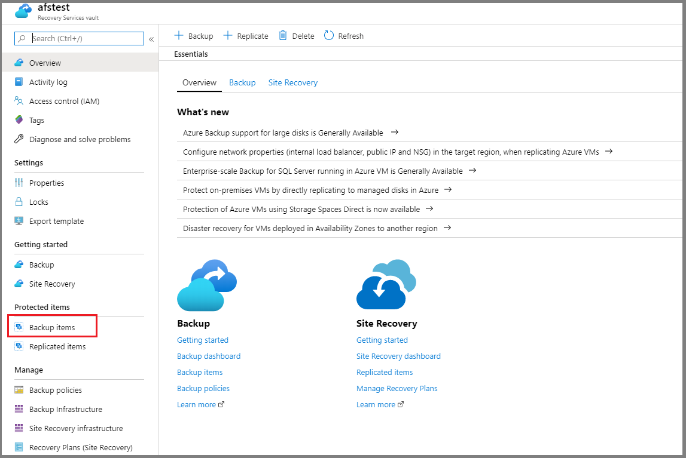

1. After you select **Backup items**, a new pane that lists all backup management types opens next to the overview pane.

    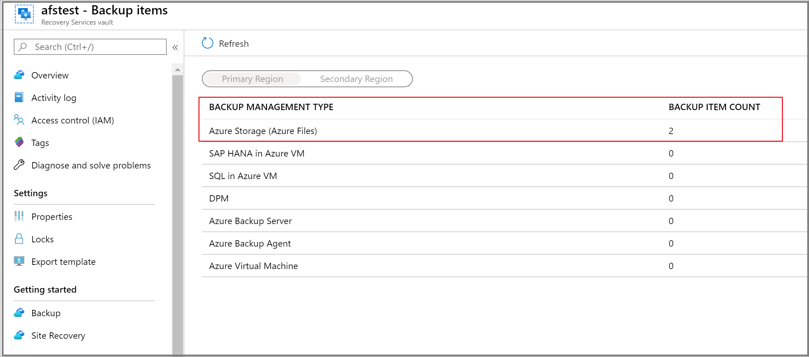

1. In the **Backup Items** pane, under **Backup Management Type**, select **Azure Storage (Azure Files)**. You'll see a list of all the file shares and their corresponding storage accounts backed up by using this vault.

    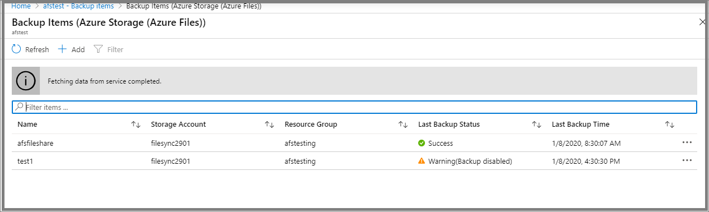

1. From the list of Azure file shares, select the file share for which you want to perform the restore operation.

### Full share recovery

You can use this restore option to restore the complete file share in the original location or an alternate location.

1. Select the **Restore Share** option in the **Backup Item** pane that appears after you selected the file share to restore in step 5 of the [Select the file share to restore](#select-the-file-share-to-restore) section.

   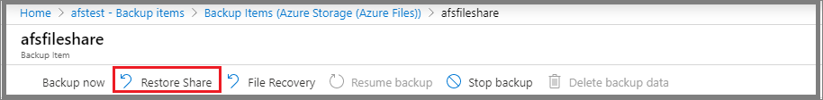

1. After you select **Restore Share**, the **Restore** pane opens. To select the restore point you want to use for performing the restore operation, click  the **Select** link text below the **Restore Point** text box.

    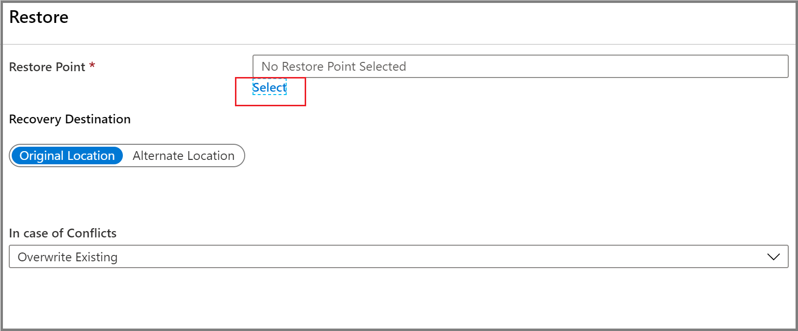

1. The **Select Restore Point** context pane opens on the right, listing the restore points available for the selected file share. Select the restore point you want to use to perform the restore operation, and select **OK**.

    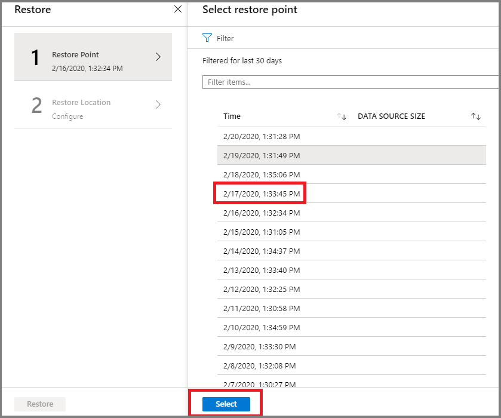

    >[!NOTE]
    >By default, the **Select Restore Point** pane lists restore points from the last 30 days. If you want to look at the restore points created during a specific duration, please specify the range by selecting the appropriate **Start Time** and **End Time** and click the **Refresh** button.

1. The next step is to choose the **Restore Location**. In the **Recovery Destination** section, specify where or how to restore the data. Select one of the following two options by using the toggle button:

    * **Original Location**: Restore the complete file share to the same location as the original source.
    * **Alternate Location**: Restore the complete file share to an alternate location and keep the original file share as is.

#### Restore to the original location

1. Select **Original Location** as the **Recovery Destination**, and select whether to skip or overwrite if there are conflicts, by choosing the appropriate option from the **In case of Conflicts** drop-down list.

1. Select **Restore** to start the restore operation.

    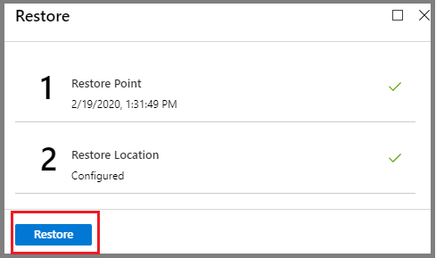

#### Restore to an alternate location

1. Select **Alternate Location** as the **Recovery Destination**.
1. Select the destination storage account where you want to restore the backed-up content from the **Storage Account** drop-down list.
1. The **Select File Share** drop-down list displays the file shares present in the storage account you selected in step 2. Select the file share where you want to restore the backed-up contents.
1. In the **Folder Name** box, specify a folder name you want to create in the destination file share with the restored contents.
1. Select whether to skip or overwrite if there are conflicts.
1. After you enter the appropriate values in all boxes, select **Restore** to start the restore operation.

    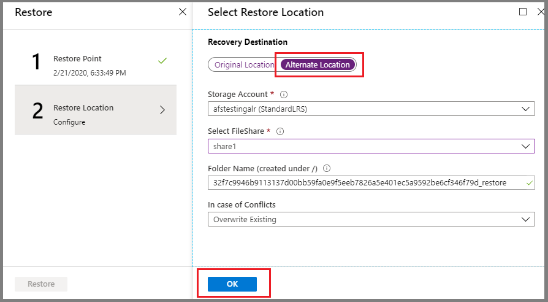

### Item-level recovery

You can use this restore option to restore individual files or folders in the original location or an alternate location.

1. Select the **File Recovery** option in the **Backup Item** pane that appears after you selected the file share to restore in step 5 of the [Select the file share to restore](#select-the-file-share-to-restore) section.

    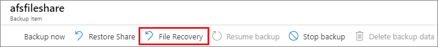

1. After you select **File Recovery**, the **Restore** pane opens. To select the restore point you want to use for performing the restore operation, click the **Select** link text below the **Restore Point** text box.

    

1. The **Select Restore Point** context pane opens on the right, listing the restore points available for the selected file share. Select the restore point you want to use to perform the restore operation, and select **OK**.

    

1. The next step is to choose the **Restore Location**. In the **Recovery Destination** section, specify where or how to restore the data. Select one of the following two options by using the toggle button:

    * **Original Location**: Restore selected files or folders to the same file share as the original source.
    * **Alternate Location**: Restore selected files or folders to an alternate location and keep the original file share contents as is.

#### Restore to the original location

1. Select **Original Location** as the **Recovery Destination**, and select whether to skip or overwrite if there are conflicts by choosing the appropriate option from the **In case of conflicts** drop-down list.

    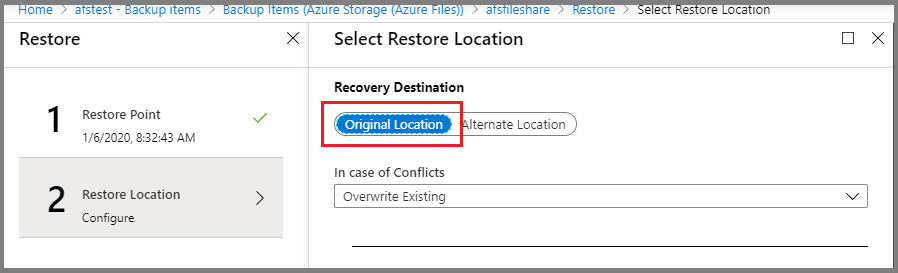

1. To select the files or folders you want to restore, click the **Add File** button. This will open a context pane on the right, displaying the contents of the file share recovery point you selected for restore.

    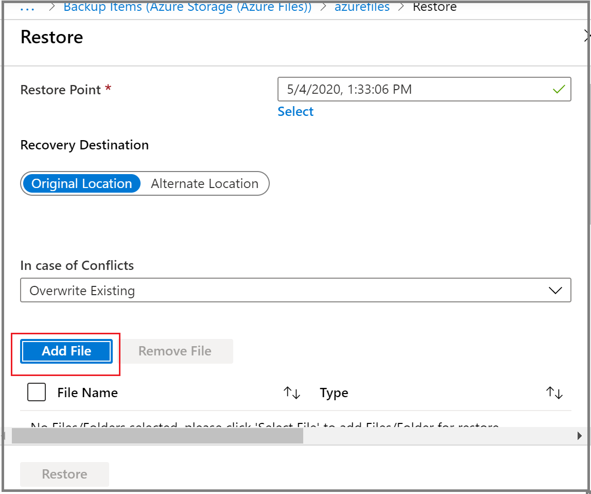

1. Select the check box that corresponds to the file or folder you want to restore, and choose **Select**.

    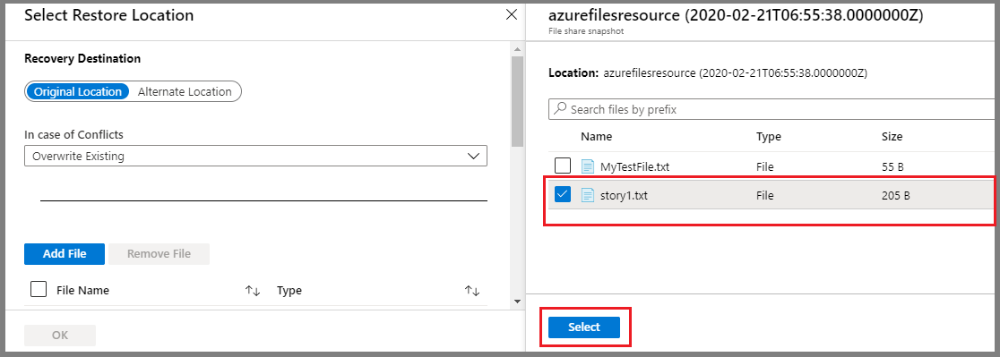

1. Repeat steps 2 through 4 to select multiple files or folders for restore.
1. After you select all the items you want to restore, select **Restore** to start the restore operation.

    

#### Restore to an alternate location

1. Select **Alternate Location** as the **Recovery Destination**.
1. Select the destination storage account where you want to restore the backed-up content from the **Storage Account** drop-down list.
1. The **Select File Share** drop-down list displays the file shares present in the storage account you selected in step 2. Select the file share where you want to restore the backed-up contents.
1. In the **Folder Name** box, specify a folder name you want to create in the destination file share with the restored contents.
1. Select whether to skip or overwrite if there are conflicts.
1. To select the files or folders you want to restore, click the **Add File** button. This will open a context pane on the right displaying the contents of the file share recovery point you selected for restore.

    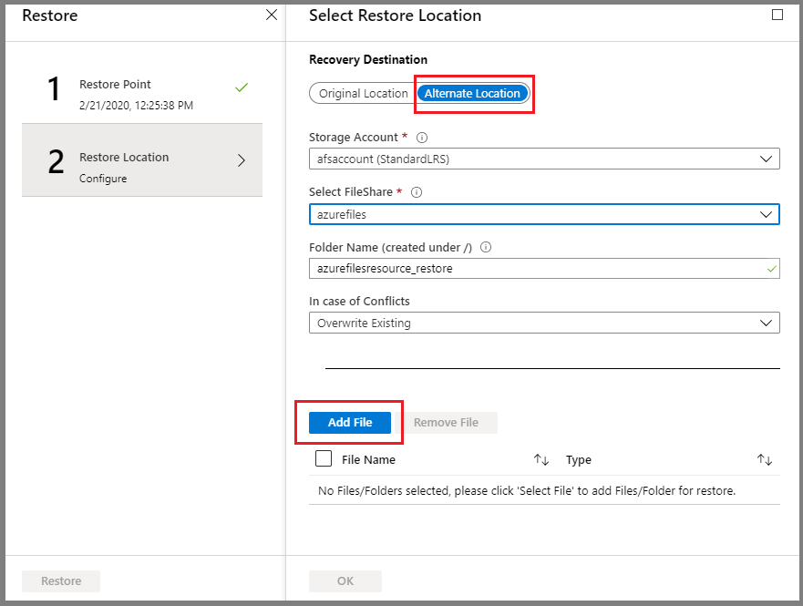

1. Select the check box that corresponds to the file or folder you want to restore, and choose **Select**.

    

1. Repeat steps 6 through 8 to select multiple files or folders for restore.
1. After you select all the items you want to restore, select **Restore** to start the restore operation.

    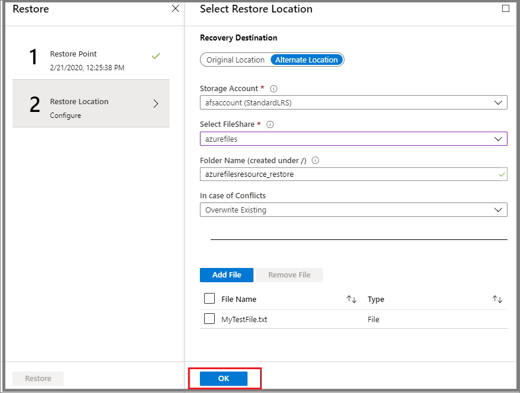

## Track a restore operation

After you trigger the restore operation, the backup service creates a job for tracking. Azure Backup displays notifications about the job in the portal. To view operations for the job, select the notifications hyperlink.

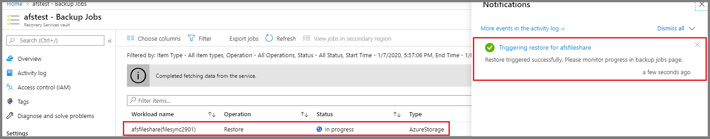

You can also monitor restore progress from the Recovery Services vault:

1. Open the Recovery Services vault from where you triggered the restore operation.
1. In the overview pane, select **Backup Jobs** under the **Monitoring** section to see the status of operations running against different workloads.

    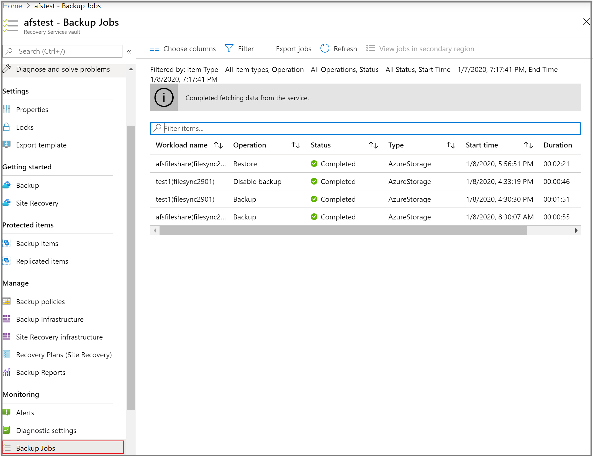

1. Select the workload name that corresponds to your file share to view more details about the restore operation, like **Data Transferred** and **Number of Restored Files**.

    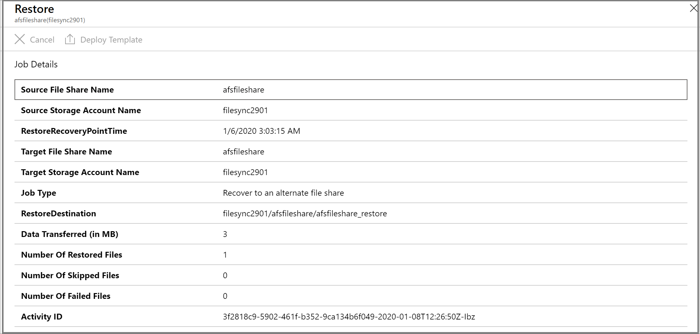

## Next steps

* Learn how to [Manage Azure file share backups](manage-afs-backup.md).
