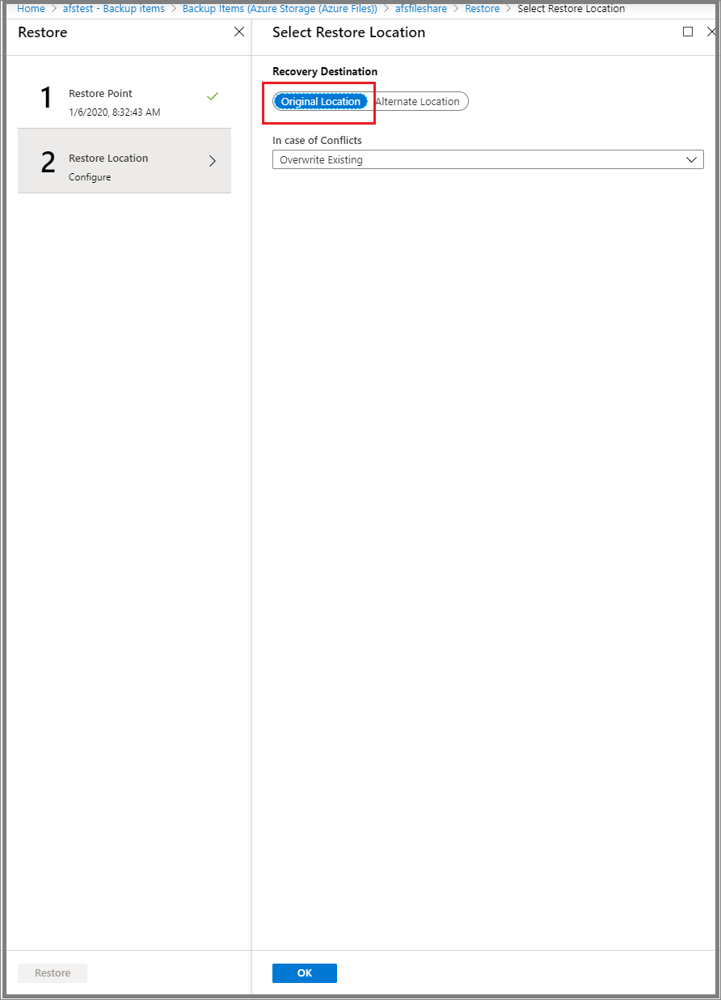
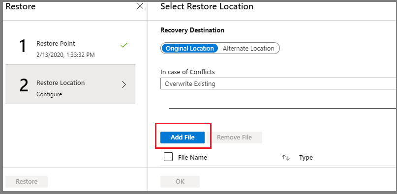
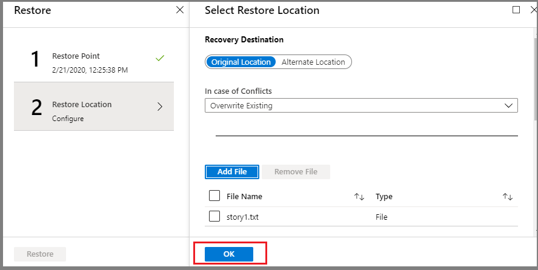

# Restore Azure file shares

This article explains how to use the Azure portal to restore an entire file share or specific files from a restore point created by the [Azure Backup](https://docs.microsoft.com/azure/backup/backup-overview) service.

In this guide you'll learn how to:

* Restore a full Azure file share
* Restore individual files or folders
* Track the Restore Operation status

## Steps to perform Restore

### Select the file share to restore

1. In the [Azure portal](https://portal.azure.com/), open the Recovery Services Vault you used to configure backup for the file share.

2. Click **Backup Items** under the **Protected Items** section of the **Overview** blade.

    

3. Once you click **Backup Items**, a new blade listing all Backup Management Types is displayed next to the **Overview** blade as seen below:

    

4. In **Backup Items**, under **Backup Management Type**, select **Azure Storage (Azure Files)**. You'll see a list of all the file shares and their corresponding storage account backed up using this vault.

    

5. From the list of Azure file shares, select the desired file share for which you want to perform the restore operation.

### Full Share Recovery

You can use this restore option to restore the complete file share in the original or an alternate location.

1. Select the **Restore share** option from the **Backup Item** blade that appears after selecting the desired file share to restore in Step 5 of the [Select the file share to restore](#select-the-file-share-to-restore) section.

   

2. Once you click **Restore Share**, the **Restore** blade opens with a **Restore point** menu displaying list of restore points available for the selected file share.

3. Select the restore point you want to use for performing restore operation and click **OK**.

    

4. Once you click OK, the restore blade menu switches to **Restore Location**. In **Restore Location**, specify where (or how) to restore the data. You can choose one of the following two options:

    * **Original Location**: Restore the complete file share to the same location as the original source.
    * **Alternate Location**: Restore the complete file share to an alternate location and keep the original file share **as is**.

#### Restore to Original Location

1. Choose **Original Location** as the **Recovery Destination** and select whether to skip or overwrite if there are conflicts. Click **OK** after making appropriate selection.

    

2. Click **Restore** to start the restore operation.

    

#### Restore to an Alternate Location

1. Choose **Alternate location** as the recovery destination.
2. Select the destination storage account, where you want to restore the backed-up content, from the drop-down menu of the **Storage Account** field.
3. Based on the storage account you selected in step 2, the **Select File Share** drop-down menu will display the list of file shares present in the selected storage account. Select the file share where you want to restore the backed-up contents.
4. In the **Folder Name** field, specify a folder name you want to create in the destination file share with the restored contents.
5. Select whether to skip or overwrite if there are conflicts.
6. Click **OK** after entering appropriate values in all fields.

    

7. Click restore to start the restore operation.

    

### Item Level Recovery

You can use this restore option to restore individual files or folders in the original or an alternate Location.

1. Select the **File Recovery** option from the **Backup Item** blade that appears after selecting the desired file share to restore in Step 5 of the [Select the file share to restore](#select-the-file-share-to-restore) section.

    

2. Once you click **File Recovery**, the **Restore** blade opens with a **Restore point** menu displaying a list of restore points available for the selected file share.

3. Select the restore point you want to use for performing restore operation and click **OK**.

    

4. Once you click OK, the restore blade menu switches to **Restore Location**. In **Restore Location**, specify where (or how) to restore the data. You can choose one of the following two options:

    * **Original Location**: Restore selected files/folders to the same file share as the original source.
    * **Alternate Location**: Restore selected files/folders to an alternate location and keep the original file share contents **as is**.

#### Restore to original location

1. Choose **Original Location** as the **Recovery Destination** and select whether to skip or overwrite if there are conflicts.

    

2. Click **Select File** to choose the files/folders you want to restore.

    

3. When you click **Select File**, a file share blade, displaying the contents of the file share recovery point you selected for restore, is displayed.

4. Check the box corresponding to file/folder you want to restore and click **Select**.

    

5. Repeat steps 2-4 to select multiple files/folders for restore.
6. After selecting all the items you want to restore, click **OK**.

    

7. Click Restore to start the restore operation.

    

#### Restore to an alternate location

1. Choose **Alternate location** as the recovery destination.
2. Select the destination storage account, where you want to restore the backed-up content, from the drop-down menu of the **Storage Account** field.
3. Based on the storage account you selected in step 2, the **Select File Share** drop-down menu will display the list of the file shares present in the selected storage account. Select the file share where you want to restore the backed-up contents.
4. In the **Folder Name** field, specify a folder name you want to create in the destination file share with the restored contents.
5. Select whether to skip or overwrite if there are conflicts.
6. Click **Select File** to choose the files/folders you want to restore.

    

7. When you click **Select File**, a file share blade, displaying the contents of the file share recovery point you selected for restore, is displayed.
8. Check the box corresponding to the file/folder you want to restore and click **Select**.

    

9. Repeat steps 6-8 to select multiple files/folders for restore.
10. After selecting all the items you want to restore, click **OK**.

    [Click OK after selecting all files](./media/restore-afs/after-selecting-all-items.png)

11. Click **Restore** to start the restore operation.

## Track Restore Operation

After you trigger the restore operation, the backup service creates a job for tracking. Azure Backup displays notifications about the job in the portal. To view operations for the job, click the notifications hyperlink.

You can also monitor restore progress from the Recovery services vault. Here are the steps to check the restore operation status:

1. Open the Recovery Services vault from where you triggered the restore operation.
2. Click **Backup Jobs** under the **Monitoring Section** of the **Overview** blade to see the status of operations running against different workloads.

    

3. Click the workload name corresponding to your file share in order to view more details about the restore operation, like Data Transferred, Number of Restored Files, etc.

    

## Next steps

* Learn how to [Manage Azure file share backups](manage-afs-backup.md)
