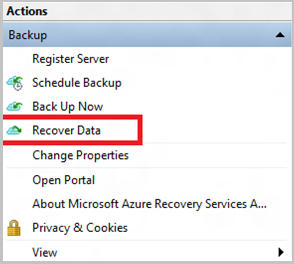
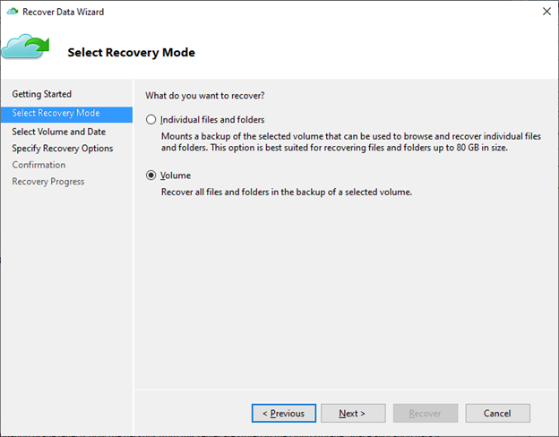
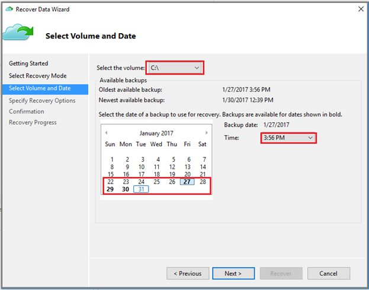
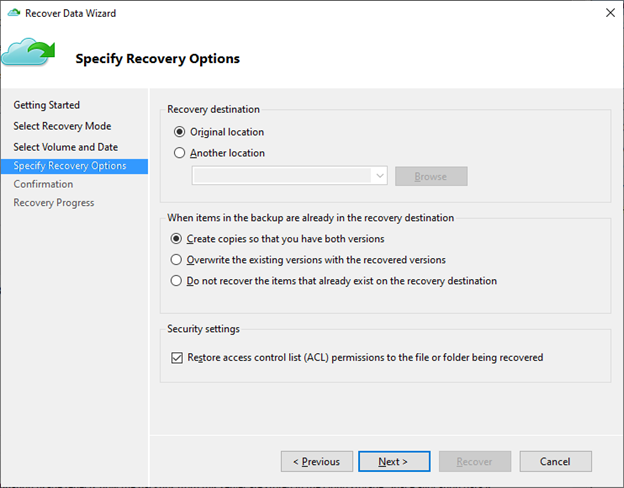
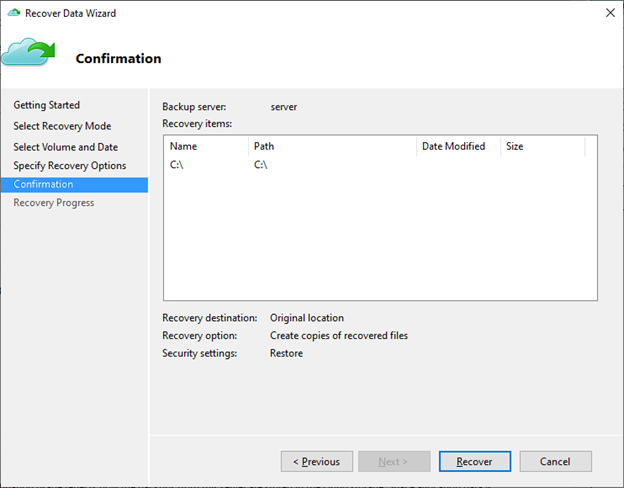

# Restore all the files in a volume using the MARS Agent

This article explains how to restore all backed-up files in an entire volume using the Recover Data wizard in the Microsoft Azure Recovery Services (MARS) Agent. You can:

- Restore all backed-up files in a volume to the same machine from which the backups were taken.
- Restore all backed-up files in a volume to an alternate machine.

>[!TIP]
>The **Volume** option recovers all backed up data in a specified volume. This option provides faster transfer speeds (up to 40 MBps), and is recommended for recovering large-sized data or entire volumes.
>
>The **Individual files and folders option** allows for quick access to the recovery point data. It's suitable for recovering individual files, and is recommended for a total size of less than 80 GB. It offers transfer or copy speeds up to 6 MBps during recovery.

## Volume level restore to the same machine

The following steps will help you recover all backed-up files in a volume:

1. Open the **Microsoft Azure Backup** snap-in. If you don't know where the snap-in was installed, search the computer or server for **Microsoft Azure Backup**. The desktop app should appear in the search results.

1. Select **Recover Data** to start the wizard.

    

1. On the **Getting Started** page, to restore the data to the same server or computer, select **This server (server name)** > **Next**.

    

1. On the **Select Recovery Mode** page, choose **Volume** > **Next**.

    

1. On the **Select Volume and Date** page, select the volume you want to restore.

    On the calendar, select a recovery point. Dates in **bold** indicate the availability of at least one recovery point. If multiple recovery points are available within a single date, choose the specific recovery point from the **Time** drop-down menu.

     

1. On the **Specify Recovery Options** page, configure the restore behavior.
    1. Choose the recovery destination:
        - **Original location**: Restore data to the original path.
        - **Another location**: Specify an alternate location to restore the data to.
    1. Choose the behavior for **When items in the backup are already in the recovery destination**:
        - **Create copies so that you have both versions**: If a file with same name already exists, data in the recovery point will be restored as a copy. The copy will have a localized file name prefix using the local restore job time in one of the following formats:
            - `YYYY-MM-DD HH-mm Copy of <original file name>`
            - `YYYY-MM-DD HH-mm Copy (n) of <original file name>`
        - **Overwrite existing versions with recovered versions**: If a file with same name already exists, the contents are replaced with data in the recovery point.
        - **Do not recover the items that already exist on the recovery destination**: If a file with same name already exists, it's skipped.
    1. **Enable Restore access control list (ACL) permissions to the file or folder being recovered** if the file should be restored with the original permissions in the recovery point.
        

1. Verify the details of the recovery on the **Confirmation** pane and select **Recover**.

    

1. On the **Recovery Progress** page, monitor the progress of the recovery job. The wizard can also be safely closed, and the recovery operation will continue in the background. You can view the progress again by double-clicking the Recovery job in the dashboard.

## Volume level restore to an alternate machine

The following steps will help you recover all backed-up files in a volume to an alternate machine. You can use these steps to recover data from Azure Backup if your entire server is lost.

These steps include the following terminology:

- *Source machine* – The original machine from which the backup was taken, and which is currently unavailable.
- *Target machine* – The machine to which the data is being recovered.
- *Sample vault* – The Recovery Services vault to which the source machine and target machine are registered.

> [!NOTE]
> Backups can't be restored to a target machine that's running an earlier version of the operating system. For example, a backup taken from a Windows 7 computer can be restored on a Windows 7 (or later) computer. A backup taken from a Windows 10 computer can't be restored to a Windows 7 computer.

1. Open the **Microsoft Azure Backup** snap-in on the target machine.

1. Ensure that the target machine and the source machine are registered to the same Recovery Services vault.

1. Select **Recover Data** to open the **Recover Data Wizard**.

    

1. On the **Getting Started** page, select **Another server**.

    

1. Provide the vault credential file that corresponds to the sample vault, and select **Next**.

    If the vault credential file is invalid (or expired), [download a new vault credential file from the sample vault](backup-azure-file-folder-backup-faq.yml#where-can-i-download-the-vault-credentials-file-) in the Azure portal. After you provide a valid vault credential, the name of the corresponding backup vault appears.

1. On the **Select Backup Server** page, select the source machine from the list of displayed machines, and provide the passphrase. Then select **Next**.

    

1. On the **Select Recovery Mode** page, choose **Volume** > **Next**.

    

1. On the **Select Volume and Date** page, select the volume you want to restore.

    On the calendar, select a recovery point. Dates in **bold** indicate the availability of at least one recovery point. If multiple recovery points are available within a single date, choose the specific recovery point from the **Time** drop-down menu.

     

1. On the **Specify Recovery Options** page, configure the restore behavior.
    1. Choose the recovery destination:
        - **Original location**: Restore data to the original path.
        - **Another location**: Specify an alternate location to restore the data to.
    1. Choose the behavior for **When items in the backup are already in the recovery destination**:
        - **Create copies so that you have both versions**: If a file with same name already exists, data in the recovery point will be restored as a copy. The copy will have a localized file name prefix using the local restore job time in one of the following formats:
            - `YYYY-MM-DD HH-mm Copy of <original file name>`
            - `YYYY-MM-DD HH-mm Copy (n) of <original file name>`
        - **Overwrite existing versions with recovered versions**: If a file with same name already exists, the contents are replaced with data in the recovery point.
        - **Do not recover the items that already exist on the recovery destination**: If a file with same name already exists, it's skipped.
    1. **Enable Restore access control list (ACL) permissions to the file or folder being recovered** if the file should be restored with the original permissions in the recovery point.
        

1. Verify the details of the recovery on the **Confirmation** pane and select **Recover**.

    

1. On the **Recovery Progress** page, monitor the progress of the recovery job. The wizard can also be safely closed, and the recovery operation will continue in the background. You can view the progress again by double-clicking the Recovery job in the dashboard.

## Next steps

- Now that you've recovered your files and folders, you can [manage your backups](backup-azure-manage-windows-server.md).
- Find [common questions about backing up files and folders](backup-azure-file-folder-backup-faq.yml).
