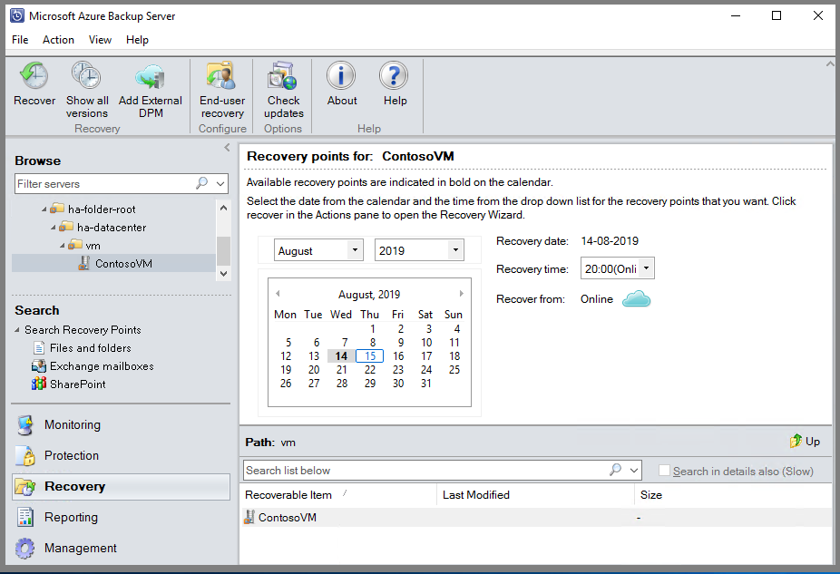
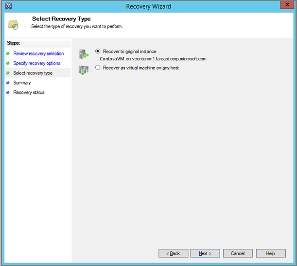
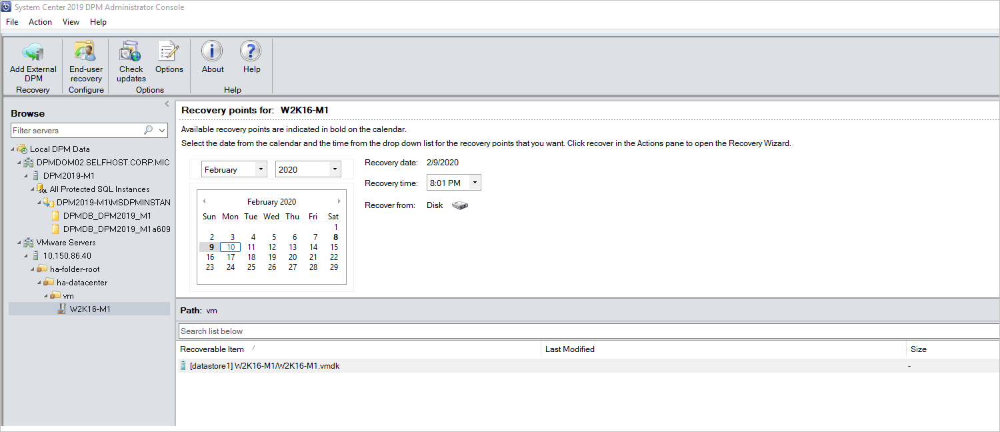
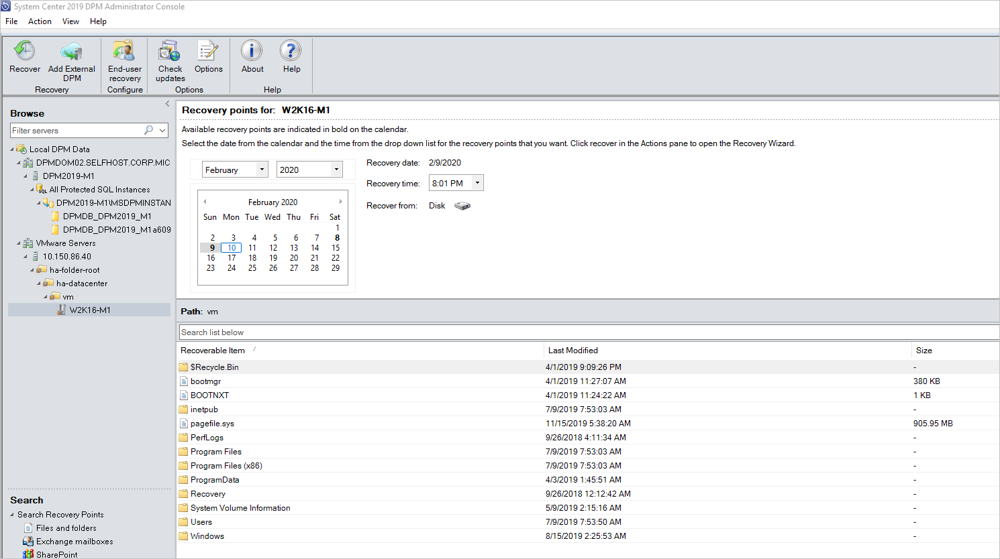
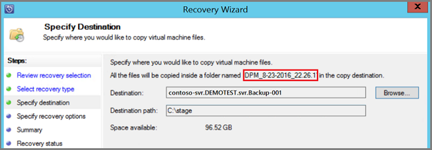

# Restore VMware virtual machines

This article explains how to use Microsoft Azure Backup Server (MABS) to restore VMware VM recovery points. For an overview on using MABS to recover data, see [Recover protected data](./backup-azure-alternate-dpm-server.md). In the MABS Administrator Console, there are two ways to find recoverable data - search or browse. When recovering data, you may, or may not want to restore data or a VM to the same location. For this reason, MABS supports three recovery options for VMware VM backups:

* **Original location recovery (OLR)** - Use OLR to restore a protected VM to its original location. You can restore a VM to its original location only if no disks have been added or deleted, since the backup occurred. If disks have been added or deleted, you must use alternate location recovery.

* **Alternate location recovery (ALR)** - When the original VM is missing, or you don't want to disturb the original VM, recover the VM to an alternate location. To recover a VM to an alternate location, you must provide the location of an ESXi host, resource pool, folder, and the storage datastore and path. To help differentiate the restored VM from the original VM, MABS appends "-Recovered" to the name of the VM.

* **Individual file location recovery (ILR)** - If the protected VM is a Windows Server VM, individual files/folders inside the VM can be recovered using MABS’s ILR capability. To recover individual files, see the procedure later in this article.

## Restore a recovery point

1. In the MABS Administrator Console, select **Recovery view**.

2. On the **Browse** pane, browse or filter to find the VM you want to recover. Once you select a VM or folder, the Recovery points for pane displays the available recovery points.

    

3. In the **Recovery points for** field, use the calendar and drop-down menus to select a date when a recovery point was taken. Calendar dates in bold have available recovery points.

4. On the tool ribbon, select **Recover** to open the **Recovery Wizard**.

    

5. Select **Next** to advance to the **Specify Recovery Options** screen.

6. On the **Specify Recovery Options** screen, if you want to enable network bandwidth throttling, select **Modify**. To leave network throttling disabled, select **Next**. No other options on this wizard screen are available for VMware VMs. If you choose to modify the network bandwidth throttle, in the Throttle dialog, select **Enable network bandwidth usage throttling** to turn it on. Once enabled, configure the **Settings** and **Work Schedule**.

7. On the **Select Recovery Type** screen, choose whether to recover to the original instance, or to a new location. Then select **Next**.

     * If you choose **Recover to original instance**, you don't need to make any more choices in the wizard. The data for the original instance is used.

     * If you choose **Recover as virtual machine on any host**, then on the **Specify Destination** screen, provide the information for **ESXi Host, Resource Pool, Folder,** and **Path**.

      

8. On the **Summary** screen, review your settings and select **Recover** to start the recovery process. The **Recovery status** screen shows the progression of the recovery operation.

## Restore an individual file from a VM

You can restore individual files from a protected VM recovery point. This feature is only available for Windows Server VMs. Restoring individual files is similar to restoring the entire VM, except you browse into the VMDK and find the file(s) you want, before starting the recovery process. To recover an individual file or select files from a Windows Server VM:

>[!NOTE]
>Restoring an individual file from a VM is available only for Windows VM and Disk Recovery Points.

1. In the MABS Administrator Console, select **Recovery** view.

2. On the **Browse** pane, browse or filter to find the VM you want to recover. Once you select a VM or folder, the **Recovery points for pane** displays the available recovery points.

    

3. In the **Recovery Points for:** pane, use the calendar to select the date that contains the desired recovery point(s). Depending on how the backup policy has been configured, dates can have more than one recovery point. Once you've selected the day when the recovery point was taken, make sure you've chosen the correct **Recovery time**. If the selected date has multiple recovery points, choose your recovery point by selecting it in the Recovery time drop-down menu. Once you chose the recovery point, the list of recoverable items appears in the **Path:** pane.

4. To find the files you want to recover, in the **Path** pane, double-click the item in the **Recoverable item** column to open it. Select the file, files, or folders you want to recover. To select multiple items, press the **Ctrl** key while selecting each item. Use the **Path** pane to search the list of files or folders appearing in the **Recoverable Item** column. **Search list below** doesn't search into subfolders. To search through subfolders, double-click the folder. Use the **Up** button to move from a child folder into the parent folder. You can select multiple items (files and folders), but they must be in the same parent folder. You can't recover items from multiple folders in the same recovery job.

    

5. Once you've selected the item(s) for recovery, in the Administrator Console tool ribbon, select **Recover** to open the **Recovery Wizard**. In the Recovery Wizard, the **Review Recovery Selection** screen shows the selected items to be recovered.

6. On the **Specify Recovery Options** screen, if you want to enable network bandwidth throttling, select **Modify**. To leave network throttling disabled, select **Next**. No other options on this wizard screen are available for VMware VMs. If you choose to modify the network bandwidth throttle, in the Throttle dialog, select **Enable network bandwidth usage throttling** to turn it on. Once enabled, configure the **Settings** and **Work Schedule**.
7. On the **Select Recovery Type** screen, select **Next**. You can only recover your file(s) or folder(s) to a network folder.
8. On the **Specify Destination** screen, select **Browse** to find a network location for your files or folders. MABS creates a folder where all recovered items are copied. The folder name has the prefix, MABS_day-month-year. When you select a location for the recovered files or folder, the details for that location (Destination, Destination path, and available space) are provided.

    

9. On the **Specify Recovery Options** screen, choose which security setting to apply. You can opt to modify the network bandwidth usage throttling, but throttling is disabled by default. Also, **SAN Recovery** and **Notification** aren't enabled.
10. On the **Summary** screen, review your settings and select **Recover** to start the recovery process. The **Recovery status** screen shows the progression of the recovery operation.

## VMware parallel restore in MABS v4 (and later)

MABS v4 supports restoring more than one VMware VMs protected from the same vCenter in parallel. By default, eight parallel recoveries are supported. You can increase the number of parallel restore jobs by adding the following registry key.

>[!Note]
>Before you increase the number of parallel recoveries, you need to consider the VMware performance. Considering the number of resources in use and additional usage required on VMware vSphere Server, you need to determine the number of recoveries to run in parallel.
>
>**Key Path**: `HKLM\ Software\Microsoft\Microsoft Data Protection Manager\Configuration\ MaxParallelRecoveryJobs`
>- **32 Bit DWORD**: VMware
>- **Data**: `<number>`. The value should be the number (decimal) of virtual machines that you select for parallel recovery.

## Next steps

For troubleshooting issues when using Azure Backup Server, review the [troubleshooting guide for Azure Backup Server](./backup-azure-mabs-troubleshoot.md).
