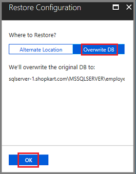
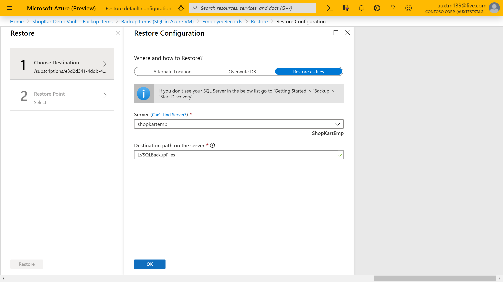
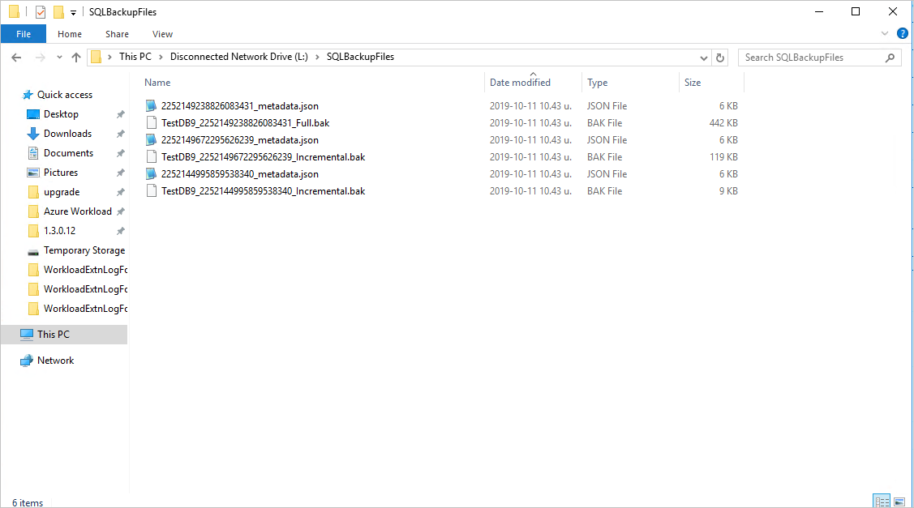
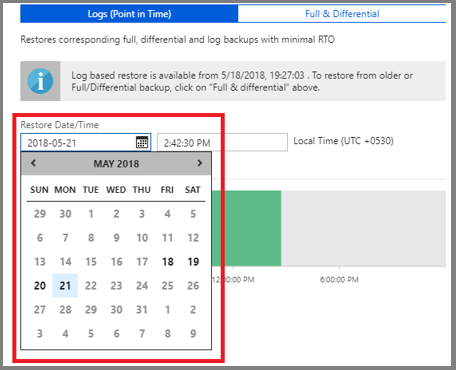
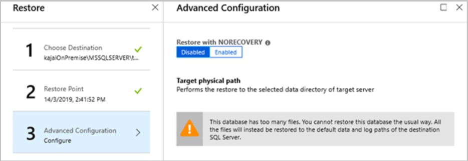
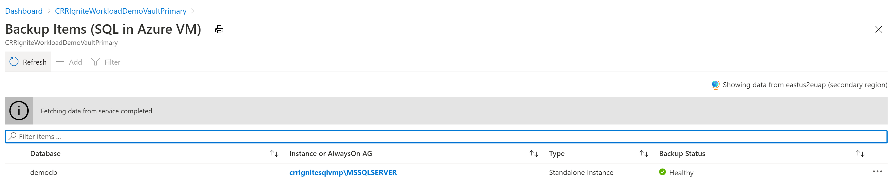
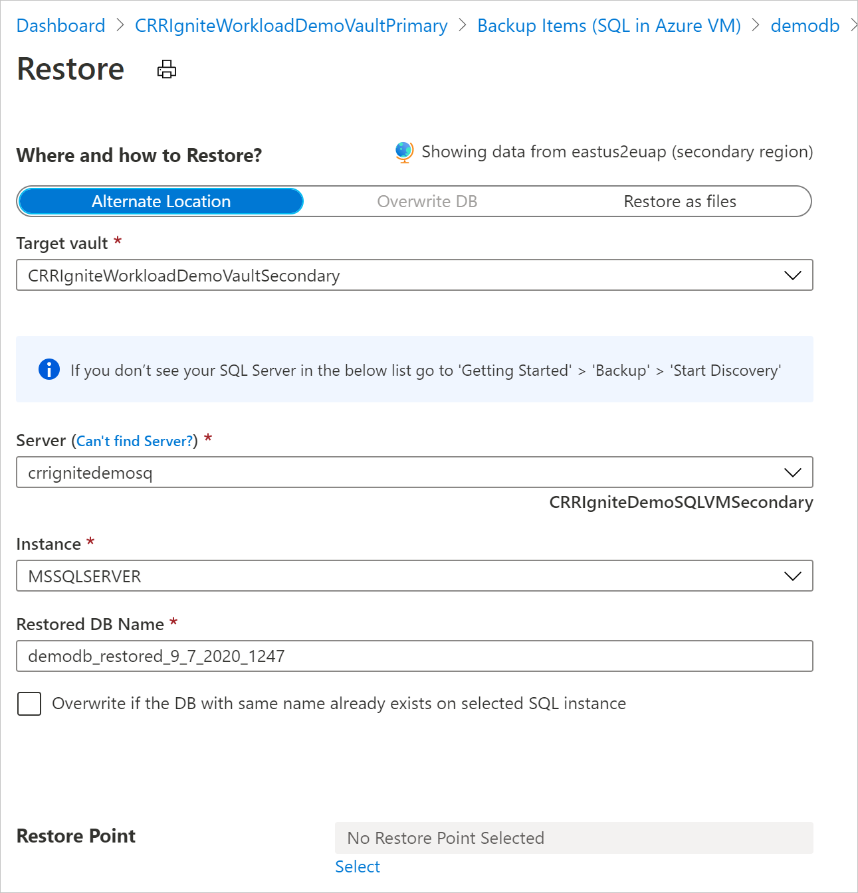
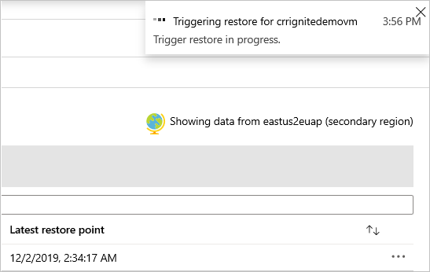

# Restore SQL Server databases on Azure VMs

This article describes how to restore a SQL Server database that's running on an Azure virtual machine (VM) that the [Azure Backup](backup-overview.md) service has backed up to an Azure Backup Recovery Services vault.

This article describes how to restore SQL Server databases. For more information, see [Back up SQL Server databases on Azure VMs](backup-azure-sql-database.md).

>[!Note]
>See the [SQL backup support matrix](sql-support-matrix.md) to know more about the supported configurations and scenarios.

## Restore to a time or a recovery point

Azure Backup can restore SQL Server databases that are running on Azure VMs as follows:

- Restore to a specific date or time (to the second) by using transaction log backups. Azure Backup automatically determines the appropriate full differential backup and the chain of log backups that are required to restore based on the selected time.
- Restore a specific full or differential backup to restore to a specific recovery point.

## Restore prerequisites

Before you restore a database, note the following:

- You can restore the database to an instance of a SQL Server in the same Azure region.
- The destination server must be registered to the same vault as the source. If you want to restore backups to a different vault, [enable Cross Subscription Restore](#cross-subscription-restore).
- If you have multiple instances running on a server, all the instances should be up and running. Otherwise the server won't appear in the list of destination servers for you to restore the database to. For more information, refer to [the troubleshooting steps](backup-sql-server-azure-troubleshoot.md#faulty-instance-in-a-vm-with-multiple-sql-server-instances).
- To restore a TDE-encrypted database to another SQL Server, you need to first [restore the certificate to the destination server](/sql/relational-databases/security/encryption/move-a-tde-protected-database-to-another-sql-server).
- [CDC](/sql/relational-databases/track-changes/enable-and-disable-change-data-capture-sql-server) enabled databases should be restored using the [Restore as files](#restore-as-files) option.
- We strongly recommended to restore the "master" database using the [Restore as files](#restore-as-files) option and then restore [using T-SQL commands](/sql/relational-databases/backup-restore/restore-the-master-database-transact-sql).
- For all system databases (model, msdb), stop the SQL Server Agent service before you trigger the restore.
- Close any applications that might try to take a connection to any of these databases.

## Restore a database

To restore, you need the following permissions:

- **Backup Operator** permissions in the vault where you're doing the restore.
- **Contributor (write)** access to the source VM that's backed up.
- **Contributor (write)** access to the target VM:
  - If you're restoring to the same VM, this is the source VM.
  - If you're restoring to an alternate location, this is the new target VM.

Restore as follows:

1. In the Azure portal, go to **Backup center** and click **Restore**.

   :::image type="content" source="./media/backup-azure-sql-database/backup-center-restore-inline.png" alt-text="Screenshot showing the start the restore process." lightbox="./media/backup-azure-sql-database/backup-center-restore-expanded.png":::

1. Select **SQL in Azure VM** as the datasource type, select a database to restore, and click **Continue**.

   :::image type="content" source="./media/backup-azure-sql-database/sql-restore.png" alt-text="Screenshot showing to select the datasource type.":::

1. In **Restore Configuration**, specify where (or how) to restore the data:
   
   - **Alternate Location**: Restore the database to an alternate location and keep the original source database.
   - **Overwrite DB**: Restore the data to the same SQL Server instance as the original source. This option overwrites the original database.

        > [!IMPORTANT]
        > If the selected database belongs to an Always On availability group, SQL Server doesn't allow the database to be overwritten. Only **Alternate Location** is available.
        >
   - **Restore as files**: Instead of restoring as a database, restore the backup files that can be recovered as a database later on any machine where the files are present using SQL Server Management Studio.

### Restore to an alternate location

1. In the **Restore Configuration** menu, under **Where to Restore**, select **Alternate Location**.
1. Select the SQL Server name and instance to which you want to restore the database.
1. In the **Restored DB Name** box, enter the name of the target database.
1. If applicable, select **Overwrite if the DB with the same name already exists on selected SQL instance**.
1. Select **Restore Point**, and select whether to [restore to a specific point in time](#restore-to-a-specific-point-in-time) or to [restore to a specific recovery point](#restore-to-a-specific-restore-point).

   :::image type="content" source="./media/backup-azure-sql-database/sql-alternate-location-recovery.png" alt-text="Screenshot showing to select Restore Point.":::

   :::image type="content" source="./media/backup-azure-sql-database/restore-points-sql-inline.png" alt-text="Screenshot showing restore to point in time." lightbox="./media/backup-azure-sql-database/restore-points-sql-expanded.png":::

1. On the **Advanced Configuration** menu:

    - If you want to keep the database nonoperational after the restore, enable **Restore with NORECOVERY**.
    - If you want to change the restore location on the destination server, enter new target paths.

        

1. Select **OK** to trigger the restore. Track the restore progress in the **Notifications** area, or track it under the **Backup Jobs** view in the vault.

    > [!NOTE]
    > The point-in-time restore is available only for log backups for databases that are in full and bulk-logged recovery mode.

### Restore and overwrite

1. In the **Restore Configuration** menu, under **Where to Restore**, select **Overwrite DB** > **OK**.

    

2. In **Select restore point**, select **Logs (Point in Time)** to [restore to a specific point in time](#restore-to-a-specific-point-in-time). Or select **Full & Differential** to restore to a [specific recovery point](#restore-to-a-specific-restore-point).

    > [!NOTE]
    > The point-in-time restore is available only for log backups for databases that are in full and bulk-logged recovery mode.

### Restore as files

To restore the backup data as .bak files instead of a database, choose **Restore as Files**. Once the files are dumped to a specified path, you can take these files to any machine where you want to restore them as a database. Since you can move these files around to any machine, you can now restore the data across subscriptions and regions.

1. Under **Where and how to Restore**, select **Restore as files**.
1. Select the SQL Server name to which you want to restore the backup files.
1. In the **Destination path on the server** input the folder path on the server selected in step 2. This is the location where the service will dump all the necessary backup files. Typically, a network share path, or path of a mounted Azure file share when specified as the destination path, enables easier access to these files by other machines in the same network or with the same Azure file share mounted on them.<BR>

   >[!Note]
   >To restore the database backup files on an Azure File Share mounted on the target registered VM, make sure that NT AUTHORITY\SYSTEM has access to the file share. You can perform the steps given below to grant the read/write permissions to the AFS mounted on the VM:
   >
   >- Run `PsExec -s cmd` to enter into NT AUTHORITY\SYSTEM shell
   >   - Execute `cmdkey /add:<storageacct>.file.core.windows.net /user:AZURE\<storageacct> /pass:<storagekey>`
   >   - Verify access with `dir \\<storageacct>.file.core.windows.net\<filesharename>`
   >- Kick off a restore as files from the Backup Vault to `\\<storageacct>.file.core.windows.net\<filesharename>` as the path<BR>
   >You can Download PsExec from the [Sysinternals](/sysinternals/downloads/psexec) page.

1. Select **OK**.

    

1. Select **Restore Point**, and select whether to [restore to a specific point in time](#restore-to-a-specific-point-in-time) or to [restore to a specific recovery point](#restore-to-a-specific-restore-point).

1. When doing SQL database point-in-time restore using **Restore as files**, it'll store all the recovery points from the *Full backup* to the *selected point-in-time*. Then you can restore using these files as a database on any machine they're present using SQL Server Management Studio.

    

### Restore to a specific point in time

If you've selected **Logs (Point in Time)** as the restore type, do the following:

1. Under **Restore Date/Time**, open the calendar. On the calendar, the dates that have recovery points are displayed in bold type, and the current date is highlighted.
1. Select a date that has recovery points. You can't select dates that have no recovery points.

    

1. After you select a date, the timeline graph displays the available recovery points in a continuous range.
1. Specify a time for the recovery on the timeline graph, or select a time. Then select **OK**.

### Partial restore as files

The Azure Backup service decides the chain of files to be downloaded during restore as files. But there are scenarios where you might not want to download the entire content again.

For eg., when you have a backup policy of weekly fulls, daily differentials and logs, and you already downloaded files for a particular differential. You found that this is not the right recovery point and decided to download the next day's differential. Now you just need the differential file since you already have the starting full. With the partial restore as files ability, provided by Azure Backup, you can now exclude the full from the download chain and download only the differential.

#### Excluding backup file types

The **ExtensionSettingsOverrides.json** is a JSON (JavaScript Object Notation) file that contains overrides for multiple settings of the Azure Backup service for SQL. For "Partial Restore as files" operation, a new JSON field `RecoveryPointTypesToBeExcludedForRestoreAsFiles` must be added. This field holds a string value that denotes which recovery point types should be excluded in the next restore as files operation.

1. In the target machine where files are to be downloaded, go to "C:\Program Files\Azure Workload Backup\bin" folder
2. Create a new JSON file named "ExtensionSettingsOverrides.JSON", if it doesn't already exist.
3. Add the following JSON key value pair

    ```json
    {
    "RecoveryPointTypesToBeExcludedForRestoreAsFiles": "ExcludeFull"
    }
    ```

4. No restart of any service is required. The Azure Backup service will attempt to exclude backup types in the restore chain as mentioned in this file.

The `RecoveryPointTypesToBeExcludedForRestoreAsFiles` only takes specific values which denote the recovery points to be excluded during restore. For SQL, these values are:

- ExcludeFull (Other backup types such as differential and logs will be downloaded, if they are present in the restore point chain)
- ExcludeFullAndDifferential (Other backup types such as logs will be downloaded, if they are present in the restore point chain)
- ExcludeFullAndIncremental (Other backup types such as logs will be downloaded, if they are present in the restore point chain)
- ExcludeFullAndDifferentialAndIncremental (Other backup types such as logs will be downloaded, if they are present in the restore point chain)


### Restore to a specific restore point

If you've selected **Full & Differential** as the restore type, do the following:

1. Select a recovery point from the list, and select **OK** to complete the restore point procedure.

    

    >[!NOTE]
    > By default, recovery points from the last 30 days are displayed. You can display recovery points older than 30 days by selecting **Filter** and selecting a custom range.

### Restore databases with large number of files

If the total string size of files in a database is greater than a [particular limit](backup-sql-server-azure-troubleshoot.md#size-limit-for-files), Azure Backup stores the list of database files in a different pit component so you can't set the target restore path during the restore operation. The files will be restored to the SQL default path instead.

  

## Recover a database from .bak file using SSMS

You can use *Restore as Files* operation to restore the database files in `.bak` format while restoring from the Azure portal. [Learn more](restore-sql-database-azure-vm.md#restore-as-files). 

When the restoration of the `.bak` file to the Azure virtual machine is complete, you can trigger restore using **TSQL commands** through SSMS. 
 
To restore the database files to the *original path on the source server*, remove the `MOVE` clause from the TSQL restore query. 
  
**Example**

  ```azurecli-interactive
    USE [master] 
    RESTORE DATABASE [<DBName>] FROM  DISK = N'<.bak file path>'
  ```

>[!Note]
>You shouldn’t have the same database files on the target server (restore with replace).  Also, you can [enable instant file initialization on the target server to reduce the file initialization time overhead]( /sql/relational-databases/databases/database-instant-file-initialization?view=sql-server-ver16&preserve-view=true).

To relocate the database files from the target restore server, you can frame a TSQL command using the `MOVE` clauses.

  ```azurecli
    USE [master] 
    RESTORE DATABASE [<DBName>] FROM  DISK = N'<.bak file path>'  MOVE N'<LogicalName1>' TO N'<TargetFilePath1OnDisk>',  MOVE N'<LogicalName2>' TO N'<TargetFilePath2OnDisk>' GO
  ```

**Example**

  ```azurecli
    USE [master] 
    RESTORE DATABASE [test] FROM  DISK = N'J:\dbBackupFiles\test.bak' WITH  FILE = 1,  MOVE N'test' TO N'F:\data\test.mdf',  MOVE N'test_log' TO N'G:\log\test_log.ldf',  NOUNLOAD,  STATS = 5 
    GO
  ```

If there are more than two files for the database, you can add additional `MOVE` clauses to the restore query. You can also use SSMS for database recovery using `.bak` files. [Learn more](/sql/relational-databases/backup-restore/restore-a-database-backup-using-ssms?view=sql-server-ver16&preserve-view=true).

>[!Note]
>For large database recovery, we recommend you to use TSQL statements. If you want to relocate the specific database files, see the list of database files in the JSON format created during the **Restore as Files** operation.

## Cross Region Restore

As one of the restore options, Cross Region Restore (CRR) allows you to restore SQL databases hosted on Azure VMs in a secondary region, which is an Azure paired region.

To onboard to the feature, read the [Before You Begin section](./backup-create-rs-vault.md#set-cross-region-restore).

To see if CRR is enabled, follow the instructions in [Configure Cross Region Restore](backup-create-rs-vault.md#set-cross-region-restore)

### View backup items in secondary region

If CRR is enabled, you can view the backup items in the secondary region.

1. From the portal, go to **Recovery Services vault** > **Backup items**.
1. Select **Secondary Region** to view the items in the secondary region.

>[!NOTE]
>Only Backup Management Types supporting the CRR feature will be shown in the list. Currently, only support for restoring secondary region data to a secondary region is allowed.




### Restore in secondary region

The secondary region restore user experience will be similar to the primary region restore user experience. When configuring details in the Restore Configuration pane to configure your restore, you'll be prompted to provide only secondary region parameters. A vault should exist in the secondary region and the SQL server should be registered to the vault in the secondary region.





>[!NOTE]
>- After the restore is triggered and in the data transfer phase, the restore job can't be cancelled.
>- The role/access level required to perform restore operation in cross-regions are _Backup Operator_ role in the subscription and _Contributor(write)_ access on the source and target virtual machines. To view backup jobs, _Backup reader_ is the minimum permission required in the subscription.
>- The RPO for the backup data to be available in secondary region is 12 hours. Therefore, when you turn on CRR, the RPO for the secondary region is 12 hours + log frequency duration (that can be set to a minimum of 15 minutes).

### Monitoring secondary region restore jobs

1. In the Azure portal, go to **Backup center** > **Backup Jobs**.
1. Filter operation for **CrossRegionRestore** to view the jobs in the secondary region.

   :::image type="content" source="./media/backup-azure-sql-database/backup-center-jobs-inline.png" alt-text="Screenshot showing the filtered Backup jobs." lightbox="./media/backup-azure-sql-database/backup-center-jobs-expanded.png":::


## Cross Subscription Restore

Azure Backup now allows you to restore SQL database to any subscription (as per the following Azure RBAC requirements) from the restore point. By default, Azure Backup restores to the same subscription where the restore points are available. 

With Cross Subscription Restore (CSR), you have the flexibility of restoring to any subscription and any vault under your tenant if restore permissions are available. By default, CSR is enabled on all Recovery Services vaults (existing and newly created vaults). 

>[!Note]
>- You can trigger Cross Subscription Restore from Recovery Services vault.
>- CSR is supported only for streaming based backup and is not supported for snapshot-based backup.
>- Cross Regional Restore (CRR) with CSR is not supported.

**Azure RBAC  requirements**

| Operation type | Backup operator | Recovery Services vault | Alternate operator |
| --- | --- | --- | --- |
| Restore database or restore as files | `Virtual Machine Contributor` | Source VM that got backed up | Instead of a built-in role, you can consider a custom role which has the following permissions: <br><br> - `Microsoft.Compute/virtualMachines/write` <br> - `Microsoft.Compute/virtualMachines/read` |
|            | `Virtual Machine Contributor` | Target VM in which the database will be restored or files are created. | Instead of a built-in role, you can consider a custom role that has the following permissions: <br><br> - `Microsoft.Compute/virtualMachines/write` <br> - `Microsoft.Compute/virtualMachines/read` |
|          | `Backup Operator` | Target Recovery Services vault |            |	

By default, CSR is enabled on the Recovery Services vault. To update the Recovery Services vault restore settings, go to **Properties** > **Cross Subscription Restore** and make the required changes.

:::image type="content" source="./media/sap-hana-db-restore/cross-subscription-restore-settings-for-database.png" alt-text="Screenshot shows how to modify the Cross Subscription Restore settings on a Recovery Services vault for SQL database." lightbox="./media/sap-hana-db-restore/cross-subscription-restore-settings-for-database.png":::


## Next steps

[Manage and monitor](manage-monitor-sql-database-backup.md) SQL Server databases that are backed up by Azure Backup.
