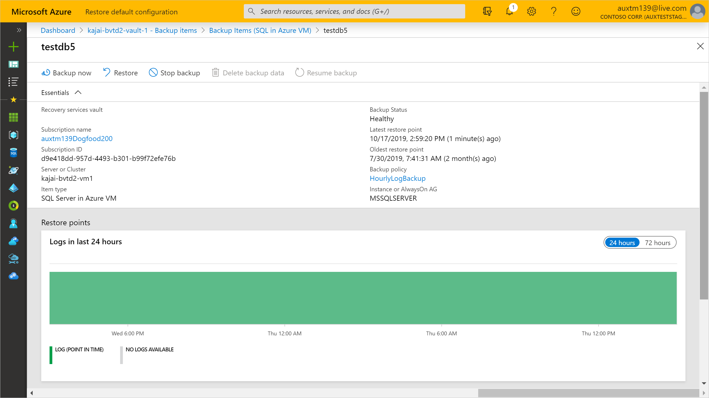
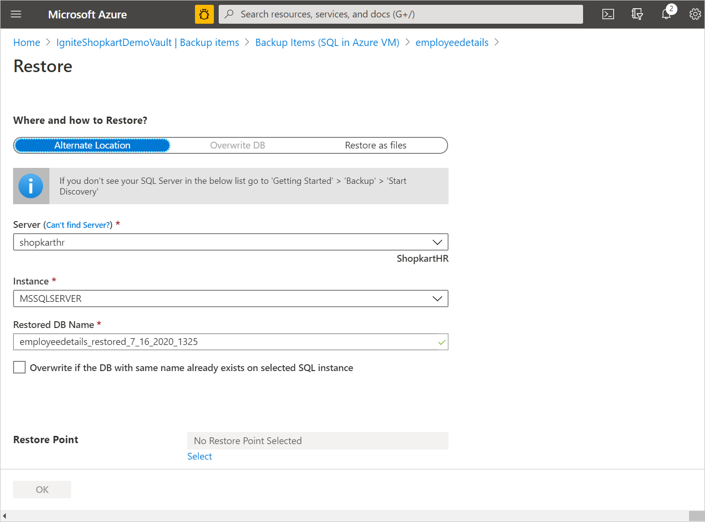
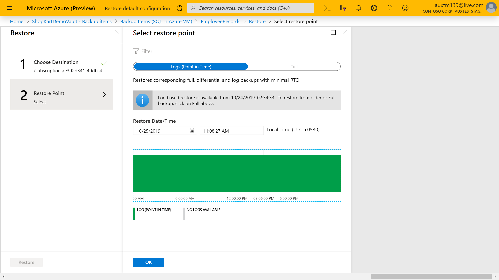

# Restore SQL Server databases on Azure VMs

This article describes how to restore a SQL Server database that's running on an Azure virtual machine (VM) that the [Azure Backup](backup-overview.md) service has backed up to an Azure Backup Recovery Services vault.

This article describes how to restore SQL Server databases. For more information, see [Back up SQL Server databases on Azure VMs](backup-azure-sql-database.md).

## Restore to a time or a recovery point

Azure Backup can restore SQL Server databases that are running on Azure VMs as follows:

- Restore to a specific date or time (to the second) by using transaction log backups. Azure Backup automatically determines the appropriate full differential backup and the chain of log backups that are required to restore based on the selected time.
- Restore a specific full or differential backup to restore to a specific recovery point.

## Prerequisites

Before you restore a database, note the following:

- You can restore the database to an instance of a SQL Server in the same Azure region.
- The destination server must be registered to the same vault as the source.
- To restore a TDE-encrypted database to another SQL Server, you need to first [restore the certificate to the destination server](https://docs.microsoft.com/sql/relational-databases/security/encryption/move-a-tde-protected-database-to-another-sql-server?view=sql-server-2017).
- Before you restore the "master" database, start the SQL Server instance in single-user mode by using the startup option **-m AzureWorkloadBackup**.
  - The value for **-m** is the name of the client.
  - Only the specified client name can open the connection.
- For all system databases (model, master, msdb), stop the SQL Server Agent service before you trigger the restore.
- Close any applications that might try to take a connection to any of these databases.
- If you have multiple instances running on a server, all of the instances should be up and running otherwise the server would not appear in the list of destination servers for you to restore database to.

## Restore a database

To restore, you need the following permissions:

- **Backup Operator** permissions in the vault where you're doing the restore.
- **Contributor (write)** access to the source VM that's backed up.
- **Contributor (write)** access to the target VM:
  - If you're restoring to the same VM, this is the source VM.
  - If you're restoring to an alternate location, this is the new target VM.

Restore as follows:

1. Open the vault in which the SQL Server VM is registered.
2. On the vault dashboard, under **Usage**, select **Backup Items**.
3. In **Backup Items**, under **Backup Management Type**, select **SQL in Azure VM**.

    

4. Select the database to restore.

    

5. Review the database menu. It provides information about the database backup, including:

    - The oldest and latest restore points.
    - The log backup status for the last 24 hours for databases that are in full and bulk-logged recovery mode and that are configured for transactional log backups.

6. Select **Restore**.

    

7. In **Restore Configuration**, specify where (or how) to restore the data:
   - **Alternate Location**: Restore the database to an alternate location and keep the original source database.
   - **Overwrite DB**: Restore the data to the same SQL Server instance as the original source. This option overwrites the original database.

    > [!IMPORTANT]
    > If the selected database belongs to an Always On availability group, SQL Server doesn't allow the database to be overwritten. Only **Alternate Location** is available.
    >
   - **Restore as files**: Instead of restoring as a database, restore the backup files that can be recovered as a database later on any machine where the files are present using SQL Server Management Studio.
     

### Restore to an alternate location

1. In the **Restore Configuration** menu, under **Where to Restore**, select **Alternate Location**.
2. Select the SQL Server name and instance to which you want to restore the database.
3. In the **Restored DB Name** box, enter the name of the target database.
4. If applicable, select **Overwrite if the DB with the same name already exists on selected SQL instance**.
5. Select **OK**.

    

6. In **Select restore point**, select whether to [restore to a specific point in time](#restore-to-a-specific-point-in-time) or to [restore to a specific recovery point](#restore-to-a-specific-restore-point).

    > [!NOTE]
    > The point-in-time restore is available only for log backups for databases that are in full and bulk-logged recovery mode.

### Restore and overwrite

1. In the **Restore Configuration** menu, under **Where to Restore**, select **Overwrite DB** > **OK**.

    

2. In **Select restore point**, select **Logs (Point in Time)** to [restore to a specific point in time](#restore-to-a-specific-point-in-time). Or select **Full & Differential** to restore to a [specific recovery point](#restore-to-a-specific-restore-point).

    > [!NOTE]
    > The point-in-time restore is available only for log backups for databases that are in full and bulk-logged recovery mode.

### Restore as files

To restore the backup data as .bak files instead of a database, choose **Restore as Files**. Once the files are dumped to a specified path, you can take these files to any machine where you want to restore them as a database. By the virtue of being able to move these files around to any machine, you can now restore the data across subscriptions and regions.

1. In the **Restore Configuration** menu, under **Where to Restore**, select **Restore as files**.
2. Select the SQL Server name to which you want to restore the backup files.
3. In the **Destination path on the server** input the folder path on the server selected in step 2. This is the location where the service will dump all the necessary backup files. Typically, a network share path, or path of a mounted Azure file share when specified as the destination path, enables easier access to these files by other machines in the same network or with the same Azure file share mounted on them. 

    >To restore the database backup files on an Azure File Share mounted on the target registered VM, make sure that NT AUTHORITY\SYSTEM has access to the file share. You can perform the steps given below to grant the read/write permissions to the AFS mounted on the VM:
    >
    >- Run `PsExec -s cmd` to enter into NT AUTHORITY\SYSTEM shell
    >   - Execute `cmdkey /add:<storageacct>.file.core.windows.net /user:AZURE\<storageacct> /pass:<storagekey>`
    >   - Verify access with `dir \\<storageacct>.file.core.windows.net\<filesharename>`
    >- Kick off a restore as files from the Backup Vault to `\\<storageacct>.file.core.windows.net\<filesharename>` as the path 
    You can download Psexec via <https://docs.microsoft.com/sysinternals/downloads/psexec>

4. Select **OK**.

    

5. Select the **Restore Point** corresponding to which all the available .bak files will be restored.

    

6. All the backup files associated with the selected recovery point are dumped into the destination path. You can restore the files as a database on any machine they are present on using SQL Server Management Studio.

    

### Restore to a specific point in time

If you've selected **Logs (Point in Time)** as the restore type, do the following:

1. Under **Restore Date/Time**, open the calendar. On the calendar, the dates that have recovery points are displayed in bold type, and the current date is highlighted.
1. Select a date that has recovery points. You can't select dates that have no recovery points.

    

1. After you select a date, the timeline graph displays the available recovery points in a continuous range.
1. Specify a time for the recovery on the timeline graph, or select a time. Then select **OK**.

    

1. On the **Advanced Configuration** menu, if you want to keep the database nonoperational after the restore, enable **Restore with NORECOVERY**.
1. If you want to change the restore location on the destination server, enter a new target path.
1. Select **OK**.

    

1. On the **Restore** menu, select **Restore** to start the restore job.
1. Track the restore progress in the **Notifications** area, or track it by selecting **Restore jobs** on the database menu.

    

### Restore to a specific restore point

If you've selected **Full & Differential** as the restore type, do the following:

1. Select a recovery point from the list, and select **OK** to complete the restore point procedure.

    

    >[!NOTE]
    > By default, recovery points from the last 30 days are displayed. You can display recovery points older than 30 days by clicking **Filter** and selecting a custom range.

1. On the **Advanced Configuration** menu, if you want to keep the database nonoperational after the restore, enable **Restore with NORECOVERY**.
1. If you want to change the restore location on the destination server, enter a new target path.
1. Select **OK**.

    

1. On the **Restore** menu, select **Restore** to start the restore job.
1. Track the restore progress in the **Notifications** area, or track it by selecting **Restore jobs** on the database menu.

    

### Restore databases with large number of files

If the total string size of files in a database is greater than a [particular limit](backup-sql-server-azure-troubleshoot.md#size-limit-for-files), Azure Backup stores the list of database files in a different pit component such that you will not be able to set the target restore path during the restore operation. The files will be restored to the SQL default path instead.

  

## Next steps

[Manage and monitor](manage-monitor-sql-database-backup.md) SQL Server databases that are backed up by Azure Backup.
