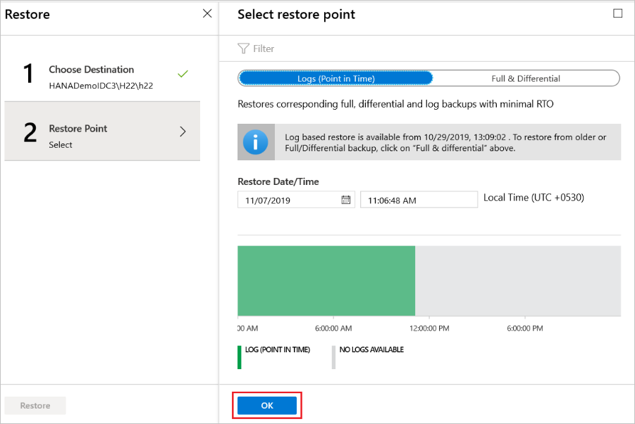
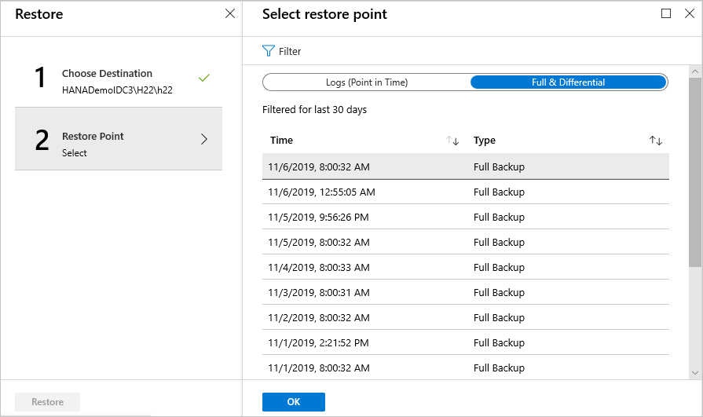
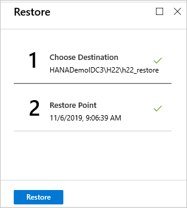
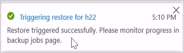
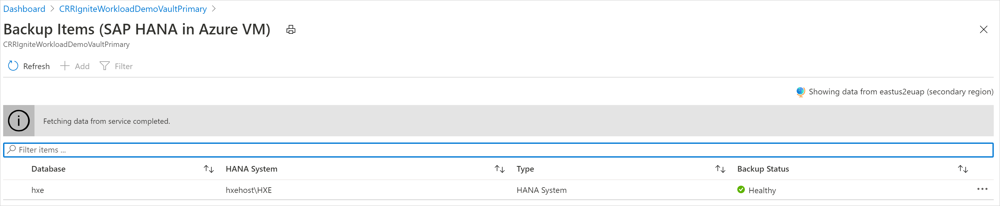
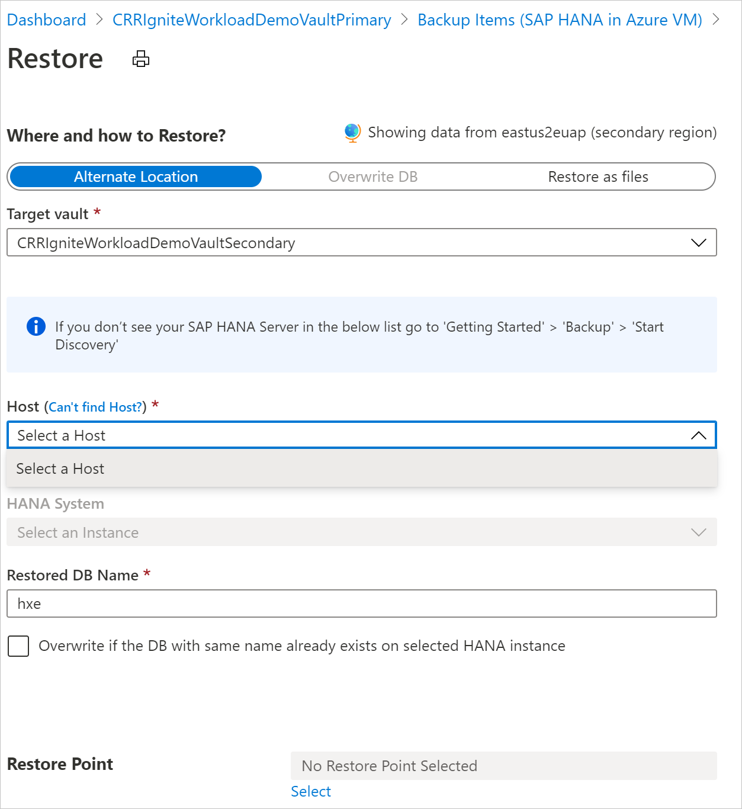

# Restore SAP HANA databases on Azure VMs

This article describes how to restore SAP HANA databases that are running on Azure virtual machines (VMs) and that the Azure Backup service has backed up to a Recovery Services vault. You can use the restored data to create copies for development and test scenarios or to return to a previous state.

Azure Backup now supports backup and restore of SAP HANA System Replication (HSR) instance.

>[!Note]
>- The restore process for HANA databases with HSR is the same as the restore process for HANA databases without HSR. As per SAP advisories, you can restore databases with HSR mode as *standalone* databases. If the target system has the HSR mode enabled, first disable the mode, and then restore the database. However, if you're restoring as files, disabling the HSR mode (breaking the HSR) isn't needed.
>- Original Location Recovery (OLR) is currently not supported for HSR. Alternatively, select **Alternate location** restore, and then select the source VM as your *Host* from the list.
>- Restore to HSR instance isn't supported. However, restore only to HANA instance is supported.

For information about the supported configurations and scenarios, see the [SAP HANA backup support matrix](sap-hana-backup-support-matrix.md).

## Restore to a point in time or to a recovery point

Azure Backup restores SAP HANA databases that are running on Azure VMs. It can:

* Restore them to a specific date or time (to the second) by using log backups. Azure Backup automatically determines the appropriate full backups, differential backups, and chain of log backups that are required to restore based on the selected time.

* Restore them to a specific full or differential backup to restore them to a specific recovery point.

## Prerequisites

Before you begin restoring a database, note the following:

* You can restore the database only to an SAP HANA instance that's in the same region.

* The target instance must be registered with the same vault as the source. [Learn more about backing up SAP HANA databases](backup-azure-sap-hana-database.md#discover-the-databases).

* Azure Backup can't identify two different SAP HANA instances on the same VM. So restoring data from one instance to another on the same VM isn't possible.

* To ensure that the target SAP HANA instance is ready for restore, check its **Backup readiness** status:

  1. In the Azure portal, go to **Backup center**, and then select **Backup**.

     :::image type="content" source="./media/sap-hana-db-restore/backup-center-configure-inline.png" alt-text="Screenshot that shows where to check to see whether the target SAP HANA instance is ready to restore." lightbox="./media/sap-hana-db-restore/backup-center-configure-expanded.png":::

  1. On the **Start: Configure Backup** pane, for **Datasource type**, select **SAP HANA in Azure VM**, select the vault to which the SAP HANA instance is registered, and then select **Continue**.

     :::image type="content" source="./media/sap-hana-db-restore/hana-select-vault.png" alt-text="Screenshot that shows where to select SAP HANA in Azure VM as the datasource type.":::

  1. Under **Discover DBs in VMs**, select **View details**.

     :::image type="content" source="./media/sap-hana-db-restore/hana-discover-databases.png" alt-text="Screenshot that shows where to view database details.":::

  1. Review the **Backup Readiness** of the target VM.

     :::image type="content" source="./media/sap-hana-db-restore/hana-select-virtual-machines-inline.png" alt-text="Screenshot that shows where to review the backup readiness of the target VM." lightbox="./media/sap-hana-db-restore/hana-select-virtual-machines-expanded.png":::

* To learn more about the restore types that SAP HANA supports, refer to [SAP HANA Note 1642148](https://launchpad.support.sap.com/#/notes/1642148).

## Restore a database

To restore a database, you need the following permissions:

* **Backup Operator**: Provides permissions in the vault where you're doing the restore.
* **Contributor (write)**: Provides access to the source VM that's backed up.
* **Contributor (write**): Provides access to the target VM.
  * If you're restoring to the same VM, this is the source VM.
  * If you're restoring to an alternate location, this is the new target VM.

1. In the Azure portal, go to **Backup center**, and then select **Restore**.

   :::image type="content" source="./media/sap-hana-db-restore/backup-center-restore-inline.png" alt-text="Screenshot that shows where to start restoring an SAP HANA database." lightbox="./media/sap-hana-db-restore/backup-center-restore-expanded.png":::

1. Select **SAP HANA in Azure VM** as the datasource type, select the database you want to restore, and then select **Continue**.

   :::image type="content" source="./media/sap-hana-db-restore/hana-restore-select-database.png" alt-text="Screenshot that shows where to restore the backup items.":::

1. Under **Restore Configuration**, specify where or how to restore the data:

   * **Alternate Location**: Restore the database to an alternate location and keep the original source database.
   * **Overwrite DB**: Restore the data to the same SAP HANA instance as the original source. This option overwrites the original database.

   :::image type="content" source="./media/sap-hana-db-restore/hana-restore-configuration.png" alt-text="Screenshot that shows where to restore the configuration.":::

>[!Note]
>During restore (applicable to Virtual IP/ Load balancer frontend IP scenario only), if you’re trying to restore a backup to target node after changing the HSR mode as standalone or breaking HSR before restore as recommended by SAP and, ensure that Load Balancer is pointed to the target node.
>
>**Example scenarios**:
>
>- If you’re using *hdbuserstore set SYSTEMKEY localhost* in your preregistration script, there will be no issues during restore.
>- If your *hdbuserstore set `SYSTEMKEY <load balancer host/ip>` in your preregistration script and you’re trying to restore the backup to target node, ensure that the load balancer is pointed to the target node that needs to be restored.
>
>    

### Restore to an alternate location

1. On the **Restore** pane, under **Where and how to Restore?**, select **Alternate Location**.

   :::image type="content" source="./media/sap-hana-db-restore/hana-alternate-location-recovery.png" alt-text="Screenshot that shows how to restore the database to an alternate location.":::

1. Select the SAP HANA hostname and instance name to which you want to restore the database.
1. Check to see whether the target SAP HANA instance is ready to be restored by ensuring its backup readiness. For more information, see [Prerequisites](#prerequisites).
1. In the **Restored DB Name** box, enter the name of the target database.

    > [!NOTE]
    > Single Database Container (SDC) restores must follow these [checks](backup-azure-sap-hana-database-troubleshoot.md#single-container-database-sdc-restore).

1. If applicable, select the **Overwrite if the DB with the same name already exists on selected HANA instance** checkbox.

1. In **Select restore point**, select **Logs (Point in Time)** to [restore to a specific point in time](#restore-to-a-specific-point-in-time). Or select **Full & Differential** to [restore to a specific recovery point](#restore-to-a-specific-recovery-point).

### Restore as files

>[!Note]
>*Restore as files* doesn't work on Common Internet File System (CIFS) shares, but it does work for Network File System (NFS).

To restore the backup data as files instead of a database, select **Restore as Files**. After the files have been dumped to a specified path, you can take them to any SAP HANA machine where you want to restore them as a database. Because you can move the files to any machine, you can now restore the data across subscriptions and regions.

1. On the **Restore** pane, under **Where and how to Restore?**, select **Restore as files**.
1. Select the host or HANA server name to which you want to restore the backup files.
1. In the **Destination path on the server** box, enter the folder path on the server that you selected in the preceding step. This is the location where the service will dump all the necessary backup files.

    The files that are dumped are:

    * Database backup files
    * JSON metadata files (for each backup file that's involved)

    Typically, a network share path, or the path of a mounted Azure file share that's specified as the destination path, enables easier access to these files by other machines in the same network or with the same Azure file share that's mounted on them.

    >[!NOTE]
    >To restore the database backup files on an Azure file share mounted on the target registered VM, make sure that the root account has read/write permissions on the share.

   :::image type="content" source="./media/sap-hana-db-restore/hana-restore-as-files.png" alt-text="Screenshot that shows how to choose the destination path.":::

1. Select the **Restore Point** to which all the backup files and folders will be restored.

   :::image type="content" source="./media/sap-hana-db-restore/hana-select-recovery-point-inline.png" alt-text="Screenshot that shows where to select the restore point." lightbox="./media/sap-hana-db-restore/hana-select-recovery-point-expanded.png":::

1. All the backup files associated with the selected restore point are dumped into the destination path.
1. Depending on the type of restore point you've chosen (**Point in time** or **Full & Differential**), you'll see one or more folders created in the destination path. One of the folders, *Data_\<date and time of restore>* contains the full backups, and the other folder, *Log* contains the log backups and other backups (such as differential and incremental).

   >[!Note]
   >If you've selected **Restore to a point in time**, the log files, which were dumped to the target VM, might sometimes contain logs beyond the point in time that were chosen for restore. Azure Backup does this to ensure that log backups for all HANA services are available for consistent and successful restore to the chosen point in time.

1. Move the restored files to the SAP HANA server where you want to restore them as a database, and then do the following:

    a. Set permissions on the folder or directory where the backup files are stored by running the following command:

    ```bash
    chown -R <SID>adm:sapsys <directory>
    ```

    b. Run the next set of commands as `<SID>adm`:

    ```bash
    su: <sid>adm
    ```

    c. Generate the catalog file for restore. Extract the BackupId from the JSON metadata file for the full backup, which you'll use later in the restore operation. Make sure that the full and log backups (not present for the full backup recovery) are in different folders, and delete the JSON metadata files in these folders. Run:

    ```bash
    hdbbackupdiag --generate --dataDir <DataFileDir> --logDirs <LogFilesDir> -d <PathToPlaceCatalogFile>
    ```

    * `<DataFileDir>`: The folder that contains the full backups.
    * `<LogFilesDir>`: The folder that contains the log backups, differential backups, and incremental backups. For Full BackUp Restore, because the log folder isn't created, add an empty directory.
    * `<PathToPlaceCatalogFile>`: The folder where the generated catalog file must be placed.

    d. You can restore by using the newly generated catalog file through HANA Studio or run the SAP HANA HDBSQL tool restore query with this newly generated catalog. The HDBSQL queries are listed here:

     * To open the HDBSQL prompt, run the following command:

        ```bash
        hdbsql -U AZUREWLBACKUPHANAUSER -d systemDB
        ```

     * To restore to a point in time:

        If you're creating a new restored database, run the HDBSQL command to create a new database `<DatabaseName>`, and then stop the database for restore by using the command `ALTER SYSTEM STOP DATABASE <db> IMMEDIATE`. However, if you're restoring an existing database only, run the HDBSQL command to stop the database.

        Then run the following command to restore the database:

        ```hdbsql
        RECOVER DATABASE FOR <db> UNTIL TIMESTAMP <t1> USING CATALOG PATH <path> USING LOG PATH <path> USING DATA PATH <path> USING BACKUP_ID <bkId> CHECK ACCESS USING FILE
        ```

        * `<DatabaseName>`: The name of the new database or existing database that you want to restore.
        * `<Timestamp>`: The exact timestamp of the point in time restore.
        * `<DatabaseName@HostName>`: The name of the database whose backup is used for restore and the host or SAP HANA server name on which this database resides. The `USING SOURCE <DatabaseName@HostName>` option specifies that the data backup (used for restore) is of a database with a different SID or name than the target SAP HANA machine. It doesn't need to be specified for restores that are done on the same HANA server from where the backup is taken.
        * `<PathToGeneratedCatalogInStep3>`: The path to the catalog file that was generated in "step c."
        * `<DataFileDir>`: The folder that contains the full backups.
        * `<LogFilesDir>`: The folder that contains the log backups, differential backups, and incremental backups (if any).
        * `<BackupIdFromJsonFile>`: The BackupId that was extracted in "step c."

    * To restore to a particular full or differential backup:

        If you're creating a new restored database, run the HDBSQL command to create a new database `<DatabaseName>` and then stop the database for restore by using the command `ALTER SYSTEM STOP DATABASE <db> IMMEDIATE`. However, if you're restoring an existing database only, run the HDBSQL command to stop the database:

        ```hdbsql
        RECOVER DATA FOR <DatabaseName> USING BACKUP_ID <BackupIdFromJsonFile> USING SOURCE '<DatabaseName@HostName>' USING CATALOG PATH ('<PathToGeneratedCatalogInStep3>') USING DATA PATH ('<DataFileDir>')  CLEAR LOG
        ```

        * `<DatabaseName>`: The name of the new database or existing database that you want to restore.
        * `<Timestamp>`: The exact timestamp of the point in time restore.
        * `<DatabaseName@HostName>`: The name of the database whose backup is used for restore and the host or SAP HANA server name on which this database resides. The `USING SOURCE <DatabaseName@HostName>` option specifies that the data backup (used for restore) is of a database with a different SID or name than the target SAP HANA machine. So it doesn't need to be specified for restores that are done on the same HANA server from where the backup is taken.
        * `<PathToGeneratedCatalogInStep3>`: The path to the catalog file that was generated in "step c."
        * `<DataFileDir>`: The folder that contains the full backups.
        * `<LogFilesDir>`: The folder that contains the log backups, differential backups, and incremental backups (if any).
        * `<BackupIdFromJsonFile>`: The BackupId that was extracted in "step c."
    
    * To restore by using a backup ID:

        ```hdbsql
        RECOVER DATA FOR <db> USING BACKUP_ID <bkId> USING CATALOG PATH <path> USING LOG PATH <path> USING DATA PATH <path>  CHECK ACCESS USING FILE
        ```
 
      Examples:

      SAP HANA SYSTEM restoration on the same server:

        ```hdbsql
        RECOVER DATABASE FOR SYSTEM UNTIL TIMESTAMP '2022-01-12T08:51:54.023' USING CATALOG PATH ('/restore/catalo_gen') USING LOG PATH ('/restore/Log/') USING DATA PATH ('/restore/Data_2022-01-12_08-51-54/') USING BACKUP_ID 1641977514020 CHECK ACCESS USING FILE
        ```

      SAP HANA tenant restoration on the same server:

        ```hdbsql
        RECOVER DATABASE FOR DHI UNTIL TIMESTAMP '2022-01-12T08:51:54.023' USING CATALOG PATH ('/restore/catalo_gen') USING LOG PATH ('/restore/Log/') USING DATA PATH ('/restore/Data_2022-01-12_08-51-54/') USING BACKUP_ID 1641977514020 CHECK ACCESS USING FILE
        ```

      SAP HANA SYSTEM restoration on a different server:

        ```hdbsql
        RECOVER DATABASE FOR SYSTEM UNTIL TIMESTAMP '2022-01-12T08:51:54.023' USING SOURCE <sourceSID> USING CATALOG PATH ('/restore/catalo_gen') USING LOG PATH ('/restore/Log/') USING DATA PATH ('/restore/Data_2022-01-12_08-51-54/') USING BACKUP_ID 1641977514020 CHECK ACCESS USING FILE
        ```

      SAP HANA tenant restoration on a different server:

        ```hdbsql
        RECOVER DATABASE FOR DHI UNTIL TIMESTAMP '2022-01-12T08:51:54.023' USING SOURCE <sourceSID> USING CATALOG PATH ('/restore/catalo_gen') USING LOG PATH ('/restore/Log/') USING DATA PATH ('/restore/Data_2022-01-12_08-51-54/') USING BACKUP_ID 1641977514020 CHECK ACCESS USING FILE
        ```

### Partial restore as files

The Azure Backup service decides the chain of files to be downloaded during *restore as files*. But there are scenarios where you might not want to download the entire content again.

For example, you might have a backup policy of weekly fulls, daily differentials, and logs, and you've already downloaded files for a particular differential. You found that this isn't the right recovery point and decided to download the next day's differential. Now you just need the differential file, because you already have the starting full backup. With the partial *restore as files* ability, provided by Azure Backup, you can now exclude the full backup from the download chain and download only the differential backup.

#### Excluding backup file types

*ExtensionSettingOverrides.json* is a JSON (JavaScript Object Notation) file that contains overrides for multiple settings of the Azure Backup service for SQL. For a *partial restore as files* operation, you must add a new JSON field, `RecoveryPointsToBeExcludedForRestoreAsFiles`. This field holds a string value that denotes which recovery point types should be excluded in the next *restore as files* operation.

1. On the target machine where files are to be downloaded, go to the *opt/msawb/bin* folder.

1. Create a new JSON file named *ExtensionSettingOverrides.JSON*, if it doesn't already exist.

1. Add the following JSON key value pair:

    ```json
    {
    "RecoveryPointsToBeExcludedForRestoreAsFiles": "ExcludeFull"
    }
    ```

1. Change the permissions and ownership of the file:
   
    ```bash
    chmod 750 ExtensionSettingsOverrides.json
    chown root:msawb ExtensionSettingsOverrides.json
    ```

1. No restart of any service is required. The Azure Backup service will attempt to exclude backup types in the restore chain, as mentioned in this file.

```RecoveryPointsToBeExcludedForRestoreAsFiles``` takes only specific values, which denote the recovery points to be excluded during restore. For SAP HANA, these values are:

- `ExcludeFull`. Other backup types such as differential, incremental, and logs will be downloaded, if they're present in the restore point chain.
- `ExcludeFullAndDifferential`. Other backup types such as incremental and logs will be downloaded, if they're present in the restore point chain.
- `ExcludeFullAndIncremental`. Other backup types such as differential and logs will be downloaded, if they're present in the restore point chain.
- `ExcludeFullAndDifferentialAndIncremental`. Other backup types such as logs will be downloaded, if they're present in the restore point chain.

### Restore to a specific point in time

If you've selected **Logs (Point in Time)** as the restore type, do the following:

1. Select a recovery point from the log graph, and then select **OK** to choose the point of restore.

    

1. On the **Restore** menu, select **Restore** to start the restore job.

    

1. Track the restore progress in the **Notifications** area, or track it by selecting **Restore jobs** on the database menu.

    

### Restore to a specific recovery point

If you've selected **Full & Differential** as the restore type, do the following:

1. Select a recovery point from the list, and then select **OK** to choose the point of restore.

    

1. On the **Restore** menu, select **Restore** to start the restore job.

    

1. Track the restore progress in the **Notifications** area, or track it by selecting **Restore jobs** on the database menu.

    

    > [!NOTE]
    > In Multiple Database Container (MDC) restores, after the system database is restored to a target instance, you need to run the preregistration script again. Then the subsequent tenant database restores will succeed. To learn more, see [Troubleshoot Multiple Container Database restore](backup-azure-sap-hana-database-troubleshoot.md#multiple-container-database-mdc-restore).

## Cross Region Restore

As one of the restore options, Cross Region Restore (CRR) allows you to restore SAP HANA databases that are hosted on Azure VMs in a secondary region, which is an Azure paired region.

To begin using the feature, see [Set Cross Region Restore](./backup-create-rs-vault.md#set-cross-region-restore).

### View backup items in the secondary region

If CRR is enabled, you can view the backup items in the secondary region.

1. In the Azure portal, go to **Recovery Services vault**, and then select **Backup items**.
1. Select **Secondary Region** to view the items in the secondary region.

> [!NOTE]
> Only backup management types that support the CRR feature are shown in the list. Currently, only support for restoring secondary region data to a secondary region is allowed.




### Restore in the secondary region

The secondary region restore user experience is similar to the primary region restore user experience. When you configure the details on the **Restore Configuration** pane, you're prompted to provide only secondary region parameters. A vault should exist in the secondary region, and the SAP HANA server should be registered to the vault in the secondary region.




>[!NOTE]
>* After the restore is triggered and in the data transfer phase, the restore job can't be canceled.
>* The role and access level that are required to perform a restore operation in cross-regions are the Backup Operator role in the subscription and Contributor (write) access on the source and target virtual machines. To view backup jobs, Backup reader is the minimum permission that's required in the subscription.
>* The recovery point objective (RPO) for the backup data to be available in secondary region is 12 hours. Therefore, when you turn on CRR, the RPO for the secondary region is *12 hours + log frequency duration* (which can be set to a minimum of 15 minutes).

### Monitor secondary region restore jobs

1. In the Azure portal, go to **Backup center**, and then select **Backup Jobs**.
1. To view the jobs in the secondary region, filter the **Operation** for **CrossRegionRestore**. 

   :::image type="content" source="./media/sap-hana-db-restore/hana-view-jobs-inline.png" alt-text="Screenshot that shows filtered backup jobs." lightbox="./media/sap-hana-db-restore/hana-view-jobs-expanded.png":::

## Cross Subscription Restore

Azure Backup now allows you to restore SAP HANA Database to any subscription (as per the following Azure RBAC requirements) from the restore point. By default, Azure Backup restores to the same subscription where the restore points are available. 

With Cross Subscription Restore (CSR), you have the flexibility of restoring to any subscription and any vault under your tenant if restore permissions are available. By default, CSR is enabled on all Recovery Services vaults (existing and newly created vaults). 

>[!Note]
>- You can trigger Cross Subscription Restore from Recovery Services vault.
>- CSR is supported only for streaming/Backint-based backups and is not supported for snapshot-based backup.
>- Cross Regional Restore (CRR) with CSR is not supported.

**Azure RBAC  requirements**

| Operation type | Backup operator | Recovery Services vault | Alternate operator |
| --- | --- | --- | --- |
| Restore database or restore as files | `Virtual Machine Contributor` | Source VM that got backed up | Instead of a built-in role, you can consider a custom role which has the following permissions: <br><br> - `Microsoft.Compute/virtualMachines/write` <br> - `Microsoft.Compute/virtualMachines/read` |
|            | `Virtual Machine Contributor` | Target VM in which the database will be restored or files are created. | Instead of a built-in role, you can consider a custom role that has the following permissions: <br><br> - `Microsoft.Compute/virtualMachines/write` <br> - `Microsoft.Compute/virtualMachines/read` |
|          | `Backup Operator` | Target Recovery Services vault |            |	

By default, CSR is enabled on the Recovery Services vault. To update the Recovery Services vault restore settings, go to **Properties** > **Cross Subscription Restore** and make the required changes.

:::image type="content" source="./media/sap-hana-db-restore/cross-subscription-restore-settings-for-database.png" alt-text="Screenshot shows how to modify the Cross Subscription Restore settings on a Recovery Services vault for HANA database." lightbox="./media/sap-hana-db-restore/cross-subscription-restore-settings-for-database.png":::

**Cross Subscription Restore using Azure CLI**

```azurecli
az backup vault create

```

Add the parameter `cross-subscription-restore-state` that enables you to set the CSR state of the vault during vault creation and updating.

```azurecli
az backup recoveryconfig show

```

Add the parameter `--target-subscription-id` that enables you to provide the target subscription as the input while triggering Cross Subscription Restore for SQL or HANA datasources.

**Example**:

```azurecli
   az backup vault create -g {rg_name} -n {vault_name} -l {location} --cross-subscription-restore-state Disable
   az backup recoveryconfig show --restore-mode alternateworkloadrestore --backup-management-type azureworkload -r {rp} --target-container-name {target_container} --target-item-name {target_item} --target-resource-group {target_rg} --target-server-name {target_server} --target-server-type SQLInstance --target-subscription-id {target_subscription} --target-vault-name {target_vault} --workload-type SQLDataBase --ids {source_item_id}

```

## Next steps

- [Manage SAP HANA databases by using Azure Backup](sap-hana-db-manage.md)
- [About backing up SAP HANA databases on Azure VMs](sap-hana-database-about.md)
