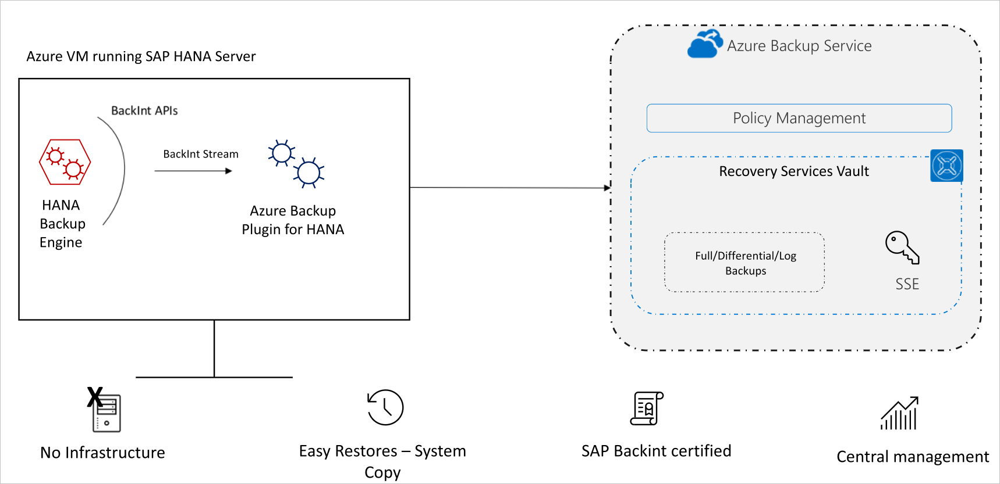

# About SAP HANA database backup in Azure VMs

SAP HANA databases are mission critical workloads that require a low recovery point objective (RPO) and a fast recovery time objective (RTO). You can now [back up SAP HANA databases running on Azure VMs](https://docs.microsoft.com/azure/backup/tutorial-backup-sap-hana-db) using [Azure Backup](https://docs.microsoft.com/azure/backup/backup-overview).

Azure Backup is [Backint certified](https://www.sap.com/dmc/exp/2013_09_adpd/enEN/#/d/solutions?id=8f3fd455-a2d7-4086-aa28-51d8870acaa5) by SAP, to provide native backup support by leveraging SAP HANA's native APIs. This offering from Azure Backup aligns with Azure Backup's mantra of **zero-infrastructure** backups, eliminating the need to deploy and manage backup infrastructure. You can now seamlessly back up and restore SAP HANA databases running on Azure VMs ([M series VMs](../virtual-machines/m-series.md) also supported now!) and leverage enterprise management capabilities that Azure Backup provides.

## Added value

Using Azure Backup to back up and restore SAP HANA databases, gives the following advantages:

* **15-minute Recovery Point Objective (RPO)**: Recovery of critical data of up to 15 minutes is now possible.
* **One-click, point-in-time restores**: Restore of production data to alternate HANA servers is made easy. Chaining of backups and catalogs to perform restores is all managed by Azure behind the scenes.
* **Long-term retention**: For rigorous compliance and audit needs. Retain your backups for years, based on the retention duration, beyond which the recovery points will be pruned automatically by the built-in lifecycle management capability.
* **Backup Management from Azure**: Use Azure Backup's management and monitoring capabilities for improved management experience. Azure CLI is also supported.

To view the backup and restore scenarios that we support today, refer to the [SAP HANA scenario support matrix](https://docs.microsoft.com/azure/backup/sap-hana-backup-support-matrix#scenario-support).

## Backup architecture

* The backup process begins by [creating a Recovery services vault](https://docs.microsoft.com/azure/backup/tutorial-backup-sap-hana-db#create-a-recovery-service-vault) in Azure. This vault will be used to store the backups and recovery points created over time.
* The Azure VM running SAP HANA server is registered with the vault, and the databases to be backed-up are [discovered](https://docs.microsoft.com/azure/backup/tutorial-backup-sap-hana-db#discover-the-databases). To enable the Azure Backup service to discover databases, a [preregistration script](https://aka.ms/scriptforpermsonhana) must be run on the HANA server as a root user.
* This script creates **AZUREWLBACKUPHANAUSER** DB user and a corresponding key with the same name in **hdbuserstore**. Refer to the  [What the pre-registration script does](tutorial-backup-sap-hana-db.md#what-the-pre-registration-script-does) section to understand more about what the script does.
* Azure Backup Service now installs the **Azure Backup Plugin for HANA** on the registered SAP HANA server.
* The **AZUREWLBACKUPHANAUSER** DB user created by the preregistration script is used by the **Azure Backup Plugin for HANA** to perform all backup and restore operations. If you attempt to configure backup for SAP HANA DBs without running this script, you might receive the following error: **UserErrorHanaScriptNotRun**.
* To [configure backup](https://docs.microsoft.com/azure/backup/tutorial-backup-sap-hana-db#configure-backup) on the databases that are discovered, choose the required backup policy and enable backups.

* Once the backup is configured, Azure Backup service sets up the following Backint parameters at the DATABASE level on the protected SAP HANA server:
  * [catalog_backup_using_backint:true]
  * [enable_accumulated_catalog_backup:false]
  * [parallel_data_backup_backint_channels:1]
  * [log_backup_timeout_s:900)]
  * [backint_response_timeout:7200]

>[!NOTE]
>Ensure that these parameters are *not* present at HOST level. Host-level parameters will override these parameters and might cause unexpected behavior.
>

* The **Azure Backup Plugin for HANA** maintains all the backup schedules and policy details. It triggers the scheduled backups and communicates with the **HANA Backup Engine** through the Backint APIs.
* The **HANA Backup Engine** returns a Backint stream with the data to be backed up.
* All the scheduled backups and on-demand backups (triggered from the Azure portal) that are either full or differential are initiated by the **Azure Backup Plugin for HANA**. However, log backups are managed and triggered by **HANA Backup Engine** itself.
* Azure Backup for SAP HANA, being a BackInt certified solution, doesn't depend on underlying disk or VM types. The backup is performed by streams generated by HANA.

## Using Azure VM backup with Azure SAP HANA backup

In addition to using the SAP HANA backup in Azure that provides database level backup and recovery, you can use the Azure VM backup solution to back up the OS and non-database disks.

The [Backint certified Azure SAP HANA backup solution](#backup-architecture) can be used for database backup and recovery.

[Azure VM backup](backup-azure-vms-introduction.md) can be used to back up the OS and other non-database disks. The VM backup is taken once every day and it backups up all the disks (except **Write Accelerator (WA) disks** and **UltraDisks**). Since the database is being backed up using the Azure SAP HANA backup solution, you can take a file-consistent backup of only the OS and non-database disks using the exclude disk capability, which is currently in preview.

>[!NOTE]
> Using pre-post scripts with the Azure VM backup will allow app-consistent backups of the data volumes of the database. However, if the log area resides on WA disks, taking a snapshot of these disks may not guarantee a log area consistency. HANA has an explicit way of generating log backups for this exact reason. Enable the same in your SAP HANA, and they can be backed up using Azure SAP HANA backup.

To restore a VM running SAP HANA, follow these steps:

* [Restore a new VM from Azure VM backup](backup-azure-arm-restore-vms.md) from the latest recovery point. Or create a new empty VM and attach the disks from the latest recovery point.
* Since WA disks aren't backed up, they aren't restored. Create empty WA disks and log area.
* After all the other configurations (such as IP, system name, and so on) are set, the VM is set to receive DB data from Azure backup.
* Now restore the DB into the VM from the [Azure SAP HANA DB backup](sap-hana-db-restore.md#restore-to-a-point-in-time-or-to-a-recovery-point) to the desired point-in-time.

## Next steps

* Learn how to [restore an SAP HANA database running on an Azure VM](https://docs.microsoft.com/azure/backup/sap-hana-db-restore)
* Learn how to [manage SAP HANA databases that are backed up using Azure Backup](https://docs.microsoft.com/azure/backup/sap-hana-db-manage)
