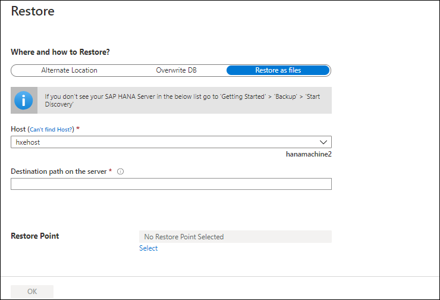
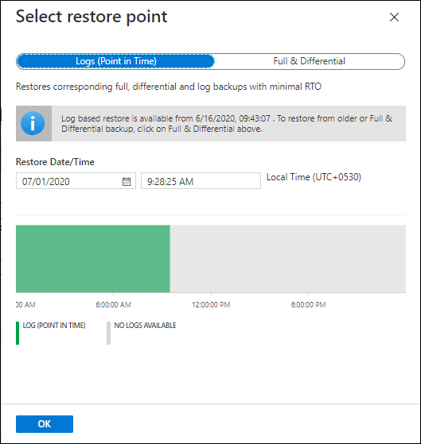

# Restore SAP HANA databases on Azure VMs

This article describes how to restore SAP HANA databases running on an Azure Virtual Machine (VM), which the Azure Backup service has backed up to a Recovery Services vault. Restores can be used to create copies of the data for dev / test scenarios or to return to a previous state.

For more information, on how to back up SAP HANA databases, see [Back up SAP HANA databases on Azure VMs](./backup-azure-sap-hana-database.md).

## Restore to a point in time or to a recovery point

Azure Backup can restore SAP HANA databases that are running on Azure VMs as follows:

* Restore to a specific date or time (to the second) by using log backups. Azure Backup automatically determines the appropriate full, differential backups and the chain of log backups that are required to restore based on the selected time.

* Restore to a specific full or differential backup to restore to a specific recovery point.

## Prerequisites

Before restoring a database, note the following:

* You can restore the database only to an SAP HANA instance that's in the same region.

* The target instance must be registered with the same vault as the source.

* Azure Backup can't identify two different SAP HANA instances on the same VM. So restoring data from one instance to another on the same VM isn't possible.

* To ensure that the target SAP HANA instance is ready for restore, check its **Backup readiness** status:

  1. Open the vault in which the target SAP HANA instance is registered.

  1. On the vault dashboard, under **Getting started**, choose **Backup**.

      

  1. In **Backup**, under **What do you want to backup?** choose **SAP HANA in Azure VM**.

      

  1. Under **Discover DBs in VMs**, select **View details**.

      

  1. Review the **Backup Readiness** of the target VM.

      

* To learn more about the restore types that SAP HANA supports, refer to the SAP HANA Note [1642148](https://launchpad.support.sap.com/#/notes/1642148)

## Restore a database

To restore, you need the following permissions:

* **Backup Operator** permissions in the vault where you're doing the restore.
* **Contributor (write)** access to the source VM that's backed up.
* **Contributor (write**) access to the target VM:
  * If you're restoring to the same VM, this is the source VM.
  * If you're restoring to an alternate location, this is the new target VM.

1. Open the vault in which the SAP HANA database to be restored is registered

1. On the vault dashboard, under **Protected Items**, choose **Backup Items**

    

1. In **Backup Items**, under **Backup Management Type** select **SAP HANA in Azure VM**

    

1. Select the database to be restored

    

1. Review the database menu. It provides information about database backup, including:

    * The oldest and latest restore points

    * The log backup status for the last 24 and 72 hours for the database

    

1. Select **Restore DB**

1. Under **Restore Configuration**, specify where (or how) to restore data:

    * **Alternate Location**: Restore the database to an alternate location and keep the original source database.

    * **Overwrite DB**: Restore the data to the same SAP HANA instance as the original source. This option overwrites the original database.

      

### Restore to alternate location

1. In the **Restore Configuration** menu, under **Where to Restore**, select **Alternate Location**.

    

1. Select the SAP HANA host name and instance name to which you want to restore the database.
1. Check if the target SAP HANA instance is ready for restore by ensuring its **Backup Readiness.** Refer to the [prerequisites section](#prerequisites) for more details.
1. In the **Restored DB Name** box, enter the name of the target database.

    > [!NOTE]
    > Single Database Container (SDC) restores must follow these [checks](backup-azure-sap-hana-database-troubleshoot.md#single-container-database-sdc-restore).

1. If applicable, select **Overwrite if the DB with the same name already exists on selected HANA instance**.
1. Select **OK**.

    

1. In **Select restore point**, select **Logs (Point in Time)** to [restore to a specific point in time](#restore-to-a-specific-point-in-time). Or select **Full & Differential** to [restore to a specific recovery point](#restore-to-a-specific-recovery-point).

### Restore and overwrite

1. In the **Restore Configuration** menu, under **Where to Restore**, select **Overwrite DB** > **OK**.

    

1. In **Select restore point**, select **Logs (Point in Time)** to [restore to a specific point in time](#restore-to-a-specific-point-in-time). Or select **Full & Differential** to [restore to a specific recovery point](#restore-to-a-specific-recovery-point).

### Restore as files

To restore the backup data as files instead of a database, choose **Restore as Files**. Once the files are dumped to a specified path, you can take these files to any SAP HANA machine where you want to restore them as a database. Because you can move these files to any machine, you can now restore the data across subscriptions and regions.

1. In the **Restore Configuration** menu, under **Where and how to Restore**, select **Restore as files**.
1. Select the **host** / HANA Server name to which you want to restore the backup files.
1. In the **Destination path on the server**, enter the folder path on the server selected in step 2. This is the location where the service will dump all the necessary backup files.

    The files that are dumped are:

    * Database backup files
    * Catalog files
    * JSON metadata files (for each backup file that's involved)

    Typically, a network share path, or path of a mounted Azure file share when specified as the destination path, enables easier access to these files by other machines in the same network or with the same Azure file share mounted on them.

    >[!NOTE]
    >To restore the database backup files on an Azure file share mounted on the target registered VM, make sure that root account has read/ write permissions on the Azure file share.

    

1. Select the **Restore Point** corresponding to which all the backup files and folders will be restored.

    

1. All the backup files associated with the selected restore point are dumped into the destination path.
1. Based on the type of restore point chosen (**Point in time** or **Full & Differential**), you'll see one or more folders created in the destination path. One of the folders named `Data_<date and time of restore>` contains the full and differential backups, and the other folder named `Log` contains the log backups.
1. Move these restored files to the SAP HANA server where you want to restore them as a database.
1. Then follow these steps:
    1. Set permissions on the folder / directory where the backup files are stored using the following command:

        ```bash
        chown -R <SID>adm:sapsys <directory>
        ```

    1. Run the next set of commands as `<SID>adm`

        ```bash
        su - <sid>adm
        ```

    1. Generate the catalog file for restore. Extract the **BackupId** from the JSON metadata file for the full backup, which will be used later in the restore operation. Make sure that the full and log backups are in different folders and delete the catalog files and JSON metadata files in these folders.

        ```bash
        hdbbackupdiag --generate --dataDir <DataFileDir> --logDirs <LogFilesDir> -d <PathToPlaceCatalogFile>
        ```

        In the command above:

        * `<DataFileDir>` - the folder that contains the full backups
        * `<LogFilesDir>` - the folder that contains the log backups
        * `<PathToPlaceCatalogFile>` - the folder where the catalog file generated must be placed

    1. Restore using the newly generated catalog file through HANA Studio or run the HDBSQL restore query with this newly generated catalog. HDBSQL queries are listed below:

    * To restore to a point in time:

        If you're creating a new restored database, run the HDBSQL command to create a new database `<DatabaseName>` and then stop the database for restore. However, if you're only restoring an existing database, run the HDBSQL command to stop the database.

        Then run the following command to restore the database:

        ```hdbsql
        RECOVER DATABASE FOR <DatabaseName> UNTIL TIMESTAMP '<TimeStamp>' CLEAR LOG USING SOURCE '<DatabaseName@HostName>'  USING CATALOG PATH ('<PathToGeneratedCatalogInStep3>') USING LOG PATH (' <LogFileDir>') USING DATA PATH ('<DataFileDir>') USING BACKUP_ID <BackupIdFromJsonFile> CHECK ACCESS USING FILE
        ```

        * `<DatabaseName>` - Name of the new database or existing database that you want to restore
        * `<Timestamp>` - Exact timestamp of the Point in time restore
        * `<DatabaseName@HostName>` - Name of the database whose backup is used for restore and the **host** / SAP HANA server name on which this database resides. The `USING SOURCE <DatabaseName@HostName>` option specifies that the data backup (used for restore) is of a database with a different SID or name than the target SAP HANA machine. So it doesn't need be specified for restores done on the same HANA server from where the backup is taken.
        * `<PathToGeneratedCatalogInStep3>` - Path to the catalog file generated in **Step C**
        * `<DataFileDir>` - the folder that contains the full backups
        * `<LogFilesDir>` - the folder that contains the log backups
        * `<BackupIdFromJsonFile>` - the **BackupId** extracted in **Step C**

    * To restore to a particular full or differential backup:

        If you're creating a new restored database, run the HDBSQL command to create a new database `<DatabaseName>` and then stop the database for restore. However, if you're only restoring an existing database, run the HDBSQL command to stop the database:

        ```hdbsql
        RECOVER DATA FOR <DatabaseName> USING BACKUP_ID <BackupIdFromJsonFile> USING SOURCE '<DatabaseName@HostName>'  USING CATALOG PATH ('<PathToGeneratedCatalogInStep3>') USING DATA PATH ('<DataFileDir>')  CLEAR LOG
        ```

        * `<DatabaseName>` - the name of the new database or existing database that you want to restore
        * `<Timestamp>` - the exact timestamp of the Point in time restore
        * `<DatabaseName@HostName>` - the name of the database whose backup is used for restore and the **host** / SAP HANA server name on which this database resides. The `USING SOURCE <DatabaseName@HostName>`  option specifies that the data backup (used for restore) is of a database with a different SID or name than the target SAP HANA machine. So it need not be specified for restores done on the same HANA server from where the backup is taken.
        * `<PathToGeneratedCatalogInStep3>` - the path to the catalog file generated in **Step C**
        * `<DataFileDir>` - the folder that contains the full backups
        * `<LogFilesDir>` - the folder that contains the log backups
        * `<BackupIdFromJsonFile>` - the **BackupId** extracted in **Step C**

### Restore to a specific point in time

If you've selected **Logs (Point in Time)** as the restore type, do the following:

1. Select a recovery point from the log graph and select **OK** to choose the point of restore.

    

1. On the **Restore** menu, select **Restore** to start the restore job.

    

1. Track the restore progress in the **Notifications** area or track it by selecting **Restore jobs** on the database menu.

    

### Restore to a specific recovery point

If you've selected **Full & Differential** as the restore type, do the following:

1. Select a recovery point from the list and select **OK** to choose the point of restore.

    

1. On the **Restore** menu, select **Restore** to start the restore job.

    

1. Track the restore progress in the **Notifications** area or track it by selecting **Restore jobs** on the database menu.

    

    > [!NOTE]
    > In Multiple Database Container (MDC) restores after the system DB is restored to a target instance, one needs to run the pre-registration script again. Only then the subsequent tenant DB restores will succeed. To learn more refer to [Troubleshooting – MDC Restore](backup-azure-sap-hana-database-troubleshoot.md#multiple-container-database-mdc-restore).

## Next steps

* [Learn how](sap-hana-db-manage.md) to manage SAP HANA databases backed up using Azure Backup
