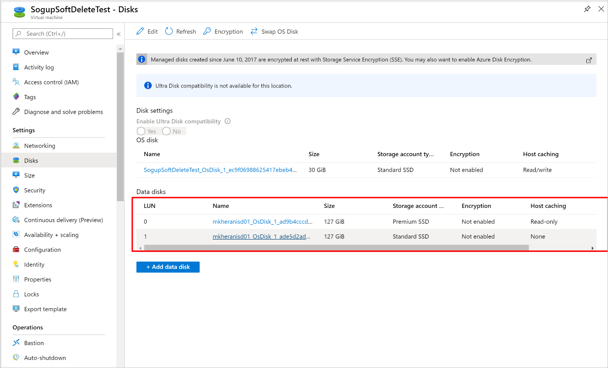
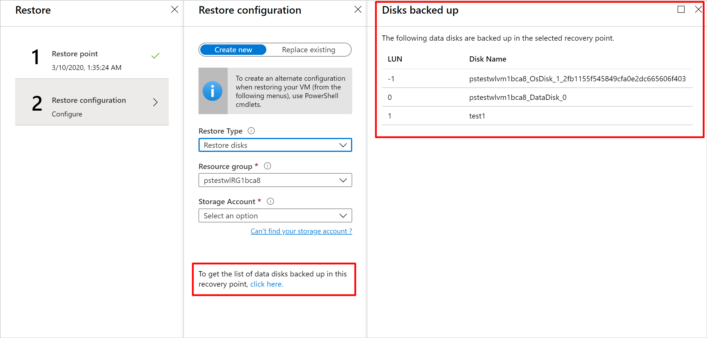

 
# Selective disk backup and restore for Azure VMs

Azure Backup supports backing up all the disks (operating system and data) in a VM together using the virtual machine backup solution. Now, using the exclude disk functionality, you get an option to back up one or a few out of the many data disks in a VM. This provides an efficient and cost-effective solution for your backup and restore needs. Each recovery point contains data of the disks included in the backup operation, which further allows you to have a subset of disks restored from the given recovery point during the restore operation. This applies to both restore from snapshots and the vault.

## Scenarios

This solution is useful particularly in the following scenarios:

1. If you have critical data to be backed up in only one disk and don’t want backup for rest of the disks attached to a VM to minimize the backup storage costs.
2. If you have other backup solutions for part of your VM or data. For example, if you back up your databases or data using a different workload backup solution and you want to use Azure VM level backup for the rest of the data or disks to build an efficient and  robust system using the best capabilities available.

The configuration of disks to be included/ excluded in the VM backup are based on LUN numbers. Each disk is associated with a unique LUN number that can be seen using the CLI cmdlet below:

```azurecli
az vm show --resource-group {resourcegroup} --name {vmname}
```

Or from the Azure portal: **Virtual machine > Disks**



>[!NOTE]
> The OS disk is by default added to the VM backup and cannot be excluded.

## Selective Disk Restore

Selective disk restore is an added functionality you get when enabling disk exclusion feature. With this feature, you can restore selective disks from all the disks backed up in a recovery point. It's more efficient and helps save time in scenarios where you know which disk  needs to be restored.

- Selective disk restore is supported only for recovery points created after the disk exclusion capability is enabled.
- Backups with Disk exclude setting **ON** only support the **Disk restore** option. **VM restore** or **Replace existing** restore options aren't supported in this case.
- The OS disk is always restored.

## Billing

Azure virtual machine backup follows the pricing model as before, explained in detail [here](https://azure.microsoft.com/pricing/details/backup/). With exclude disk, the backup of only the included disks are taken and so you save on the storage costs. The protected instance cost and snapshot cost are calculated for all the disks in the VM (included and excluded disks) and so remains as before and is calculated according to the VM backup pricing model.

## CLI cmdlets for disk inclusion and exclusion operations

>[!NOTE]
>Ensure you are using Az CLI version 2.0.80 or higher. You can get the CLI version with the command `az --version`

Sign in to the subscription ID where the Recovery services vault and the VM exist:

```azurecli
az account set -s {subscriptionID}
```

### Configure backup

During the configure protection operation, you need to specify the disk list setting with an inclusion or exclusion parameter giving the LUN numbers of the disks to be included or excluded in the backup.

```azurecli
az backup protection enable-for-vm --resource-group {resourcegroup} --vault-name {vaultname} --vm {vmname} --policy-name {policyname} --disk-list-setting include --diskslist {LUN number(s) separated by space}

az backup protection enable-for-vm --resource-group {resourcegroup} --vault-name {vaultname} --vm {vmname} --policy-name {policyname} --disk-list-setting exclude --diskslist 0 1
```

If the VM isn't in the same resource group as that  vault, then **ResourceGroup** refers to the resource group where the vault was created. Instead of the VM name, provide the VM ID as indicated below.

```azurecli
az backup protection enable-for-vm  --resource-group {ResourceGroup} --vault-name {vaultname} --vm $(az vm show -g VMResourceGroup -n MyVm --query id | tr -d '"') --policy-name {policyname} --disk-list-setting include --diskslist {LUN number(s) separated by space}
```

### Modify protection for already backed up VMs

```azurecli
az backup protection update-for-vm --resource-group {resourcegroup} --vault-name {vaultname} -c {vmname} -i {vmname} --disk-list-setting exclude --diskslist {LUN number(s) separated by space}
```

### Backup only OS disk during configure backup

```azurecli
az backup protection enable-for-vm --resource-group {resourcegroup} --vault-name {vaultname} --vm {vmname} --policy-name {policyname} -- exclude-all-data-disks
```

### Backup only OS disk during modify protection

```azurecli
az backup protection update-for-vm --resource-group {resourcegroup} --vault-name {vaultname} -c {vmname} -i {vmname} --exclude-all-data-disks
```

### Restore disks

```azurecli
az backup restore restore-disks --resource-group {resourcegroup} --vault-name {vaultname} -c {vmname} -i {vmname} -r {restorepoint} --target-resource-group {targetresourcegroup} --storage-account {storageaccountname} --restore-to-staging-storage-account --diskslist {LUN number of the disk(s) to be restored}
```

### Restore only OS-disks  

```azurecli
az backup restore restore-disks --resource-group {resourcegroup} --vault-name {vaultname} -c {vmname} -i {vmname} -r {restorepoint} } --target-resource-group {targetresourcegroup} --storage-account {storageaccountname} --restore-to-staging-storage-account --restore-only-osdisk
```

### Get Protected Item to get disk exclusion details

```azurecli
az backup item show -c {vmname} -n {vmname} --vault-name {vaultname} --resource-group {resourcegroup} --backup-management-type AzureIaasVM
```

There's an additional **diskExclusionProperties** parameter added to the protected item as shown below:

```azurecli
"extendedProperties": {
      "diskExclusionProperties": {
        "diskLunList": [
          0,
          1
        ],
        "isInclusionList": true
      }
```

### Get backup job

```azurecli
az backup job show --vault-name {vaultname} --resource-group {resourcegroup} -n {BackupJobID}
```

This command helps get the details of the backed-up disks and excluded disks as shown below:

```azurecli
   "Backed-up disk(s)": "diskextest_OsDisk_1_170808a95d214428bad92efeecae626b; diskextest_DataDisk_0; diskextest_DataDisk_1",
        "Backup Size": "0 MB",
        "Excluded disk(s)": "diskextest_DataDisk_2",
```

### List Recovery Points

```azurecli
az backup recoverypoint list --vault-name {vaultname} --resource-group {resourcegroup} -c {vmname} -i {vmname} --backup-management-type AzureIaasVM
```

This gives the information of the number of disks attached and backed up in the VM.

```azurecli
      "recoveryPointDiskConfiguration": {
        "excludedDiskList": null,
        "includedDiskList": null,
        "numberOfDisksAttachedToVm": 4,
        "numberOfDisksIncludedInBackup": 3
};
```

### Get Recovery Point

```azurecli
az backup recoverypoint show --vault-name {vaultname} --resource-group {resourcegroup} -c {vmname} -i {vmname} --backup-management-type AzureIaasVM -n {recoverypointID}
```

Each recovery point has the information of the included and excluded disks:

```azurecli
"recoveryPointDiskConfiguration": {
      "excludedDiskList": [
        {
          "lun": 2,
          "name": "diskextest_DataDisk_2"
        }
      ],
      "includedDiskList": [
        {
          "lun": -1,
          "name": "diskextest_OsDisk_1_170808a95d214428bad92efeecae626b"
        },
        {
          "lun": 0,
          "name": "diskextest_DataDisk_0"
        },
        {
          "lun": 1,
          "name": "diskextest_DataDisk_1"
        }
      ],
      "numberOfDisksAttachedToVm": 4,
      "numberOfDisksIncludedInBackup": 3
```

### Remove disk exclusion settings and get protected item

```azurecli
az backup protection update-for-vm --vault-name {vaultname} --resource-group {resourcegroup} -c {vmname} -i {vmname} --disk-list-setting resetexclusionsettings

az backup item show -c {vmname} -n {vmname} --vault-name {vaultname} --resource-group {resourcegroup} --backup-management-type AzureIaasVM
```

On executing these commands, you'll see `"diskExclusionProperties": null`

## PowerShell cmdlets for disk inclusion and exclusion operations

>[!NOTE]
>Ensure you are using Azure PS version 3.7.0 or higher.

### Enable backup

```powershell
Enable-AzRecoveryServicesBackupProtection -Policy $pol -Name "V2VM" -ResourceGroupName "RGName1"  -DiskListSetting "Include"/"Exclude" -DisksList[Strings] -VaultId $targetVault.ID
```

### Backup only OS disk during configure backup (PowerShell)

```powershell
Enable-AzRecoveryServicesBackupProtection -Policy $pol -Name "V2VM" -ResourceGroupName "RGName1"  -ExcludeAllDataDisks -VaultId $targetVault.ID
```

### Modify protection for already backed up VMs (PowerShell)

```powershell
Enable-AzRecoveryServicesBackupProtection -Item "V2VM" -DiskListSetting "Include"/"Exclude" -DisksList[Strings]   -VaultId $targetVault.ID
```

### Backup only OS disk during modify protection (PowerShell)

```powershell
Enable-AzRecoveryServicesBackupProtection -Item "V2VM"  -ExcludeAllDataDisks -VaultId $targetVault.ID
```

### Reset disk exclusion setting (PowerShell)

```powershell
Enable-AzRecoveryServicesBackupProtection -Item "V2VM" -DiskListSetting "Reset" -VaultId $targetVault.ID
```

### Restore selective disks (PowerShell)

```powershell
Restore-AzRecoveryServicesBackupItem -RecoveryPoint $rp[0] -StorageAccountName "DestAccount" -StorageAccountResourceGroupName "DestRG" -TargetResourceGroupName "DestRGforManagedDisks" -VaultId $targetVault.ID -RestoreDiskList [Strings]
```

### Restore only OS disk (PowerShell)

```powershell
Restore-AzRecoveryServicesBackupItem -RecoveryPoint $rp[0] -StorageAccountName "DestAccount" -StorageAccountResourceGroupName "DestRG" -TargetResourceGroupName "DestRGforManagedDisks" -VaultId $targetVault.ID -RestoreOnlyOSDisk
```

>[!NOTE]
>If data spans across disks, make sure all the dependent disks are included in the backup.<BR>
>If you don’t backup all the dependent disks in a volume, during restore a volume comprising of some non-backed up disks will not be created.

## Azure portal

Disk exclusion can be configured only through CLI and PowerShell today. Configuring disk exclusion through the Azure portal isn't supported in preview.

You can view the included disks for a virtual machine in the portal from the **VM backup details** pane.


You can also view the backed-up and excluded disks in a backup from the **Job Details** pane.


During restore, when selecting the recovery point to restore from, you get an option to view the backed-up disks in that particular recovery point.



>[!NOTE]
>Disk exclusion is not supported for encrypted virtual machines and classic virtual machines.

## Next steps

- [Support matrix for Azure VM backup](backup-support-matrix-iaas.md)
- [Frequently asked questions-Back up Azure VMs](backup-azure-vm-backup-faq.md)
