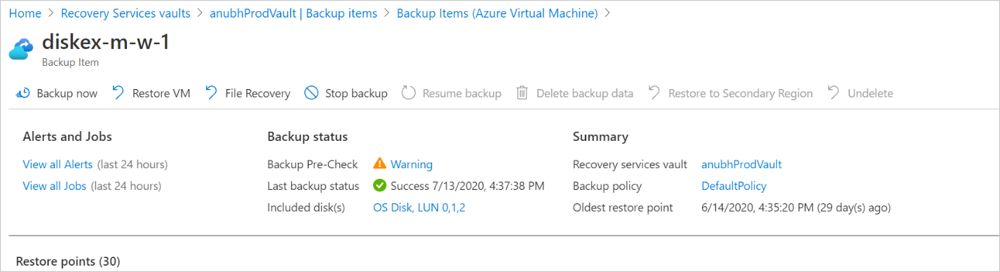
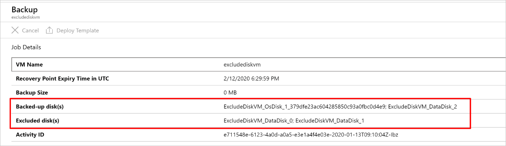
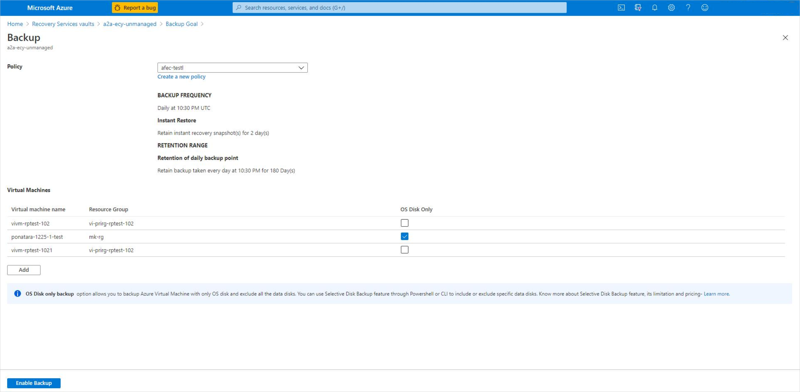
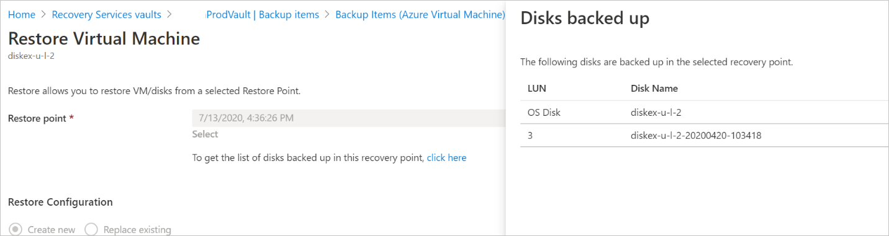

 
# Selective disk backup and restore for Azure virtual machines

Azure Backup supports backing up all the disks (operating system and data) in a VM together using the virtual machine backup solution. Now, using the selective disks backup and restore functionality, you can back up a subset of the data disks in a VM. This provides an efficient and cost-effective solution for your backup and restore needs. Each recovery point contains only the disks that are included in the backup operation. This further allows you to have a subset of disks restored from the given recovery point during the restore operation. This applies to both restore from snapshots and the vault.

## Scenarios

This solution is useful particularly in the following scenarios:

1. If you have critical data to be backed up in only one disk, or a subset of the disks and don’t want to back up the rest of the disks attached to a VM to minimize the backup storage costs.
2. If you have other backup solutions for part of your VM or data. For example, if you back up your databases or data using a different workload backup solution and you want to use Azure VM level backup for the rest of the data or disks to build an efficient and  robust system using the best capabilities available.

Using PowerShell or Azure CLI, you can configure selective disk backup of the Azure VM. Using a script, you can include or exclude data disks using their LUN numbers. Currently, the ability to configure selective disks backup through the Azure portal is limited to the **Backup OS Disk only** option. So you can configure backup of your Azure VM with OS disk, and exclude all the data disks attached to it.

>[!NOTE]
> The OS disk is by default added to the VM backup and can't be excluded.

## Using Azure CLI

Ensure you're using Az CLI version 2.0.80 or higher. You can get the CLI version with this command:

```azurecli
az --version
```

Sign in to the subscription ID, where the Recovery Services vault and the VM exist:

```azurecli
az account set -s {subscriptionID}
```

>[!NOTE]
>Only the **resourcegroup** name (not the object) corresponding to the vault is needed in each command below.

### Configure backup with Azure CLI

During the configure protection operation, you need to specify the disk list setting with an **inclusion** / **exclusion** parameter, giving the LUN numbers of the disks to be included or excluded in the backup.

>[!NOTE]
>The configure protection operation overrides the previous settings, they will not be cumulative.

```azurecli
az backup protection enable-for-vm --resource-group {resourcegroup} --vault-name {vaultname} --vm {vmname} --policy-name {policyname} --disk-list-setting include --diskslist {LUN number(s) separated by space}
```

```azurecli
az backup protection enable-for-vm --resource-group {resourcegroup} --vault-name {vaultname} --vm {vmname} --policy-name {policyname} --disk-list-setting exclude --diskslist 0 1
```

If the VM isn't in the same resource group as the vault, then **ResourceGroup** refers to the resource group where the vault was created. Instead of the VM name, provide the VM ID as indicated below.

```azurecli
az backup protection enable-for-vm  --resource-group {ResourceGroup} --vault-name {vaultname} --vm $(az vm show -g VMResourceGroup -n MyVm --query id --output tsv) --policy-name {policyname} --disk-list-setting include --diskslist {LUN number(s) separated by space}
```

### Modify protection for already backed up VMs with Azure CLI

```azurecli
az backup protection update-for-vm --resource-group {resourcegroup} --vault-name {vaultname} -c {vmname} -i {vmname} --backup-management-type AzureIaasVM --disk-list-setting exclude --diskslist {LUN number(s) separated by space}
```

### Backup only OS disk during configure backup with Azure CLI

```azurecli
az backup protection enable-for-vm --resource-group {resourcegroup} --vault-name {vaultname} --vm {vmname} --policy-name {policyname} --exclude-all-data-disks
```

### Backup only OS disk during modify protection with Azure CLI

```azurecli
az backup protection update-for-vm --resource-group {resourcegroup} --vault-name {vaultname} -c {vmname} -i {vmname} --backup-management-type AzureIaasVM --exclude-all-data-disks
```

### Restore disks with Azure CLI

```azurecli
az backup restore restore-disks --resource-group {resourcegroup} --vault-name {vaultname} -c {vmname} -i {vmname} -r {restorepoint} --target-resource-group {targetresourcegroup} --storage-account {storageaccountname} --diskslist {LUN number of the disk(s) to be restored}
```

### Restore only OS disk with Azure CLI

```azurecli
az backup restore restore-disks --resource-group {resourcegroup} --vault-name {vaultname} -c {vmname} -i {vmname} -r {restorepoint} } --target-resource-group {targetresourcegroup} --storage-account {storageaccountname} --restore-only-osdisk
```

### Get protected item to get disk exclusion details with Azure CLI

```azurecli
az backup item show -c {vmname} -n {vmname} --vault-name {vaultname} --resource-group {resourcegroup} --backup-management-type AzureIaasVM
```

There's an additional **diskExclusionProperties** parameter added to the protected item as shown below:

```azurecli
"extendedProperties": {
      "diskExclusionProperties": {
        "diskLunList": [
          0,
          1
        ],
        "isInclusionList": true
      }
```

### Get backup job with Azure CLI

```azurecli
az backup job show --vault-name {vaultname} --resource-group {resourcegroup} -n {BackupJobID}
```

This command helps get the details of the backed-up disks and excluded disks as shown below:

```output
   "Backed-up disk(s)": "diskextest_OsDisk_1_170808a95d214428bad92efeecae626b; diskextest_DataDisk_0; diskextest_DataDisk_1",  "Backup Size": "0 MB",
   "Excluded disk(s)": "diskextest_DataDisk_2",
```

_BackupJobID_ is the Backup Job name. To fetch the job name, run the following command:

```azurecli
az backup job list --resource-group {resourcegroup} --vault-name {vaultname}
```
### List recovery points with Azure CLI

```azurecli
az backup recoverypoint list --vault-name {vaultname} --resource-group {resourcegroup} -c {vmname} -i {vmname} --backup-management-type AzureIaasVM
```

This gives the information of the number of disks attached and backed up in the VM.

```azurecli
      "recoveryPointDiskConfiguration": {
        "excludedDiskList": null,
        "includedDiskList": null,
        "numberOfDisksAttachedToVm": 4,
        "numberOfDisksIncludedInBackup": 3
};
```

### Get recovery point with Azure CLI

```azurecli
az backup recoverypoint show --vault-name {vaultname} --resource-group {resourcegroup} -c {vmname} -i {vmname} --backup-management-type AzureIaasVM -n {recoverypointID}
```

Each recovery point has the information of the included and excluded disks:

```azurecli
  "recoveryPointDiskConfiguration": {
      "excludedDiskList": [
        {
          "lun": 2,
          "name": "diskextest_DataDisk_2"
        }
      ],
      "includedDiskList": [
        {
          "lun": -1,
          "name": "diskextest_OsDisk_1_170808a95d214428bad92efeecae626b"
        },
        {
          "lun": 0,
          "name": "diskextest_DataDisk_0"
        },
        {
          "lun": 1,
          "name": "diskextest_DataDisk_1"
        }
      ],
      "numberOfDisksAttachedToVm": 4,
      "numberOfDisksIncludedInBackup": 3
```

### Remove disk exclusion settings and get protected item with Azure CLI

```azurecli
az backup protection update-for-vm --vault-name {vaultname} --resource-group {resourcegroup} -c {vmname} -i {vmname} --backup-management-type AzureIaasVM --disk-list-setting resetexclusionsettings

az backup item show -c {vmname} -n {vmname} --vault-name {vaultname} --resource-group {resourcegroup} --backup-management-type AzureIaasVM
```

When you execute these commands, you'll see `"diskExclusionProperties": null`.

## Using PowerShell

Ensure you're using Azure PowerShell version 3.7.0 or higher.

During the configure protection operation, you need to specify the disk list setting with an inclusion / exclusion parameter, giving the LUN numbers of the disks to be included or excluded in the backup.

>[!NOTE]
>The configure protection operation overrides the previous settings, they will not be cumulative.

### Enable backup with PowerShell

For example:

```azurepowershell
$disks = ("0","1")
$targetVault = Get-AzRecoveryServicesVault -ResourceGroupName "rg-p-recovery_vaults" -Name "rsv-p-servers"
Set-AzRecoveryServicesVaultContext -Vault $targetVault
Get-AzRecoveryServicesBackupProtectionPolicy
$pol = Get-AzRecoveryServicesBackupProtectionPolicy -Name "P-Servers"
```

```azurepowershell
Enable-AzRecoveryServicesBackupProtection -Policy $pol -Name "V2VM" -ResourceGroupName "RGName1"  -InclusionDisksList $disks -VaultId $targetVault.ID
```

```azurepowershell
Enable-AzRecoveryServicesBackupProtection -Policy $pol -Name "V2VM" -ResourceGroupName "RGName1"  -ExclusionDisksList $disks -VaultId $targetVault.ID
```

### Backup only OS disk during configure backup with PowerShell

```azurepowershell
Enable-AzRecoveryServicesBackupProtection -Policy $pol -Name "V2VM" -ResourceGroupName "RGName1"  -ExcludeAllDataDisks -VaultId $targetVault.ID
```

### Get backup item object to be passed in modify protection with PowerShell

```azurepowershell
$item= Get-AzRecoveryServicesBackupItem -BackupManagementType "AzureVM" -WorkloadType "AzureVM" -VaultId $targetVault.ID -FriendlyName "V2VM"
```

You need to pass the above obtained **$item** object to the **–Item** parameter in the following cmdlets.

### Modify protection for already backed up VMs with PowerShell

```azurepowershell
Enable-AzRecoveryServicesBackupProtection -Item $item -InclusionDisksList[Strings] -VaultId $targetVault.ID
```

```azurepowershell
Enable-AzRecoveryServicesBackupProtection -Item $item -ExclusionDisksList[Strings] -VaultId $targetVault.ID
```

### Backup only OS disk during modify protection with PowerShell

```azurepowershell
Enable-AzRecoveryServicesBackupProtection -Item $item  -ExcludeAllDataDisks -VaultId $targetVault.ID
```

### Reset disk exclusion setting with PowerShell

```azurepowershell
Enable-AzRecoveryServicesBackupProtection -Item $item -ResetExclusionSettings -VaultId $targetVault.ID
```

### Restore selective disks with PowerShell

```azurepowershell
$startDate = (Get-Date).AddDays(-7)
$endDate = Get-Date
$rp = Get-AzRecoveryServicesBackupRecoveryPoint -Item $item -StartDate $startdate.ToUniversalTime() -EndDate $enddate.ToUniversalTime() -VaultId $targetVault.ID
Restore-AzRecoveryServicesBackupItem -RecoveryPoint $rp[0] -StorageAccountName "DestAccount" -StorageAccountResourceGroupName "DestRG" -TargetResourceGroupName "DestRGforManagedDisks" -VaultId $targetVault.ID -RestoreDiskList [$disks]
```

### Restore only OS disk with PowerShell

```azurepowershell
Restore-AzRecoveryServicesBackupItem -RecoveryPoint $rp[0] -StorageAccountName "DestAccount" -StorageAccountResourceGroupName "DestRG" -TargetResourceGroupName "DestRGforManagedDisks" -VaultId $targetVault.ID -RestoreOnlyOSDisk
```

## Using the Azure portal

[!INCLUDE [backup-center.md](../../includes/backup-center.md)]

Using the Azure portal, you can view the included and excluded disks from the VM backup details pane and the backup job details pane.  During restore, when you select the recovery point to restore from, you can view the backed-up disks in that recovery point.

Here you can view the included and excluded disks for a virtual machine in the portal from the VM backup details pane:



Here you can view the included and excluded disks in a backup from job details pane:



Here you can view the backed-up disks during restore, when you select the recovery point to restore from:


Configuring the selective disks backup experience for a VM through the Azure portal is limited to  the **Backup OS Disk only** option. To use selective disks backup on already a backed-up VM or for advanced inclusion or exclusion of specific data disks of a VM, use PowerShell or Azure CLI.

>[!NOTE]
>If data spans across disks, make sure all the dependent disks are included in the backup. If you don’t backup all the dependent disks in a volume, during restore the volume comprising of some non-backed up disks won't be created.

### Backup OS disk only in the Azure portal

When you enable backup using Azure portal, you can choose the **Backup OS Disk only** option. So you can configure backup of your Azure VM with OS disk, and exclude all data disks attached to it.



## Using Azure REST API

You can configure Azure VM Backup with a few select disks or you can modify an existing VM's protection to include/exclude few disks as documented [here](backup-azure-arm-userestapi-backupazurevms.md#excluding-disks-in-azure-vm-backup).

## Selective disk restore

Selective disk restore is an added functionality you get when you enable the selective disks backup feature. With this functionality, you can restore selective disks from all the disks backed up in a recovery point. It's more efficient, and helps save time in scenarios where you know which of the disks needs to be restored.

- The OS disk is included by default in the VM backup and restore, and can't be excluded.
- Selective disk restore is supported only for recovery points created after the disk exclusion capability is enabled.
- Backups with the disk exclude setting **ON** only support the **Disk restore** option. **VM restore** or **Replace Existing** restore options aren't supported in this case.



## Limitations

Selective disks backup functionality isn't supported for classic virtual machines and encrypted virtual machines. So Azure VMs that are encrypted with Azure Disk Encryption (ADE) using BitLocker for encryption of Windows VM, and the dm-crypt feature for Linux VMs are unsupported.

The restore options to **Create new VM** and **Replace existing** aren't supported for the VM for which selective disks backup functionality is enabled.

Currently, Azure VM backup doesn't support VMs with ultra-disks or shared disks attached to them. Selective disk backup can't be used to in such cases, which exclude the disk and backup the VM.

If you use disk exclusion or selective disks while backing up Azure VM, _[stop protection and retain backup data](backup-azure-manage-vms.md#stop-protection-and-retain-backup-data)_. When resuming backup for this resource, you need to set up disk exclusion settings again.

## Billing

Azure virtual machine backup follows the existing pricing model, explained in detail [here](https://azure.microsoft.com/pricing/details/backup/).

**Protected Instance (PI) cost** is calculated for the OS disk only if you choose to back up using the **OS Disk only** option.  If you configure backup and select at least one data disk, the PI cost will be calculated for all the disks attached to the VM. **Backup storage cost** is calculated based on only the included disks and so you get to save on the storage cost. **Snapshot cost** is always calculated for all the disks in the VM (both the included and excluded disks).

If you have chosen the Cross Region Restore (CRR) feature, then the [CRR pricing](https://azure.microsoft.com/pricing/details/backup/) applies on the backup storage cost after excluding the disk.

## Frequently asked questions

### How is Protected Instance (PI) cost calculated for only OS disk backup in Windows and Linux?

PI cost is calculated based on actual (used) size of the VM.

- For Windows: Used space calculation is based on the drive that stores the operating system (which is usually C:).
- For Linux: Used space calculation is based on the device where root filesystem ( / ) is mounted.

### I have configured only OS disk backup, why is the snapshot happening for all the disks?

Selective disk backup features let you save on backup vault storage cost by hardening the included disks that are part of the backup. However, the snapshot is taken for all the disks that are attached to the VM. So the snapshot cost is always calculated for all the disks in the VM (both the included and excluded disks). For more information, see [billing](#billing).

### I can't configure backup for the Azure virtual machine by excluding ultra disk or shared disks attached to the VM

Selective disk backup feature is a capability provided on top of the Azure virtual machine backup solution. Currently, Azure VM backup doesn't support VMs with ultra-disk or shared disk attached to them.

## Next steps

- [Support matrix for Azure VM backup](backup-support-matrix-iaas.md)
- [Frequently asked questions-Back up Azure VMs](backup-azure-vm-backup-faq.yml)
