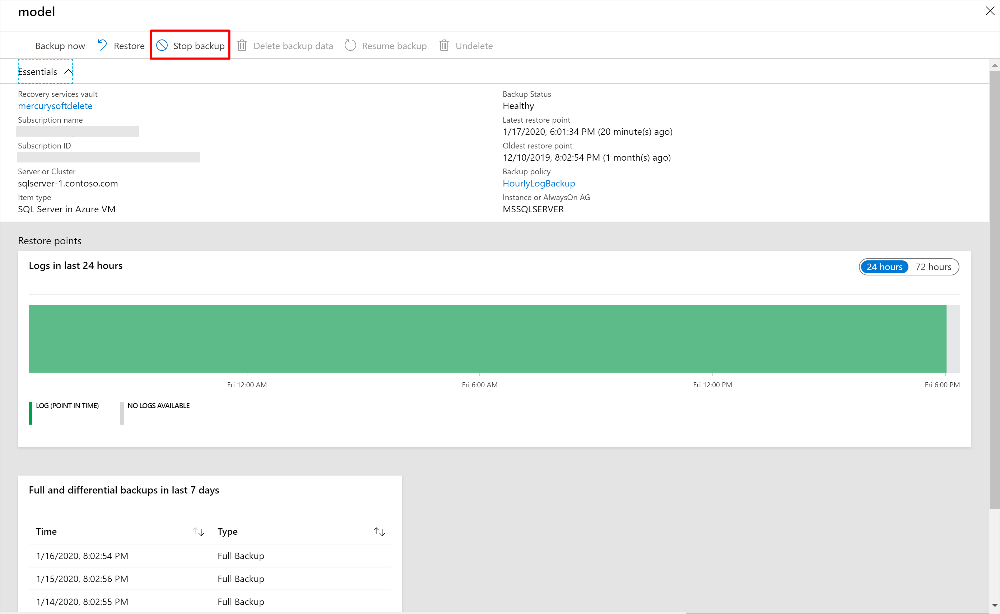
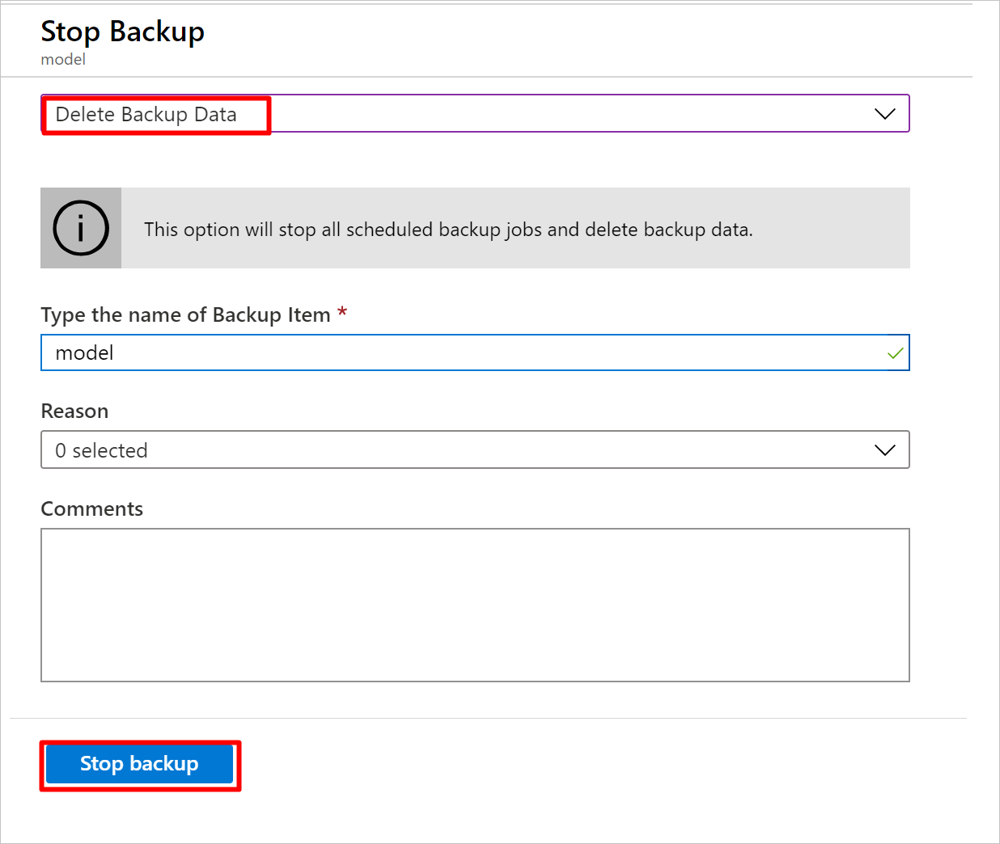
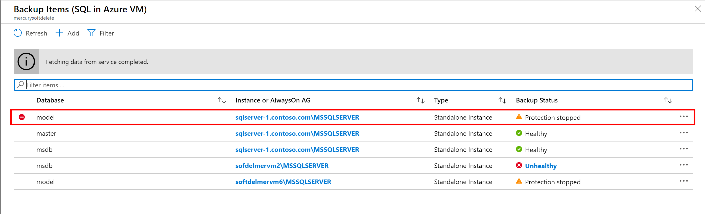
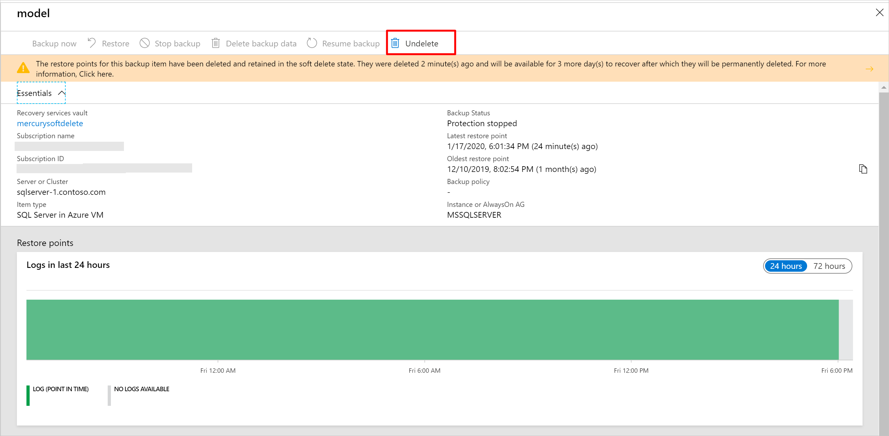
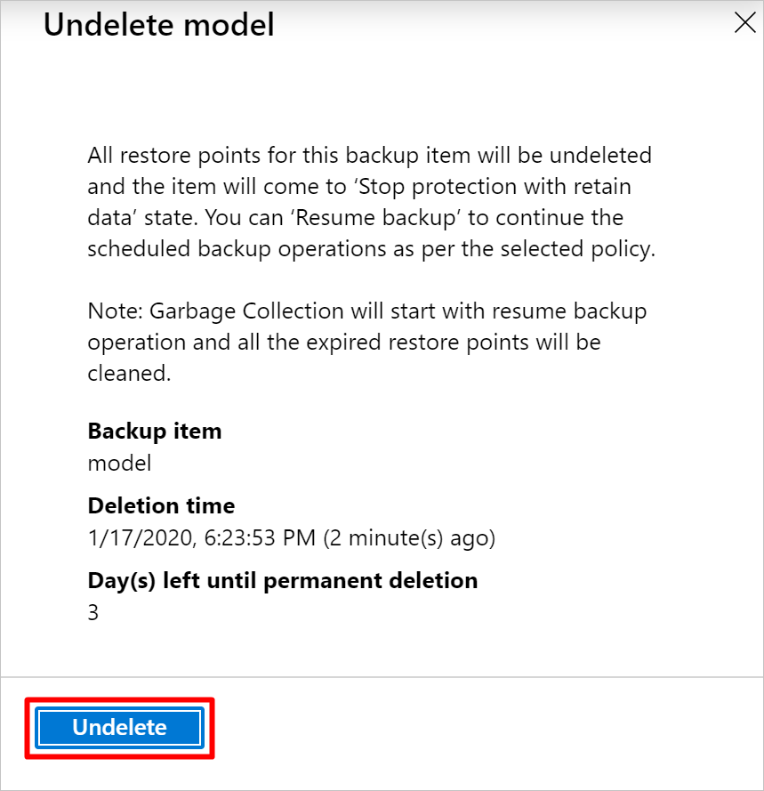
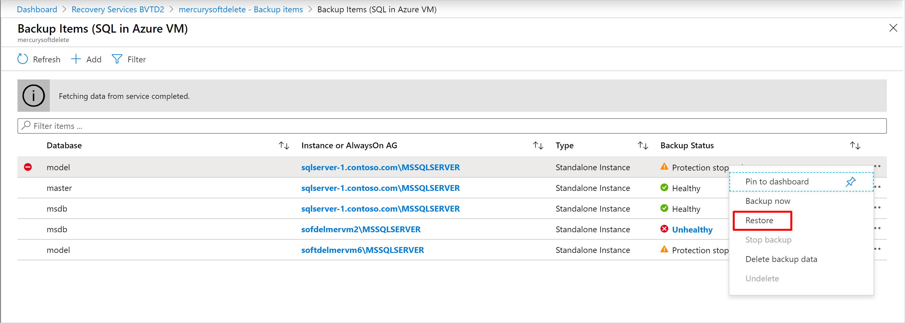
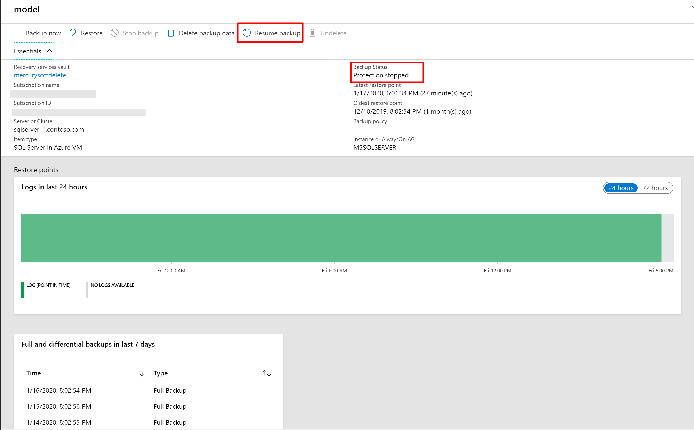

# Soft delete for SQL server in Azure VM and SAP HANA in Azure VM workloads

Azure Backup now provides soft delete for SQL server in Azure VM and SAP HANA in Azure VM workloads. This is in addition to the already supported [Azure Virtual machine soft delete scenario](soft-delete-virtual-machines.md).

[Soft delete](backup-azure-security-feature-cloud.md) is a security feature to help protect backup data even after deletion. With soft delete, even if a malicious actor deletes the backup of a database (or backup data is accidentally deleted), the backup data is retained for 14 additional days. This allows the recovery of that backup item with no data loss. This additional retention of 14 days of the backup data in the "soft delete" state doesn’t incur any cost to the customer.

## Soft delete for SQL server in Azure VM using Azure portal

>[!NOTE]
>These instructions also apply to SAP HANA in Azure VM.

1. To delete the backup data of a database in a SQL server, the backup must be stopped. In the Azure portal, go to your Recovery Services vault, go to the backup item, and choose **Stop backup**.

   

2. In the following window, you'll be given a choice to delete or retain the backup data. If you choose **Delete backup data**, the database backup won't be permanently deleted. Rather, the backup data will be retained for 14 days in the soft deleted state. The deletion is deferred until the 15th day with regular alert emails on the first, 12th, and 15th day informing about the backup state of the database to the user.

   

3. During those 14 days, in the Recovery Services vault, the soft deleted item will appear with a red “soft-delete” icon next to it.

   

4. To restore the soft-deleted DB, it must first be undeleted. To undelete, choose the soft-deleted DB, and then select the option **Undelete**.

   

   A window will appear warning that if undelete is chosen, all restore points for the database will be undeleted and available for performing a restore operation. The backup item will be retained in a “stop protection with retain data” state with backups paused and backup data retained forever with no backup policy effective.

   

5. At this point, you can also restore the data by selecting **Restore** for the chosen soft deleted backup item.

   

6. After the undelete process is completed, the status will return to “Stop backup with retain data” and then you can choose **Resume backup**. The **Resume backup** operation brings back the backup item in the active state, associated with a backup policy selected by the user defining the backup and retention schedules.

   

## Soft delete for SQL server in VM using Azure PowerShell

>[!NOTE]
>The Az.RecoveryServices version required to use soft-delete using Azure PowerShell is minimum 2.2.0. Use `Install-Module -Name Az.RecoveryServices -Force` to get the latest version.

The sequence of steps for using  Azure PowerShell is the same as in the Azure portal, outlined above.

### Delete the backup item using Azure PowerShell

Delete the backup item using the [Disable-AzRecoveryServicesBackupProtection](/powershell/module/az.recoveryservices/disable-azrecoveryservicesbackupprotection) PowerShell cmdlet.

```powershell
Disable-AzRecoveryServicesBackupProtection -Item $myBkpItem -RemoveRecoveryPoints -VaultId $myVaultID -Force
```

The **DeleteState** of the backup item will change from **NotDeleted** to **ToBeDeleted**. The backup data will be retained for 14 days. If you wish to revert the delete operation, then undo-delete should be performed.

### Undoing the deletion operation using Azure PowerShell

First, fetch the relevant backup item that's in soft-delete state (that is, about to be deleted).

```powershell
Get-AzRecoveryServicesBackupItem -BackupManagementType AzureWorkload -WorkloadType SQLDataBase -VaultId $myVaultID | Where-Object {$_.DeleteState -eq "ToBeDeleted"}

$myBkpItem = Get-AzRecoveryServicesBackupItem -BackupManagementType AzureWorkload -WorkloadType SQLDataBase -VaultId $myVaultID -Name AppVM1
```

Then, perform the undo-deletion operation using the [Undo-AzRecoveryServicesBackupItemDeletion](/powershell/module/az.recoveryservices/undo-azrecoveryservicesbackupitemdeletion) PowerShell cmdlet.

```powershell
Undo-AzRecoveryServicesBackupItemDeletion -Item $myBKpItem -VaultId $myVaultID -Force
```

The **DeleteState** of the backup item will revert to **NotDeleted**. But the protection is still stopped. Resume the backup to re-enable the protection.

## How to disable soft delete

Disabling this feature isn't recommended. The only circumstance where you should consider disabling soft delete is if you're planning on moving your protected items to a new vault, and can't wait the 14 days required before deleting and reprotecting (such as in a test environment.) For instructions on how to disable soft delete, see [Enabling and disabling soft delete](backup-azure-security-feature-cloud.md#enabling-and-disabling-soft-delete).

## Next steps

- Read the [frequently asked questions](backup-azure-security-feature-cloud.md#frequently-asked-questions) about soft delete
- Read about all the [security features in Azure Backup](security-overview.md)
