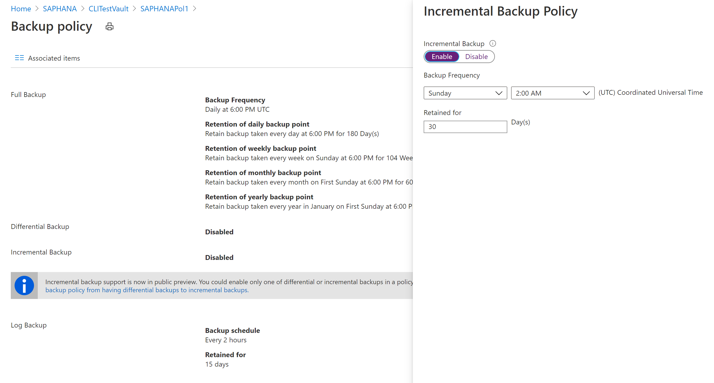
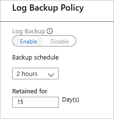

# Tutorial: Back up SAP HANA databases in an Azure VM

This tutorial shows you how to back up SAP HANA databases running on Azure VMs to an Azure Backup Recovery Services vault. In this article you'll learn how to:

> [!div class="checklist"]
>
> * Create and configure a vault
> * Discover databases
> * Configure backups

[Here](sap-hana-backup-support-matrix.md#scenario-support) are all the scenarios that we currently support.

## Prerequisites

Make sure you do the following before configuring backups:

* Identify or create a [Recovery Services vault](backup-sql-server-database-azure-vms.md#create-a-recovery-services-vault) in the same region and subscription as the VM running SAP HANA.
* Allow connectivity from the VM to the internet, so that it can reach Azure, as described in the [set up network connectivity](backup-azure-sap-hana-database.md#establish-network-connectivity) section.
* Ensure that the combined length of the SAP HANA Server VM name and the Resource Group name doesn't exceed 84 characters for Azure Resource Manager (ARM_ VMs (and 77 characters for classic VMs). This limitation is because some characters are reserved by the service.
* A key should exist in the **hdbuserstore** that fulfills the following criteria:
  * It should be present in the default **hdbuserstore**. The default is the `<sid>adm` account under which SAP HANA is installed.
  * For MDC, the key should point to the SQL port of **NAMESERVER**. In the case of SDC, it should point to the SQL port of **INDEXSERVER**
  * It should have credentials to add and delete users
  * Note that this key can be deleted after running the pre-registration script successfully
* You could also choose to create a key for the existing HANA SYSTSEM user in **hdbuserstore** instead of creating a custom key as listed in the step above.
* Run the SAP HANA backup configuration script (pre-registration script) in the virtual machine where HANA is installed, as the root user. [This script](https://go.microsoft.com/fwlink/?linkid=2173610) gets the HANA system ready for backup and requires the key you have created in the above steps to be passed as input. To understand how this input is to be passed as a parameter to the script, refer to the [What the pre-registration script does](#what-the-pre-registration-script-does) section. It also details about what the pre-registration script does.
* If your HANA setup uses Private Endpoints, run the [pre-registration script](https://go.microsoft.com/fwlink/?linkid=2173610) with the *-sn* or *--skip-network-checks* parameter.

>[!NOTE]
>The preregistration script installs the **compat-unixODBC234** for SAP HANA workloads running on RHEL (7.4, 7.6 and 7.7) and **unixODBC** for RHEL 8.1. [This package is located in the RHEL for SAP HANA (for RHEL 7 Server) Update Services for SAP Solutions (RPMs) repo](https://access.redhat.com/solutions/5094721).  For an Azure Marketplace RHEL image the repo would be **rhui-rhel-sap-hana-for-rhel-7-server-rhui-e4s-rpms**.

## Understanding backup and restore throughput performance

The backups (log and non-log) in SAP HANA Azure VMs provided via Backint are streams to Azure Recovery Services vaults (which internally use Azure Storage Blob) and so it is important to understand this streaming methodology.

The Backint component of HANA provides the 'pipes' (a pipe to read from and a pipe to write into), connected to underlying disks where database files reside, which are then read by the Azure Backup service and transported to Azure Recovery Services vault, which is a remote Azure Storage Account. The Azure Backup service also performs a checksum to validate the streams, in addition to the Backint native validation checks. These validations will make sure that the data present in Azure Recovery Services vault is indeed reliable and recoverable.

Since the streams primarily deal with disks, you need to understand the disk performance for read and network performance to transfer backup data  to gauge the backup and restore performance. Refer to [this article](../virtual-machines/disks-performance.md) for an in-depth understanding of disk/network throughput and performance in Azure VMs. These are also applicable to backup and restore performance.

**The Azure Backup service attempts to achieve upto ~420 MBps for non-log backups (such as full, differential and incremental) and upto 100 MBps for log backups for HANA**. As mentioned above, these are not guaranteed speeds and depend on following factors:

- Maximum Uncached disk throughput of the VM – read from data or log area.
- Underlying disk type and its throughput – read from data or log area.
- VM’s maximum network throughput – write to Recovery Services vault.
- If the VNET has NVA/firewall, it's network throughput
- If the data/log on Azure NetApp Files – both read from ANF and write to Vault consume VM’s network.

> [!IMPORTANT]
> In smaller VMs, where the uncached disk throughput is very close to or lesser than 400 MBps, you may be concerned that the entire disk IOPS are consumed by the backup service which may affect SAP HANA's operations related to read/write from the disks. In that case, if you wishes to throttle or limit the backup service consumption to the maximum limit, you can refer to the next section.

### Limiting backup throughput performance

If you want to throttle backup service disk IOPS consumption to a maximum value, then perform the following steps.

1. Go to the "opt/msawb/bin" folder
2. Create a new JSON file named "ExtensionSettingOverrides.JSON"
3. Add a key-value pair to the JSON file as follows:

    ```json
    {
    "MaxUsableVMThroughputInMBPS": 200
    }
    ```

4. Change the permissions and ownership of the file as follows:
    
    ```bash
    chmod 750 ExtensionSettingOverrides.json
    chown root:msawb ExtensionSettingOverrides.json
    ```

5. No restart of any service is required. The Azure Backup service will attempt to limit the throughput performance as mentioned in this file.

## What the pre-registration script does

Running the pre-registration script performs the following functions:

* Based on your Linux distribution, the script installs or updates any necessary packages required by the Azure Backup agent.
* It performs outbound network connectivity checks with Azure Backup servers and dependent services like Microsoft Entra ID and Azure Storage.
* It logs into your HANA system using the custom user key or SYSTEM user key mentioned as part of the [prerequisites](#prerequisites). This is used to create a backup user (AZUREWLBACKUPHANAUSER) in the HANA system and the user key can be deleted after the pre-registration script runs successfully. _Note that the SYSTEM user key must not be deleted_.
* It checks and warns if the */opt/msawb* folder is placed in the root partition and the root partition is 2 GB in size. The script recommends that you increase the root partition size to 4 GB or move the */opt/msawb* folder to a different location where it has space to grow to a maximum of 4 GB in size. Note that if you place the */opt/msawb* folder in the root partition of 2 GB size, this could lead to root partition getting full and causing the backups to fail.
* AZUREWLBACKUPHANAUSER is assigned these required roles and permissions:
  * For MDC: DATABASE ADMIN and BACKUP ADMIN (from HANA 2.0 SPS05 onwards): to create new databases during restore.
  * For SDC: BACKUP ADMIN: to create new databases during restore.
  * CATALOG READ: to read the backup catalog.
  * SAP_INTERNAL_HANA_SUPPORT: to access a few private tables. Only required for SDC and MDC versions below HANA 2.0 SPS04 Rev 46. This is not required for HANA 2.0 SPS04 Rev 46 and above since we are getting the required information from public tables now with the fix from HANA team.
* The script adds a key to **hdbuserstore** for AZUREWLBACKUPHANAUSER for the HANA backup plug-in to handle all operations (database queries, restore operations, configuring and running backup).
* Alternatively, you could choose to create your own custom Backup user. Ensure that this user is assigned the following required roles and permissions:
  * For MDC: DATABASE ADMIN and BACKUP ADMIN (from HANA 2.0 SPS05 onwards): to create new databases during restore.
  * For SDC: BACKUP ADMIN: to create new databases during restore.
  * CATALOG READ: to read the backup catalog.
  * SAP_INTERNAL_HANA_SUPPORT: to access a few private tables. Only required for SDC and MDC versions below HANA 2.0 SPS04 Rev 46. This isn't required for HANA 2.0 SPS04 Rev 46 and above as we are getting the required information from public tables now with the fix from HANA team.
* Then add a key to hdbuserstore for your custom Backup user for the HANA backup plug-in to handle all operations (database queries, restore operations, configuring, and running backup). Pass this custom Backup user key to the script as a parameter: `-bk CUSTOM_BACKUP_KEY_NAME` or `-backup-key CUSTOM_BACKUP_KEY_NAME`.  _Note that the password expiry of this custom backup key could lead to backup and restore failures._
* If your HANA `<sid>adm` user is an Active Directory (AD) user, create a *msawb* group in your AD and add the `<sid>adm` user to this group. You must now specify that `<sid>adm` is an AD user in the pre-registration script using the parameters: `-ad <SID>_ADM_USER or --ad-user <SID>_ADM_USER`.

>[!NOTE]
> To learn what other parameters the script accepts, use the command `bash msawb-plugin-config-com-sap-hana.sh --help`

To confirm the key creation, run the HDBSQL command on the HANA machine with SIDADM credentials:

```hdbsql
hdbuserstore list
```

The command output should display the {SID}{DBNAME} key, with the user shown as AZUREWLBACKUPHANAUSER.

>[!NOTE]
> Make sure you have a unique set of SSFS files under `/usr/sap/{SID}/home/.hdb/`. There should be only one folder in this path.

Here's a summary of steps required for completing the pre-registration script run. Note that in this flow we're providing the SYSTEM user key as an input parameter to the pre-registration script.

| Who     |    From    |    What to run    |    Comments    |
| --- | --- | --- | --- |
| `<sid>`adm (OS) |    HANA OS   | Read the tutorial and download the pre-registration script.  |    Tutorial: [Back up HANA databases in Azure VM]()   <br><br>    Download the [pre-registration script](https://go.microsoft.com/fwlink/?linkid=2173610) |
| `<sid>`adm (OS)    |    HANA OS    |   Start HANA (HDB start)    |   Before you set up, ensure that HANA is up and running.   |
| `<sid>`adm (OS)   |   HANA OS  |    Run the command: <br>  `hdbuserstore Set`   |  `hdbuserstore Set SYSTEM <hostname>:3<Instance#>13 SYSTEM <password>`  <br><br>   **Note** <br>  Ensure that you use hostname instead of IP address/FQDN.   |
| `<sid>`adm (OS)   |  HANA OS    |   Run the command:<br> `hdbuserstore List`   |  Check if the result includes the default store as below: <br><br> `KEY SYSTEM`  <br> `ENV : <hostname>:3<Instance#>13`    <br>  `USER : SYSTEM`   |
| Root (OS)   |   HANA OS    |    Run the [Azure Backup HANA pre-registration script](https://go.microsoft.com/fwlink/?linkid=2173610).     | `./msawb-plugin-config-com-sap-hana.sh -a --sid <SID> -n <Instance#> --system-key SYSTEM`    |
| `<sid>`adm (OS)   |   HANA OS   |    Run the command: <br> `hdbuserstore List`   |   Check if result includes new lines as below: <br><br>  `KEY AZUREWLBACKUPHANAUSER` <br>  `ENV : localhost: 3<Instance#>13`   <br> `USER: AZUREWLBACKUPHANAUSER`    |
| Azure Contributor     |    Azure portal    |   Configure NSG, NVA, Azure Firewall, and so on to allow outbound traffic to Azure Backup service, Microsoft Entra ID, and Azure Storage.     |    [Set up network connectivity](backup-azure-sap-hana-database.md#establish-network-connectivity)    |
| Azure Contributor |   Azure portal    |   Create or open a Recovery Services vault and then select HANA backup.   |   Find all the target HANA VMs to back up.   |
| Azure Contributor    |   Azure portal    |   Discover HANA databases and configure backup policy.   |  For example: <br><br>  Weekly backup: Every Sunday 2:00 AM, retention of weekly 12 weeks, monthly 12 months, yearly 3 years   <br>   Differential or incremental: Every day, except for Sunday    <br>   Log: every 15 minutes retained for 35 days    |
| Azure Contributor  |   Azure portal    |    Recovery Service vault – Backup Items – SAP HANA     |   Check backup jobs (Azure Workload).    |
| HANA Admin    | HANA Studio   | Check Backup Console, Backup catalog, backup.log, backint.log, and globa.ini   |    Both SYSTEMDB and Tenant database.   |

After running the pre-registration script successfully and verifying, you can then proceed to check [the connectivity requirements](backup-azure-sap-hana-database.md#establish-network-connectivity) and then [configure backup](#discover-the-databases) from Recovery services vault

[!INCLUDE [How to create a Recovery Services vault](../../includes/backup-create-rs-vault.md)]

The Recovery Services vault is now created.

## Enable Cross Region Restore

At the Recovery Services vault, you can enable Cross Region Restore. Learn about [how to turn on Cross Region Restore](./backup-create-rs-vault.md#set-cross-region-restore).

[Learn more](./backup-azure-recovery-services-vault-overview.md) about Cross Region Restore.

## Discover the databases

1. In the Azure portal, go to **Backup center** and click **+Backup**.

   :::image type="content" source="./media/backup-azure-sap-hana-database/backup-center-configure-inline.png" alt-text="Screenshot showing to start checking for SAP HANA databases." lightbox="./media/backup-azure-sap-hana-database/backup-center-configure-expanded.png":::

1. Select **SAP HANA in Azure VM** as the datasource type, select a Recovery Services vault to use for backup, and then click **Continue**.

   :::image type="content" source="./media/backup-azure-sap-hana-database/hana-select-vault.png" alt-text="Screenshot showing to select an SAP HANA database in Azure VM.":::

1. Select **Start Discovery**. This initiates discovery of unprotected Linux VMs in the vault region.

   * After discovery, unprotected VMs appear in the portal, listed by name and resource group.
   * If a VM isn't listed as expected, check whether it's already backed up in a vault.
   * Multiple VMs can have the same name but they belong to different resource groups.

   :::image type="content" source="./media/backup-azure-sap-hana-database/hana-discover-databases.png" alt-text="Screenshot showing to select Start Discovery.":::

1. In **Select Virtual Machines**, select the link to download the script that provides permissions for the Azure Backup service to access the SAP HANA VMs for database discovery.
1. Run the script on each VM hosting SAP HANA databases that you want to back up.
1. After running the script on the VMs, in **Select Virtual Machines**, select the VMs. Then select **Discover DBs**.
1. Azure Backup discovers all SAP HANA databases on the VM. During discovery, Azure Backup registers the VM with the vault, and installs an extension on the VM. No agent is installed on the database.

   :::image type="content" source="./media/backup-azure-sap-hana-database/hana-select-virtual-machines-inline.png" alt-text="Screenshot showing the discovered SAP HANA databases." lightbox="./media/backup-azure-sap-hana-database/hana-select-virtual-machines-expanded.png":::

## Configure backup

Now enable backup.

1. In Step 2, select **Configure Backup**.

   :::image type="content" source="./media/backup-azure-sap-hana-database/hana-configure-backups.png" alt-text="Screenshot showing to configure Backup.":::

2. In **Select items to back up**, select all the databases you want to protect > **OK**.

   :::image type="content" source="./media/backup-azure-sap-hana-database/hana-select-databases-inline.png" alt-text="Screenshot showing to select databases to back up." lightbox="./media/backup-azure-sap-hana-database/hana-select-databases-expanded.png":::

3. In **Backup Policy** > **Choose backup policy**, create a new backup policy for the databases, in accordance with the instructions below.

   :::image type="content" source="./media/backup-azure-sap-hana-database/hana-policy-summary.png" alt-text="Screenshot showing to choose backup policy.":::

4. After creating the policy, on the **Backup** menu, select **Enable backup**.

    

## Creating a backup policy

A backup policy defines when backups are taken, and how long they're retained.

* A policy is created at the vault level.
* Multiple vaults can use the same backup policy, but you must apply the backup policy to each vault.

>[!NOTE]
>Azure Backup doesn’t automatically adjust for daylight saving time changes when backing up an SAP HANA database running in an Azure VM.
>
>Modify the policy manually as needed.

Specify the policy settings as follows:

1. In **Policy name**, enter a name for the new policy. In this case, enter **SAPHANA**.

   

2. In **Full Backup policy**, select a **Backup Frequency**. You can choose **Daily** or **Weekly**. For this tutorial, we chose the **Daily** backup.

   

3. In **Retention Range**, configure retention settings for the full backup.
   * By default, all options are selected. Clear any retention range limits you don't want to use and set those that you do.
   * The minimum retention period for any type of backup (full/differential/log) is seven days.
   * Recovery points are tagged for retention based on their retention range. For example, if you select a daily full backup, only one full backup is triggered each day.
   * The backup for a specific day is tagged and retained based on the weekly retention range and setting.
   * The monthly and yearly retention ranges behave in a similar way.
4. In the **Full Backup policy** menu, select **OK** to accept the settings.
5. Then select **Differential Backup** to add a differential policy.
6. In **Differential Backup policy**, select **Enable** to open the frequency and retention controls. We've enabled a differential backup every **Sunday** at **2:00 AM**, which is retained for **30 days**.

   

   >[!NOTE]
   >You can choose either a differential or an incremental as a daily backup but not both.

7. In **Incremental Backup policy**, select **Enable** to open the frequency and retention controls.
    * At most, you can trigger one incremental backup per day.
    * Incremental backups can be retained for a maximum of 180 days. If you need longer retention, you must use full backups.

    

8. Select **OK** to save the policy and return to the main **Backup policy** menu.
9. Select **Log Backup** to add a transactional log backup policy,
   * **Log Backup** is by default set to **Enable**. This can't be disabled as SAP HANA manages all log backups.
   * We've set **2 hours** as the Backup schedule and **15 days** of retention period.

    

   >[!NOTE]
   > Log backups only begin to flow after one successful full backup is completed.
   >

10. Select **OK** to save the policy and return to the main **Backup policy** menu.
11. After you finish defining the backup policy, select **OK**.

You've now successfully configured backup(s) for your SAP HANA database(s).

## Next Steps

* Learn how to [run on-demand backups on SAP HANA databases running on Azure VMs](backup-azure-sap-hana-database.md#run-an-on-demand-backup)
* Learn how to [restore SAP HANA databases running on Azure VMs](sap-hana-db-restore.md)
* Learn how to [manage SAP HANA databases that are backed up using Azure Backup](sap-hana-db-manage.md)
* Learn how to [troubleshoot common issues when backing up SAP HANA databases](backup-azure-sap-hana-database-troubleshoot.md)
