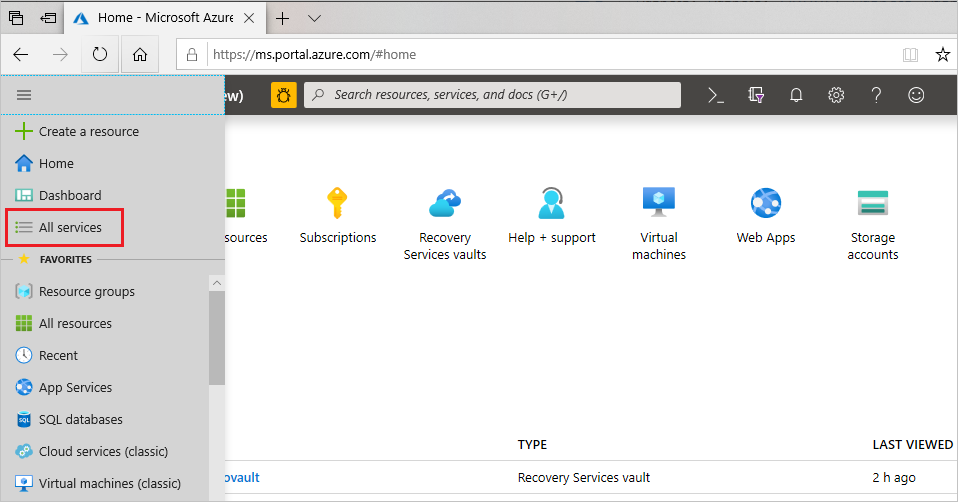
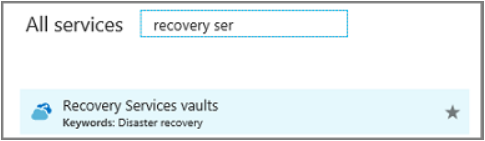
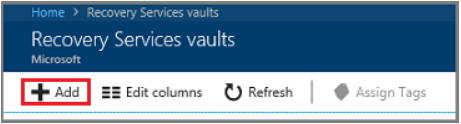
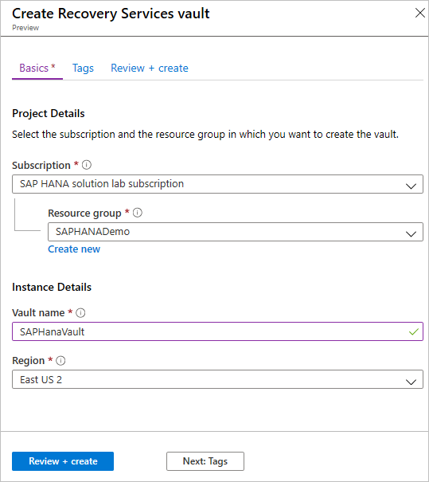
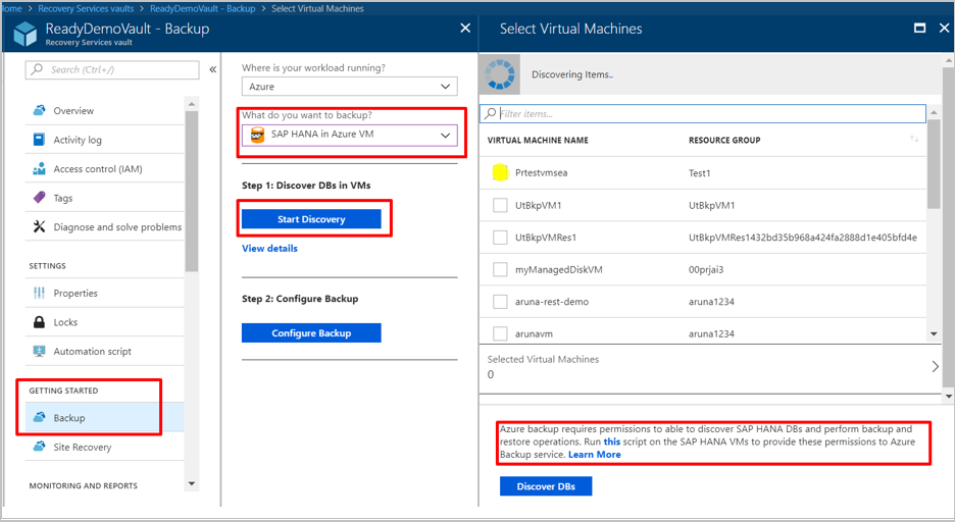
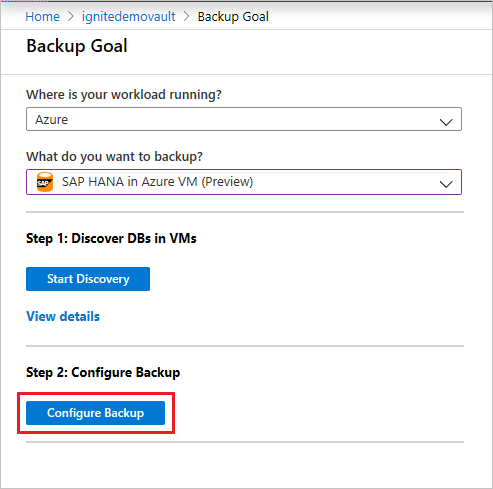
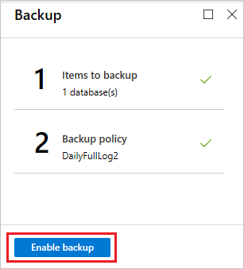

# Tutorial: Back up SAP HANA databases in an Azure VM

This tutorial shows you how to back up SAP HANA databases running on Azure VMs to an Azure Backup Recovery Services vault. In this article you'll learn how to:

> [!div class="checklist"]
>
> * Create and configure a vault
> * Discover databases
> * Configure backups

[Here](sap-hana-backup-support-matrix.md#scenario-support) are all the scenarios that we currently support.

>[!NOTE]
>[Get started](https://docs.microsoft.com/azure/backup/tutorial-backup-sap-hana-db) with SAP HANA backup preview for RHEL (7.4, 7.6, 7.7 or 8.1). For further queries write to us at [AskAzureBackupTeam@microsoft.com](mailto:AskAzureBackupTeam@microsoft.com).

## Prerequisites

Make sure you do the following before configuring backups:

* Identify or create a [Recovery Services vault](backup-sql-server-database-azure-vms.md#create-a-recovery-services-vault) in the same region and subscription as the VM running SAP HANA.
* Allow connectivity from the VM to the internet, so that it can reach Azure, as described in the [set up network connectivity](#set-up-network-connectivity) procedure below.
* Ensure that the combined length of the SAP HANA Server VM name and the Resource Group name doesn't exceed 84 characters for Azure Resoure Manager (ARM_ VMs (and 77 characters for classic VMs). This limitation is because some characters are reserved by the service.
* A key should exist in the **hdbuserstore** that fulfills the following criteria:
  * It should be present in the default **hdbuserstore**. The default is the `<sid>adm` account under which SAP HANA is installed.
  * For MDC, the key should point to the SQL port of **NAMESERVER**. In the case of SDC, it should point to the SQL port of **INDEXSERVER**
  * It should have credentials to add and delete users
* Run the SAP HANA backup configuration script (pre-registration script) in the virtual machine where HANA is installed, as the root user. [This script](https://aka.ms/scriptforpermsonhana) gets the HANA system ready for backup. Refer to the [What the pre-registration script does](#what-the-pre-registration-script-does) section to understand more about the pre-registration script.

>[!NOTE]
>The preregistration script installs the **compat-unixODBC234** for SAP HANA workloads running on RHEL (7.4, 7.6 and 7.7) and **unixODBC** for RHEL 8.1. [This package is located in the RHEL for SAP HANA (for RHEL 7 Server) Update Services for SAP Solutions (RPMs) repo](https://access.redhat.com/solutions/5094721).  For the Azure Marketplace RHEL image the repo would be **rhui-rhel-sap-hana-for-rhel-7-server-rhui-e4s-rpms**.

## Set up network connectivity

For all operations, the SAP HANA VM requires connectivity to Azure public IP addresses. VM operations (database discovery, configure backups, schedule backups, restore recovery points, and so on) fail without connectivity to Azure public IP addresses.

Establish connectivity by using one of the following options:

### Allow the Azure datacenter IP ranges

This option allows the [IP ranges](https://www.microsoft.com/download/details.aspx?id=41653) in the downloaded file. To access a network security group (NSG), use the Set-AzureNetworkSecurityRule cmdlet. If your safe recipients list only includes region-specific IPs, you'll also need to update the safe recipients list the Azure Active Directory (Azure AD) service tag to enable authentication.

### Allow access using NSG tags

If you use NSG to restrict connectivity, then you should use AzureBackup service tag to allows outbound access to Azure Backup. In addition, you should also allow connectivity for authentication and data transfer by using [rules](https://docs.microsoft.com/azure/virtual-network/security-overview#service-tags)  for Azure AD and Azure Storage. This can be done from the Azure portal or via PowerShell.

To create a rule using the portal:

  1. In **All Services**, go to **Network security groups** and select the network security group.
  2. Select **Outbound security rules** under **Settings**.
  3. Select **Add**. Enter all the required details for creating a new rule as described in [security rule settings](https://docs.microsoft.com/azure/virtual-network/manage-network-security-group#security-rule-settings). Ensure the option  **Destination** is set to **Service Tag** and **Destination service tag** is set to **AzureBackup**.
  4. Click **Add**, to save the newly created outbound security rule.

To create a rule using PowerShell:

 1. Add Azure account credentials and update the national clouds<br/>
      `Add-AzureRmAccount`<br/>

 2. Select the NSG subscription<br/>
      `Select-AzureRmSubscription "<Subscription Id>"`

 3. Select the NSG<br/>
    `$nsg = Get-AzureRmNetworkSecurityGroup -Name "<NSG name>" -ResourceGroupName "<NSG resource group name>"`

 4. Add allow outbound rule for Azure Backup service tag<br/>
    `Add-AzureRmNetworkSecurityRuleConfig -NetworkSecurityGroup $nsg -Name "AzureBackupAllowOutbound" -Access Allow -Protocol * -Direction Outbound -Priority <priority> -SourceAddressPrefix * -SourcePortRange * -DestinationAddressPrefix "AzureBackup" -DestinationPortRange 443 -Description "Allow outbound traffic to Azure Backup service"`

 5. Add allow outbound rule for Storage service tag<br/>
    `Add-AzureRmNetworkSecurityRuleConfig -NetworkSecurityGroup $nsg -Name "StorageAllowOutbound" -Access Allow -Protocol * -Direction Outbound -Priority <priority> -SourceAddressPrefix * -SourcePortRange * -DestinationAddressPrefix "Storage" -DestinationPortRange 443 -Description "Allow outbound traffic to Azure Backup service"`

 6. Add allow outbound rule for AzureActiveDirectory service tag<br/>
    `Add-AzureRmNetworkSecurityRuleConfig -NetworkSecurityGroup $nsg -Name "AzureActiveDirectoryAllowOutbound" -Access Allow -Protocol * -Direction Outbound -Priority <priority> -SourceAddressPrefix * -SourcePortRange * -DestinationAddressPrefix "AzureActiveDirectory" -DestinationPortRange 443 -Description "Allow outbound traffic to AzureActiveDirectory service"`

 7. Save the NSG<br/>
    `Set-AzureRmNetworkSecurityGroup -NetworkSecurityGroup $nsg`

**Allow access by using Azure Firewall tags**. If you're using Azure Firewall, create an application rule by using the AzureBackup [FQDN tag](https://docs.microsoft.com/azure/firewall/fqdn-tags). This allows outbound access to Azure Backup.

**Deploy an HTTP proxy server to route traffic**. When you back up an SAP HANA database on an Azure VM, the backup extension on the VM uses the HTTPS APIs to send management commands to Azure Backup and data to Azure Storage. The backup extension also uses Azure AD for authentication. Route the backup extension traffic for these three services through the HTTP proxy. The extensions are the only component that's configured for access to the public internet.

Connectivity options include the following advantages and disadvantages:

**Option** | **Advantages** | **Disadvantages**
--- | --- | ---
Allow IP ranges | No additional costs | Complex to manage because the IP address ranges change over time <br/><br/> Provides access to the whole of Azure, not just Azure Storage
Use NSG service tags | Easier to manage as range changes are automatically merged <br/><br/> No additional costs <br/><br/> | Can be used with NSGs only <br/><br/> Provides access to the entire service
Use Azure Firewall FQDN tags | Easier to manage as the required FQDNs are automatically managed | Can be used with Azure Firewall only
Use an HTTP proxy | Granular control in the proxy over the storage URLs is allowed <br/><br/> Single point of internet access to VMs <br/><br/> Not subject to Azure IP address changes | Additional costs to run a VM with the proxy software

## What the pre-registration script does

Running the pre-registration script performs the following functions:

* Based on your Linux distribution, the script installs or updates any necessary packages required by the Azure Backup agent.
* It performs outbound network connectivity checks with Azure Backup servers and dependent services like Azure Active Directory and Azure Storage.
* It logs into your HANA system using the user key listed as part of the [prerequisites](#prerequisites). The user key is used to create a backup user (AZUREWLBACKUPHANAUSER) in the HANA system and the user key can be deleted after the pre-registration script runs successfully.
* AZUREWLBACKUPHANAUSER is assigned these required roles and permissions:
  * DATABASE ADMIN (in case of MDC) and BACKUP ADMIN (in case of SDC): to create new databases during restore.
  * CATALOG READ: to read the backup catalog.
  * SAP_INTERNAL_HANA_SUPPORT: to access a few private tables.
* The script adds a key to **hdbuserstore** for AZUREWLBACKUPHANAUSER for the HANA backup plug-in to handle all operations (database queries, restore operations, configuring and running backup).

>[!NOTE]
> You can explicitly pass the user key listed as part of the [prerequisites](#prerequisites) as a parameter to the pre-registration script: `-sk SYSTEM_KEY_NAME, --system-key SYSTEM_KEY_NAME` <br><br>
>To learn what other parameters the script accepts, use the command `bash msawb-plugin-config-com-sap-hana.sh --help`

To confirm the key creation, run the HDBSQL command on the HANA machine with SIDADM credentials:

```hdbsql
hdbuserstore list
```

The command output should display the {SID}{DBNAME} key, with the user shown as AZUREWLBACKUPHANAUSER.

>[!NOTE]
> Make sure you have a unique set of SSFS files under `/usr/sap/{SID}/home/.hdb/`. There should be only one folder in this path.

## Create a Recovery Service vault

A Recovery Services vault is an entity that stores the backups and recovery points created over time. The Recovery Services vault also contains the backup policies that are associated with the protected virtual machines.

To create a Recovery Services vault:

1. Sign in to your subscription in the [Azure portal](https://portal.azure.com/).

2. On the left menu, select **All services**

   

3. In the **All services** dialog box, enter **Recovery Services**. The list of resources filters according to your input. In the list of resources, select **Recovery Services vaults**.

   

4. On the **Recovery Services** vaults dashboard, select **Add**.

   

   The **Recovery Services vault** dialog box opens. Provide values for the **Name, Subscription, Resource group,** and **Location**

   

   * **Name**: The name is used to identify the recovery services vault and must be unique to the Azure subscription. Specify a name that has at least two, but not more than 50 characters. The name must start with a letter and consist only of letters, numbers, and hyphens. For this tutorial, we've used the name **SAPHanaVault**.
   * **Subscription**: Choose the subscription to use. If you're a member of only one subscription, you'll see that name. If you're not sure which subscription to use, use the default (suggested) subscription. There are multiple choices only if your work or school account is associated with more than one Azure subscription. Here, we have used the **SAP HANA solution lab subscription** subscription.
   * **Resource group**: Use an existing resource group or create a new one. Here, we have used **SAPHANADemo**.<br>
   To see the list of available resource groups in your subscription, select **Use existing**, and then select a resource from the drop-down list box. To create a new resource group, select **Create new** and enter the name. For complete information about resource groups, see [Azure Resource Manager overview](https://docs.microsoft.com/azure/azure-resource-manager/resource-group-overview).
   * **Location**: Select the geographic region for the vault. The vault must be in the same region as the Virtual Machine running SAP HANA. We have used **East US 2**.

5. Select **Review + Create**.

   

The Recovery services vault is now created.

## Discover the databases

1. In the vault, in **Getting Started**, click **Backup**. In **Where is your workload running?**, select **SAP HANA in Azure VM**.
2. Click **Start Discovery**. This initiates discovery of unprotected Linux VMs in the vault region. You will see the Azure VM that you want to protect.
3. In **Select Virtual Machines**, click the link to download the script that provides permissions for the Azure Backup service to access the SAP HANA VMs for database discovery.
4. Run the script on the VM hosting SAP HANA database(s) that you want to back up.
5. After running the script on the VM, in **Select Virtual Machines**, select the VM. Then click **Discover DBs**.
6. Azure Backup discovers all SAP HANA databases on the VM. During discovery, Azure Backup registers the VM with the vault, and installs an extension on the VM. No agent is installed on the database.

   

## Configure backup

Now that the databases we want to back up are discovered, let's enable backup.

1. Click **Configure Backup**.

   

2. In **Select items to back up**, select one or more databases that you want to protect, and then click **OK**.

   

3. In **Backup Policy > Choose backup policy**, create a new backup policy for the database(s), in accordance with the instructions in the next section.

   

4. After creating the policy, on the **Backup menu**, click **Enable backup**.

   

5. Track the backup configuration progress in the **Notifications** area of the portal.

## Creating a backup policy

A backup policy defines when backups are taken, and how long they're retained.

* A policy is created at the vault level.
* Multiple vaults can use the same backup policy, but you must apply the backup policy to each vault.

Specify the policy settings as follows:

1. In **Policy name**, enter a name for the new policy. In this case, enter **SAPHANA**.

   

2. In **Full Backup policy**, select a **Backup Frequency**. You can choose **Daily** or **Weekly**. For this tutorial, we chose the **Daily** backup.

   

3. In **Retention Range**, configure retention settings for the full backup.
   * By default, all options are selected. Clear any retention range limits you don't want to use and set those that you do.
   * The minimum retention period for any type of backup (full/differential/log) is seven days.
   * Recovery points are tagged for retention based on their retention range. For example, if you select a daily full backup, only one full backup is triggered each day.
   * The backup for a specific day is tagged and retained based on the weekly retention range and setting.
   * The monthly and yearly retention ranges behave in a similar way.
4. In the **Full Backup policy** menu, click **OK** to accept the settings.
5. Then select **Differential Backup** to add a differential policy.
6. In **Differential Backup policy**, select **Enable** to open the frequency and retention controls. We have enabled a differential backup every **Sunday** at **2:00 AM**, which is retained for **30 days**.

   

   >[!NOTE]
   >Incremental backups aren't currently supported.
   >

7. Click **OK** to save the policy and return to the main **Backup policy** menu.
8. Select **Log Backup** to add a transactional log backup policy,
   * **Log Backup** is by default set to **Enable**. This cannot be disabled as SAP HANA manages all log backups.
   * We have set **2 hours** as the Backup schedule and **15 days** of retention period.

    

   >[!NOTE]
   > Log backups only begin to flow after one successful full backup is completed.
   >

9. Click **OK** to save the policy and return to the main **Backup policy** menu.
10. After you finish defining the backup policy, click **OK**.

You have now successfully configured backup(s) for your SAP HANA database(s).

## Next Steps

* Learn how to [run on-demand backups on SAP HANA databases running on Azure VMs](backup-azure-sap-hana-database.md#run-an-on-demand-backup)
* Learn how to [restore SAP HANA databases running on Azure VMs](sap-hana-db-restore.md)
* Learn how to [manage SAP HANA databases that are backed up using Azure Backup](sap-hana-db-manage.md)
* Learn how to [troubleshoot common issues when backing up SAP HANA databases](backup-azure-sap-hana-database-troubleshoot.md)
