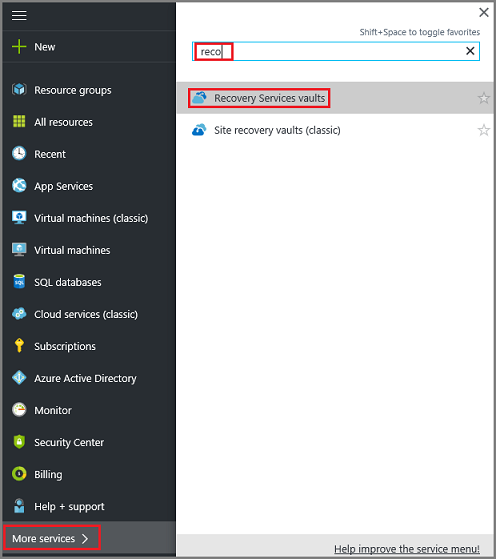
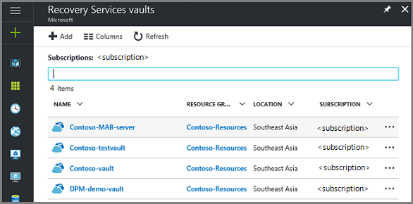
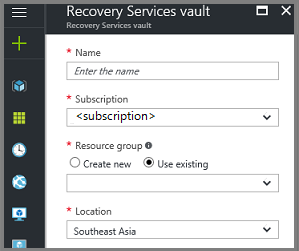
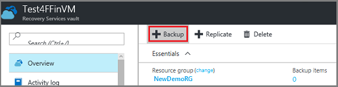
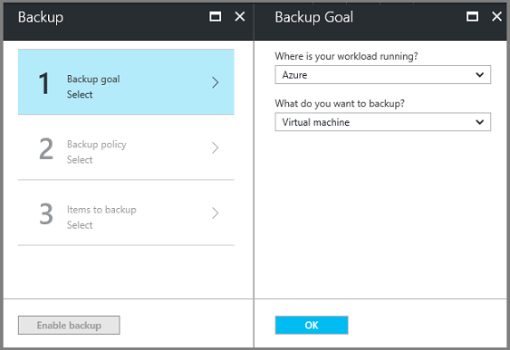
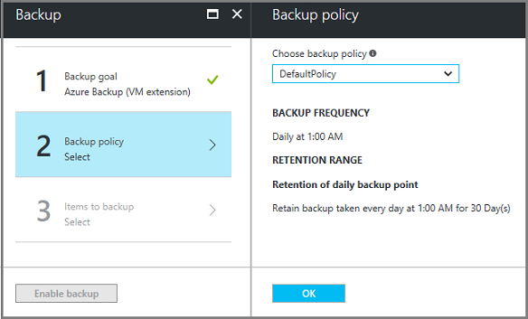
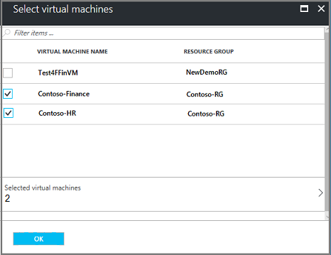

# Use Azure portal to back up multiple virtual machines

When you back up data in Azure, you store that data in an Azure resource called a Recovery Services vault. The Recovery Services vault resource is available from the Settings menu of most Azure services. The Recovery Services vault is integrated into the Settings menu which makes it easy to create a new Recovery Services vault, or back up data into an existing Recovery Services vault. This tutorial shows you how to use the Recovery Services vault menu to back up multiple virtual machines at once. 
The steps in this tutorial differ from the Back up a virtual machine using the Azure portal quickstart. In this tutorial you configure your resources with the Recovery Services vault menu.
 
If you don't have an Azure subscription, create a [free](https://azure.microsoft.com/free/) account before you begin. If you want to create virtual machines, see the tutorial to [create a Windows virtual machine in Azure](../virtual-machines/windows/tutorial-manage-vm.md).

## Log in to the Azure portal

Log in to the [Azure portal](https://portal.azure.com/).

## Create a Recovery Services vault

The Recovery Services vault contains the backup data, and the backup policy applied to the protected virtual machines. Backing up virtual machines is a local process. You cannot back up a virtual machine from one location to a Recovery Services vault in another location. So, for each Azure location that has virtual machines to be backed up, at least one Recovery Services vault must exist in that location.

To create a Recovery Services vault:

1. On the left-hand menu, select **More services** and in the Filter dialog type **Recovery Services**. As you type, the list of resources filters. When you see Recovery Services vaults in the list, select it.

      

    The Recovery Services vaults menu appears. If there are Recovery Services vaults in the subscription, the vaults are listed.

    
2. On the **Recovery Services vaults** menu, click **Add**.

    The Recovery Services vault menu opens.

    

3. Enter or choose a **Name**, **Subscription**, **Resource group**, and **Location** for the vault. 

- The Recovery Services vault must be in the same location as the virtual machines being protected. If you are unsure of the virtual machine location, close the vault creation dialog, and go to the list of virtual machines in the Azure portal. If you have virtual machines in multiple regions, create a Recovery Services vault in each region. Create the vault in the first location before going to the next location.

4. Once you fill in the information for the Recovery Services vault, at the bottom of the Recovery Services vault menu, click **Create**.

    It can take several minutes for the Recovery Services vault to be created. Monitor the status notifications in the upper right-hand area of the portal. Once your vault is created, it appears in the list of Recovery Services vaults. If after several minutes you don't see your vault, in the Recovery Services vaults menu bar click **Refresh**.

     

When you create a Recovery Services vault, by default the vault has geo-redundant storage. To provide data resiliency, geo-redundant storage replicates the data multiple times across two Azure regions. 

## Select a backup goal, set policy and define items to protect

In the Azure portal, scenario refers to what you are going to put into the Recovery Services vault. Policy is the schedule for how often and when recovery points are taken. Policy also includes the retention range for the recovery points.

1. If you already have a Recovery Services vault open, proceed to step 2. Otherwise, on the left-hand menu, click **More services** and in the list of resources, type **Recovery Services** and click **Recovery Services vaults**.

      

    The list of Recovery Services vaults appears.

    

    From the list of Recovery Services vaults, select a vault to open its dashboard.

2. On the vault dashboard menu, click **Backup** to open the Backup menu.

    

    The Backup and Backup Goal menus open.

    

3. On the Backup Goal menu, from the **Where is your workload running** drop-down menu, choose Azure. From the **What do you want to backup** drop-down, choose Virtual machine, then click **OK**.

    These actions register the Virtual Machine extension with the Recovery Services vault. The Backup Goal menu closes and the **Backup policy** menu opens.

    

4. On the Backup policy menu, click **OK** to accept the chosen backup policy.

    The details of the policy are listed under the drop-down menu. The Backup policy menu closes and the **Select virtual machines** menu opens.

    

5. In the **Select virtual machines** menu, select all virtual machines to associate with the specified policy and click **OK**. 

    The option of selecting multiple virtual machines allows you to scale the deployment of your backup policy.

6. In the Backup menu, click **Enable Backup** to deploy the policies to the vault and the virtual machines. Deploying the backup policy does not create the initial recovery point for the virtual machine. The backup policy executes on schedule.

## Initial backup

You have enabled backup for the Recovery Services vault, but the initial backup has not been created. It is a disaster recovery best practice to create the first backup. 

To run the initial backup job:

1. On the vault dashboard, click the number under **Backup Items**, or click the **Backup Items** tile.  
  

  The **Backup Items** menu opens.

  

2. On the **Backup Items** menu, select the item.

  

  The **Backup Items** list opens.  

  

3. On the **Backup Items** list, click the ellipses **...** to open the Context menu.

  

  The Context menu appears.

  

4. On the Context menu, click **Backup now**.

  

  The Backup Now menu opens.

  

5. On the Backup Now menu, click the calendar icon, use the calendar control to select the last day this recovery point is retained, and click **Backup**.

  

  Deployment notifications let you know the backup job has been triggered, and that you can monitor the progress of the job on the Backup jobs page. Depending on the size of your VM, creating the initial backup may take a while.

6. To view or track the status of the initial backup, on the vault dashboard, on the **Backup Jobs** tile click **In progress**.

  

  The Backup Jobs menu opens.

  

  In the **Backup jobs** menu, you can see the status of all jobs. Check if the backup job for your VM is still in progress, or if it has finished. When a backup job is finished, the status is *Completed*.

  
## Clean up resources

Other tutorials in this collection build upon this tutorial. If you plan to continue on to work with subsequent tutorials, do not clean up the resources created in this tutorial. If you do not plan to continue, use the following steps to delete all resources created by this tutorial in the Azure portal.

1. On the myVM menu, click **Backup** to open the Backup dashboard.

  

2. In the Backup dashboard, click **...More** to show additional options, then click **Stop backup** to open the Stop Backup menu.

  

3. In the Stop Backup menu, select the upper drop-down menu and choose **Delete Backup Data**.

4. In the **Type the name of the Backup item** dialog, type *myVM*.
 
5. Once the backup item is verified, the Stop backup button is enabled. Click **Stop Backup** to delete the restore point and the Recovery Services vault.  

  .

6. From the left-hand menu in the Azure portal, click **Resource groups** and then click **myResourceGroup**.

7. On your resource group page, click **Delete**, type **myResourceGroup** in the text box, and then click **Delete**.

## Next steps

In this tutorial you used the Azure portal to:

> [!div class="checklist"]
> * Create a Recovery Services vault
> * Create a backup and retention policy
> * Back up multiple virtual machines

Continue to the next tutorial to recover Azure virtual machines using virtual machine templates. 

> [!div class="nextstepaction"]
> [Restore VMs using templates](./tutorial-backup-azure-vm.md)
