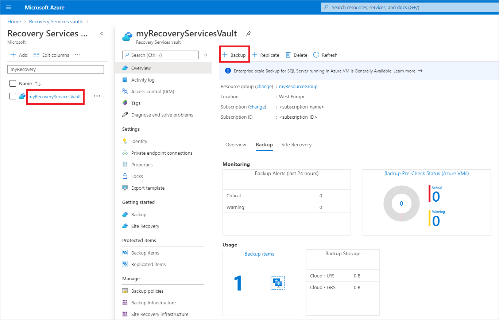
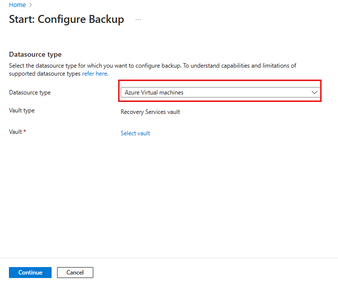
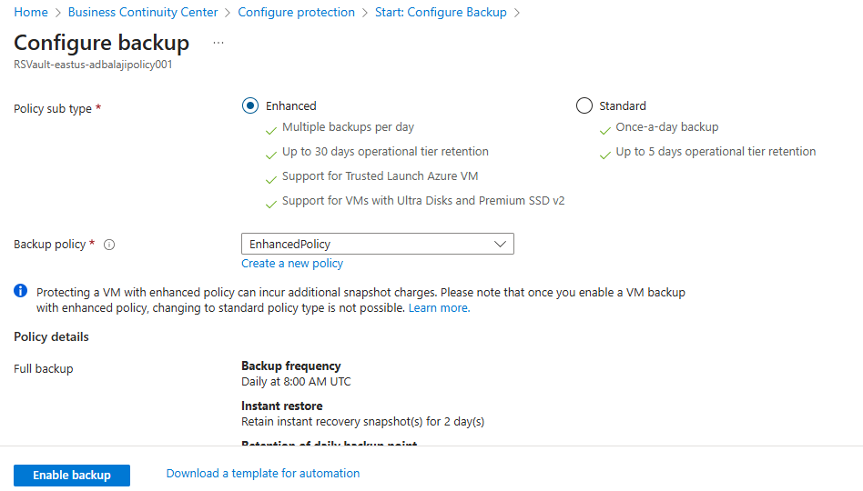
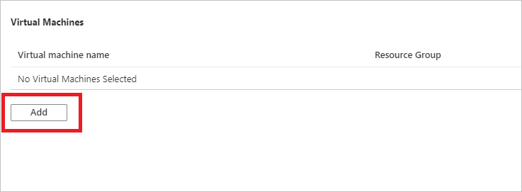

# Use Azure portal to back up multiple virtual machines

When you back up data in Azure, you store that data in an Azure resource called a Recovery Services vault. The Recovery Services vault resource is available from the Settings menu of most Azure services. The benefit of having the Recovery Services vault integrated into the Settings menu of most Azure services is the ease of backing up data. However, working individually with each database or virtual machine in your business is tedious. What if you want to back up the data for all virtual machines in one department, or in one location? It's easy to back up multiple virtual machines by creating a backup policy and applying that policy to the desired virtual machines. This tutorial explains how to:

> [!div class="checklist"]
>
> * Create a Recovery Services vault
> * Define a backup policy
> * Apply the backup policy to protect multiple virtual machines
> * Trigger an on-demand backup job for the protected virtual machines

## Sign in to the Azure portal

Sign in to the [Azure portal](https://portal.azure.com/).

[!INCLUDE [backup-center.md](../../includes/backup-center.md)]

[!INCLUDE [How to create a Recovery Services vault](../../includes/backup-create-rs-vault.md)]

When you create a Recovery Services vault, by default the vault has geo-redundant storage. To provide data resiliency, geo-redundant storage replicates the data multiple times across two Azure regions.

## Set backup policy to protect VMs

After creating the Recovery Services vault, the next step is to configure the vault for the type of data, and to set the backup policy. Backup policy is the schedule for how often and when recovery points are taken. Policy also includes the retention range for the recovery points. For this tutorial, let's assume your business is a sports complex with a hotel, stadium, and restaurants and concessions, and you're protecting the data on the virtual machines. The following steps create a backup policy for the financial data.

To set a backup policy to your Azure VMs, follow these steps:

1. Go to **Backup center** and click **+Backup** from the **Overview** tab.

   

1. Select **Azure Virtual machines** as the **Datasource type** and select the vault you have created. Then click **Continue**.

   

1. Assign a Backup policy.

    - The default policy backs up the VM once a day. The daily backups are retained for 30 days. Instant recovery snapshots are retained for two days.

      

    - If you don't want to use the default policy, select **Create New**, and create a custom policy as described in the next procedure.

1. Under **Virtual Machines**, select **Add**.

      

1. The **Select virtual machines** pane will open. Select the VMs you want to back up using the policy. Then select **OK**.

   * The selected VMs are validated.
   * You can only select VMs in the same region as the vault.
   * VMs can only be backed up in a single vault.

     

    >[!NOTE]
    > All the VMs in the same region and subscription as that of the vault are available to configure backup. When configuring backup, you can browse to the virtual machine name and its resource group, even though you don’t have the required permission on those VMs. If your VM is in soft deleted state, then it won't be visible in this list. If you need to re-protect the VM, then you need to wait for the soft delete period to expire or undelete the VM from the soft deleted list. For more information, see [the soft delete for VMs article](soft-delete-virtual-machines.md#soft-delete-for-vms-using-azure-portal).

1. In **Backup**, select **Enable backup**. This deploys the policy to the vault and to the VMs, and installs the backup extension on the VM agent running on the Azure VM.

After enabling backup:

* The Backup service installs the backup extension whether or not the VM is running.
* An initial backup will run in accordance with your backup schedule.
* When backups run, note that:
  * A VM that's running has the greatest chance for capturing an application-consistent recovery point.
  * However, even if the VM is turned off, it's backed up. Such a VM is known as an offline VM. In this case, the recovery point will be crash-consistent.
* Explicit outbound connectivity isn't required to allow backup of Azure VMs.

> [!Note]
> You can also set Enhanced policy to back up Azure VMs multiple times a day. Learn about [Enhanced policy](backup-azure-vms-enhanced-policy.md). 

## Initial backup

You've enabled backup for the Recovery Services vaults, but an initial backup hasn't been created. It's a disaster recovery best practice to trigger the first backup, so that your data is protected.

The initial backup will run in accordance with the schedule, but you can run it immediately as follows:

1. Go to **Backup center** and select the **Backup Instances** menu item.
1. Select **Azure Virtual machines** as the **Datasource type**. Then search for the VM that you have configured for backup.
1. Right-click the relevant row or select the more icon (…), and then click **Backup Now**.
1. In **Backup Now**, use the calendar control to select the last day that the recovery point should be retained. Then select **OK**.
1. Monitor the portal notifications.
   To  monitor the job progress, go to **Backup center** > **Backup Jobs** and filter the list for **In progress** jobs.
   Depending on the size of your VM, creating the initial backup may take a while.

## Clean up resources

If you plan to continue on to work with subsequent tutorials, don't clean up the resources created in this tutorial. If you don't plan to continue, use the following steps to delete all resources created by this tutorial in the Azure portal.

1. On the **myRecoveryServicesVault** dashboard, select **3** under **Backup Items** to open the Backup Items menu.

    

1. On the **Backup Items** menu, select **Azure Virtual Machine** to open the list of virtual machines associated with the vault.

    

    The **Backup Items** list opens.

1. In the **Backup Items** menu, select the ellipsis to open the Context menu.

    

1. On the context menu, select **Stop backup** to open Stop Backup menu.

    

1. In the **Stop Backup** menu, select the upper drop-down menu and choose **Delete Backup Data**.

1. In the **Type the name of the Backup item** dialog, type *myVM*.

1. Once the backup item is verified (a check mark appears), **Stop backup** button is enabled. Select **Stop Backup** to stop the policy and delete the restore points.

    

    >[!NOTE]
    >Deleted items are retained in the soft delete state for 14 days. Only after that period can the vault be deleted. For more information, see [Delete an Azure Backup Recovery Services vault](backup-azure-delete-vault.md).

1. When there are no more items in the vault, select **Delete**.

    

    Once the vault is deleted, you'll return to the list of Recovery Services vaults.

## Next steps

In this tutorial, you used the Azure portal to:

> [!div class="checklist"]
>
> * Create a Recovery Services vault
> * Set the vault to protect virtual machines
> * Create a custom backup and retention policy
> * Assign the policy to protect multiple virtual machines
> * Trigger an on-demand back up for virtual machines

Continue to the next tutorial to restore an Azure virtual machine from disk.

> [!div class="nextstepaction"]
> [Restore VMs using CLI](./tutorial-restore-disk.md)
