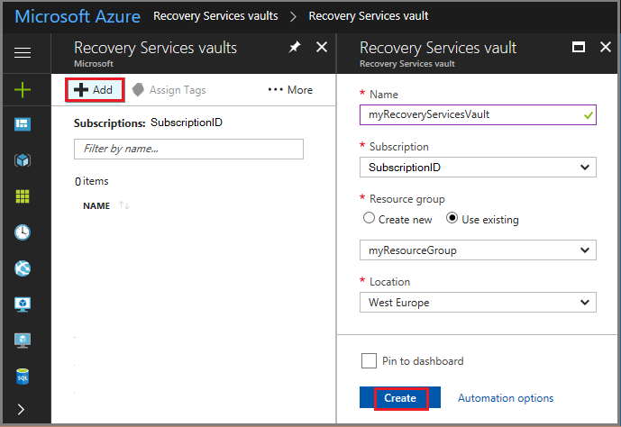
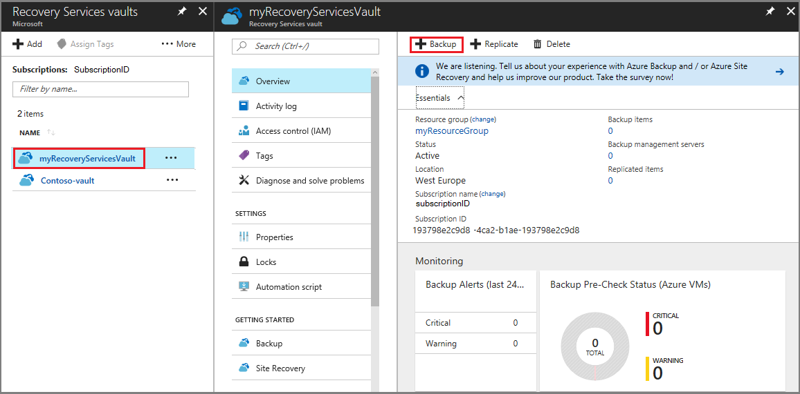
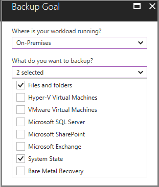
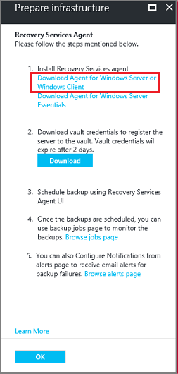
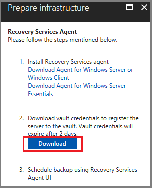
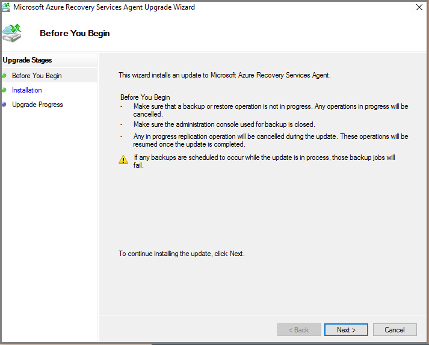
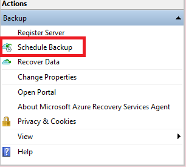
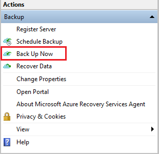

# Back up Windows Server to Azure

You can use Azure Backup to protect your Windows Server from corruptions, attacks, and disasters. Azure Backup provides a lightweight tool known as the Microsoft Azure Recovery Services (MARS) agent. The MARS agent is installed on the Windows Server to protect files and folders, and server configuration info via Windows Server System State. This tutorial explains how you can use MARS Agent to back up your Windows Server to Azure. In this tutorial you learn how to: 

> [!div class="checklist"]
> * Download and set up the MARS Agent
> * Configure back up times and retention schedule for your server’s backups
> * Perform an ad hoc back up

## Sign in to Azure

Sign in to the Azure portal at https://portal.azure.com.

## Create a Recovery Services vault

Before you can back up Windows Server, you must create a place for the backups, or restore points, to be stored. A [Recovery Services vault](backup-azure-recovery-services-vault-overview.md) is a container in Azure that stores the backups from your Windows Server. Follow the steps below to create a Recovery Services vault in the Azure portal. 

1. On the left-hand menu, select **All services** and in the services list, type **Recovery Services**. Click **Recovery Services vaults**.

   

2. On the **Recovery Services vaults** menu, click **Add**.

   

3. In the **Recovery Services vault** menu,

    - Type *myRecoveryServicesVault* in **Name**.
    - The current subscription ID appears in **Subscription**.
    - For **Resource group**, select **Use existing** and choose *myResourceGroup*. If *myResourceGroup* doesn't exist, select **Create New** and type *myResourceGroup*. 
    - From the **Location** drop-down menu, choose *West Europe*.
    - Click **Create** to create your Recovery Services vault.
 
Once your vault is created, it appears in the list of Recovery Services vaults.

## Download Recovery Services agent

The Microsoft Azure Recovery Services (MARS) agent creates an association between Windows Server and your Recovery Services vault. The following procedure explains how to download the agent to your server.

1. From the list of Recovery Services vaults, select **myRecoveryServicesVault** to open its dashboard.

   

2. On the vault dashboard menu, click **Backup**.

3. On the **Backup Goal** menu:

   * for **Where is your workload running?**, select **On-premises**, 
   * for **What do you want to backup?**, select **Files and folders** and **System State**

   

4. Click **Prepare Infrastructure** to open the **Prepare infrastructure** menu.

5. On the **Prepare infrastructure** menu, click **Download Agent for Windows Server or Windows Client** to download the *MARSAgentInstaller.exe*. 

    

    The installer opens a separate browser and downloads **MARSAgentInstaller.exe**.
 
6. Before you run the downloaded file, on the Prepare infrastructure menu click **Download** and save the **Vault Credentials** file. Vault credentials are required to connect the MARS Agent with the Recovery Services vault.

    
 
## Install and register the agent

1. Locate and double-click the downloaded **MARSagentinstaller.exe**.
2. The **Microsoft Azure Recovery Services Agent Setup Wizard** appears. As you go through the wizard, provide the following information when prompted and click **Register**.
   - Location for the installation and cache folder.
   - Proxy server info if you use a proxy server to connect to the internet.
   - Your user name and password details if you use an authenticated proxy.

      

3. At the end of the wizard, click **Proceed to Registration** and provide the **Vault Credentials** file you downloaded in the previous procedure.
 
4. When prompted, provide an encryption passphrase to encrypt backups from Windows Server. Save the passphrase in a secure location as Microsoft cannot recover the passphrase if it is lost.

5. Click **Finish**. 

## Configure Backup and Retention

You use the Microsoft Azure Recovery Services agent to schedule when backups to Azure, occur on Windows Server. Execute the following steps on the server where you downloaded the agent.

1. Open the Microsoft Azure Recovery Services agent. You can find it by searching your machine for **Microsoft Azure Backup**.

2.	In the Recovery Services agent console, click **Schedule Backup** under the **Actions Pane**.

    

3. Click **Next** to navigate to the **Select Items to Back up** page.

4. Click **Add Items** and from the dialog box that opens, select **System State** and files or folders that you want to back up. Then click **OK**.

5. Click **Next**.

6. On the **Specify Backup Schedule (System State)** page, specify the time of the day, or week when backups need to be triggered for System State and click **Next**.

7. On the **Select Retention Policy (System State)** page, select the Retention Policy for the backup copy for System State and click **Next**.

8. Similarly, select the backup schedule and retention policy for selected files and folders. 

9. On the **Choose Initial Back up Type** page, select **Automatically over the network**, and click **Next**.

10. On the **Confirmation** page, review the information, and click **Finish**.

11.	After the wizard finishes creating the backup schedule, click **Close**.

## Perform an ad hoc back up

You have established the schedule when backup jobs run. However, you have not backed up the server. It is a disaster recovery best practice to run an on-demand backup to ensure data resiliency for your server.

1.	In the Microsoft Azure Recovery Services agent console, click **Back Up Now**.

    

2.	On the **Back Up Now** wizard, select one from **Files and Folders** or **System State** that you want to back up and click **Next** 
3. On the **Confirmation** page, review the settings that the **Back Up Now** wizard uses to back up your server. Then click **Back Up**.
4.	Click **Close** to close the wizard. If you close the wizard before the back up process finishes, the wizard continues to run in the background.
4.	After the initial backup is completed, **Job completed** status appears in **Jobs** pane of the MARS agent console.

## Next steps

In this tutorial, you used the Azure portal to: 
 
> [!div class="checklist"] 
> * Create a Recovery Services vault 
> * Download the Microsoft Azure Recovery Services agent 
> * Install the agent 
> * Configure backup for Windows Server 
> * Perform an on-demand backup 

Continue to the next tutorial to recover files from Azure to Windows Server

> [!div class="nextstepaction"] 
> [Restore files from Azure to Windows Server](./tutorial-backup-restore-files-windows-server.md) 

