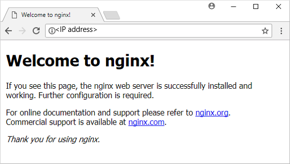

# Restore files to a virtual machine in Azure

Azure Backup creates recovery points that are stored in geo-redundant recovery vaults. When you restore from a recovery point, you can restore the whole VM or individual files. This article details how to restore individual files. In this tutorial you learn how to:

> [!div class="checklist"]
>
> * List and select recovery points
> * Connect a recovery point to a VM
> * Restore files from a recovery point

## Prerequisites

This tutorial requires a Linux VM that has been protected with Azure Backup. To simulate an accidental file deletion and recovery process, you delete a page from a web server. If you need a Linux VM that runs a webserver and has been protected with Azure Backup, see [Back up a virtual machine in Azure with the CLI](quick-backup-vm-cli.md).

Prepare your environment:

[!INCLUDE [azure-cli-prepare-your-environment-no-header.md](../../includes/azure-cli-prepare-your-environment-no-header.md)]

- This article requires version 2.0.18 or later of the Azure CLI. If using Azure Cloud Shell, the latest version is already installed.

## Backup overview

When Azure initiates a backup, the backup extension on the VM takes a point-in-time snapshot. The backup extension is installed on the VM when the first backup is requested. Azure Backup can also take a snapshot of the underlying storage if the VM isn't running when the backup takes place.

By default, Azure Backup takes a file system consistent backup. Once Azure Backup takes the snapshot, the data is transferred to the Recovery Services vault. To maximize efficiency, Azure Backup identifies and transfers only the blocks of data that have changed since the previous backup.

When the data transfer is complete, the snapshot is removed and a recovery point is created.

## Delete a file from a VM

If you accidentally delete or make changes to a file, you can restore individual files from a recovery point. This process allows you to browse the files backed up in a recovery point and restore only the files you need. In this example, we delete a file from a web server to demonstrate the file-level recovery process.

1. To connect to your VM, obtain the IP address of your VM with [az vm show](/cli/azure/vm#az_vm_show):

     ```azurecli-interactive
     az vm show --resource-group myResourceGroup --name myVM -d --query [publicIps] --o tsv
     ```

2. To confirm that your web site currently works, open a web browser to the public IP address of your VM. Leave the web browser window open.

    

3. Connect to your VM with SSH. Replace *publicIpAddress* with the public IP address that you obtained in a previous command:

    ```bash
    ssh publicIpAddress
    ```

4. Delete the default page from the web server at */var/www/html/index.nginx-debian.html* as follows:

    ```bash
    sudo rm /var/www/html/index.nginx-debian.html
    ```

5. In your web browser, refresh the web page. The web site no longer loads the page, as shown in the following example:

    

6. Close the SSH session to your VM as follows:

    ```bash
    exit
    ```

## Generate file recovery script

To restore your files, Azure Backup provides a script to run on your VM that connects your recovery point as a local drive. You can browse this local drive, restore files to the VM itself, then disconnect the recovery point. Azure Backup continues to back up your data based on the assigned policy for schedule and retention.

1. To list recovery points for your VM, use [az backup recoverypoint list](/cli/azure/backup/recoverypoint#az_backup_recoverypoint_list). In this example, we select the most recent recovery point for the VM named *myVM* that's protected in *myRecoveryServicesVault*:

    ```azurecli-interactive
    az backup recoverypoint list \
        --resource-group myResourceGroup \
        --vault-name myRecoveryServicesVault \
        --container-name myVM \
        --item-name myVM \
        --query [0].name \
        --output tsv
    ```

2. To obtain the script that connects, or mounts, the recovery point to your VM, use [az backup restore files mount-rp](/cli/azure/backup/restore/files#az_backup_restore_files_mount_rp). The following example obtains the script for the VM named *myVM* that's protected in *myRecoveryServicesVault*.

    Replace *myRecoveryPointName* with the name of the recovery point that you obtained in the preceding command:

    ```azurecli-interactive
    az backup restore files mount-rp \
        --resource-group myResourceGroup \
        --vault-name myRecoveryServicesVault \
        --container-name myVM \
        --item-name myVM \
        --rp-name myRecoveryPointName
    ```

    The script is downloaded and a password is displayed, as in the following example:

    ```output
    File downloaded: myVM_we_1571974050985163527.sh. Use password c068a041ce12465
    ```

3. To transfer the script to your VM, use Secure Copy (SCP). Provide the name of your downloaded script, and replace *publicIpAddress* with the public IP address of your VM. Make sure you include the trailing `:` at the end of the SCP command as follows:

    ```bash
    scp myVM_we_1571974050985163527.sh 52.174.241.110:
    ```

## Restore file to your VM

With the recovery script copied to your VM, you can now connect the recovery point and restore files.

>[!NOTE]
> Check [here](backup-azure-restore-files-from-vm.md#step-2-ensure-the-machine-meets-the-requirements-before-executing-the-script) to see if you can run the script on your VM before continuing.

1. Connect to your VM with SSH. Replace *publicIpAddress* with the public IP address of your VM as follows:

    ```bash
    ssh publicIpAddress
    ```

2. To allow your script to run correctly, add execute permissions with **chmod**. Enter the name of your own script:

    ```bash
    chmod +x myVM_we_1571974050985163527.sh
    ```

3. To mount the recovery point, run the script. Enter the name of your own script:

    ```bash
    ./myVM_we_1571974050985163527.sh
    ```

    As the script runs, you're prompted to enter a password to access the recovery point. Enter the password shown in the output from the previous [az backup restore files mount-rp](/cli/azure/backup/restore/files#az_backup_restore_files_mount_rp) command that generated the recovery script.

    The output from the script gives you the path for the recovery point. The following example output shows that the recovery point is mounted at */home/azureuser/myVM-20170919213536/Volume1*:

    ```output
    Microsoft Azure VM Backup - File Recovery
    ______________________________________________
    Please enter the password as shown on the portal to securely connect to the recovery point. : c068a041ce12465

    Connecting to recovery point using ISCSI service...

    Connection succeeded!

    Please wait while we attach volumes of the recovery point to this machine...

    ************ Volumes of the recovery point and their mount paths on this machine ************

    Sr.No.  |  Disk  |  Volume  |  MountPath

    1)  | /dev/sdc  |  /dev/sdc1  |  /home/azureuser/myVM-20170919213536/Volume1

    ************ Open File Explorer to browse for files. ************
    ```

4. Use **cp** to copy the NGINX default web page from the mounted recovery point back to the original file location. Replace the */home/azureuser/myVM-20170919213536/Volume1* mount point with your own location:

    ```bash
    sudo cp /home/azureuser/myVM-20170919213536/Volume1/var/www/html/index.nginx-debian.html /var/www/html/
    ```

5. In your web browser, refresh the web page. The web site now loads correctly again, as shown in the following example:

    

6. Close the SSH session to your VM as follows:

    ```bash
    exit
    ```

7. Unmount the recovery point from your VM with [az backup restore files unmount-rp](/cli/azure/backup/restore/files#az_backup_restore_files_unmount_rp). The following example unmounts the recovery point from the VM named *myVM* in *myRecoveryServicesVault*.

    Replace *myRecoveryPointName* with the name of your recovery point that you obtained in the previous commands:

    ```azurecli-interactive
    az backup restore files unmount-rp \
        --resource-group myResourceGroup \
        --vault-name myRecoveryServicesVault \
        --container-name myVM \
        --item-name myVM \
        --rp-name myRecoveryPointName
    ```

## Next steps

In this tutorial, you connected a recovery point to a VM and restored files for a web server. You learned how to:

> [!div class="checklist"]
>
> * List and select recovery points
> * Connect a recovery point to a VM
> * Restore files from a recovery point

Advance to the next tutorial to learn about how to back up Windows Server to Azure.

> [!div class="nextstepaction"]
> [Back up Windows Server to Azure](tutorial-backup-windows-server-to-azure.md)
